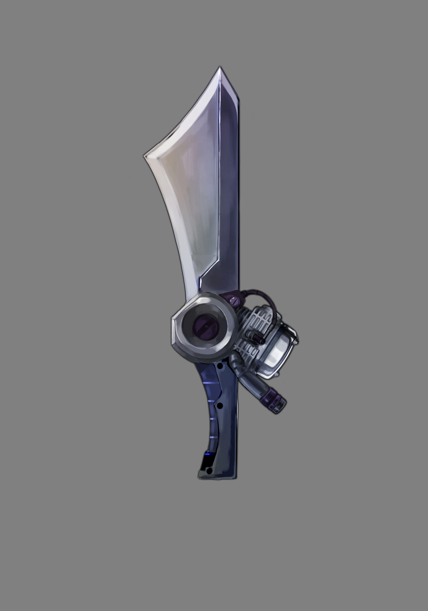
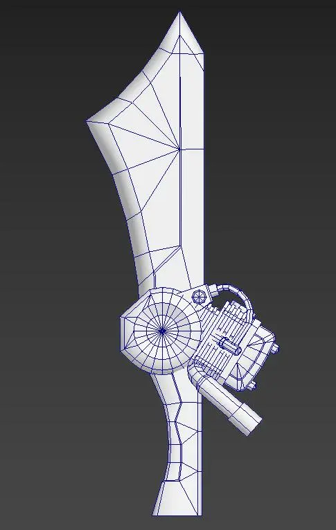
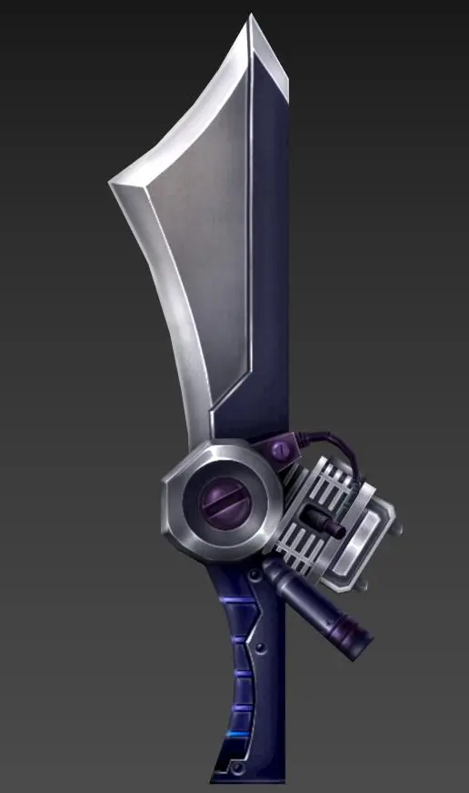
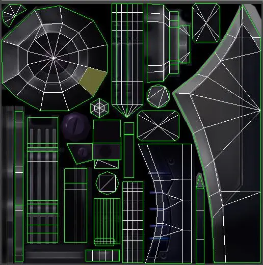
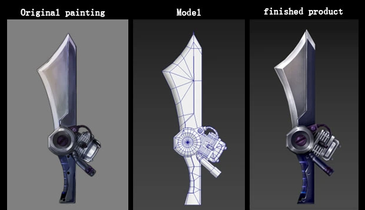

**Props are items that can interact with players in the game and have a certain influence on the attributes of the game characters.**  
There are two important criteria for judging whether an item is a prop:

- First, can it interact with players?
- Second, does the use of this item affect the character's attributes?

In games, props can be divided into three types according to the way they are used: `use type`, `equipment type` and `plot type`.

Let's have a look at an equipment prop as an example:

Equipment props, as the name implies, are things that can be equipped on the body. Different props are designed according to different characters and used in the game.

### Step 1: Original painting

In order to design props, we first need the original painting (Figure 1). Take the props model as a concrete picture to build several specific visual frames for you to further create the 3D model.

_Figure 1_

### Step 2: Prime model

The 3D model includes two kinds of modes: prime and color. The white model is added after the 3D model is built, which is a simple prime model which cannot be used in the game (Figure 2).

_Figure 2_

### Step 3: Color model

The color model is the artistic effect (as shown in Figure 3), that is finally presented in the game after the model is mapped (the model is put on colorful and textured clothes).
PS: UV should be developed before drawing the map of the model (Figure 4). It is convenient to draw the map by tiling the model (the plain model wears clothes).

_Figure 3_

_Figure 4_

_Figure 5_

3D characters, props and scenes in games are produced following these three steps.

I hope that this introduction will let everyone understand the process of 3D model production in games.
