CI Pipelines help improve efficiency by automating complex workflows. With GitHub Actions, it's easier than ever to bring CI/CD directly into your workflow from your repository. Put together with the CI pipeline, a series of automated workflows that help DevOps teams cut down on manual tasks.

In this article, I will describe the integration between GitHub actions with the CI pipeline where I will cover the following topics:
* Basic understanding of [CI/CD pipeline](https://www.edureka.co/blog/ci-cd-pipeline/), how and why we should use GitHub Actions instead of other tools (Here we will only focus on the CI pipeline).
* Provided step-by-step guidelines so that anyone can prepare a workflow just by following this article.
* Step-by-step guideline on how to trigger the QA Workflow from the Developer repository.

## What is CI/CD
[Continuous integration](https://www.atlassian.com/continuous-delivery/continuous-integration) (CI) in CI/CD is an automated process that lets multiple developers contribute software elements to the same project without any integration conflicts. CI engages automated testing whenever a software change is integrated into the repository. 

[CD](https://www.atlassian.com/continuous-delivery/principles/continuous-integration-vs-delivery-vs-deployment) is known for continuous delivery or continuous deployment. Both involve continuously integrating and deploying the code to QA or production environments. Some teams practice continuous deployment to deploy daily or even hourly to production, though continuous deployment is not optimal for every business application.
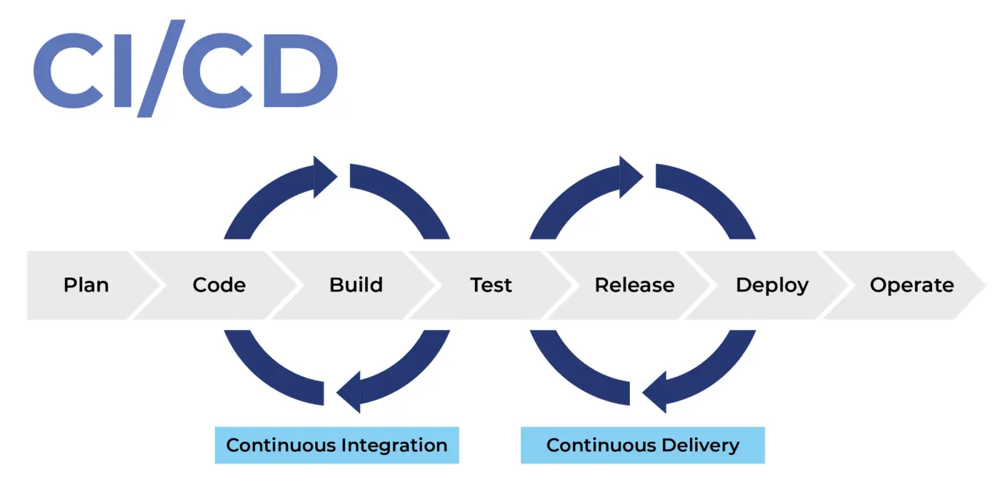
_Image Source [FAUN Publication](https://faun.pub/most-popular-ci-cd-pipelines-and-tools-ccfdce429867)_

## What is GitHub Actions
[GitHub Actions](https://docs.github.com/en/actions/learn-github-actions/understanding-github-actions) is an event-driven automation platform that allows you to run a group of commands after a specified event. It uses [YAML](https://www.javatpoint.com/yaml) syntax to specify the workflow. This action makes it easier to write a script (.yml) in your workflow quickly. Workflows are stored as a separate YAML file in your code repository. You can create a workflow in your repository that automatically triggers a series of commands whenever code is pushed. A frequent use case for Actions is automated continuous integration and deployment.
## Why GitHub Actions
GitHub Actions is free to use on both public repositories and self-hosted runners. It can be used for free on private repositories with a limit of 2,000 minutes a month. It is quick and easy to set up directly from the GitHub website. It permits building CI/CD pipelines for testing, releasing, and deploying software without third-party platforms. It allows easier integration with code on GitHub and the option to reduce the number of services you need to subscribe, to have a complete CI/CD workflow. It also allows for much easier viewing of each build's pipeline status since you do not have to leave GitHub's website to see any logs or errors.
## Getting started with GitHub Actions
1. At first, you need to create a new repository
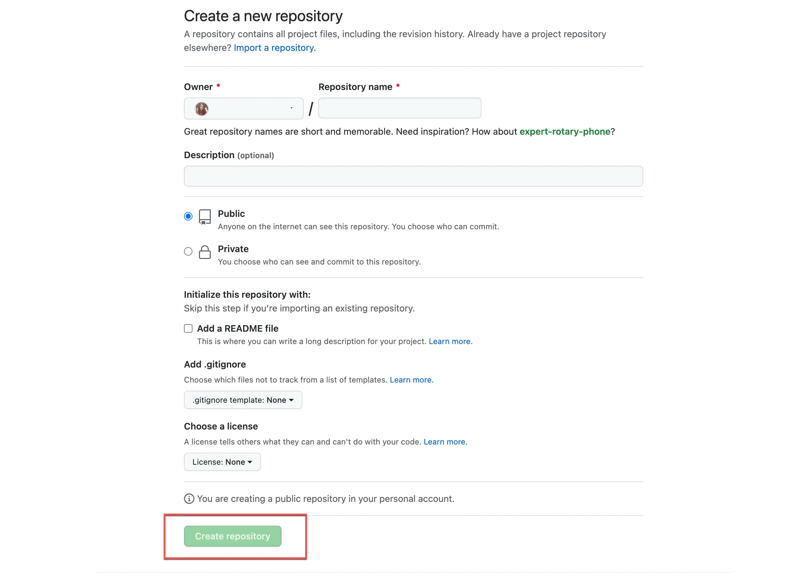
2. You need to push your code into the repository. For example, I am using the Selenium (Java with maven) project.
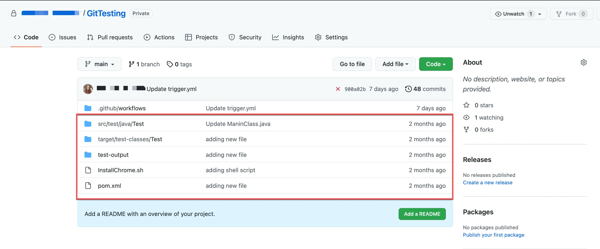

##### **Create and Configure a New Workflow**
1. In the Actions tab, you will see that GitHub recommends [Workflow](https://docs.github.com/en/actions/using-workflows/workflow-syntax-for-github-actions), depending on the project. You can select your desired template based on your project repository (for my project, I am selecting Java with Maven). You can create multiple workflows in the same repository. Alternatively, you can set up your workflow by clicking on the "set up workflow yourself" option.
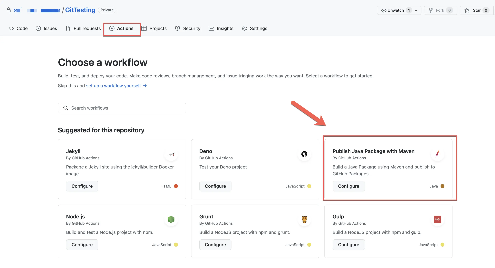
2. It will automatically generate a .yml file for the java with maven project.
Workflows will be located inside the .github/workflows directory. For example- .github/workflows/maven.yml to your project. 
                 
##### A workflow file consists of the following contents-

**Name of the Workflow:** The workflow's name is denoted by the keyword **'name'**. If you wish to include multiple CI jobs in your project, you should name each one appropriately.

**Event:** A workflow can be triggered manually or in response to specific events. You will use the **'on'** keyword to specify the events that trigger a workflow. There are many ways to trigger the workflow, such as:
1. push
2. pull_request
3. release & many more

You can mention the branch name below the specific event. If you create a workflow in your default branch(main) then you don't need to mention the branch name.

**Jobs:** A workflow execution made up of one or more jobs. A job consists of multiple steps and runs in an instance of the virtual environment. Jobs can run independently or sequentially.

**Runner:**  A runner is a server that executes your workflows when they're triggered. You can host your runner or use GitHub-hosted runners such as Ubuntu Linux, Microsoft Windows, and macOS. In my example, I am using the Ubuntu runner. You can choose any other operating system (Windows/Mac OS) per the machine's requirement. We need to run a single job at a time.
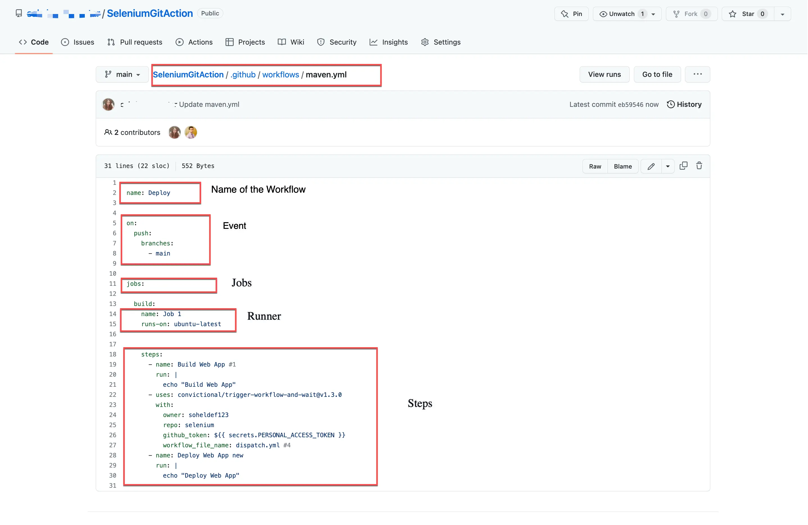
**Steps:** After you specify the runner, determine the steps with the commands. Steps are a group of tasks that a job can execute.

**Actions:** An action is a command which is executed on a runner and is one of the core elements of GitHub Actions. You can create actions or you can use publicly shared Actions from the Marketplace.

##### **Run The Workflow**
1. You will see the "Start commit" button on the right side of the page. By clicking on the commit button, you can execute the .yml file.
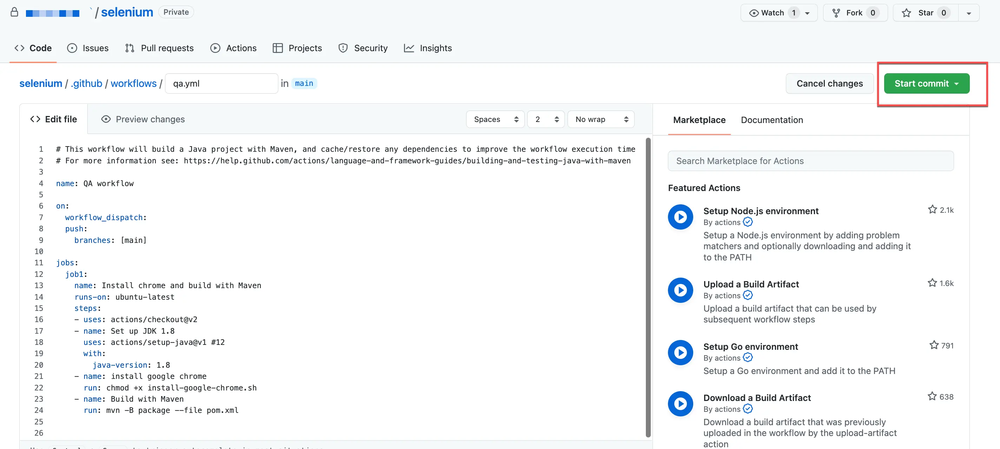 
2. Once the commit is successful, you will notice that your new workflow is being added in the "Actions" tab.
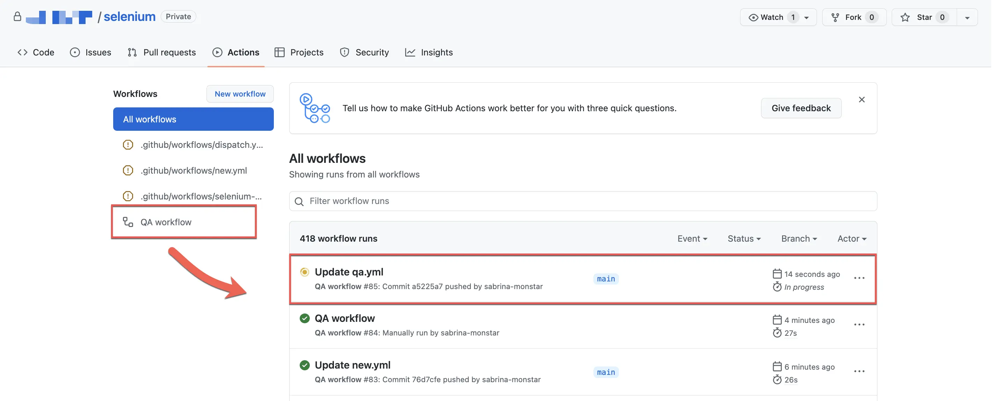
3. The workflow build job starts building and running the instructions/commands in the .yml file and changes the build status from "Queued" to "In progress".
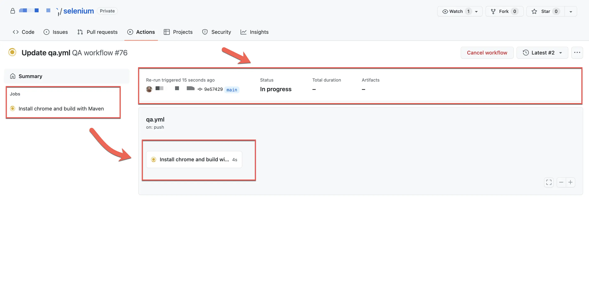
4. When you go to the "Actions" tab, you will notice that a job is set up and executed. You can check it to see the live console.
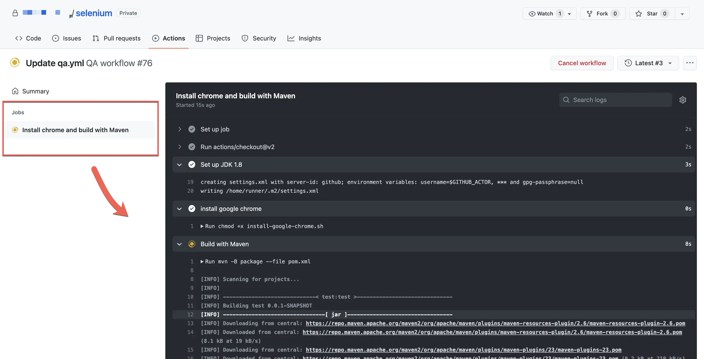
5. After completing all the build runs, you will notice the status changed to pass/fail based on the outcome of the build run.
6. If the build passes, you will see a Green Tick Mark (✅) beside the built-to run.
7. If the build fails, you will see a Red Cross Mark (❌) beside the built and an email notification will be sent to the user.
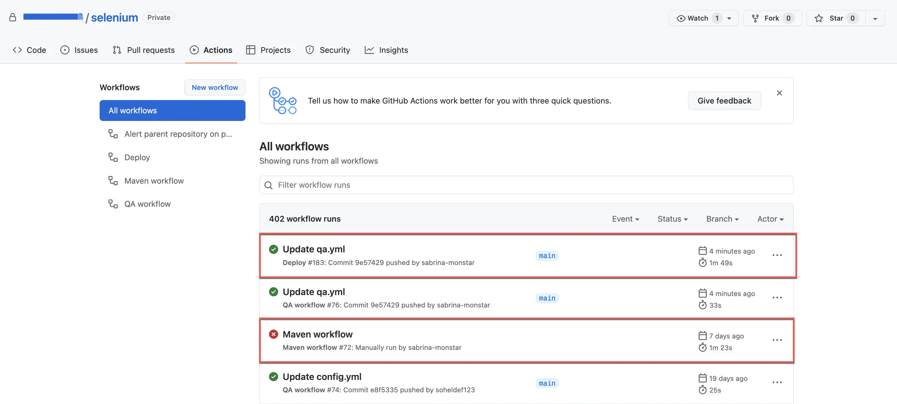

##### **Disable The Workflow**
1. Go to the Action tab and select your desired workflow from the workflows section (left-side). 
2. Next you need to click on the meatball icon (**...**) and choose the disable workflow option.
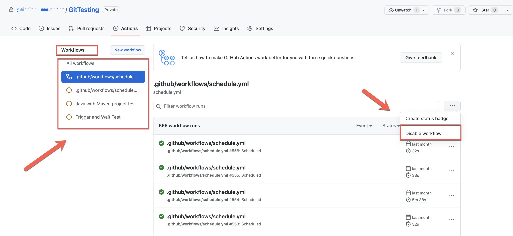
 

#### **Scheduler (Cron job)**
The scheduled event executes your workflow on a specific timeline using the [cron syntax](https://pubs.opengroup.org/onlinepubs/9699919799/utilities/crontab.html#tag_20_25_07). The cron expression is made of 5 fields which are denoted as asterisk signs ( * * * * * ) that means "every minute of every day". You can define multiple schedules based on your project need. I have instructed the job to run every 15 minutes in the below example. Also, be aware that GitHub Actions only runs scheduled jobs on the default branch of your repository (main). As times are showing on UTC, so you may have to do some time zone conversion.

#### **Multiple Jobs & Dependencies**
To execute our tests in GitHub Actions in parallel and reduce execution times, you can run multiple jobs simultaneously. You can also set up jobs that depend on other jobs. 
1. If any job needs to run sequentially where the current job depends on the previous job to succeed, in that case, you have to add the **`needs`** attribute to create the dependency.
2. If your parent job fails, you can still run the child job by using the **`if:always()`** keyword. If the first job fails, it will run the next job inspite of having the dependency.

#### **Trigger the Other Workflow**
When Developers and QAs are working on the same project, it is essential that whenever a developer modifies or changes some code on his project repository and pushes those changes, it should automatically trigger the QA Workflow. You can trigger multiple workflows from the Dev repository.
To implement that, you need two repositories, the Developer Repository (Project) and QA Repository (Automation).

##### **Developer Workflow**
If you want to trigger the QA workflow, you have to follow these steps:
* You need to use a public repository called [checkout](https://github.com/actions/checkout), it is an official GitHub Actions used to check out a repository so a workflow can access it.
* From the [GitHub conventional site](https://github.com/convictional/), you need to use a public repository called [trigger-workflow-and-wait](https://github.com/convictional/trigger-workflow-and-wait). You must provide some required information about the repository that you want to trigger.
* You need to generate a [github token](https://docs.github.com/en/authentication/keeping-your-account-and-data-secure/creating-a-personal-access-tokens) from the developer option and add that token to the developer repository as a [secret key](https://docs.github.com/en/actions/security-guides/encrypted-secrets). 

##### **QA Workflow**
In QA workflow, you have to follow these steps:
* You need to add the developer as a collaborator so that he can access the QA repository.
* Next, you need to add an attribute called [workflow_dispatch](https://github.com/marketplace/actions/workflow-dispatch) to the event section so that it can be triggered. 
   

By following the above steps, you can trigger a QA Automation workflow. And whenever a developer changes or modifies anything and pushes those changes to their project repository, it will automatically trigger the QA Workflow as well. In this way, both the developer and QA can work together in the CI pipeline.

## Pro Tips
1. You should name your workflows accordingly if you want multiple workflows to build a CI pipeline to run tests with Selenium GitHub Actions. "Name" is not a required field; if skipped, GitHub shall create a default name for us from the defined path & name of the file.
2. If you have multiple workflows with the event **(on:push)**. Whenever you modify or push anything to that repository, it will trigger all the workflows and will be running on the Actions tab.
3. The formats you need to keep in mind while dealing with YAML files are that you cannot enter incorrect formats, and you need to follow the proper indentation, colons, and dashes across the file, which primarily consists of key-value pairs, lists, and maps.
4. For example, if a workflow is scheduled to run every 15 minutes. After executing the workflow, you will notice that it did not run within 15 minutes. A delay of 2 to 10 minutes may occur. 
5. In QA workflow, you must add the "workflow_dispatch" event; otherwise, it will not be triggered. 
6. While generating the PAT, we should generate the token using the custom options, or it may create some issues.
7. If you use a free version of the GitHub account and want to keep your cron job running for many days, it might use 100% of included services for GitHub Actions. You can make your repository public or switch to a paid version of your GitHub account to resolve these issues. You can check this link for more details- [pricing/compare-features](https://github.com/pricing#compare-features)
8. To get more information about GitHub Actions, you can check this link- [GitHub Actions Documentation](https://docs.github.com/en/actions)

## Additional resources
Check out the following tutorials and resources to learn more about GitHub Actions: 
1. [How to Set Up Advanced CI/CD Pipeline with GitHub Actions](https://javascript.plainenglish.io/how-to-setup-advanced-ci-cd-pipeline-with-github-actions-no-travis-circle-ci-29b02b03c501)
2. [Creating a CI/CD pipeline using Github Actions](https://medium.com/@michaelekpang/creating-a-ci-cd-pipeline-using-github-actions-b65bb248edfe)

_Article Photo by [NordWood Themes](https://unsplash.com/photos/kRNZiGKtz48)_
