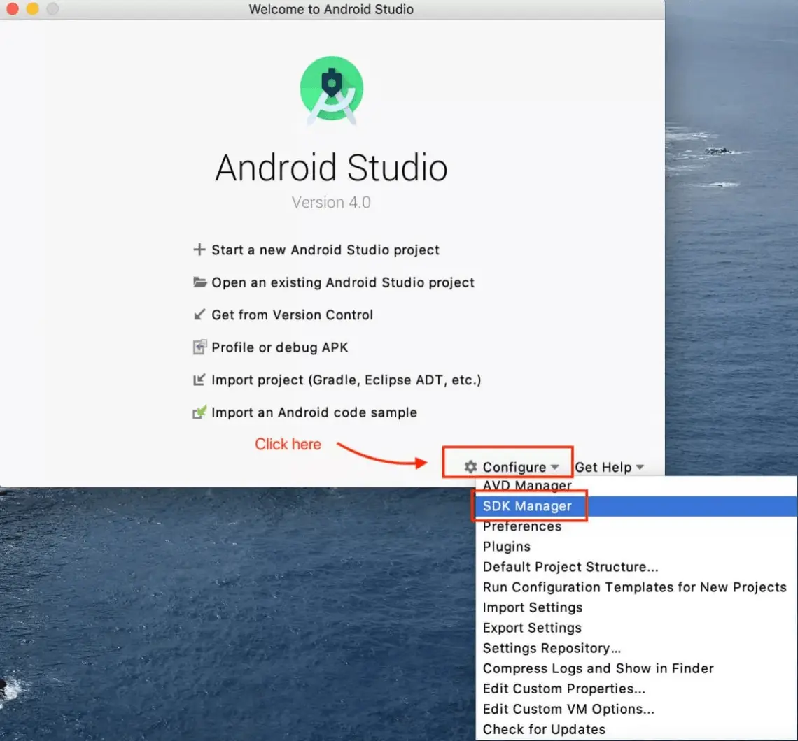
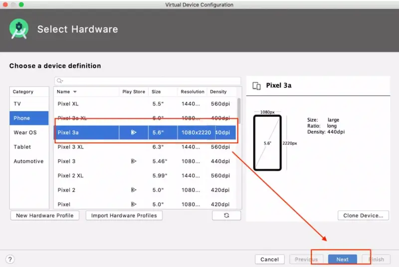

Manual testing is an essential part of Android application testing that involves a tester manually going through an application to ensure that it meets the desired specifications and quality standards. However, this process can become monotonous and repetitive, leading to a decrease in the tester's attention span and motivation. As a result, the testing process can become less effective, and the quality of the application can suffer. This is where Appium comes in, offering a solution to this problem by handling repetitive tasks and freeing up the tester's time and energy to focus on more complex and creative aspects of testing.

Appium is an open-source tool for automating native, mobile web, and hybrid applications. It allows you to write tests in multiple programming languages such as Java, Ruby, Python, etc. With Appium, you can write tests that simulate user interactions on an Android device, which can help test the functionality of your application.

Furthermore, Appium uses the standard WebDriver API, so you can leverage the wide range of WebDriver-based tools and libraries available in the market. One of the major advantages of Appium is it can be integrated easily with other testing frameworks, such as Selenium, allowing testers to leverage existing test scripts and frameworks for mobile app testing.

By the end of this article, you will have a thorough understanding of how to get started with Android test automation using Appium and Java. Furthermore, you will be able to automate a feature of the Calculator app, putting into practice what you've learned. Before we get started the reader should have a basic knowledge of [Java](https://www.javatpoint.com/java-tutorial) programming language and [Selenium](https://www.javatpoint.com/selenium-tutorial). We’ll cover the following topics:
- Setting up Appium for Android test automation
- Getting appPackage and appActivity
- Writing your first Appium test


## 1. Setting up Appium for Android test automation

Setting up Appium for Android test automation is a straightforward process. I will be showing the setup in macOS for this article. You can check the installation in Windows from [here](https://support.smartbear.com/testcomplete/docs/app-testing/mobile/device-cloud/configure-appium/android-on-windows.html). Here’s how you can get started:

Install Homebrew: Homebrew is a package manager for Mac OS X that makes it easy to install and manage open-source software. You can install Homebrew by following the instructions on the [Homebrew](https://brew.sh/) website.

Install Node.js: Appium is built on Node.js, so you’ll need to install Node.js on your Macbook. You can install Node.js by running the following command in your terminal:

- `brew install node`

Install Appium: Once you have installed Node.js, you can install Appium by running the following command in your terminal:

- `npm install -g appium`

Install Android Studio: You’ll also need to install Android Studio on your Macbook. The Android Studio provides the tools and APIs required to develop, test, and debug Android applications. You can download the [Android Studio](https://developer.android.com/studio) from the Android developer website.

Setup SDK Platforms and Tools: Once downloaded and installed, open Android Studio, click on Configure, and then SDK Manager. 



You can download any desired SDK Tools from here. Also can upgrade any required updates from Android SDK settings. We’ll select the defaults for now.


Set up Environment Variable: To run Appium tests on an Android device, you need to set up environment variables that tell the Appium server where to find the Android SDK and other tools like the emulator and platform tools. This is necessary to ensure that Appium can access these tools and run tests correctly.

To accomplish this, we can include the following variables in the system environment.

On MacOS-

 - To add environment variables for Android Studio, you need to edit the shell profile file for your chosen shell. For Bash, this is usually the .bash_profile file, while for Zsh it's the .zshrc file.


Set up the Android emulator: Once you have installed the Android SDK, you can set up an Android emulator to test your application. The Android emulator is a software tool that allows you to run a virtual Android device on your computer. This virtual device can be used to test your applications without the need for a physical Android device.

- Open Android Studio
- Click Configure
- Click on AVD Manager


To create an Android emulator, you need to launch the Virtual Device Configuration flow, which is accessible from within Android Studio.


When creating an Android emulator, it's important to consider which Play Store services are available, as certain apps may require the latest version of these services to be installed. Select the operating system and all the necessary stuff and complete creating the virtual device.



After creating our emulator, we can start it up by tapping the Play icon under the Actions section.


Start the Appium server: Once you have completed all of the above steps, you can start the Appium server by running the following command in your terminal:

- appium


That’s it! You have successfully set up Appium for Android test automation on your Macbook. You can now write and run Appium tests for your Android application.

## 2. Getting appPackage and appActivity

We can find the App details using the [Android Debugging Bridge (ADB)](https://developer.android.com/studio/command-line/adb) interface in a Terminal.

1. Open your android emulator and open the app in which you want to find the appPackage and appActivity. I am using the android Calculator Application here.


2. Open a Terminal window and use the below command to see the appPackage and appActivity.

   - adb shell dumpsys window | grep -E ‘mCurrentFocus’


## 3. Writing your first Appium test

1. Choose a programming language and Appium client library: Appium supports various programming languages such as Java, Python, Ruby, etc., and client libraries for each language are available.

2. Create a new test project: Set up a new project in your preferred IDE and include the Appium client library in your project’s build path. 
   - Open your IDE, say for example you are using Intellij Idea, start creating a new Java Project by following the below path,

     Go to File -> New -> Project -> Select Maven Project -> Click Next


  Once you are done with the above step, you will land on the project page,

  - You need to add an Appium library that would help our test framework to execute the test cases and the same can be done with the help of the Maven Project’s pom.xml file.


3. Write your first Appium test: Here’s an example of a Java test to launch the Calculator app on an Android emulator, input some numbers, and verify the result. Find the project [here](https://github.com/Eftiar/Calculatortest.git).

```java
import io.appium.java_client.android.AndroidDriver;
import io.appium.java_client.remote.MobileCapabilityType;
import org.openqa.selenium.remote.DesiredCapabilities;
import java.net.URL;


public class CalculatorTest {
   public static void main(String[] args) throws Exception {
       DesiredCapabilities capabilities = new DesiredCapabilities();
       capabilities.setCapability(MobileCapabilityType.DEVICE_NAME, "emulator-5554");
       capabilities.setCapability("appPackage", "com.google.android.calculator");
       capabilities.setCapability("appActivity", "com.android.calculator2.Calculator");
       AndroidDriver driver = new AndroidDriver(new URL("http://0.0.0.0:4723/wd/hub"), capabilities);
       driver.findElementById("digit_2").click();
       driver.findElementById("op_add").click();
       driver.findElementById("digit_2").click();
       driver.findElementById("eq").click();
       String result = driver.findElementById("result").getText();
       System.out.println("Result is: " + result);
       driver.quit();
   }
}
```
This test uses the Appium Java client library and launches the Calculator app on an Android device, performs some basic calculations, and verifies the result. It uses the AndroidDriver class to interact with the mobile device, and DesiredCapabilities to set the device's capabilities. 

4. Run the test: Run the test from your IDE, and it will execute the test on the connected mobile device or emulator.

Note: Ensure the Appium server is running and listening to the correct port before executing the test.

### Here are some Top Appium Installation Hacks that's can make your Appium installation easier:

 - Use the Appium GUI installer: The Appium GUI installer is a graphical user interface that guides you through the installation process and can be helpful for beginners. https://github.com/appium/appium-desktop/releases/tag/v1.22.3-4 
 - Install required dependencies separately: Appium requires several dependencies, such as Node.js and the Android SDK. Installing these dependencies separately can make the Appium installation process smoother. 
 - Use Appium doctor: Appium doctor is a command-line tool that can help diagnose and resolve common installation issues. Running Appium doctor before installing Appium can help identify any missing dependencies or configuration issues. https://github.com/appium/appium-doctor 
 - Use a package manager: Using a package manager like Homebrew (for macOS) can simplify the installation process by automatically resolving dependencies. https://brew.sh/

Thank you for reading this blog post. I hope you found the information useful and informative. If you enjoyed this post, be sure to check out our next blog post, which will focus on locating elements on Appium, POM and running & debugging Appium tests on Android.

https://www.linkedin.com/in/s-m-eftiar-hossain-a94808174/ 

_Article Photo by [Alex Knight](https://unsplash.com/@agk42)_

