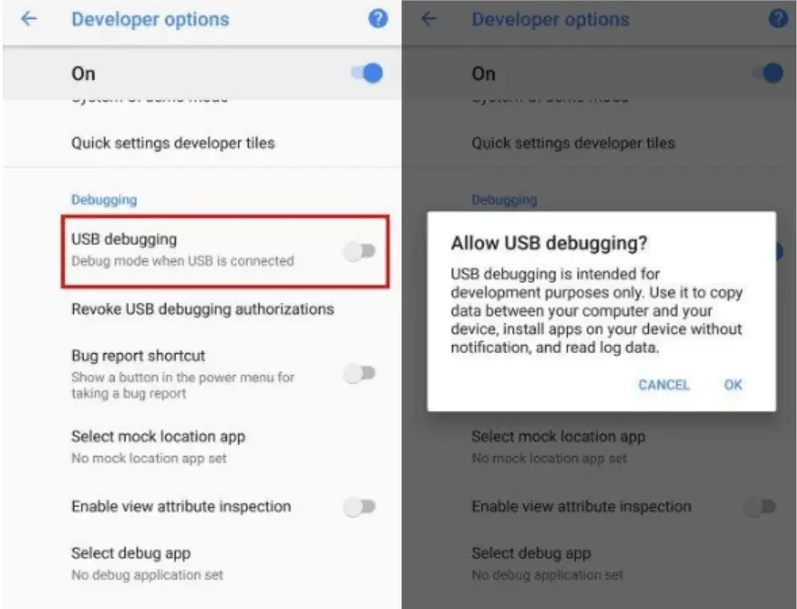
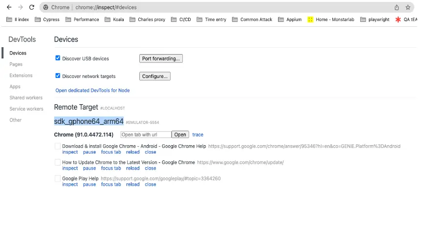
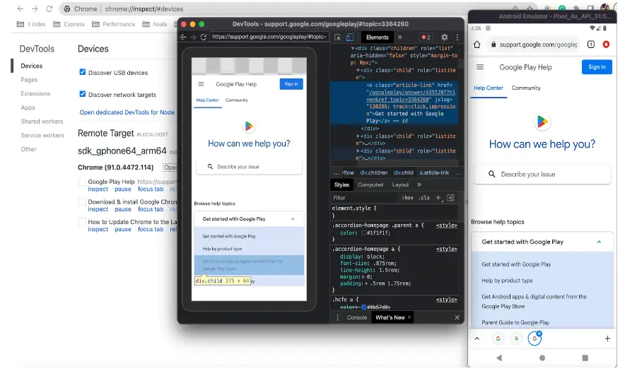
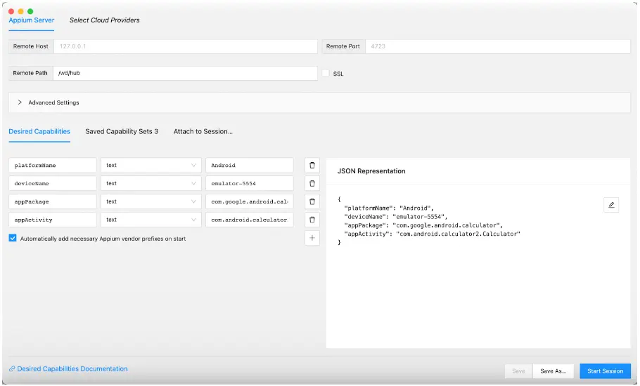
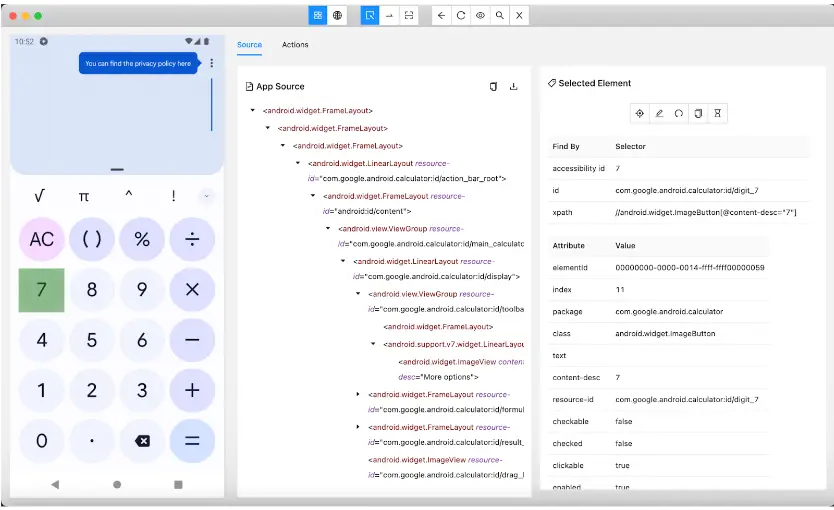
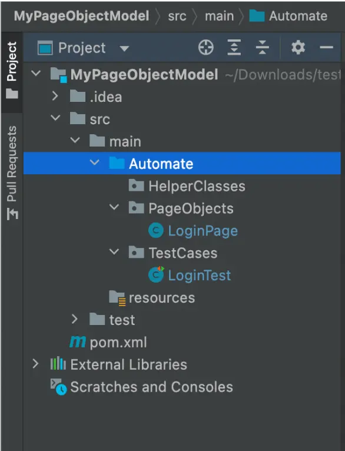

Welcome back! In this blog post, we will explore Appium, a powerful tool for automating Hybrid Android apps. Firstly, we will discuss locating Hybrid app elements in Appium, which involves identifying and interacting with specific elements within the app's user interface. Next, we will cover Hybrid Android app automation, which focuses on automating the testing process of Android apps with hybrid features. Additionally, we will explore the Page Object Model (POM) pattern for Appium test automation, a structured approach that aids in maintaining maintainable and reusable code. Finally, we will highlight best practices for Appium test automation, providing valuable guidelines for achieving reliable and efficient automation. 

By the end of this blog, you will have the knowledge and tools to enhance your Hybrid Android app automation process using Appium. If you haven't read the [first part](https://engineering.monstar-lab.com/en/post/2023/04/26/Accelerate-Your-Android-App-Testing-with-Appium-and-Java-A-Beginner%E2%80%99s-Guide-(Part-1)/) yet, I highly recommend checking it out before proceeding. In the first part of this blog post series, we explored:
 - How to set up Appium for Android test automation
 - Getting the appPackage and appActivity
 - Writing your first Appium test

Now let’s deep dive. Hybrid Android app refers to an application that combines elements of both native and web-based technologies for development. It typically uses web technologies such as HTML, CSS, and JavaScript to build the user interface (UI) and runs inside a WebView component, which acts as a browser embedded within the app.

## 1. Locating Hybrid app elements in Appium

Hybrid apps are built using a combination of web technologies (HTML, CSS, JavaScript) and native components. In that case, you need to locate both web and native elements.

### Locating Web Elements: 

Hybrid apps typically use a WebView component to display web content within the app. You'll need to locate the WebView element to interact with the web elements inside it. You can locate Web elements following these steps:

1. Install the hybrid app on an Android device or emulator. If you're running on it on a real device, connect the Android device to your development machine using a USB cable. Make sure USB debugging is enabled in the device's developer options. Ensure that the app is running in a debuggable mode.



2. Open Google Chrome on your development machine and navigate to "chrome://inspect". You should see a list of connected devices and running WebView instances. 



3. Find the WebView instance corresponding to your app and click the "Inspect" button. This opens the Chrome DevTools for that WebView.



4. Within Chrome DevTools, you can use various inspection tools like the Elements panel, Console, and Network panel to locate and interact with web elements. You can inspect the HTML structure, apply CSS selectors, execute JavaScript, and simulate user interactions.


5. Once you have identified the desired web element, you can use it in your code to interact with the element.


### Locating Native Elements:

When it comes to locating native elements in Appium, there are several ways to do so. One popular method is to use Appium Inspector, which is a visual tool that allows you to inspect the user interface (UI) elements of your application and generate the corresponding locators.
To use Appium Inspector, you'll need to have your app running on a device or emulator and have the Appium server running. Once you have both of these setups, you can locate elements following these steps:

1. Download and Install the Appium Inspector from [here](https://github.com/appium/appium-inspector/releases).


2. Open Appium Inspector and Enter the desired capabilities for your test, such as the device name and platform name. Find the details documentation of desired capabilities from [here](https://appium.readthedocs.io/en/stable/en/writing-running-appium/caps/).



3. Click the "Start Session" button to launch your app on the device or emulator.


4. Once your app is running, you should see the UI elements displayed in Appium Inspector. You can click on the UI elements and see their attributes, such as the ID, class name, and text.



5. To generate a locator for an element, simply click on the element in Appium Inspector and Copy "XPath" / "Accessibility ID" or “Resource ID” (depending on your preferred locator type) from the right side of the Selected Element.


6. Paste the generated locator into your Appium test code and use it to interact with the element.


Using Appium Inspector you can save you time and make it easier to locate elements in your app. However, it's important to note that it's not always the most reliable method, especially if the UI of your app changes frequently. In these cases, you may need to use alternative methods such as [regular expressions](https://www.lambdatest.com/blog/locators-in-appium/) to locate your elements.

## 2. Hybrid Android app Automation with Appium

Automating Hybrid apps can be more complex compared to testing native apps or web apps alone, as you need to handle both web and native contexts in your test script. Fortunately, Appium provides methods to switch between these contexts and perform actions accordingly.

Here's an example code snippet to give you an idea of how to automate a hybrid Android app using Appium with Java:

Switching into Webview:

```java
    public static void switchToWebView() {
        Set<String> contextHandles = driver.getContextHandles();
        for (String context : contextHandles) {
            if (context.startsWith("WEBVIEW")) {
                driver.context(context);
                break;
            }
        }
    }
```
Switching into Nativeview:
```java

    public static void switchToNativeView() {
        Set<String> contextHandles = driver.getContextHandles();
        for (String context : contextHandles) {
            if (context.startsWith("NATIVE")) {
                driver.context(context);
                break;
            }
        }
    }

```

The given code provides two methods, `switchToWebView()` and `switchToNativeView()`, for switching between the web view and native view in a mobile application using Appium.

In the `switchToWebView()` method:

- The code starts by obtaining a set of all available context handles using the `driver.getContextHandles()` method. Context handles represent different execution contexts or views within the application.
- It then iterates through each context handle using a for-each loop.
- Inside the loop, it checks if the context handle starts with the prefix "WEBVIEW" using the startsWith() method.
- If a context handle with the "WEBVIEW" prefix is found, it indicates the web view context.
- The code then switches the driver's context to the identified web view context using the driver.context(context) method.
- Finally, the loop is broken using the break statement to prevent unnecessary iterations once the web view context is found.

Similarly, in the `switchToNativeView()` method, the code performs the following steps:

- Obtains the set of all available context handles using driver.getContextHandles().
- Iterates through each context handle.
- Checks if the context handle starts with the prefix "NATIVE".
- If a context handle with the "NATIVE" prefix is found, it indicates the native view context.
- Switches the driver's context to the identified native view context using `driver.context(context)`.
- Breaks the loop to stop further iterations once the native view context is found.

These methods provide a way to switch between the web view and native view contexts in a mobile application when using Appium. There are some other methods such as `driver.getContextHandles()`, `driver.getContext()`, `driver.switchTo().context()`
are used to get context and switching the context between Web and Native view.  


## 3. POM for Appium test Automation

POM stands for Page Object Model, which is a design pattern used in test automation to represent each page of an application as a separate class, containing its own set of methods and properties. By separating the application pages into separate classes, the code becomes more readable and easier to understand.



### Step 1: Create Page Objects

The first step is to create a class for each page or screen of the application that you want to test. The class should contain the elements and methods specific to that page. For example, if you have a login page, you can create a LoginPage class as follows:

```java
public class LoginPage {
   private AndroidDriver<AndroidElement> driver;
   public LoginPage(AndroidDriver<AndroidElement> driver) {
      this.driver = driver;
   }
   private By emailId = By.id(“email”);
   private By password = By.id(“password”);
   private By loginButton = By.id(“login”);

   public void enterEmail(String email) {
      driver.findElement(emailId).sendKeys(email);
   }
   public void enterPassword(String pass) {
      driver.findElement(password).sendKeys(pass);
   }
   public void clickLoginButton() {
      driver.findElement(loginButton).click();
       // Check if the login is successful 
      if (/* condition to check if login is successful */) { 
        // Success assertion Assert.assertTrue
       (/* condition indicating login success */, "Login was successful."); 
       returnToHome();
       } 
     else { 
       // Fail assertion Assert.fail
      ("Login failed."); 
      }
  }
 private void returnToHome() { 
    // Code to navigate back to the home screen or perform other actions 
}
}
```

### Step 2: Create a TestCases Class

Creates a separate class for each test case that you want to execute. In each test class, initialize the driver and create an instance of the page class. For example, if you want to test the login functionality, you can create a test class as follows:

```java

public class LoginTest {
   private AndroidDriver<AndroidElement> driver;
   LoginPage loginPage;
   @BeforeTest
   public void setUp() throws MalformedURLException {
      DesiredCapabilities caps = new DesiredCapabilities();
      caps.setCapability(“deviceName”, “emulator-5554");
      caps.setCapability(“platformVersion”, “10.0");
      caps.setCapability(“deviceName”, “emulator-5554");
      caps.setCapability(“appPackage”, “com.example.android”);
      caps.setCapability(“appActivity”, “.MainActivity”);
      caps.setCapability(“automationName”, “UiAutomator2");
      URL url = new URL(“http://127.0.0.1:4723/wd/hub”);
      driver = new AndroidDriver<AndroidElement>(url, caps);
      loginPage = new LoginPage(driver);
   }
   @Test
   public void testLogin() {
      loginPage.enterEmail(“testuser@test.com”);
      loginPage.enterPassword(“testpassword”);
      loginPage.clickLoginButton();
   }
   @AfterTest
   public void tearDown() {
      driver.quit();
   }
}
```

### Step 3: Run the Test

Run all the test classes and verify the results. You can use a test runner such as TestNG or JUnit to run the tests. Find the demo project for POM [here](https://github.com/Eftiar/DemoPageObjectModel). 

### 4: Best practices for Appium test automation


- **Use stable locators**: Choose reliable and unique locators to identify elements within the app's UI. IDs or names are better to use for web elements, while resource IDs or accessibility IDs are useful for native elements. Avoid relying solely on element positions, as they can change dynamically.

- **Set up the desired capabilities correctly:** Provide accurate and complete desired capabilities to establish the correct session for your hybrid app. Specify the app type and include other necessary capabilities like platform name, device name, app package, app activity, and automation name.

- **Use waits and synchronization:** Hybrid apps often involve asynchronous operations, such as loading web content or making API requests. Use implicit and explicit waits to handle synchronization. Implicit waits set a global timeout for element searches, while explicit waits wait for specific conditions to be met before proceeding with the test. Learn more about waits from here. Here’s an example of how to use waits:

    ```java
    public class HybridAppTest { 

    private WebDriver driver; 
    private WebDriverWait wait; 
    public HybridAppTest(WebDriver driver) { 
    this.driver = driver; 
    this.wait = new WebDriverWait(driver, 10); 
    // Initialize WebDriverWait with a timeout of 10 seconds 
    } 
    public void performHybridAppTest() { 
    // Perform some actions that trigger the loading of web content 
    // ... 
    // Wait for a specific element to be visible using explicit wait 
    By elementLocator = By.id("exampleElementId"); wait.until(ExpectedConditions.visibilityOfElementLocated(elementLocator)); 
    // Perform actions on the loaded element 
    WebElement element = driver.findElement(elementLocator); element.click(); 
    // Continue with the test 
    // ... 
    } 
    }
    ```

- **Use parameterization:** Parameterizing your tests can help you to run the same test with different data inputs, making your tests more flexible and reusable. You can use tools such as TestNG or JUnit to define data-driven tests. Here’s an example of how to use parameterization:

    ```java
    public class ParameterizedTest { 

    @DataProvider(name = "testdata") 
    public Object[][] testData() { 
    return new Object[][] { 
    {"username1", "password1"}, 
    {"username2", "password2"}, 
    {"username3", "password3"}
        };
    } 
    @Test(dataProvider = "testdata") 
    public void loginTest(String username, String password) { 
    // Perform login with the provided username and password 
    // ... 
    }
    }
    ```

- **Continuous integration and reporting:** Integrate your hybrid app automation tests into a continuous integration (CI) system, such as Jenkins or CircleCI. This allows for automatic test execution on code changes and provides detailed test reports and notifications. Additionally, leverage reporting tools like Extent Reports or Allure to generate comprehensive and visually appealing test reports.

 - **Use cloud-based devices:** Testing on real devices can be expensive and time-consuming. Using a cloud-based device provider such as AWS Device Farm, Sauce Labs, or BrowserStack can help you test your app on a wide range of devices and configurations without managing physical devices.


In conclusion, this two-part blog post series provides valuable insights into accelerating Android app testing with Appium and Java, specifically focusing on hybrid app automation. The first part covers the initial setup of Appium, obtaining the necessary package and activity information, and writing your first Appium test. The second part delves deeper into Appium by discussing best practices for locating hybrid app elements, automating hybrid Android apps, implementing the Page Object Model (POM) for test automation, and highlighting general best practices for Appium test automation.


_Article Photo by [Alex Knight](https://unsplash.com/@agk42)_


