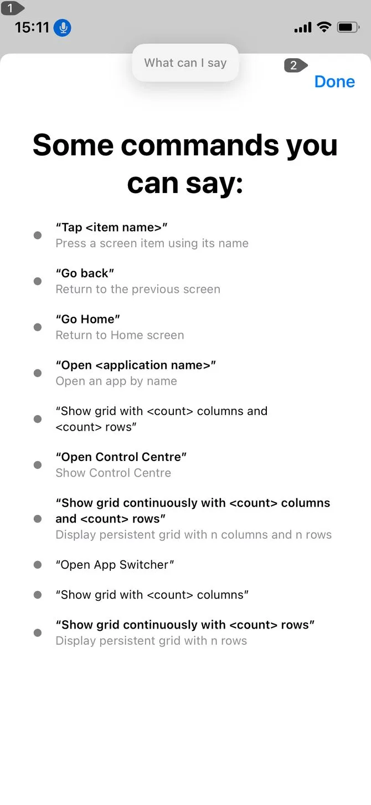
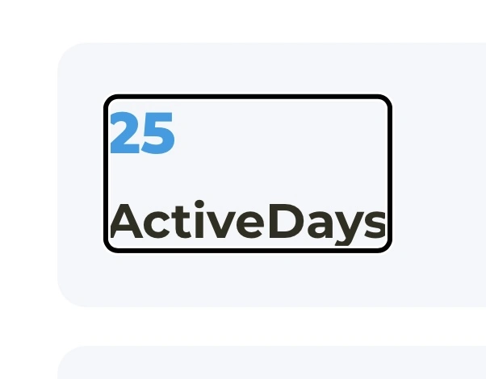
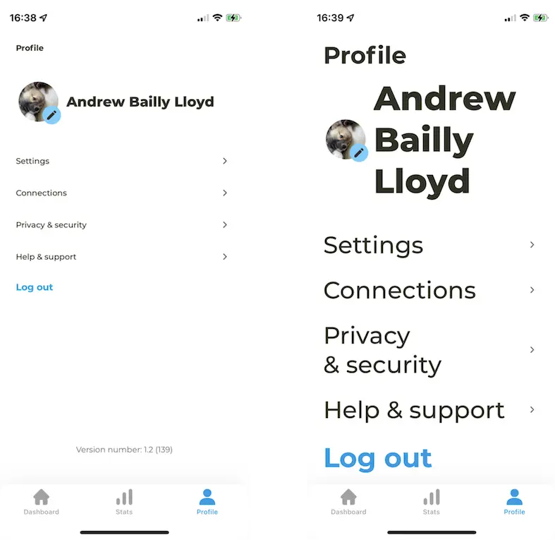

Accessibility in our iOS applications is something we should all strive for. To be inclusive and have our applications available to all is a massive goal for us at Monstarlab in every project we undertake. To accommodate to each user, whatever their needs, is extremely important. I wanted to write this blog post to share some of my learnings from adding various accessibility support to recent projects within Monstarlab using SwiftUI. I think a lot of developers will be taken aback by how simple adding support is. Below is a list of some of the various accessibility features iOS provide and how you can add them into your application.


## Voice Control

Voice control allows people who may not be able to physically interact with their device full control over the application without the requirement of touch. It allows users to tap buttons, request to scroll up or down and all the various gestures you expect using iOS such as swiping and zooming. 

Voice control mostly comes fully supported with iOS without much further development required. iOS Voice Control can automatically acknowledge UI elements that can be interacted with. Then with a number of commands, users can control the app using their voice, for example: Saying “Tap ‘Home Button’”, will act as if the user has tapped on the button labelled Home. For buttons that do not have text labels, accessibility labels will need to be provided. You can also use accessibility labels if you wish to have a different name used in Voice Control from the text displayed in the UI.

```swift
    Button("Let's GO!") {
        //action
    }.accessibilityLabel(“Start Button”)
```

At any point during use, users can request “Show me what to say”, at this point, iOS will suggest some voice commands the user could use on the current screen. 



Some custom UI elements can be hard to add Voice Control support for, we should always aim to use native iOS components where possible as these will always have Voice Control support. One example of this is our application had a custom slider UI element, for Voice Control support, we had to add extra control buttons to allow Voice Control support, as it was controlled using different swipe/slide gestures not available using Voice Control.

You can read more about iOS Voice Control [here](https://support.apple.com/en-gb/guide/iphone/iph2c21a3c88/ios).


## Voice Over

Voice over is an accessibility feature available on iOS allowing users to have UI elements read to them. 

These elements are read from the top down by default, but the order can be defined by the developer if required. For example, if you had two labels displayed but wish to read them bottom to top, you could use the `accessibilitySortPriority` view modifier property like so. With these, higher numbers are sorted first (the default sort priority is zero).

```swift
    VStack {
        Text("Read Second")
            .accessibilitySortPriority(1)
        Text("Read First")
            .accessibilitySortPriority(2)
    } 

```
Voice over will also read any element when it is tapped on. Once Voice Over is enabled on iOS, a single tap will read the UI element and a double tap will interact with it (for example, tapping a button). There are plenty of other gestures that are part of Voice Over such as swiping left and right to read previous/next elements on the screen.
 
We can group elements together to be read as one making it easier to understand, for example, in a workout application where a user accumulates “active days”, having two separate labels displaying “25” & “active days” would sound much better on Voice Over grouped together, as it will then be read as a singular “25 active days”. 

```swift       
    VStack {
        Text(“25”)
        Text(“Active Days”)
    } 
    .accessibilityElement(children: .combine)
```



You can also group more complex elements together giving them an overall description to give a better understanding to the user what the UI is displaying. You can also disable elements from Voice Over, for example, an image that is purely decorative and adds nothing to the functionality of the screen, you may opt for Voice Over to ignore. 

```swift
    Image.home
        .accessibilityHidden(true)
```

For any elements that do not have text content, you can provide accessibility labels, these will be read by Voice Over to describe the element. We already covered how to add accessibilityLabel’s above as these are also used for Voice Control commands. For example, a “close” button that has an X icon, can have an accessibility label as “close” and Voice over will read it as “close button” and the user can use Voice Control to say “Tap Close”. 

iOS has many gestures to learn while using Voice Over, it also has a Voice Over rotor feature that allows for greater control of what is read, the speed it is read etc. You can read more about Voice Over gestures from Apple [here](https://support.apple.com/en-gb/guide/iphone/iph3e2e2281/ios).

## Zoom

Zoom comes in the box with iOS and no development work is required for specific apps. Controlled in the iOS Settings, zoom functionality allows users to use different finger gestures to zoom and pan around the screen making UI larger.

## Accessibility Text Size Support

To support larger accessibility text sizes, we have to make the UI dynamic enough to support large font sizes in any UI. This means making any view scrollable if required and having correct spacing between elements. It also means any text cannot be restricted to one line as most text will require multiple lines on larger text size options.

Using SwiftUI makes this much easier due to how VStacks and HStacks automatically grow depending on the content provided. iOS will scale your text sizes up and down for you but from experience this will not always work straight out of the box. Designs will never be a pixel-perfect match when developing this way as we let iOS determine much more of specific spacing/layout, but this is good, it hands over more control to iOS with less dependency on developers coding specific values and will ultimately result in a better looking & performing application. It is up to designers to always bear this in mind and for us developers to point out when designs need to be more dynamic.

The main challenge we faced with adding this support was having views be scrollable only when required. It would be easy enough to put all your app’s views into scrollviews but for larger devices or cases where the user’s preferences have veered towards a smaller text size, we still want SwiftUI to work its magic by spacing elements across the screen and giving us the easy, great looking, SwiftUI element layout system we’ve come to rely on. 

We ended up building an AccessibilityScrollView content wrapper which either wraps your content within a scrollview or not. It is determined by the users selected ContentSizeCategory (the text size selected in their device settings). This defaults to using a scrollview whenever accessibility sizes are used but a category can be passed in as a parameter for cases where your UI has less or more content. It often can take some testing & tweaking with different devices and size categories for more complex UIs but we find this solution works really well. 



eg.
```swift
    AccessibilityScrollView(minimumSizeRequired: .accessibilityExtraLarge) {
        VStack {
            //content goes here
        }
    }
```

```swift
struct AccessibilityScrollView<Content>: View where Content: View {
    init(minimumSizeRequired: ContentSizeCategory? = nil,
         showsIndicators: Bool = false,
         @ViewBuilder content: @escaping () -> Content) {
        self.content = content
        self.minimumSizeRequired = minimumSizeRequired
        self.showsIndicators = showsIndicators
    }
    
    //if size is this or larger, scroll view will be used
    var minimumSizeRequired: ContentSizeCategory?
    var showsIndicators: Bool = false
    
    var content: () -> Content
    @Environment(\.sizeCategory) var sizeCategory
    
    private var scrollViewRequired: Bool {
        if let minimumSize = minimumSizeRequired {
            return sizeCategory >= minimumSize
        } else {
            return sizeCategory.isAccessibilityCategory
        }
    }
    
    var body: some View {
        if scrollViewRequired {
            ScrollView(showsIndicators: false) {
                content()
            }
            .clipped()
        } else {
            content()
        }
    }
}
```

### Conclusion

Hopefully you've found some helpful tips here, even just adding a little bit of accessibility support to your app is already a great start. It can be difficult to get perfect but there are some quick ways you can support these great features iOS provide which could really help out & offer your app to more people.  


####

## Related Articles:

* [Apple: Voice Over](https://support.apple.com/en-gb/guide/iphone/iph3e2e2281/ios)
* [Apple: Voice Control](https://support.apple.com/en-gb/guide/iphone/iph2c21a3c88/ios)
* [Apple: Zoom](https://support.apple.com/en-gb/guide/iphone/iph3e2e367e/ios)

_Article Photo by [Getty Images](https://miro.medium.com/max/1400/1*0D5sXj2MrV6XfNJ7pegzWw.jpeg)_
