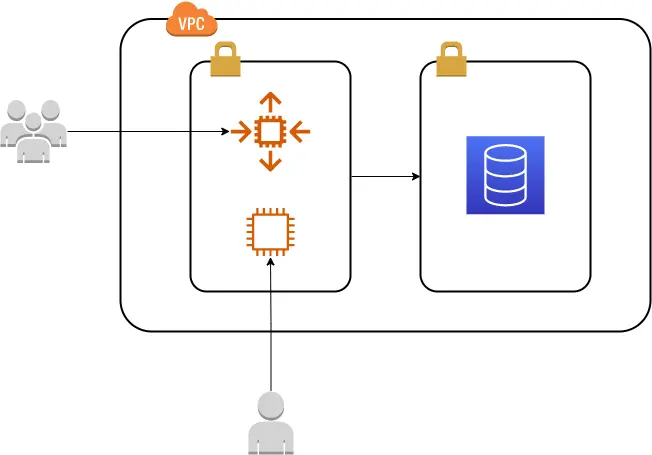
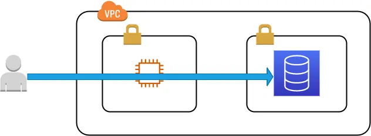

Ok, I admit it. The title might sounds weird because, how it is supposed to connect to an SQL service without a port, right? Well the catch is that there IS a port, but it is not an inbound port, therefore nothing is exposed. And it is fully managed by AWS. Interesting, right? Keep reading to know more.

## What scenario do we have?


Following best practices, database must always be inside the private subnet, i.e. no access to/from the internet by default, and the only allowed inbound access is from the deployed application in the same VPC. However, you can think of many scenarios/use cases, where developer needs to access the databases from outside the VPC, for example: for development/debug purposes, the access from the local developer machine is needed... etc

If we add some fences, it looks more like this.


It means the database is inside a private subnet that can be accessed only by the backend. The way the backend is connected with the frontend would vary a lot, so to simplify it, lets just put an arrow from users.

The daily basis tasks requires to get connected to the database to tweak some data, so how do we do that? 

The most common scenario is something like this:
* A bastion host instance is added into the same subnet like the backend instances but with a very small instance size. It can even be turned on and off to save some money.
* This bastion has an Ubuntu or an Amazon Linux, and the 22 port open to an SSH server.
* The SSH server requires public keys of the users that will connect to it.
* The user uses some database client software that can manage tunneling, or creates the tunnel manually right before the SQL connection and engage the task.
* Besides the host, the user and the database password; she needs to have the private keys that matches the public keys of the bastion already configured.
* We know every key must be rotated periodically and the comply of this security measure depends on humans; therefore, it is very common that you find very old keys which are still in use. I am sure you've seen such keys before.


What happens when that user finishes her services with the company? Those keys need to be removed from every bastion host and any other key she had contact with its correspondent private key must be rotated. It could be lot of work. And if it fails, the person will still have access to the database instance. It is a huge risk.

## A better approach
A respected company must have SSO access to authorize users into AWS accounts with very specific roles. And every user must have MFA. We can use that.

It is very important to **do not** use IAM users. To bring temporary access key id and its correspondent secret access key from the SSO service we use [SAML2AWS](https://github.com/Versent/saml2aws). And needless to say that IAM creation permissions should not be granted to anyone.

Also, we will use the **SSM console access** feature provided by the [AWS System Manager Session Manager tool](https://docs.aws.amazon.com/systems-manager/latest/userguide/session-manager.html). This tool has CLI connection capabilities similar to those already provided by SSH, but without the downsides of requiring inbounds ports open nor maintenance of key pairs. Can you see where are we going with it? It just requires to have the SSM Agent installed into the bastion host and all inbound ports closed by the security group.

The most powerful components of the tool are the [System Management Documents](https://docs.aws.amazon.com/systems-manager/latest/userguide/sysman-ssm-docs.html) which describe actions that can be performed inside the managed system. In this case, we will use `AWS-StartPortForwardingSessionToRemoteHost` which reflects exactly the action we need.

Let's see it in action!
With a command like the following, we create a tunnel from your computer passing through the bastion host, directly to the RDS instance into the correct port.
```shellscript
aws ssm start-session \
  --region eu-west-2 \
  --target i-fafafafafafafa \
  --document-name AWS-StartPortForwardingSessionToRemoteHost \
  --parameters host="${RDS_HOST}",portNumber="3306",localPortNumber="3306"
```
It is something like this:


This is an example that assumes i-fafafafafafafa is the bastion host's instance ID located in the London region and the database port is 3306 because we are using MySQL engines. But you will adjust it accordingly depending on your resources.

Extra tip to get the INSTANCE's Id if you have a bastion host with tags; and the RDS_HOST from a Bash command line interface. Useful for scripting and automation:
```shellscript
INSTANCE=$(aws ec2 describe-instances \
  --query "Reservations[].Instances[].InstanceId" \
  --filters "Name=tag-value,Values=bastion" \
  --output text \
)
RDS_HOST=$(aws rds describe-db-cluster-endpoints \
  --query="DBClusterEndpoints[?EndpointType=='WRITER'].Endpoint" \
   --output=text \
)
```
Now you can:
```shellscript
mysql -u your_rds_user -p -h 127.0.0.1 --ssl-mode=disabled
```
If the administrator needs to revoke the user's access for any reason, they can do so with the attached roles in SSO. No need for RSA key files, IP addresses or ports, access_key/secret_id rotation, ... nothing.

## Conclusion
By using the **AWS SSM session manager**, we create a temporary **tunnel** directly to the database instance while keeping **all inbound ports closed** and centralizing user access **via SSO**. This creates a secure environment without personal credentials and therefore does not need to be maintained in the face of an employee termination or similar event.

_Article Photo by [Dan Christie](https://blenderartists.org/u/danchristie25)_

