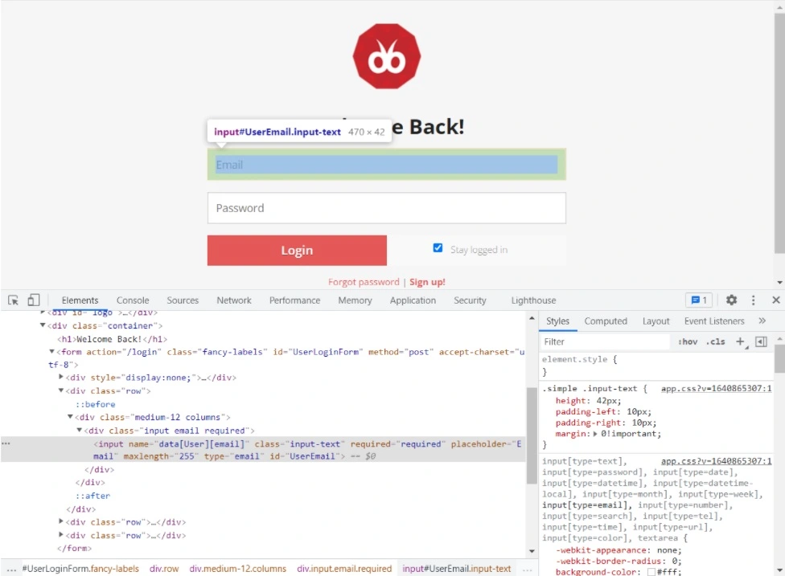

In 2000s, when I started working as a QA Engineer, there weren't good tools for UI automated testing, I didn't have enough experience and developers didn't think about automation.

The first tool I tried was TestComplete. We used Infragistics UI controls for our applications and TestComplete wasn't able to locate them properly. It performed clicks by coordinates and if the test was recorded on the one device they might fail on devices with another screen resolution.

We made the decision to test our applications manually.

I started working for another company (Sitecore).

A QA Engineer with good knowledge of programming languages joined our QA team. In cooperation with one of our best FE developers he built a framework for UI testing. The framework was based on WatiN (open-source tool). Together with unit and integration tests (QA Engineers took part in the creation too), this gave us good savings, and regression testing was faster.

However, there was still a lot of manual work.

After maternity leave, I went to work for another company.

Before that, I tried Selenium for self-study, but in Caspio I saw for the first time how it is used in real conditions, on real projects.

There was an Automation Team, they automated tests and it saved time for regression testing.

Also, we automated tests for the new features inside our Scrum teams:

- unit tests prevented commiting "bad" code to the repository
- integration tests helped prevented deploying "bad" code to our servers
- UI auto tests helped us understand if the build may be accepted for the testing or should be reverted
- Additionally UI auto tests helped us run end-to-end scenarios faster and receive the results faster

I fell in love with Selenium: its capabilities and community.

One of the challenges in automated testing is fragmentation in the testing ecosystem. Several different tools are used for creating tests, running them, creating reports etc.

Recently, there has been a confrontation between open-source tools and full-featured test automation platforms.

I was asked to compare two of the platforms: Testim and TestProject.

There are some differences between them:

- **TestProject** is free - **Testim** has free plan but there are several paid plans
- **TestProject** can be used for automated testing of web and mobile applications - **Testim** is for web applications only
- **Testim** uses their own Grid for running the tests
- **TestProject** allows creating addons that can be used by anyone who has account

The list isn't full.

There is one common thing - AI (Artificial Intelligence).

Testim:

> **AI learning**
> Smart <ins>Locators</ins> compare confidence scores from current to prior runs. When elements change, the <ins>locators</ins> improve and match your app.
>
> **Control locators**
> Smart <ins>Locator</ins> properties are visible and adjustable. Increase the confidence requirement or alter the weighting of a specific attribute.
>
> **Optimize reuse**
> Automatically scan all tests, identify repeated sequences, deduplicate, and replace them with reusable groups to reduce maintenance.


TestProject:

> **Self Healing**
> One thing that many test automation teams have found is that test maintenance takes up a lot of time. Often tests will fail due to changing or moving <ins>locators</ins>. Humans can easily correct for this, but traditional test automation can't. This leads to a lot of time being spent on updating tests. This kind of work can be tedious and so TestProject has created self-healing capabilities. This AI-driven capability will identify one main way to identify an element, but will also find a number of other possible ways to locate the element. If something breaks such that the primary <ins>locator</ins> strategy does not work, it will automatically detect that it is broken and then use the fallback strategies to find the element for you.


What is the <ins>"locator"</ins>?

Webpage source can be viewed in Web DevTools. If you press F12 or right-click and select "View page source" you will see an HTML code.

Each HTML-tag (a, li, div, form) is an HTML-element.

**Locator** is a query that helps to find 1 or more HTML elements on the page.

If we are talking about an Android app something similar to the DevTools view can be seen in the Layout Inspector.

The simplest ways to find an element are by id, name, class name, link text, tag name. CSS selector and XPath are used in the locators too.

**Example**: there is an application called [Debugle](https://debugle.com/). I used it to teach my students to create good bug reports. Also, we created test plans for it, checklists for cross-browser testing and automated smoke tests for it.



It is possible to identify the highlighted element by its id, name, tag name, class name, type, or placeholder. Locators could look like the following (C#):

- By.Id("UserEmail")
- By.Name("data\[User\]\[email\]")
- By.ClassName("input-text")
- By.TagName("input")
- By.CssSelector("input\[placeholder='Email'\]")
- By.CssSelector("input\[type='email'\]")
- By.XPath("//input\[@type='email'\]")

The list isn't full. These locators can be used for automation with Selenium WebDriver.

I propose to record the following test in Testim and in TestProject and compare the results:

1. Open [Debugle](https://debugle.com/).
2. Click Login (in the top right corner).
3. Login as "debugle-demo@ua.fm", "Qwerty123!" (you can use this test account or create your own).
4. Check that "Hello, Inna" (or your account name) is on the top of the page.

Instructions for Testim are [here](https://help.testim.io/docs/creating-your-first-codeless-test).

Instructions for TestProject are [here](https://docs.testproject.io/tips-and-tricks/how-to-record-a-web-test-for-a-mobile-browser#creating-a-web-test).

Let's start with Testim.

Work of Testim AI is to record all possible locators for the element and locators of all its children and parents:


It is clear from the picture above that Testim recorded only properties of the "input" element (id, name, class, placeholder etc.)

When it is necessary, Testim will try to locate the element by these properties (and by the properties of its parents and children). It will calculate a score. If the score is “Very Low” the test will be failed because the element cannot be found on the page.

**Note**: it is impossible to add more locators, it is only possible to hide some locators.

Let's take a look at two more examples to get a better understanding of how it works.

**Example**: run the recorded test for the 2nd time.

The user is already logged in (no Login button in the top right corner of the page). Testim opens the Account page (instead of the Login page). After that it is trying to enter username and password, and it isn’t possible. Anyway the test is passed.

There are 3 ways to fix the problem:

1. Clear cookies before the second step
2. Add a step to logout (if needed) before running the rest of the steps
3. Run the test in the Incognito mode

To clear cookies:

1. Add a new step with type "Add custom action" (from the "Testim predefined steps") after the "Setup" step.
2. Enter the following Javascript code:
```javascript
var cookies = document.cookie.split(";");

for (var i = 0; i < cookies.length; i++) {
    var cookie = cookies[i];
    var eqPos = cookie.indexOf("=");
    var name = eqPos > -1 ? cookie.substr(0, eqPos) : cookie;
    document.cookie = name + "=;expires=Thu, 01 Jan 1970 00:00:00 GMT";
}

location.reload();
```
3. Save and run the test.

It doesn't help (and it won't help in most cases) because the "HttpOnly" flag disables Javascript's access to the cookie.

I decided to use the 3rd way: to check the "Run in incognito mode" checkbox and allow the Testim Chrome extension to be enabled in the Incognito mode. It is simpler than the 2nd way. Also when the tests are run in the Grid no need to clear cookies.

Let's continue with the test above but before the beginning change the locator for the "Hello, Inna" element. Change "Inna" to "Maria".
Run the test.

It will be passed. It is because of the score I've written earlier.

Do the following:

1. Open the step with assertion.
2. Open "Locators".
3. Click the "target" icon.
4. Change "The minimal confidence level required to consider the element as found" to "High" (it is "Low" by default).
5. Run the test again.

The result will be the same.

It will fail only if "Very High" is selected in this case.

**Note** : the test will fail in 30-40 seconds!!!

As far as all element locators and all locators of its children and parents are taken into account in calculation of the score it is impossible to know exactly which "The minimal confidence level required to consider the element as found" should be selected. In some cases it should be "High", in some cases it should be "Very High".

I believe the AI work of Testim needs to be improved.
It is really easy to record the tests, run them and receive reports. However, I cannot trust the results.

It's TestProject turn.

Here are the locators recorded by the TestProject for the "email" element:


It is possible to define which locator is more preferred, delete or add a new locator for the element.
The first 3 locators look secure enough.

Let's change the fist locator to "#UserEmailTEST" to have a look at how TestProject AI works.

The test will be passed and the following will be in the report:


This "heartbeat" sign means that the element wasn't recognized by the 1st locator and was found by another locator from the list:

> Don't sweat! This step was self-healed by TestProject's AI.
> We'll keep looking for ways to speed up your executions.
> The original locator was "CSSSELECTOR:#UserEmailTEST"


When I changed "Inna" to "Maria" in the step with assertion the test failed as it was expected.

This, of course, is just my opinion. I like the TestProject more, I trust its results more.

It has a lot of good features. The TestProject community continuously develops new addons. One of them gives me the ability to clear cookies for example.

Also, it is possible to implement some kind of Page Object Pattern, well-known and bellowed by QA Automation Engineers. Elements can be added manually and placed to folders. Then they can be used when creating tests.

For those who are on Windows machines it is possible to automate tests for iOS apps. Visit this page for [details](https://docs.testproject.io/getting-started/getting-started-with-ios-testing/ios-devices). I tried and it worked for me.

To summarize, when I started to investigate TestProject and Testim I didn't expect anything amazing.

I am still sure that there are a lot of cases when it is impossible to automate tests without knowledge of any programming language. Two of them:

- when search for some entities you should be sure that all possible variants are present in the results and no any superfluous results
- when tickets, rooms etc. should be selected for some dates in the future (it is not easy to use Calendar in this cases)

TestProject SDK can be used: C#, JAVA, Python.

Testim Javascrip Dev Kit can be used.

It gives some flexibility in creating the tests.

**Testim AI disappoints me (I hope for a while).**

**I would like to learn TestProject deeper, I see potential here. I will try it for our applications.**

_Article Photo by [Andy Kelly](https://unsplash.com/photos/0E_vhMVqL9g)_
