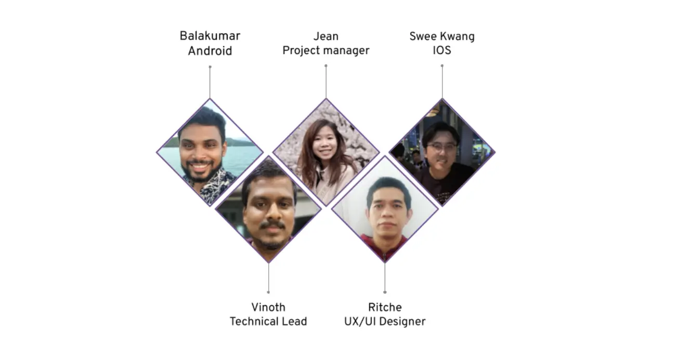
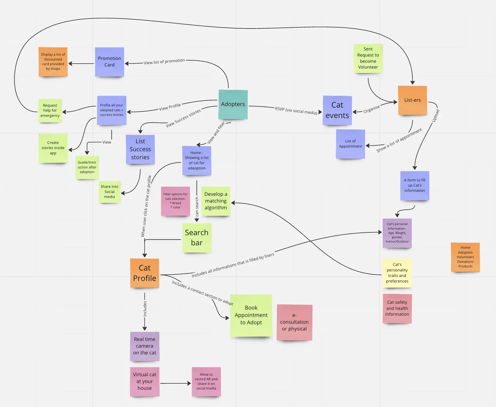
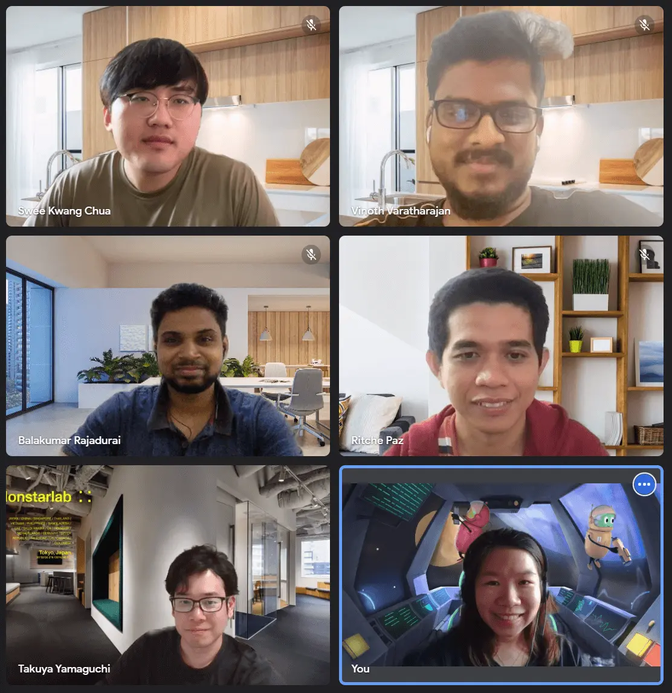
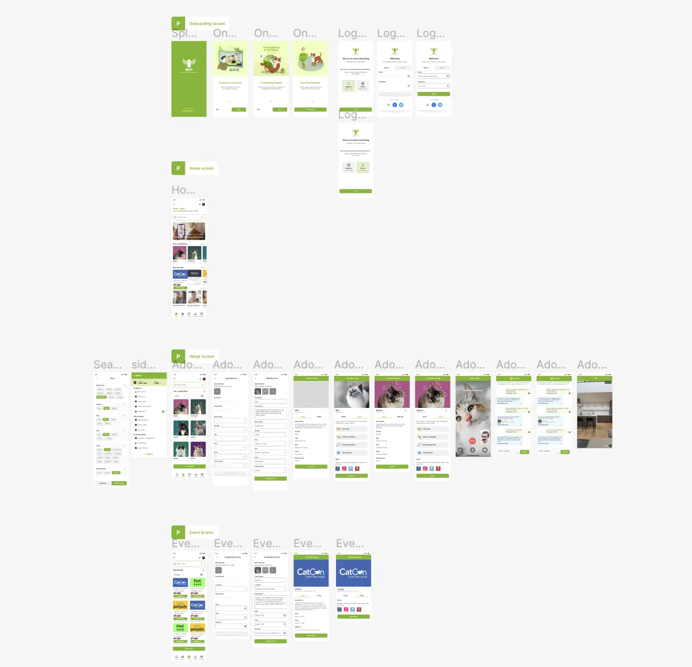

Participating in [MonstarHacks](https://www.linkedin.com/showcase/monstarhacks), Monstarlab's internal hackathon, was truly an amazing experience. The event brought together a diverse group of individuals, each with their own unique set of skills and backgrounds from different countries. For my team, all of us are first-time hackathon participants and our goal was to develop innovative solutions within a tight timeframe which can help and contribute to the society. In this article, I'll share my insights and takeaways from my time at MonstarHacks and how my team worked together to tackle the unique challenges we faced and the innovative solutions we developed as a team.

## Our amazing team

My talented members of our hackathon team, HackWarriors consists of five members, all with unique skills and experiences.

- Balakumar, our Senior Mobile Developer, had an extensive background in mobile app development. Thanks to his expertise, the prototype was completed within the designated timeline.
- Vinoth, our Tech Lead, contributed a wealth of technical knowledge to the team. We knew we could depend on him to address any technical challenges that arose.
- Jean, our Project Manager, showcased exceptional organizational skills, instilling confidence that we could achieve our goals and meet deadlines.
- Ritche, our UX/UI Designer, was based in the Philippines but remained a vital team member. He offered a fresh perspective and valuable design experience.
- Lastly, I, Swee Kwang, served as the team's iOS Developer. Leveraging my experience in iOS app development, I was eager to contribute to the team and help create a successful project.

Each team member was located in Singapore, with the exception of Ritche, who joined us from the Philippines. We were excited to work together as a team and to tackle the challenges ahead of us.

## Brainstorming and topic selection

During our morning call on Google Meet, my team and I discussed potential topics for the four challenges. Following extensive brainstorming, we decided to focus on the challenge presented by the partnering NGO [El Gatio](https://elgatio.org/), of simplifying the cat adoption process and facilitating adoptions - **Match Made in HEAVEN; Streamlining Cat Foster and Adoption Matching**.

We used Miro to create quick idea flow and identify the necessary features for our app, which Ritche then used as a foundation for the design.

Additionally, we have scheduled a call with our mentor, Takuya Yamaguchi, to discuss our idea and receive guidance on any additional considerations we should take into account.

## Our working process

Our diverse team had only three days to create a prototype, design the app, and prepare presentation materials. To efficiently manage our time, we split tasks into four areas: designing the prototype, creating the prototype, preparing presentation slides, and preparing the app demo video.

As soon as several screen designs were finished, the developers — Balakumar, Vinoth, and myself — started working on the prototype to ensure we stayed within our time constraints. We decided to use Flutter to create our prototype so that we could create both iOS and Android platforms simultaneously. If there were any uncertainties during the development process, we used Slack for communication.

Our project manager, Jean, took charge of creating the presentation slides and a document to showcase our app to the judges. She searched and selected relevant statistics and information to explain our app's features and benefits. Our technical lead, Vinoth, worked closely with her to ensure that the presentation was informative and effective.

Creating an engaging app demo video was also a crucial part of our presentation strategy. To achieve the desired effect, we decided to follow the style of Apple Support's YouTube videos as a form of inspiration for keeping it simple yet effective. Working alongside the project manager, who developed the flow of the app demo, I recorded the app and took care of the video editing.

We also received valuable feedback on our ideas from Andrea Giraldo, one of the volunteers for the El Gatio organization.

### Management

Throughout the hackathon, we had a project manager who was responsible for overseeing the project and ensuring that everyone was working towards our common goal. The project manager conducted daily stand-up meetings to check in on the team's progress.

Working together in a remote hackathon was both a challenging and rewarding experience, but by splitting our tasks into design, prototype, slides, documentation, and management, we were able to build a meaningful yet innovative cat fostering app in just one weekend, which was our greatest accomplishment till date.

Each team member had a specific role to play, and we all worked together towards our common goal. Despite the distance between us, we were able to collaborate effectively and deliver a great product.
