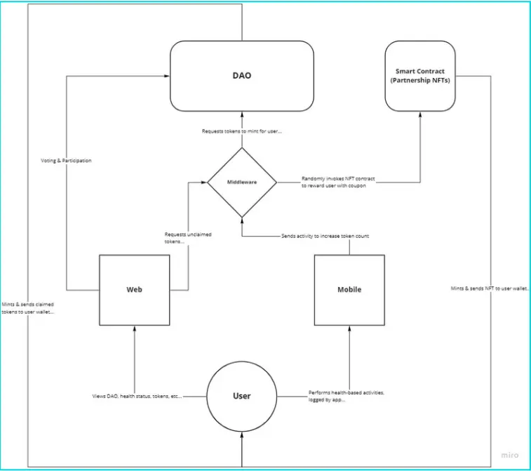
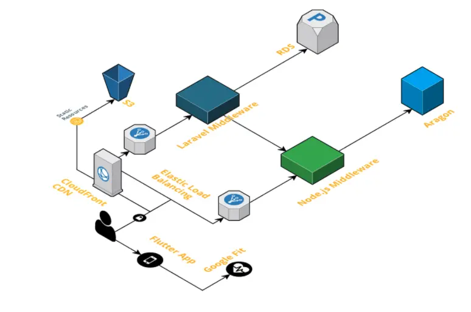
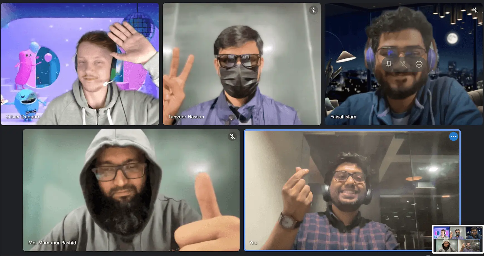

There is always excitement about what the future should look like. As the year ends, tech corporations and developers attempt to look into the future, make bold predictions and try to learn from the past. Recently, there has been a new paradigm surfacing from the tech-sphere, with an ambition to challenge, and perhaps change the way we perceive the internet.
The message is clear and brief; the new net is here, and you may own it.

Web3 (originally “Web 3.0”), as the word was first coined by Ethereum co-founder Gavin Wood in 2014 as he had just recently left the Ethereum project, has been dominating the tech landscape in the recent months.

Our team, “Team BlockBhais”, was formed for [MonstarHacks](https://www.linkedin.com/showcase/monstarhacks), an internal hackathon event that happened between 10-12 December 2021 where teams from all the Monstarlab offices were invited to participate. This year's MonstarHacks theme was to make a solution for any of the 3 judge-selected goals out of the 17 [UN Sustainable Goals](https://sdgs.un.org/goals). Out of the selected goals for the hackathon, we picked the 3rd SDG goal (good health, and well-being) and took this opportunity to explore, learn and implement aspects of the Web3 in a real hybrid solution, bringing together the best of both worlds.

We identified that post-COVID era we realized that we need to work together to achieve any success and the government may lead but cannot solve problems like medicare alone.
The current problems of healthcare services are many, and the most pressing issues are the health care services are inadequate, underfunded, understaffed, and people with pre-existing medical conditions are the worst affected. Too often we see people opt-out of regular medical check-ups or services so as to save for emergencies. We want an alternative for people to invest in their health at an earlier age and consistently, so that they may reap the benefits of a healthy life and more affordable healthcare.

So, over the hackathon weekend, we created BlockHealth+ - a blockchain-powered Health DAO (Decentralized Autonomous Organization) that rewards good healthy behavior with healthcare. The next time you go for a run, you’ll gain tokens by losing calories! These BlockHealth Tokens (BHT) can be exchanged for medical services from one of the community-picked partners.

## Case Study: BlockHealth+

## Building a health-focused DAO on the blockchain

{{ youtube-link="1TiH4Qo8X7g" }}

### Introduction

Imagine you are running a marathon event, you get a medal at the end of the race, but in addition you are also rewarded with sufficient social capital that can easily be redeemed with top healthcare providers for a 20-30% discount or greater.

Another scenario may be a not so strictly physical in nature, but assuming you participate in your government's vaccination drive and get your Covid-19 vaccine, you are then allocated tokens upon completion that can be spent with your local healthcare provider for, perhaps, large discounts in your next medicinal purchase. But, how do you facilitate this sort of cooperation among many different authorities, partners and people?

### Proposition

We needed to create a community with a shared, trustless bank account dedicated to rewarding the health-related activities that people do regularly with health services in the longer run. This community will have transparent financial transactions and a direct democratic governance-structure.

For participating members, all of their good behaviors now serve a greater purpose. They can carry out their daily routine, track it in their Google Fit, registered gym or other mandated 3rd party health service, and later cash-out these activities in the health sector with entities that have a community-mandated partnership.

The partnerships can be suggested by anyone, but it is up to the members of the community (of the DAO), to vote for and against the different companies and/or NGOs, authorities etc.
Essentially, the community votes for the partnerships they want on their terms - cutting out the middleman, which has the potential to be predatory in nature, and wind up getting the better deal.

This greater cause and transparency on how the money is spent and in what activities, allows UN, WHO, governments, NGOs, philanthropists, etc. to step in to promote and preserve a healthy lifestyle and healthcare in society.

Business entities have an incentive to be part of a community to help individuals redeem the rewards with their health services since they do enjoy extra benefits from the government, as well as a monetary incentive from the group for various initiatives.

### What is a DAO?

Web3 revolves around the idea of decentralization, which is in stark contrast to its predecessor, in which large amounts of data and personal information is owned by a few large tech companies, also known as “Big Tech”.

The main idea is that Web3 is governed by people through the use of decentralized blockchain technologies, in which large tech companies have little to no control over data or people.
There has been a resurgence of financial instruments (DeFi - Decentralized Finance), as well as gaming, art, music, and even organization forms such as the so-called DAO (Decentralized Autonomous Organization).

In this form of organization, decisions are made by stakeholders/members of said organization, usually through a vote.

### In practice

So, to create a DAO or to use an OSS DAO platform after thorough investigation and be able to connect it to it via middleware whose documentation is not updated at all, to utilize blockchain and users digital wallet with Metamask integration, to write smart contracts, and to generate NFTs in a language like a Solidity that is not mainstream, all was daunting, to begin with, but with time we slowly could see how the pieces connect.

This entire project currently relies on the web and mobile applications to interface with the DAO, we selected (Aragon) [https://aragon.org/] to build one, by use of middleware where this middleware also communicates with the Companion Smart Contract - that means whenever you participate, you will be able to be rewarded with their own redeemable NFT.

However, while members of the DAO are able to grant entities partnership roles and revoke them, they are also able to vote on the software solution required to facilitate activity validation - this means our current software (web & mobile) could be replaced in the future and are not irrevocably binding the DAO to it.

### System Flow

- Onboarding
- Import/Generate Wallet
- Acquire BHT Tokens
- Get Entry In DAO
- Integrate FIT APP Data
- Be Part GooD Healthy Activities
- Be ACTIVE IN DAO Activities
- Claim Rewards, NFTS
- Redeem tokens

### Technologies (including 3rd party frameworks and services)

#### Aragon DAO

- [Aragon Client](https://aragon.org/aragon-client) (platform)
- [Aragon Company Template](https://help.aragon.org/article/30-create-a-new-company-organization)(configuration-type)

#### Mobile

- [Flutter](https://flutter.dev/) (framework)
- [Webview_flutter](https://pub.dev/packages/webview_flutter/example) (3rd-party package for displaying web in-app)
- [Dart](https://dart.dev/) (language)

#### Partnership Smart Contract Companion

- [Solidity](https://docs.soliditylang.org/en/v0.8.11/) (language)
- [ERC721](https://eips.ethereum.org/EIPS/eip-721) (ethereum token standard)
- Access Control (smart contract administration standard)
- Javascript (language)
- [Hardhat](https://hardhat.org/) (dev environment)
- [ethers.js](https://docs.ethers.io/v5/) (JS library for blockchain interaction)
- [Waffle](https://getwaffle.io/) (Library for writing & testing smart contracts)
- [Chai](https://www.chaijs.com/) (JS library for smart contract testing)

#### Web App

- [Angular 12](https://github.com/angular/angular)
- Typescript
- RxJS
- Web3
- [Ant Design](https://ant.design/)

#### Laravel Middleware

- [Laravel](https://github.com/laravel/laravel)
- PHP 8.0
- Database
- MySQL 8

#### Node.js Middleware

- Typescript
- [Aragon Connect](https://github.com/aragon/connect)

#### Terraform IAC

### Afterword

We strongly believe this solution of DAO, powered by blockchain, that tries to reward
people for their activities, and allow people to have ownership stake from day one can
be used for other domains apart from health, like education, climate change etc.

This hackathon helped us learn many things, among them:

- SDG Goals and their impact in society
- How DAOs work
- Hands on experience with creating and managing a DAO on Aragon
- Better understanding of blockchain technology
- General Web3 knowledge
- Metamask wallet integration to web app
- Smart Contract development using Solidity
- Connecting to DAO via JS

Surely Web3 looks daunting, but the potential it has is huge as power is redistributed from organizations and large tech companies, back into the hands of the people. Exciting days ahead for developers and users alike.

[Header Image](https://unsplash.com/photos/oGv9xIl7DkY) from Unsplash by fitsum-admasu.
