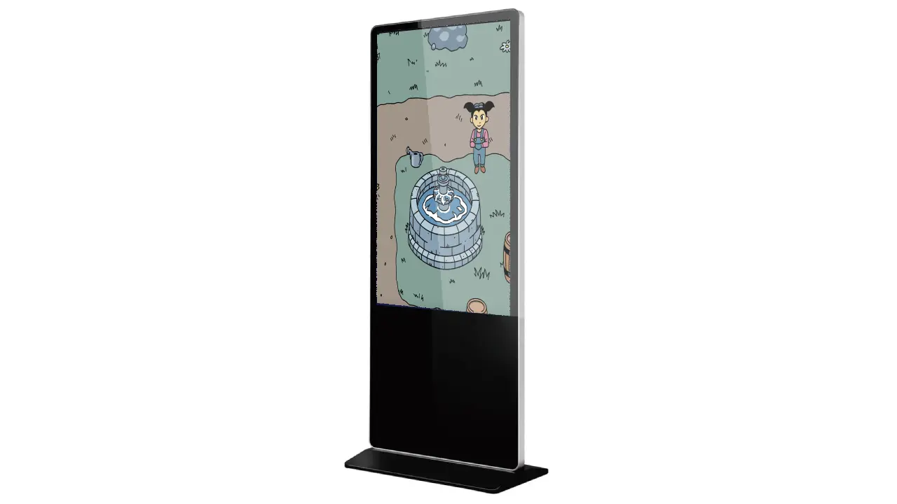

This year's [MonstarHacks](https://www.linkedin.com/showcase/monstarhacks) main theme was NGOs and 4 NGOs were selected to partner up with Monstarlab to provide real life challenges.

These 4 NGOs are working on 3 different topics:
- Children Rights
- Health/Crisis
- Animal Rescue

For our project, we choose a Health/Crisis challenge, partnering with the [ASHA](https://www.asha-np.org/en) NGO.

## Problem statement
We believe there are good people on earth and we want to improve health literacy. [ASHA](https://www.asha-np.org/en), an NGO is conducting special lessons at middle schools to address this need. They provide learning sessions for first aid and basic medicine, as well as practical training sessions so that people can truly utilize these skills. However, the capacity of the lecturers limits the delivery of this education.

The NGO faces issues due to a lack of capacity of their lecturers. They are not able to send a teacher to each school or class, and pre-recorded video lessons won't work due to the lack of access to smart devices for some students.

## Why we choose this problem
Our team `PartTimeHusters` decided to tackle this problem because it aims to address the critical issue of providing health education to middle school students in a scalable and accessible manner. It is crucial to provide students with the necessary knowledge and skills to make informed decisions about their health and emergency situations, and this challenge allows us to develop a creative and innovative solution to make this possible. We believe that our solution can effectively address ASHA's pain points while also providing an engaging and interactive learning experience for middle school students.

### The assumptions we are making about the challenge
- The NGO is understaffed and under-resourced, both in-terms of teaching staff, and finances.
- The location of the site is a very remote hilly area, and the transport communication is unpleasant.
- School facilities don’t have consistent electricity and internet access.
- Students do not have access to handheld devices. Teachers are not well educated on digital technologies.

## The proposed solution
To solve this organizational problem our team came up with the concept of `Lifesaver Academy - An interactive and resource efficient gamified learning platform`. We aimed to create an integrated passive learning system, incorporating a reinforcement rating mechanism that keeps students engaged. Our intention was to offer learning through games, utilizing advertising touch displays as interactive gaming consoles. These games would also be accessible on other platforms, such as mobile and PC.

Our approach addresses three main key challenges the NGO is facing and provides sustainable solutions:

**Challenge 1:** Heavy dependency on the teacher/lecturer which hampers the delivery of education

**How our solution solves this challenge:**
Our solution decouples the dependency on the teacher/lecturer. Students can have quality health education anytime at their school premises. The learning videos/slides will keep playing, seeking sudden attention from the nearby students. Also, they can go in front of the display to engage in a game when they have available time.

**Challenge 2:**  Heavy dependence on tech infrastructure due to budget shortage

**How our solution solves this challenge:**
This platform comes in the form of cheap advertise touch displays as interactive consoles. Although, our solution is platform-agnostic. We have built the web app version of the solution in a progressive manner hence it can be installed in a smartphone as well. We have also built an AR/VR prototype of the solution. Additionally, multiple students can interact with the app at once so the problem of device shortage is solved as well.
We are building the solution in such a way that it can also be used **offline**.

**Challenge 3:** Sometimes static video lessons can be less interactive hence boring

**How our solution solves this challenge:**
Scientific evidence supports the effectiveness of interactive methods for learning. Our gamification of the application will enable students to engage with the material, solidifying their understanding and preparing them to apply their knowledge in real-world scenarios.

**Challenge 4:** Not all schools have electricity or internet access

**How our solution solves this challenge:**
It is crucial to have electricity and internet for any digital learning platform to be usable. However, our proposed platform is able to run without the internet.

**Challenge 5:** Language barriers

**How our solution solves this challenge:**
Our solution supports multiple languages. Digital assets can be prepared and distributed in any localized form required.

## How does it work
Traditional health education taught by a teacher is not sufficiently scalable, as the number of students a trained teacher can reach is limited. That's why we have decided to replace teachers with digital interactive stories. A school can implement our proposed learning platform, or even a laptop is enough for our solution to work. Students can explore the interactive stories on their own and learn basic health education. This approach is more engaging and interactive than receiving lessons from a teacher, resulting in better retention of each lesson for students.

Check out the gameplay video:

{{ youtube-link="5a93U3idU98" }}

## Our Tech stack
- [GameMaker Language (GML)](https://gamemaker.io/en) - GameMaker is a software tool that allows users to create video games without the need for extensive programming knowledge. It includes a drag-and-drop interface for creating game elements and a scripting language called GameMaker Language (GML) for more advanced programming.
- [Figma](https://www.figma.com/) - Intuitive tool for mocking and designing app flow.

### Tools that we used to develop our game
- [GameMaker Studio 2](https://gamemaker.io/en) (GameMaker IDE)
- [Narakeet](https://www.narakeet.com/) (Text to Speech converter)
- [online-audio-converter](https://online-audio-converter.com/) (Mp3 audio converter)
- [Loom](https://loom.com/) (Video maker)
- [Canva](https://www.canva.com/) (Presentation maker)
- [picresize](https://picresize.com/en/results) (Image processor)
- [opera.com/gx](https://www.opera.com/gx) (Game browser for demotime tryout, not needed for release)
- [gx.games](https://gx.games/) (Game hosting platform)
- [Photopea](https://www.photopea.com/) (Image editor)

### Links to our Game and VR Design Prototype
- 💻 Demo Implementation: [Game is published and can be played here](https://gx.games/games/j52x30/life-savers-academy/tracks/f34c2945-2af6-4be9-9dd1-b1a24eaf1a5b/)
- 🎨 VR Design Prototype: [VR Prototype Figma file ](https://www.figma.com/file/hbC4BLwbDVs1tkTY38GuhY/VR?type=design&node-id=0-1&t=bIJ6PN3oWGKmVGD3-0)
