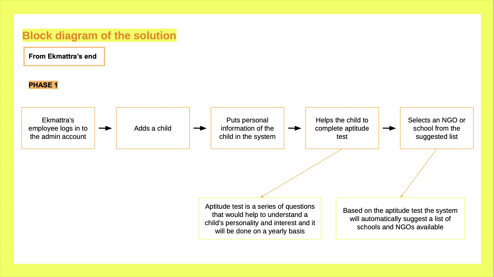
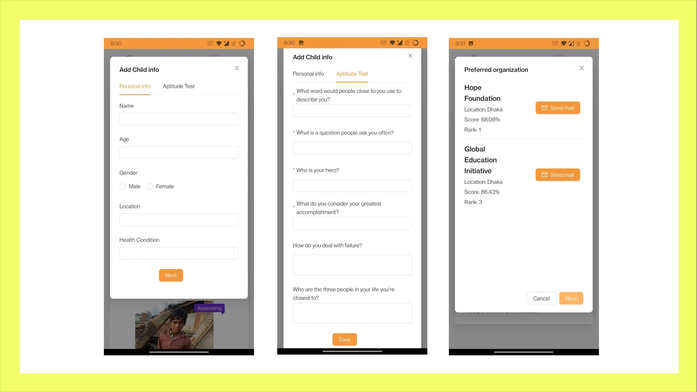
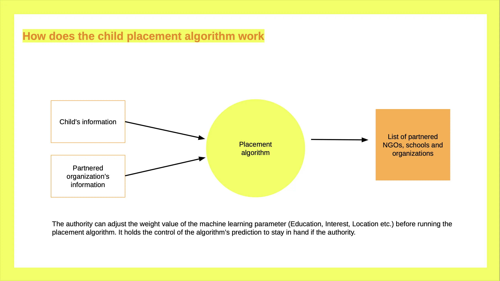
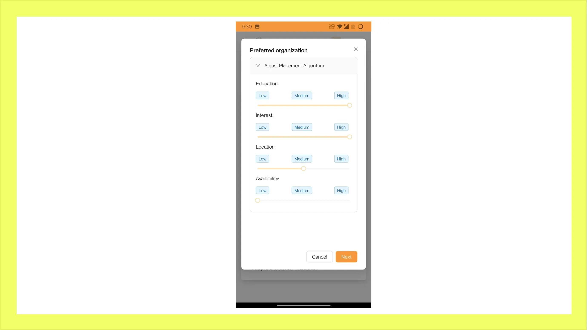
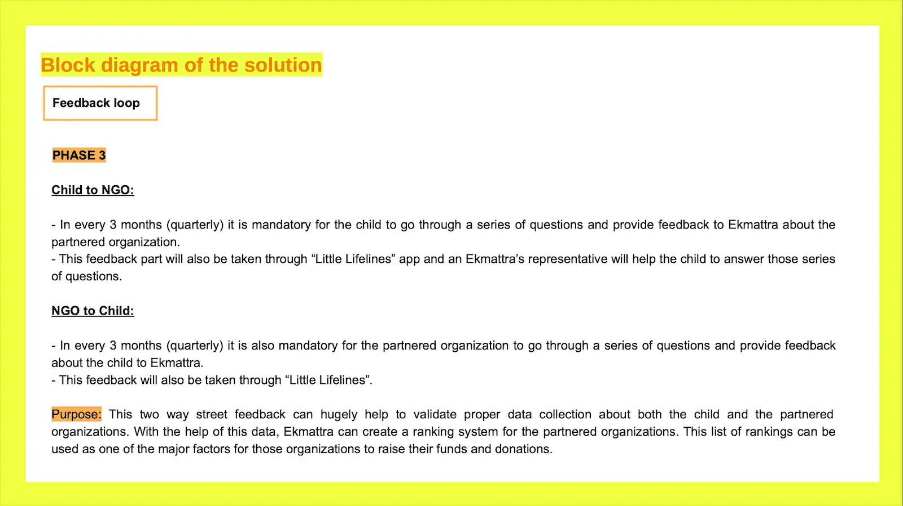
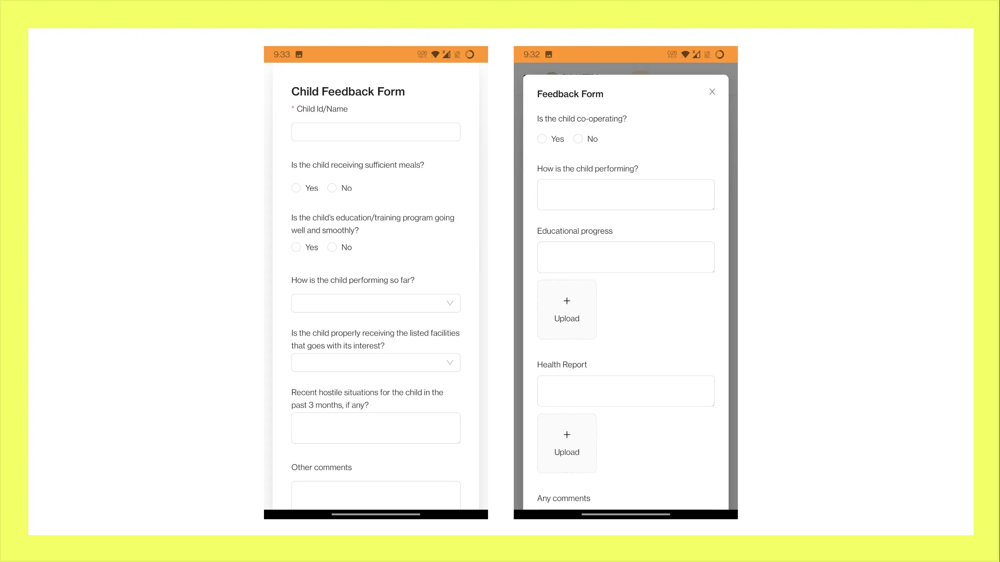
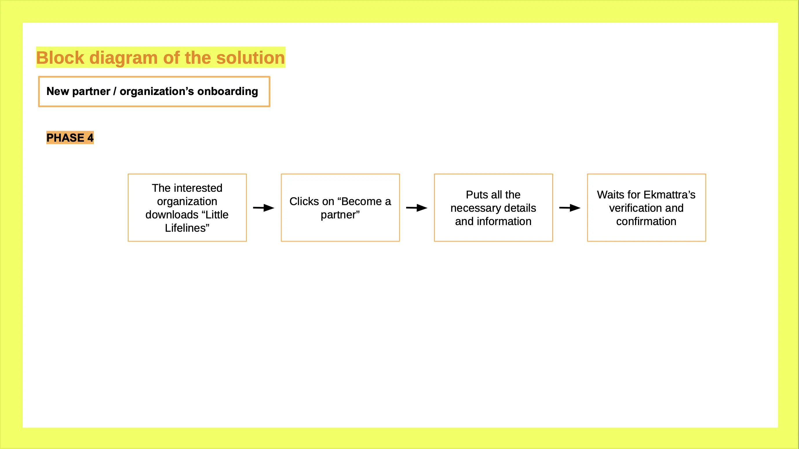
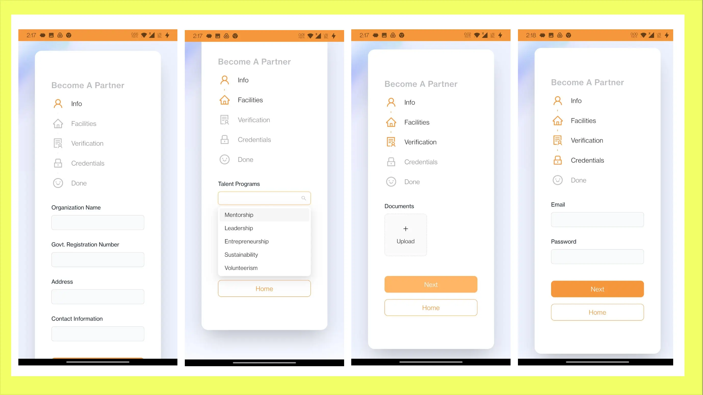
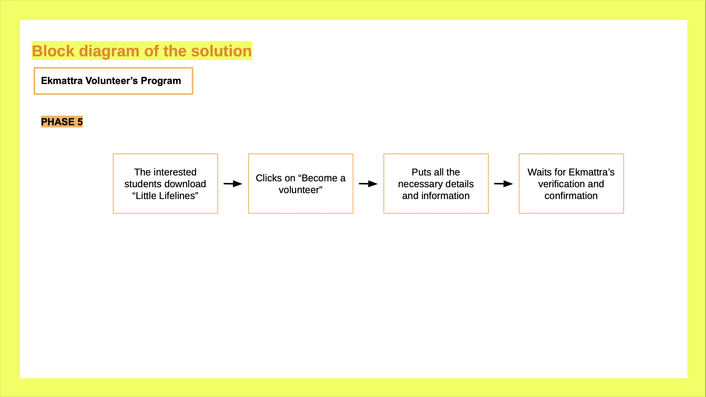
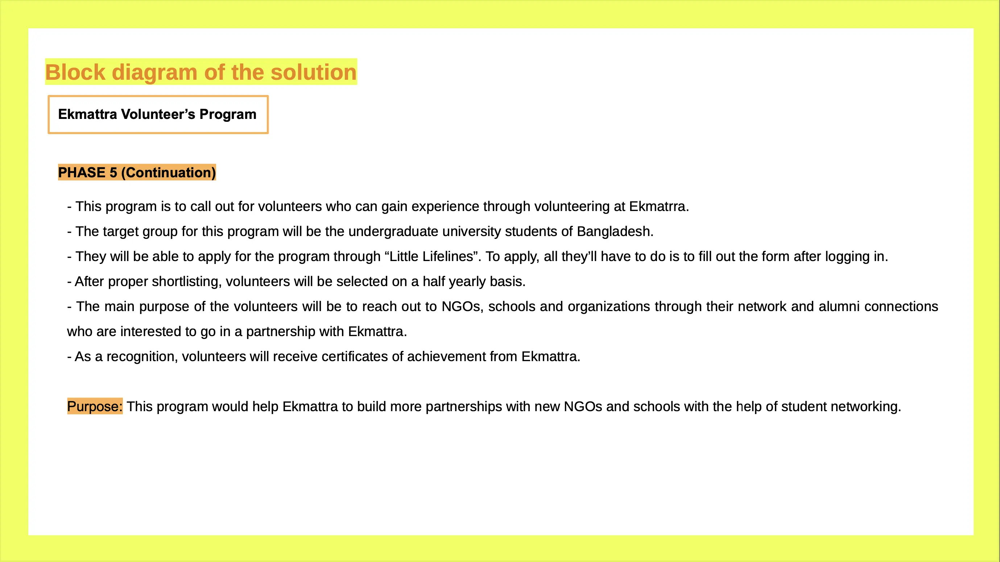

For the past 2 years, **Monstarlab** has been hosting a hackathon for all its employees from every branch worldwide. This marked the third consecutive year of the event. We participated this year as Team 5 (Hacktivists). The topic this year was particularly exciting. We collaborated with four international NGOs, who presented us with real-world problem scenarios. Our task was to develop digital solutions based on the information provided by these organizations.

## A small introduction of our team

We participated as Team 5 in this hackathon event, dubbed **The Hacktivists**. Our team consisted of 5 dynamic, diverse, and diligent people, all from the Dhaka office. So there was Tanvir Tasif Ahmed (myself), Susmita Saha, Md. Ariful Alam, Arun Kundu, and Zulfikar Ali Zihan. Our team was a blend of HR, front-end, and back-end professionals. We had great fun working together!

## Which problem we chose and why?

We discussed and debated all the problems provided in this Hackathon. However, we did make up our minds and chose to solve the problem of one of the children's rights NGOs known as [Ekmattra](https://ekmattra.org/) based in Bangladesh. Ekmattra's problem statement was:

"Ekmattra rescues abandoned children or children who fled from their villages to Dhaka and provides fore linkage support for those children by sending them to a school or NGOs who can provide them support to live and study.
The challenge is to determine which organization or school is appropriate for the rescued children living on the streets. The matchmaking process is extremely difficult and often relies on impromptu decisions and connections within a narrow network, leaving doubts about whether the choices made are truly the best for the children.
We currently have 13 partner organizations available to accommodate the rescued children. However, we need updated information on their capacity for children's placement. Additionally, we are seeking opportunities to connect with organizations and schools that cater to children's interests. Our goal is to place the children in organizations that can better support their interests, such as vocational institutes for those interested in mechanical work. Ultimately, our aim is to make connections and manage placements that accelerate the children's lives for a better future.
When it comes to matchmaking, it's important to consider both the child's interests and the availability of organizations. We aim to find organizations, institutions, or schools that align with the child's interests and have opportunities available that match their skills and future plans. For instance, we would look for coding camps or classes for a child interested in computer programming.
We also take into account the child's age and experience level, as some organizations may have specific requirements. Moreover, their schedule and location should be considered when matching them with an organization or school.
Effective communication with potential partners is crucial to determine if there is a good fit and arrange the logistics of the partnership."

Now why did we choose this problem?

Because:

- As we are a team from Bangladesh, we possess a deeper understanding of the challenges faced by Ekmattra and can propose a solution that is both feasible and viable within the Bangladeshi context.
- Addressing this issue will have a major impact on society and we may have the opportunity to have it adopted on a broader scale in the future.
- Solving this problem can save a generation, providing them with a better and more secure future, and enabling them to contribute positively to society in the years to come.
- This project offers us the opportunity to suggest a simple solution or re-think existing ones with a new approach that aligns with current technology.
- Tackling this problem can have a major impact on the following Sustainable Development Goals (SDGs): (a) Zero Hunger (b) Good health and Well-being and (c) Decent Work and Economic Growth.

## Our approach in tackling this problem

After reviewing the problem and focusing on key points we made a list of tasks that will help us accomplish the ultimate goal.

So we need to provide a platform that would:
- Aid Ekmattra in matching children's skills, interests, and locations with the most suitable schools and NGOs
- Assist them in having updated information about the organizations they have partnered with to understand the availability and capacity for children’s placements
- Ensure effective communication with the potential partners

By achieving these objectives, we recognized that we would be able to provide Ekmattra with the solution they need.

## An overview of our solution

We considered making an app to provide a digital solution for their problem, and we called our app "Little Lifelines."

Our solution will work the following way:
We would have all the necessary information about our partner organizations beforehand in our portal, we can then add any children’s profile based on their interests and location. We will simply put an algorithm where it matches the children with respective organizations based on, age-range, location, interests, and availability. The doubt of proper placement will be eliminated for Ekmattra because Ekmattra will know exactly how this process is working and can tweak the algorithm accordingly. It also allows Ekmattra to take prompt decisions because of the real-time data network we are aiming to provide.

Basically, our vision was to connect children with opportunities through technology.
We divided the solution into multiple phases.

### Phase 1

The first phase of this solution is actually about the placement algorithm, a step-by-step guide on how an Ekmattra employee can use our platform to place a child by filling up the necessary information. They can also tweak this algorithm as they see fit.

### Phase 2:

In phase two, we developed the interface for NGOs and schools, and their response system for handling requests submitted by Ekmattra. Both the partner organizations and Ekmattra will use the same portal for these procedures.

### Phase 3:

A critical aspect of our solution is obtaining feedback from the children placed by Ekmattra and the NGOs responsible for their care. This feedback phase ensures safety, well-being, and trust among children, organizations, and Ekmattra itself.

### Phase 4:

Onboarding partner organizations on Ekmattra's portal to create a real-time data network of all the organizations.

### Phase 5:

We understand that Ekmattra's work is challenging and requires as much support as possible. Therefore, we introduced a volunteering program for Ekmattra with a straightforward feature designed to increase the number of helping hands available to provide care.

## Wrapping up the hackathon weekend

After a 3 days marathon with late nights, we pulled out a demo app with all the steps of the solution we could manage. Those 3 days were truly enjoyable for us. We had 2 other teams from our office who were competing as well. We had a lot of fun hanging out together, teasing each other, and even had a pizza party! Thanks to Team 7. Instead of feeling nervous about the results, we concluded our hackathon experience with sheer eagerness to learn more, learned to collaborate more outside our usual circles, gained valuable knowledge, and had a memorable experience etched in our hearts. We thank everyone who organized this hackathon and hope to return stronger than ever! Till then, Adios Amigos!

_Article Photo by [Ben Wicks](https://unsplash.com/photos/iDCtsz-INHI)_
