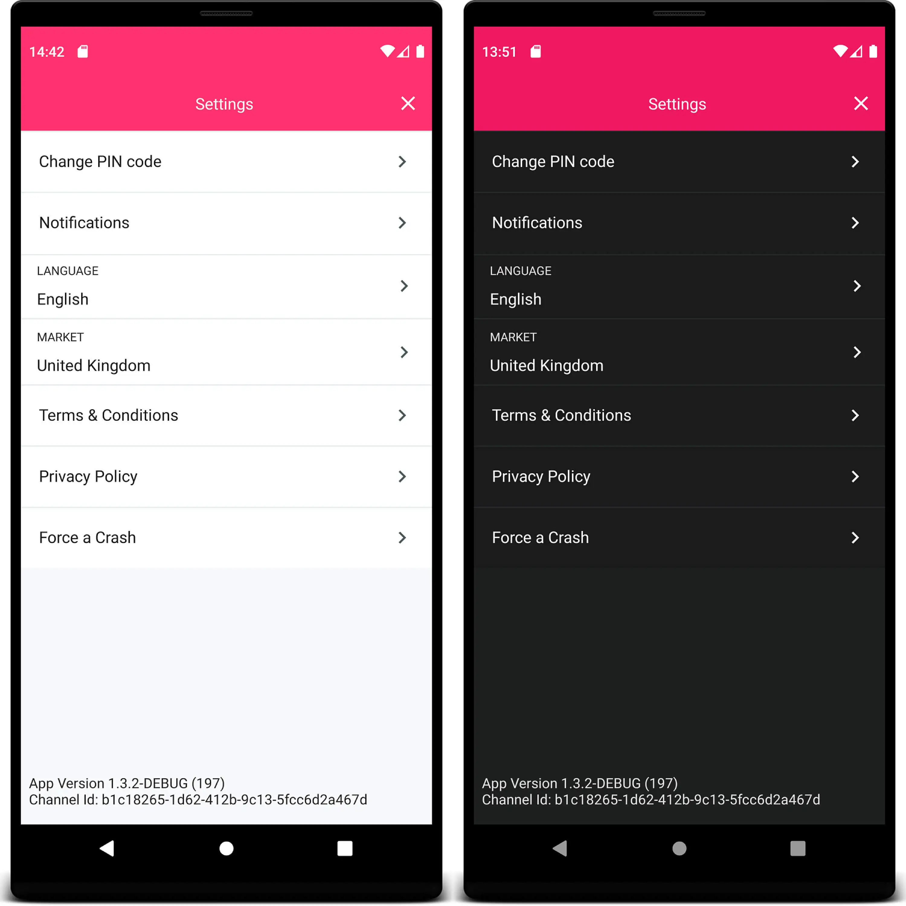
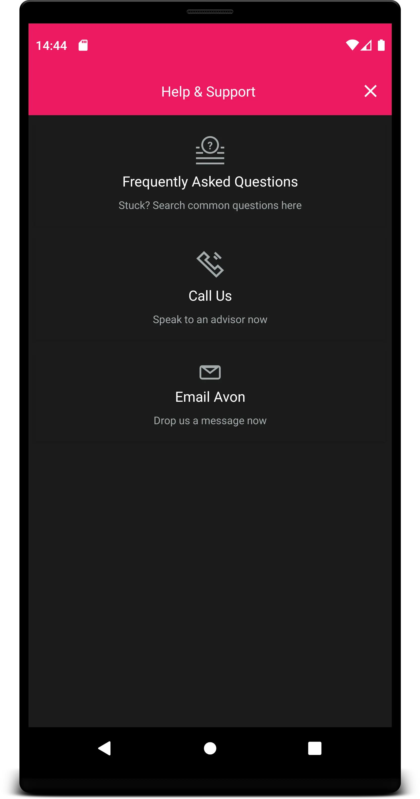
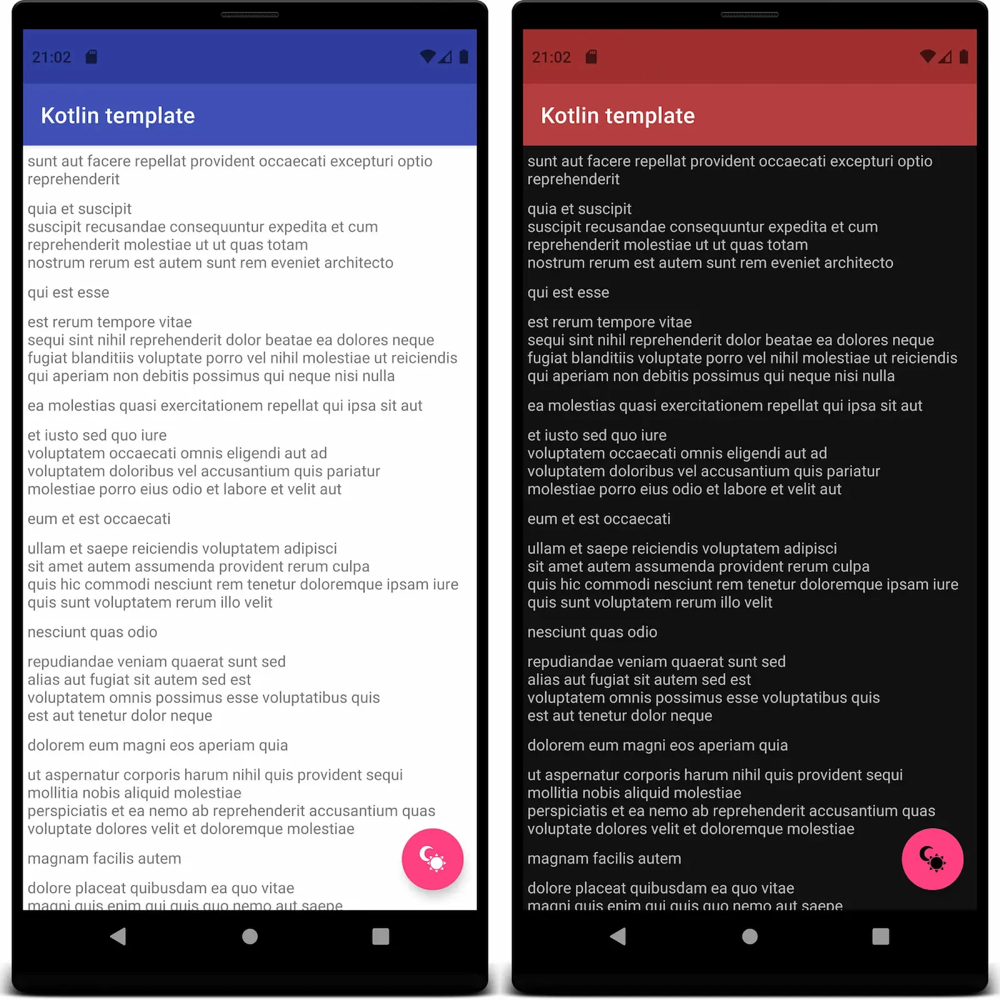

With the arrival of Android 10, the latest trend in Android
development is giving the users the choice to select a dark version
of the app. Some say it can help save battery life and some
just prefer it because it is easier on the eyes when the user opens the app
in a dark room or at night for example. Whatever reason you prefer, here's a
quick walk through on how to implement it.

## Getting Started

The quickest and easiest way to get started with the dark theme is forcing
it on the style. This will only work on Android 10, where the system will
override the app colors and try to make it dark. This can work nicely
for simple apps, but it might mess the app if it has a complex visual.

Note that doing this the dark mode will only work on Android 10 and it
won't have backward compatibility as the previous versions of Android
can't handle the dark mode natively.

## Forcing the Dark Theme

Add this to your `Theme` in the `style.xml`:

```
<item name="android:forceDarkAllowed" tools:targetApi="q">true</item>
```

## Examples

Here are some examples where we let the system handle the dark mode:




## Possible problems

You can see in the previous screenshots that it worked quite well. But in some cases it's
not ideal, like the following example where the options are showing but you
can barely see the card background for each button:



When forcing the dark theme, you can also specify in the xml for a
specific element to not be styled as dark using the following tag:

```
<View
    ...
    android:forceDarkAllowed="false"
    .../>
```

This is a example with the dark mode forced on the theme and adding the
ignore tag on the card element:


You can see that everything became dark but the card keep the original
background and text colors.

## Supporting Dark Theme

To properly support the dark theme you first need to add the DayNight style
as parent of your app theme:

```
<style name="AppTheme" parent="Theme.AppCompat.DayNight">
```

or the proper theme from [MaterialComponents'](https://github.com/material-components/material-components-android) :

```
<style name="AppTheme" parent="Theme.MaterialComponents.DayNight">
```

After this simple change you can start handling the dark mode state on the app.

I've created this simple class to ease the task of switching themes, you
can check it [here](https://github.com/nodes-android/kotlin-template/blob/92e3406e3e70bef0e1e7cbdbb4fb3527e34c19f1/presentation/src/main/java/dk/nodes/template/presentation/util/ThemeHelper.kt).

So using it to change the theme is as easy as: `ThemeHelper.applyTheme(Theme.DARK)`.

Don't forget to store the user preference of the theme, as the system doesn't store it,
you have to manually handle the states. The best place to apply the user
theme preference is in the `Application` class of the app, so when the views
are rendered the system already uses the proper theme resources.

## Handling Dark Theme

If you want your app theme to follow the system settings, you have to
be aware if there is a configuration change and properly handle the
screens in your app so it doesn't lose data when it gets recreated.

For handling the activity recreation you need to add a config change
param in the `AndroidManifest.xml` for you activity, like this:

```
<activity
    android:name=".MyActivity"
    android:configChanges="uiMode" />
```

After that you can override the `onConfigurationChanged()` method in the
activity to handle and save the state when the user or the system switch
the system-wide theme.

Take care that, when supporting a dark theme, you shouldn't hardcode colors,
especially for background as it can look out of place in one of the themes.
Instead, you can set colors for the light theme (default folder) and
override the colors that don't look nice for the dark theme creating a
`colors.xml` in the night folder. Like this:

##### **../src/main/res/values/colors.xml**

```
<resources>
    <color name="colorPrimary">#3F51B5</color>
    <color name="colorPrimaryDark">#303F9F</color>
    <color name="colorFabIcon">#FFFFFF</color>
</resources>
```

##### **../src/main/res/values-night/colors.xml**

```
<resources>
    <color name="colorPrimary">#B53F3F</color>
    <color name="colorPrimaryDark">#9F3030</color>
    <color name="colorFabIcon">#000000</color>
</resources>
```

And here is how it looks like:



With the Material Components library the system already provides some useful
resources to help you apply the dark theme to elements, like `android:colorBackground`
that automatically changes based on the app theme you apply.

You can read more about it [here](https://material.io/develop/android/theming/color/).

## Dark All the Things

Implementing dark mode is not as hard as it looks. With some small
state and color handling it is possible to create an app that looks good on
both themes. Some people still prefer the light mode, so it's always nice to have the
option to switch and let the users chose way they prefer.

## Further Reading

[Android Developers - Dark theme](https://developer.android.com/guide/topics/ui/look-and-feel/darktheme)

[Dark Theme - Material Components](https://material.io/develop/android/theming/dark/)

[Material Components GitHub](https://github.com/material-components/material-components-android)

_Article Photo by [Rami Al-zayat](https://unsplash.com/photos/w33-zg-dNL4)_
