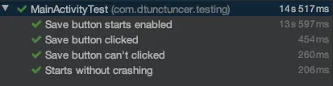

The reason I am writing this article is because it was very hard for me to find some unit testing materials on Android Components. I hope I can fill the gap. Let’s talk about unit testing for a bit. I am not going to explain what unit testing is in this article. The official Android documentation about [unit testing](https://developer.android.com/training/testing/unit-testing) can be a good place to start. Although, it will be good to talk about some of the advantages of writing unit tests.

1. It helps us refactor/change old code more confidently without fear of breaking something you don’t know.

1. It forces you to write better code

1. It makes debugging easier. If a unit test fails it means your latest change breaks something

1. Eventually, unit testing leads to less bugs

These are the main reasons why we should write unit tests in our projects. Now let’s talk about how to test Android Components.

Mainly I will try to explain Activity/Fragment unit testing with the new [AndroidX Testing library](https://mvnrepository.com/artifact/androidx.test/core-ktx). You can just simply add this dependency to use it

```groovy
    testImplementation 'androidx.test:core-ktx:{LATEST-VERSION}'
```

This library introduces us to two new classes `ActivityScenario` and `FragmentScenario`. With these two scenario classes, we can launch any activity or fragment and test their methods. You can easily change their states too.

One other benefit of this library is you can run these tests on JVM(using [Roboelectric](http://robolectric.org/)) or on a device. All you need to do is to decide where to run deciding which folder to use test or androidTest . test for JVM, androidTest for device.

These scenario classes have very easy to use API. Let’s check them.

```kotlin
    val scenario = launchActivity<MainActivity>()

    // Runs a given action on the current Activity's main thread.
    scenario.onActivity { activity ->

    }

    // Moves Activity state to a new state
    state.scenario.moveToState(Lifecycle.State.RESUMED)

    // Waits for the activity to be finished and returns the activity
    result.scenario.result

    // Finishes the managed activity and cleans up device's state
    scenario.close()
```

## Preparing

To write unit tests we need to configure our project a little bit more.

- Add this option to your project’s Gradle file:

```groovy
    android {
        ...
        testOptions {
            unitTests.includeAndroidResources = true
        }
    }
```

- Add more dependencies to write unit tests more efficiently

```groovy
    testImplementation 'androidx.test.ext:junit-ktx:{LATEST-VERSION}' // Adds AndroidJUnit runner
    testImplementation 'org.robolectric:robolectric:{LATEST-VERSION}' // to run Android tests on JVM
    testImplementation 'io.mockk:mockk:{LATEST-VERSION}' // Kotlin friendly mocking library
    testImplementation 'androidx.test.espresso:espresso-core:{LATEST-VERSION}' // to write android UI tests
```

- Add this annotation `@RunWith(AndroidJUnit::class)` to your test suite.

## Testing

Let’s start with an example. Let’s assume that we have an activity called MainActivity . Let’s test if it starts without crashing.

```kotlin
    private lateinit var scenario: ActivityScenario<MainActivity>

    @Test
    fun `Starts without crashing`() {
        scenario = launchActivity()
    }
```

That’s it. All we need to do is use the launchActivity function. It will create and start the activity for us.

Let’s do a more complicated example. Assume that we have a button and our ViewModel controls if the button is enabled or not.

```kotlin
    private val viewModel: MainViewModel = mockk(relaxUnitFun = true)

    @Test
    fun `Save button starts enabled`() {
        // Given
        every { viewModel.saveButtonEnabled } returns true

        // When
        scenario = launchActivity()

        // Then
        onView(withId(R.id.saveBtn)).check(matches(isEnabled()))
    }
```

So what happened here?

1. Mock the ViewModel and define the behavior of saveButtonEnabled flag variable.

1. Start the activity

1. Check if the button is enabled or not

## Conclusion

What we achieved in this article is to use Google’s new test API and write some small and easy unit tests. AcitivityScenario/FragmentScenenario is definitely the best and easiest way to write unit tests for Android components. I strongly recommend it.

I want to share one more benefit with you. It really feels nice to see all of your tests are passed :)



Note: You can check my [sample repo](https://github.com/dtunctuncer/android-components-unit-testing) and see the setup and some more complex examples.

Article photo by [Bill Oxford](https://unsplash.com/@bill_oxford) on [Unsplash](https://unsplash.com/)
