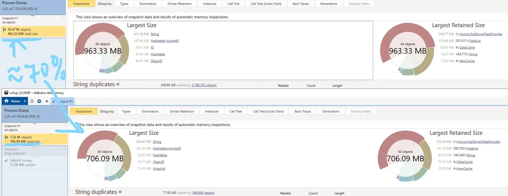

Have you ever thought about what is inside your application causing high RAM usage in Task Manager? Take a moment and check out your program memory usage right now. Does it look good/healthy/fit/expected/normal? Do you have an idea about what the top three application types consuming the most RAM are? What is your guess how much megabytes they conquer?

### How is memory expected to be used?

Memory is consumed by objects that carry data required for an application to do its job.

Does it mean the more data is there, the more memory is inevitably needed?

Is there anything that can be done to break the loop?

Let's start with finding top memory consumers and figure out if anything can be done there.

## How to get per type statistics?

[A memory snapshot of the live process](https://github.com/mitikov/KeepSitecoreSimple/wiki/Myth-busting-Memory-Dumps) is a gold mine of information and can be collected in 4 clicks:

1. Task Manager
2. Details
3. Right click on target process (w3wp in case of IIS-hosted app)
4. Create dump file

Importing the dump file into [dotMemory](https://www.jetbrains.com/dotmemory) highlights the largest size taken by [immutable](https://en.wikipedia.org/wiki/Immutable_object) [string](https://docs.microsoft.com/en-us/dotnet/api/system.string?view=netframework-4.7.2) and _Sitecore.Data.ID_ (reference version of [Guid](https://docs.microsoft.com/en-us/dotnet/api/system.guid?view=netframework-4.7.2)) types:


Sitecore reads data from the database and caches it inside the process to avoid further expensive database calls. In other words - it seem to be expected that text data and its IDs would be in top 3.

How does that align with your prediction? Did you expect **strings** to consume half of the total heap size?

### Reduce memory pressure

Despite some Sitecore fields (like **created by** `sitecore\admin`) having repeatable values, each read from the database will turn text into a new string object instance and cached by the application shortly after.

.NET already supports the concept of [re-using immutable object instances](https://docs.microsoft.com/en-us/dotnet/api/system.string.intern?view=netframework-4.7.2) by using an implementation of the [Object pool pattern](https://en.wikipedia.org/wiki/Object_pool_pattern).

Instead of caching the value straightaway, Sitecore can intern it first (either by grabbing a reference to the interned object, or by adding it to the intern pool) and thereby lowering the number of objects carrying duplicate data.

All there is left for a developer is to locate repeatable data in fields, which can be done by using this simple SQL script:

```sql
WITH DuplicatedFieldValues AS  (
SELECT
	v.FieldId,
	FieldDefinitionRow.[Name],
	CONVERT(NVARCHAR(250),v.[Value]) AS [Field Value],
	COUNT(1) AS [Hits]
FROM
	[VersionedFields] v
JOIN
	[Items] FieldDefinitionRow ON FieldDefinitionRow.ID = v.fieldID
WHERE
	v.FieldId NOT IN
	(
		/* Fields already interned OOB by Sitecore.Interning.config */
		'BADD9CF9-53E0-4D0C-BCC0-2D784C282F6A' /* updated by */,
		'5DD74568-4D4B-44C1-B513-0AF5F4CDA34F' /* created by */,
		'52807595-0F8F-4B20-8D2A-CB71D28C6103' /* owner */,
		'3E431DE1-525E-47A3-B6B0-1CCBEC3A8C98' /* workflow state */
	)
GROUP BY
	FieldId, [Name], CONVERT(NVARCHAR(250),[Value])
HAVING
	COUNT(*) > 500 /* How many same field values must be met to be shown */)

SELECT * FROM DuplicatedFieldValues
ORDER BY [Hits] DESC

SELECT
	REPLACE(CONCAT('<', [Name], '>'), ' ','_') AS [BeginTag],
	CONCAT('{',FieldId,'}') AS [FieldId],
	REPLACE(CONCAT('</', [Name], '>'), ' ','_') AS [EndTag],
	SUM(Hits) AS [Duplicates],
	COUNT(1) AS [Unique Values]
FROM
	DuplicatedFieldValues
GROUP BY
	[FieldId], [Name]
ORDER BY
	[Duplicates] DESC
```

Located fieldIDs are to be added into the Sitecore.Interning.config, **fieldIdsToIntern** section to let Sitecore apply interning logic for them.

### Verify it works phase

The real gain is to be measured with ON/OFF interning:

1. Kill existing w3wp.exe process (since applications do not like to give away conquered memory)
2. Start Sitecore application with unlimited cache sizes
3. Capture a full memory snapshot after a big pile of content has been loaded and full garbage collection has occurred. Some sample code:

```csharp
var db = Sitecore.Configuration.Factory.GetDatabase("master");
using (new SecurityDisabler())
{
	var root = db.GetItem(new ID("{110D559F-DEA5-42EA-9C1C-8A5DF7E70EF9}"));
	var descendants = root.Axes.GetDescendants();
	MainUtil.Nop(descendants);
}
GC.Collect(GC.MaxGeneration, GCCollectionMode.Forced, true, true);
GC.Collect(GC.MaxGeneration, GCCollectionMode.Forced, true, true);
```

Repeat the steps with enabled/disabled interning (**setting name="Interning.Enabled"** in **Website\App_Config\Include\Sitecore.Interning.config**) to get the base lines.

Let's make one more prediction before getting dotMemory into the game - what is the impact of configuring interning?

## Results

The local results shows that 30% less objects stays in the heap and one fourth of the RAM usage has been removed.

In simple words - the application can consume less than 6 GB instead of more than 8 GB as previously:



Did you predict that big performance win?

## Lesson learnt

[Object pool](https://en.wikipedia.org/wiki/Object_pool_pattern) and [Immutable object](https://en.wikipedia.org/wiki/Immutable_object) design patterns allow noticeably reducing the application memory pressure without altering any functionality!

The cost (extra operation to pool object) is much lower than gain - not only tons of saved memory, but also a huge boost in comparing **pooled** objects - fast by-reference equality in certain cases instead of by-value comparing.
