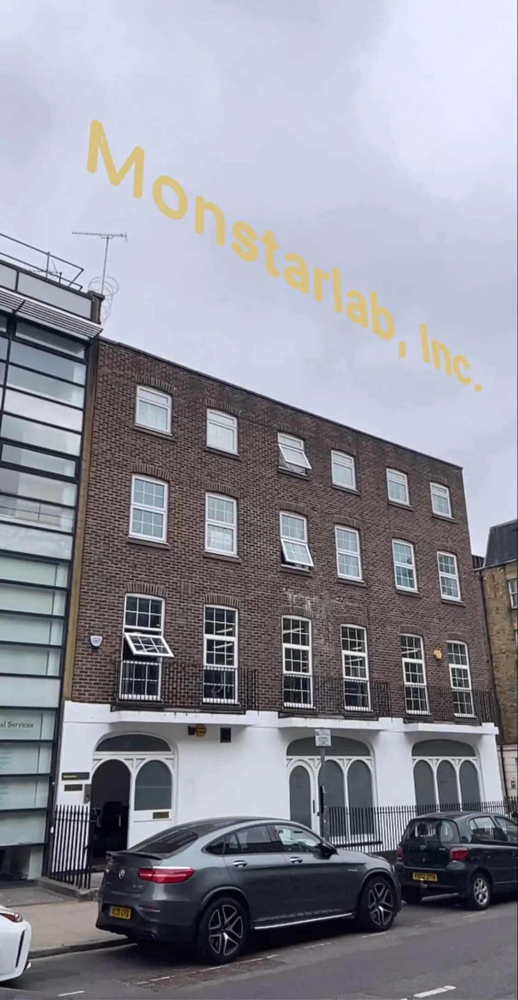
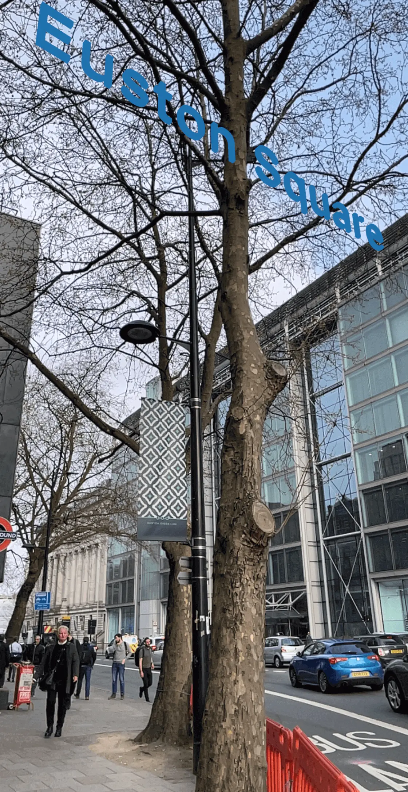
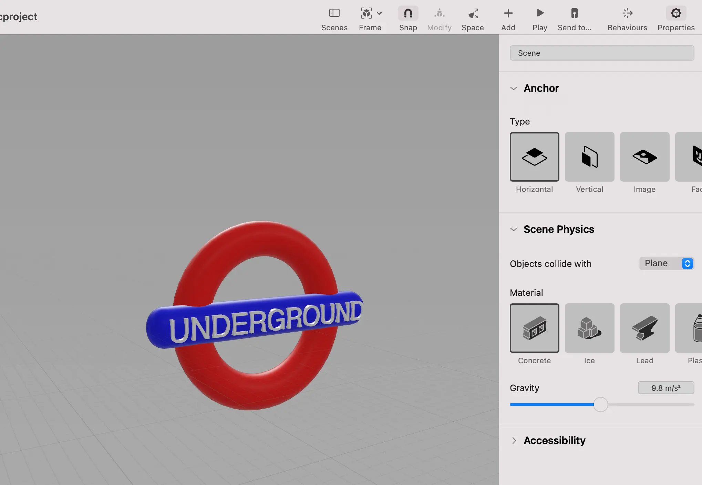
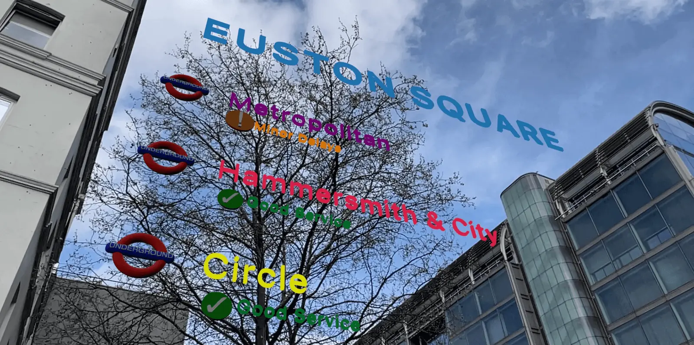

At Monstarlab we have some incredible talent when it comes to building AR experiences. Some of the work I have seen my colleagues produce has simply blown me away. Really creative, innovative experiences that can often at times blur the line between augmented reality and reality so much so that it’s hard to know what’s real! 

For me personally, I had always enjoyed using AR but had never really got my hands dirty with it. When I got the opportunity to do so, I jumped at the chance. I wanted to share my experience with working with ARKit for the first time and what I managed to create. I first completed some simple online tutorials and watched some videos from Apple to get a grasp of the basics. A really cool feature that really appealed to me was location anchoring. The possibilities of what you could do by combining real world locations using latitude, longitude & altitude, with AR experiences seems so exciting. For a movie nerd like me, the possibility of seeing AR objects interacting with the real world seemed like something only The Terminator could do up until recently!

My end goal was to create an AR experience that could locate & display all of the London TFL tube and train stations for you, what train lines were available and even the current service they were providing. Here goes…


## Step One - Adding an ARAnchor to my ARView


I couldn’t believe how easy it was to add an ARAnchor to an ARKit ARView. I think a lot of people, myself included, see AR and presume its going to be really difficult and complicated but ARKit really does all the heavy lifting for you. My first goal I set myself was to add an AR label to our UK office which simply labelled our office in the sky.

With the latitude & longitude of the office, you can simply create an ARGeoAnchor like so...
```
    let location = CLLocationCoordinate2D(latitude: "51.5113000646694", longitude: "51.5113000646694")
    let anchor = ARGeoAnchor(name: name, coordinate: location)
    arView.session.add(anchor: geoAnchor)
```
You have the option of also supplying altitude if you know how high you want your anchor to be, but I don't want to specify that for now.

This will in turn call a delegate method you should adhere to. You can then specify your AR Entity you wish to display at the location.

```
    func session(_ session: ARSession, didAdd anchors: [ARAnchor]) {
        for geoAnchor in anchors.compactMap({ $0 as? ARGeoAnchor }) {
            let entity = Entity.placemarkEntity(for: geoAnchor)
            self.arView.scene.addAnchor(entity)
        }
    }
```

You may notice here I have a method `placemarkEntity(:_)` that generates my entity for me. Lets have a quick look at what this is doing...

```
extension Entity {
    
    static func placemarkEntity(for arAnchor: ARAnchor) -> AnchorEntity {
        
        let placemarkAnchor = AnchorEntity(anchor: arAnchor)
        let indicator = generateNameIndicator(text: arAnchor.name ?? "Untitled")
        placemarkAnchor.addChild(indicator)
        
        //30 meters from the ground
        indicator.setPosition(SIMD3<Float>(0, 30, 0),
                              relativeTo: placemarkAnchor)
        
        //rotate to face where I want
        let radians = 90.0 * Float.pi / 2
        let orientation = simd_quatf.init(angle: radians, axis: SIMD3<Float>(0, 1, 0))
        indicator.setOrientation(orientation, relativeTo: placemarkAnchor)
        
        return placemarkAnchor
    }
    
    static func generateNameIndicator(text: String) -> Entity {
        let indicatorEntity = Entity()

        let text = ModelEntity.nameEntity(text.uppercased()).clone(recursive: true)
        indicatorEntity.addChild(text)
        
        return indicatorEntity
    }
}

extension ModelEntity {
    static func nameEntity(_ text: String) -> ModelEntity {
        ModelEntity(mesh: MeshResource.generateText(text,
                                                    extrusionDepth: 0.2,
                                                    font: .boldSystemFont(ofSize: 4),
                                                    containerFrame: CGRect.zero,
                                                    alignment: .center,
                                                    lineBreakMode: .byCharWrapping),
                    materials: [UnlitMaterial(color: .yellow)])
    }
}
```

So there's quite a lot going on here but I'll give it a quick run down;
Our first function is creating the AnchorEntity we display in our experience. It uses a function to generate the AR text entity, it then positions the entity 30 meters above the ground, that's around the height of our UK office. It then rotates the entity to face the front of the building.
The second function is what is called to generate the text entity, this uses the ModelEntity extension you can see which uses RealityKits' MeshResource static function to generate the 3D text with fonts, colours and other styling we desire.

When this is run in the app it displays something like this which is pretty neat!



## Step Two - Adding an ARAnchor for each Station

Now I know how to add an ARAnchor for one location, adding them for all the others was simple. I went on to find some data online that supplied me all the stations throughout London and their latitude & longitude. An issue with this was, London is a rather large city, and it has a lot of train stations! Adding all of these entities to my ARView would cause performance issues and frankly just didn't make much sense for what I wanted as most wouldn't be local enough anyway. I proceeded to use CoreLocation to get the users current location and only generate ARAnchors if the station was within 1000 meters.

Using my previous code for labelling the office, combined with the data of the station locations, I could display all the station labels. One issue with my current implementation was currently all the 3D text entities were rotated facing the same way as our UK office which of course we didn't want. What I really wanted is for the labels to be rotated so the user could read them wherever they are.

Below, this piece of code does this using Combine subscribing to the ARView scene and transforming all the entities to the ARView camera.

```
        //rotate stations to look at camera
        arView.scene.subscribe(to: SceneEvents.Update.self) { [self] _ in
            for anchor in self.arView.scene.anchors {
                if let entity = anchor as? AnchorEntity {
                    entity.billboard(targetPosition: arView.cameraTransform.translation)
                }
            }
        }.store(in: &cancellables)
```
```       
        extension Entity {
            /// Billboards the entity to the targetPosition which should be provided in world space.
            func billboard(targetPosition: SIMD3<Float>) {
                look(at: targetPosition, from: position(relativeTo: nil), relativeTo: nil)
            }
        }
```

The end result meant all tube stations were now displayed with their name above them!


## Step Three - Adding custom Reality Composer Scenes & Service Info

Now I had the station names, I really wanted it to look a bit more impressive. I decided to dive in to Reality Composer. It was so fun & easy to use with so many shapes and objects you can combine to create nearly anything you want. When designing your AR objects it's important to keep in mind sizing, these objects are going into the real world in our app, so you want to think about how large you want them to be compared to real life objects. After getting used to Reality Composer quickly, I soon felt like I was making Pixar's next big feature, making all the different train type logos that I would go on to use in our app. 
 

With my Reality Composer scenes finished, I used TFL's API to get all the train lines and their current service. I then updated my entity generation code slightly to include my Reality Composer scenes and laid the lines and their services out using dynamic height depending on the amount of information I needed to display including train lines, line statuses and status icons.

```
    static func placemarkEntity(for arAnchor: ARAnchor,
                                tubeLines: [PlacemarkLineInfo]) -> AnchorEntity {
        
        let meterSpacing:Float = 7
        let placemarkAnchor = AnchorEntity(anchor: arAnchor)
        let topHeightFromGround: Float = 15 + (meterSpacing * Float(tubeLines.count))
        var currentHeight = topHeightFromGround

        let indicator = generateNameIndicator(text: arAnchor.name ?? "Untitled")
        placemarkAnchor.addChild(indicator)
        indicator.setPosition(SIMD3<Float>(0, currentHeight, 0),
                              relativeTo: placemarkAnchor)
        currentHeight -= meterSpacing
        
        //rotate
        let radians = 90.0 * Float.pi / 2
        let orientation = simd_quatf.init(angle: radians, axis: SIMD3<Float>(0, 1, 0))
        indicator.setOrientation(orientation, relativeTo: placemarkAnchor)
        

        for line in tubeLines {
            switch line.tubeLine.trainType {
            case .tube:
                let logoScene = try! UndergroundLogo.loadScene()
                placemarkAnchor.addChild(logoScene)
                logoScene.setPosition(SIMD3<Float>(0, currentHeight + 1, 0),
                                      relativeTo: placemarkAnchor)
            case .overground:
                let logoScene = try! OvergroundLogo.loadScene()
                placemarkAnchor.addChild(logoScene)
                logoScene.setPosition(SIMD3<Float>(0, currentHeight + 1, 0),
                                      relativeTo: placemarkAnchor)
            case .nationalRail:
                let logoScene = try! NationalRailLogo.loadScene()
                placemarkAnchor.addChild(logoScene)
                logoScene.setPosition(SIMD3<Float>(0, currentHeight + 1, 0),
                                      relativeTo: placemarkAnchor)
            case .dlr:
                let logoScene = try! DLRLogo.loadScene()
                placemarkAnchor.addChild(logoScene)
                logoScene.setPosition(SIMD3<Float>(0, currentHeight + 1, 0),
                                      relativeTo: placemarkAnchor)
            }
            let lineIndicator = generateLineIndicator(line: line.tubeLine)
            placemarkAnchor.addChild(lineIndicator)
            lineIndicator.setPosition(SIMD3<Float>(-3, currentHeight, 0),
                                      relativeTo: placemarkAnchor)
            lineIndicator.setOrientation(orientation, relativeTo: placemarkAnchor)
            
            if let status = line.status {
                switch status.status {
                case .good:
                    let iconScene = try! Check.loadScene()
                    placemarkAnchor.addChild(iconScene)
                    iconScene.setPosition(SIMD3<Float>(-4, currentHeight - 2, 0),
                                          relativeTo: placemarkAnchor)
                case .disrupted:
                    let iconScene = try! Warning.loadScene()
                    placemarkAnchor.addChild(iconScene)
                    iconScene.setPosition(SIMD3<Float>(-4, currentHeight - 2 , 0),
                                          relativeTo: placemarkAnchor)
                case .notRunning:
                    let iconScene = try! Cross.loadScene()
                    placemarkAnchor.addChild(iconScene)
                    iconScene.setPosition(SIMD3<Float>(-4, currentHeight - 2, 0),
                                          relativeTo: placemarkAnchor)
                }
                let lineIndicator = generateStatusIndicator(status: status)
                placemarkAnchor.addChild(lineIndicator)
                lineIndicator.setPosition(SIMD3<Float>(-5, currentHeight - 1.5, 0),
                                          relativeTo: placemarkAnchor)
                lineIndicator.setOrientation(orientation, relativeTo: placemarkAnchor)
            }
            
            currentHeight -= meterSpacing
        }

        return placemarkAnchor
    }
```

With my entity generation code in my place, my AR experience was looking a lot more like I wanted.

 
 
 

### Conclusion

Overall, I was really pleased with all that I had learnt about both ARKit and Reality Composer within a few days. It was much easier to use than I ever would've imagined and you can get impressive results rather quickly. I look forward to having plenty more encounters with ARKit in the future as I am sure the technology & demand for these types of apps will continue to grow. Keep your eyes peeled to the Monstarlab Engineering blog, because just like The Terminator, I'll be back.

Below you can see the application in action. 

`{{ youtube-link="upBFPjHIkuU" }}`

If you want to check out the whole project, you can do so [here](https://github.com/andrewlloyd100/TubeSpotterAR)

####

## Related Articles:

* [Apple's introduction to ARAnchors](https://developer.apple.com/videos/play/wwdc2020/10611/)
* [TFL API](https://api.tfl.gov.uk/)

_Article Photo by [Getty Images](https://www.bbc.co.uk/news/uk-england-london-48531800)_
