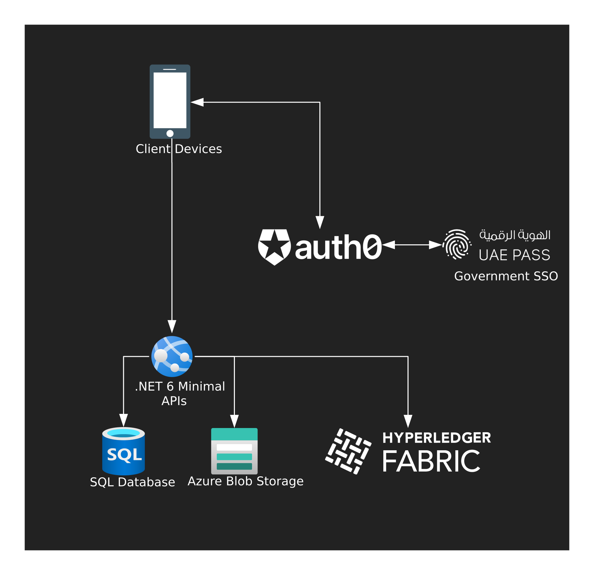

April 1st 2022 marked the kickoff of the second Monstarlab internal hackathon, [MonstarHacks](https://www.linkedin.com/showcase/monstarhacks), where each team built a project to tackle one of the three Life Science focused challenges:

1. Assure equitable health care for everybody
2. Keep the “human touch” in digital healthcare solutions in isolating times
3. Connect refugees with medical support in times of crisis (with a focus on low energy consuming solutions)

Our team decided to tackle the first challenge: “Assure equitable healthcare for everybody” by building a mobile application that will connect healthcare professionals with individuals seeking medical assistance through a centralized interface. This application can also be integrated with different healthcare providers (hospitals/clinics), for the individuals’ history to be available on the app. All patient history is to be stored on a permissioned blockchain, with individuals providing consent for healthcare professionals to access their history on a as-needed basis.

### The proposed solution

- The mobile application will allow users to login using their government single-sign-on provider, or via username and password
- Logging in with a government SSO will allow healthcare providers to upload their credentials, and have them verified by the relevant authorities/regulatory bodies
- It will also allow individuals to consent to their medical history to be shared with the healthcare professional as needed
- An individual, once logged in, can request medical assistance and go through the flow of describing their symptoms
- The application will then match them with relevant medical professionals, allowing them to either navigate to their location or have a live video call with them

## Solution Architecture


Figure: 1. Solution Architecture

## Working with spatial data in .NET 6 and EF Core

Spatial data represents the physical location and the shape of objects. Many databases provide support for this type of data so it can be indexed and queried alongside other data. Our application currently uses spatial data to calculate distance from a user to a healthcare professional, or even provide the capability to filter based on distance.

NetTopologySuite (NTS) is a spatial library for .NET that allows EF Core to map spatial data with in the database by using NTS types in your model.

To use NTS and spatial data with EF Core, you need to install the appropriate NuGet package, there are NuGet packages to support the following providers:

- [SQL Server](https://www.nuget.org/packages/Microsoft.EntityFrameworkCore.SqlServer.NetTopologySuite)
- [SQLite](https://www.nuget.org/packages/Microsoft.EntityFrameworkCore.Sqlite.NetTopologySuite)
- [In Memory](https://www.nuget.org/packages/NetTopologySuite)
- [PostgreSQL](https://www.nuget.org/packages/Npgsql.EntityFrameworkCore.PostgreSQL.NetTopologySuite)
- [MySQL](https://www.nuget.org/packages/Pomelo.EntityFrameworkCore.MySql.NetTopologySuite)
- [Teradata](https://www.nuget.org/packages/Teradata.EntityFrameworkCore.NetTopologySuite)

Our backend connects to an SQL Server, so we'll be installing the [SQL Server](https://www.nuget.org/packages/Microsoft.EntityFrameworkCore.SqlServer.NetTopologySuite) package.

The types available in the `NetTopologySuite.Geometries` namespace:

- Geometry
  - Point
  - LineString
  - Polygon
  - GeometryCollection
    - MultiPoint
    - MultiLineString
    - MultiPolygon

For our implementation, we'll be adding the `NetTopologySuite.Geometries.Point` type to the User model

```cs
public Point? LastKnownLocation { get; set; }
```

To create a point object, you'll need the coordinates of the user, the latitude and longitude, in degrees. However, the constructor for accepts (x,y), which means you'll need to provide in (longitude,latitude) instead of the usual (latitude,longitude) you might get when interacting with Google Maps or similar. So, to create a point for Monstarlab's office in Dubai (25.0720589,55.1414239) you would use the following constructor.

```cs
LastKnownLocation = new Point(55.1414239, 25.0720589) { SRID = 4326 };
```

The SRID field defines the spatial reference system for Earth's surface, 4326 is the reference system used by GPS satellite navigation systems and for NATO military geodetic surveying.

Querying users within a certain distance is straightforward, you'll need the origin latitude, longitude, as well as the maximum distance.

```cs
var currentLocation = new Point(longitude.Value, latitude.Value) { SRID = 4326 };
result = DbContext.HealthcareProfessionals.Where(x => x.User.LastKnownLocation.Distance(currentLocation) <= distance);
```

Another type that can be used for ensure your search is within a specific region, which can be beneficial if you want to search within a city or neighborhood, is the `NetTopologySuite.Geometries.Polygon`.

To create a polygon representing the JLT West district, where our Dubai office is located, you can use the below code snippet:

```cs
public class City
{
    public int Id { get; set; }
    public string Name { get; set; }
    public Polygon border { get; set; }
}
```

```cs
var JLTCoords = new List<Coordinate>() {
    new Coordinate(55.142068, 25.073812),
    new Coordinate(55.136795, 25.068180),
    new Coordinate(55.137779, 25.061550),
    new Coordinate(55.146201, 25.070782),
    new Coordinate(55.142289, 25.073899),
    new Coordinate(55.142068, 25.073812),
    }.ToArray();
var city = new City()
{
    Name = "JLT",
    border = new Polygon(new LinearRing(JLTCoords)) { SRID = 4326 }
};
```

This Polygon can be visualized on [Google Maps](https://www.google.com/maps/d/u/0/edit?mid=1EODatXqNYrAbtOdmmUnmJIXwCvBg0dPL&usp=sharing).

Subsequently, you can query the users within a region as follows:

```cs
DbContext.HealthcareProfessionals.Where(x => x.User.LastKnownLocation.Intersects(city.border));
```

## Design Ideas

Finally, we built a sample app to demonstrate the application:


Figure: 2. App login


Figure: 3. Healthcare Professional Confirmation Screen


Figure: 4.a. Individual symptoms flow part 1


Figure: 4.b. Individual symptoms flow part 2


Figure: 4.c. Individual symptoms flow part 3


Figure: 4.d. Individual symptoms flow part 4


Figure: 5. List of Healthcare Professionals


Figure: 6. Healthcare Professional Profile


Figure: 7. Video Call with Healthcare Professional

### Related Articles
- [Spatial Data - EF Core](https://docs.microsoft.com/en-us/ef/core/modeling/spatial)
- [WGS 84: EPSG Projection](https://spatialreference.org/ref/epsg/4326/)
