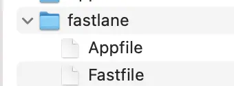
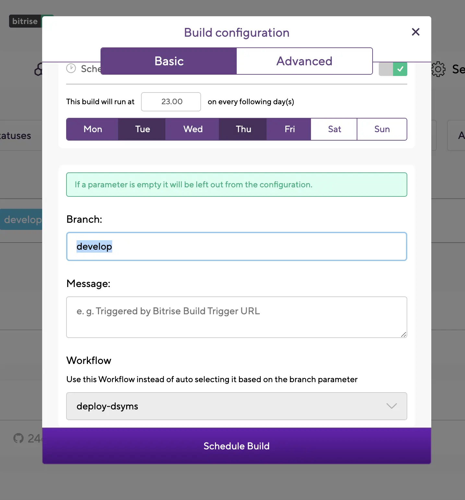

## What was the issue?

Crash reporting is something that's hugely important for all our apps. It allows us to easily find issues within our apps and can give us helpful advice on where to fix them. For our crash reporting, we use [Firebase Crashlytics](https://firebase.google.com/products/crashlytics). For the crash reporting to work in Crashlytics, it needs dSYM files (debug symbol files) but our issue was our application has bitcode enabled. 

Bitcode was first introduced by Apple with the release of Xcode 7, it allows Apple to re-optimize your app binary to tailor the app to the capabilities of the device used. For our particular use case, our application had WatchOS support and for both WatchOS & tvOS apps, bitcode is required, meaning simply turning it off wasn’t an option. And hey, it’s a cool feature that we didn’t want to turn off anyway. [You can read more about Bitcode here](https://help.apple.com/xcode/mac/current/#/devbbdc5ce4f).

With bitcode enabled, the dSYM files only become available to you after your app is done processing on App Store Connect. Previously we were downloading these files manually from App Store Connect and then manually uploading them to firebase, which as you can imagine, was a very tedious task.

We wanted to find a way to automate this within our current CI using Bitrise so we wouldn’t ever have to suffer that tedium again!

## Using Fastane to solve it

Currently we use [Fastlane](https://fastlane.tools) mostly to handle the signing of our apps, but it’s proved our main saviour here also. 

These are the steps required to upload your dSYM files automatically using Fastlane & Bitrise together. Here we go…

## 1. Add Fastlane to your project

First of all, you're going to need to install Fastlane and add it to your project. This is as easy as just installing it and running `fastlane init` in the terminal at the root of your project. Fastlane may ask you what lanes you might want to setup automatically but you can just select a custom setup. The main result should be it will generate a folder in the root of your project called "Fastlane" with two files; `Appfile` & `Fastfile`. Don't worry too much about whats in the files as we will update that. If you see this result, congratulations! It worked!

```
fastlane init
```


If you need more help getting Fastlane setup in your project [see here](https://docs.fastlane.tools/getting-started/ios/setup/)

## 2. Getting the Firebase upload script where you need it.

The Firebase SDK includes a script that we can use to upload the dSYM files. This is what we are going to use to upload them using Fastlane…

Side note; If you’re using Cocoapods, you wont have to do this or specify the binary path in your Fastfile. The script is already present in the Crashlytics pod folder and fastlane can find it. If you go this route, make sure to either commit your pod dependencies into your repo or install the pods in your Bitrise workflow before you run the fastlane step.

1. Add a folder to the root of your project and call it "scripts".

2. Next navigate to where your Firebase SDK is located. Then go into the folder Crashlytics. If using SPM, your Firebase SDK should be able to be located via right clicking and selecting "Show In Finder" on the package from within Xcode.

3. Here you should find the script "upload-symbols". Copy/paste this script into the scripts folder you just created in step 1. Note; you shouldn't need to add these or a reference to them into your Xcode project. Being in your project finder/repository is what we want.

## 3. Updating the `Appfile`

Now let's configure our `Appfile` as required. Open that file up from within your "Fastlane" folder.

We don't need to add much information here, we just need to confirm our platform and our team id. This team id relates to your App Store Developer team and can be found in your account details [there](https://developer.apple.com/account).

Then for each environment your project has, add some code like the following, specifying your environment in the lane name and which app identifier that environment uses.

```
  for_lane :refresh_dsyms_prod do
    app_identifier 'com.Monstarlab.myExampleApp.Prod'
  end
```

In the end you should have done it for each environment you wish to support and your app file should look something like this

```
for_platform :ios do
  team_id '69ABZ3N123'
  for_lane :refresh_dsyms_staging do
    app_identifier 'com.Monstarlab.myExampleApp.Staging'
  end
  for_lane :refresh_dsyms_prod do
    app_identifier 'com.Monstarlab.myExampleApp.Prod'
  end
end
```

## 3. Configuring your `Fastfile`

Next up is to configure our `Fastfile` with the lanes we need to run to do this job.

We're going to show this in reverse as it will be easier to explain. Your `Fastfile` will look something like this in the end. In this example, we are supporting the upload of two different environments (Firebase projects) dSYM uploads.

```
update_fastlane

default_platform(:ios)

platform :ios do
  desc "Downloads DSYM Files from ASC and upload them to firebase"
  lane :refresh_dsyms_prod do
     download_dsyms(version: "latest")
     upload_symbols_to_crashlytics(
      gsp_path: "./App/Resources/Firebase/GoogleService-Info.plist",
          binary_path: './scripts/upload-symbols'
    )
     clean_build_artifacts
   end
   lane :refresh_dsyms_staging do
     download_dsyms(version: "latest")
     upload_symbols_to_crashlytics(
      gsp_path: "./App/Resources/Firebase/GoogleService-Info-Staging.plist",
          binary_path: './scripts/upload-symbols'
    )
     v
   end
end
```

The first few lines just assure to update fastlane if required and defines the platform.

Then below that, you can see each lane is defined with the same names we used in our Appfile. Fastlane uses these names to relate them together to use the correct Bundle ID for the related lane. 

Let's look at the three steps in our lanes.

1.
```
download_dsyms(version: "latest")
```
 This step downloads the dsym files from App Store Connect. Currently we're only downloading the latest available builds files. You can leave this parameter off and it will download the files for every version available on App Store Connect but beware, if you have a lot of builds, this could take a while! There are some other options for specifying specific build versions or dates.
 
  You can find out more info on the action and it's options [here](https://docs.fastlane.tools/actions/download_dsyms/)

2. 
```
upload_symbols_to_crashlytics(
      gsp_path: "./App/Resources/Firebase/GoogleService-Info-Staging.plist",
          binary_path: './scripts/upload-symbols'
    )
```
Here we are uploading the symbols we just downloaded to Firebase Crashlytics. We need to specify the location of the `GoogleService-Info.plist` file within our repository. This is used so we know which Firebase project to upload them to. 

You will also need to specify the path to that script with `binary_path`. As you can see, it points to the `scripts` folder we created earlier.

More info on this fastlane action can be found [here](https://docs.fastlane.tools/actions/upload_symbols_to_crashlytics/).

3.
```
clean_build_artifacts
```     
This then simply cleans all the dSYM files we have downloaded.

More info [here](https://docs.fastlane.tools/actions/clean_build_artifacts/).


## 4. Setting up Bitrise

Ok, that is all that is needed in terms of Fastlane setup in our project. Now let's see how we can run those Fastlane lanes daily using Bitrise to keep our Firebase crash reporting up to date and returning useful crash reports.

For the sake of keeping this blog size less than the size of a novel, we assume you have your Bitrise project already set up and are already using it to upload your application to App Store Connect using the `deploy-to-itunesconnect-deliver` workflow with API Keys.

1. Go into your projects bitrise.yml and add this workflow

```
deploy-dsyms:
  after_run:
  - prepare
  - dsym-upload
```

What this is doing is creating a workflow called "deploy-dsyms". It then runs two flows;
`prepare`; which activates required ssh keys & clones our project. You'll most likely already have a workflow that does something like this.
`dsym-upload`; is then the workflow that handles the upload

2. Add this second `dsym-upload` workflow to your birise.yml

```
dsym-upload:
    steps:
    - fastlane@3:
        inputs:
        - connection: 'off'
        - api_key_path: "$BITRISEIO_ASC_API_KEY_URL"
        - api_issuer: "$ASC_ISSUER_ID"
        - verbose_log: 'yes'
        - work_dir: "./"
        - lane: refresh_dsyms_prod
    - fastlane@3:
        inputs:
        - connection: 'off'
        - api_key_path: "$BITRISEIO_ASC_API_KEY_URL"
        - api_issuer: "$ASC_ISSUER_ID"
        - verbose_log: 'yes'
        - work_dir: "./"
        - lane: refresh_dsyms_staging
```

What is happening here is it is running a Fastlane workflow, twice for each of our environments we want to support (Staging & Production). You will have to add a flow for each of your environments.

You may notice it looks very similar to the `deploy-to-itunesconnect-deliver` workflow. It requires the `api_key_path` and `api_issuer` just the same as that. 

The two important differing properties are;
 - The `work_dir` which should just be the root of your project
 - The `lane` which should match the name of the lane you specified in your Fastfile for that environment.

## 5. Automating your workflow

OK, now we 
- have our fastlane lanes all setup to do the job 
- have our bitrise workflows ready to run 
- call them

All that is left is for us to schedule them. 

As we need to wait for the app to finish processing on App Store Connect before these files are available, we decided we were just going to run this daily late at night. We didn't want to take our company's limited Bitrise spaces as these could be required by other developers throughout the day to upload builds etc and waiting for the app to finish processing in an upload workflow would eat up a lot of unused time.

If you go to your projects Builds page in Bitrise, you can select on the right hand side to "start/schedule a build". Select this.


You can then select which days you want the workflow to run and at what time. We chose to run them on weekdays at 11pm as we rarely upload builds on weekends and 11pm is a quiet time for us. 
You then select which branch you are using mainly to upload builds from but this shouldn't really matter. As long as that branch has the fastlane setup in it, we're all good. Then select your `deploy-dsyms` workflow as the flow you wish to run and select "Schedule Build".



Thats it you're all done! Bitrise will now download and upload your DSYMS at the times you just set.

### Conclusion

Hopefully this tutorial will help you automate the upload of dSYM files to Crashlytics and save you those annoying 5 minutes whenever you want to deduce why your app is crashing.

####

## Related Articles:

* [Adding missing dSYMs to Crashlytics with Fastlane](https://blog.bitrise.io/post/adding-missing-dsyms-to-crashlytics-with-fastlane)
* [Bitcode & App Thinning](https://help.apple.com/xcode/mac/current/#/devbbdc5ce4f)

_Article Photo by [Firebase](https://firebase.google.com/products/crashlytics)_
