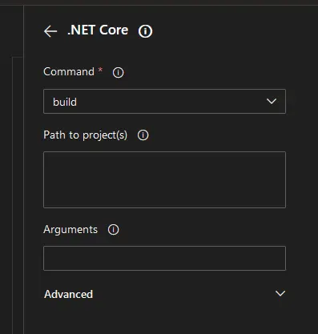
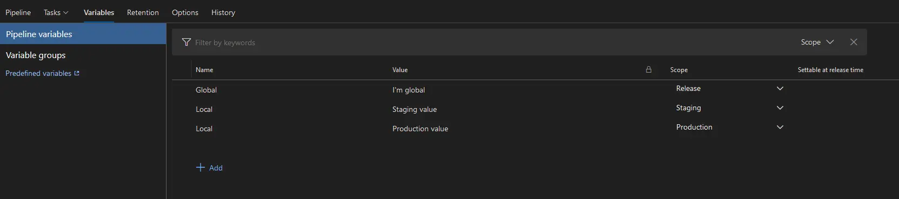

In .NET we have been using Azure DevOps Pipelines for our CI/CD needs, but after Microsoft bought GitHub and has promised to support both GitHub Actions along with Azure DevOps Pipelines promising that each platform will be able to perform the same tasks, the answer to which provider to use is maybe not as clear cut as it has been in the past.

We will take a small look into the main differences between the two platforms looking both as a newcomer to DevOps but also as a more experienced user. The topics we will take a look into are the following:

- Adding tasks: how is the experience of setting up your pipelines/actions
- Variables: how does the system handle variables both global and environment-specific
- Environment hooks: how do you set up a hook into a server or similar you want to deploy to or modify

There are of course a lot more to it than just these topics, but these topics are the basic ones that you will use for most CD pipelines/actions.

## Azure DevOps Pipelines

Azure DevOps Pipelines is Microsoft's main CI/CD platform which traditionally has been used for .NET projects of all kinds. In Azure DevOps, there are also two different pipelines to get your head around: Build pipelines which build artifacts, and release pipelines which can take a build artifact and deploy it to an environment.

At the time of writing, there are two methods of defining build pipelines:

1. Classic
2. YAML

We will not go into the Classic as the functionality is the same, but the defined pipeline is stored in Azure DevOps and not the repository, where YAML serializes the pipeline into a YAML file.

There are two methods of editing YAML files:

1. Manually editing the file in the repository using your favourite editor
2. Use the web portal

We will focus on the web portal editor.

### Adding tasks

Adding a task in Azure DevOps Pipelines is as simple as selecting the task you want in the task selector, entering the parameters you want and it's added to your YAML file where the cursor is currently placed when clicking add.

### Variables

Variables in specifically release pipelines can be defined on a release pipeline level or environment level, which means you as a DevOps developer can differentiate the variables between being global and environment-specific with ease without the pipelines needing to care, they just use the variable with a given name.

### Environment hooks

Environment hooks in Azure DevOps are set up inside the project settings, where you can use the hooks in your build steps by referencing the name of the environment hook.

## GitHub Actions

GitHub Actions is GitHub's CI/CD pipeline setup. It has been implemented with an open source usage in mind and not any particular technology to build. GitHub was acquired by Microsoft in 2018 and Microsoft has promised to expand the functionality of the Actions and support it.

### Adding tasks

As there is no official online editor of the build pipelines, you edit it using your favourite text editor in your cloned repository and push updates to the Git repository. Due to this method, you have to look up the parameters to the build steps you're using.

### Variables

Variables, or secrets as they are called, are values that can be stored globally or per environment in GitHub. Once you've entered the secret's value, you cannot view it again, but it can be used in your Actions.

### Environment hooks

In GitHub there's not anything specifically for environment hooks, you can use secrets for e.g. publish profiles to Azure Web Apps which performs the same task in practice.

## Comparison

Comparing the two platforms, we can conclude functionality wise there isn't really any noticeable difference, but the difference becomes clearer when looking at the user interface and how much the interface helps the pipeline/action developer.

### Adding tasks

Looking at the generated files, there is practically no difference. The difference lies in how much help is given to the developer. In GitHub Actions the developer must look up the parameters themselves while in Azure DevOps Pipelines, you can view all parameters in the editor with additional help of what the valid values are if the task developer has set it up.

### Variables

The main difference between Azure DevOps Pipelines and GitHub Actions regarding variables, is that in Azure DevOps Pipelines, you can define whether you want to be able to view the variable values or not where in GitHub Actions, you are not able to view the values at all. Regarding using them in pipelines/actions, the functionality is practically identical for the developer.

### Environment hooks

In GitHub Actions there are no specific menu or place for environment hooks while in Azure DevOps Pipelines, they are put into their own category. That's the main difference between the two, so it's mostly a matter of taste which of the two are most preferred.

## Summary

GitHub Actions have over the last year gotten most of the functionality that was present in Azure DevOps Pipelines such as Environments and on-demand execution of Actions. The main difference between the two is in the adding tasks part of the implementation. In Azure DevOps Pipelines you are able to view the parameters of a task directly in the browser while in GitHub Actions you have to look in the documentation of the task you're using to get the same information. However, in Azure DevOps Pipelines, the tasks available are set at an organisation level where GitHub Actions is much more liberal with adding new tasks to an Action.

Another consideration is that in Azure DevOps you can define build pipelines for repositories outside Azure DevOps including GitHub where GitHub is restricted to repositories in GitHub only.

To summarise, if you're new to DevOps development, Azure DevOps Pipelines is easier to get started with as it's holding your hand through the process a bit more, but the features available in each offering is close to identical, so if your code is already in GitHub, it makes more sense to use GitHub Actions, but if your code is in Azure DevOps or you don't want to migrate your repository to GitHub, use Azure DevOps Pipelines to keep the processes in one place.

## Resources

- [Get started with Azure DevOps Pipelines](https://docs.microsoft.com/en-us/azure/devops/pipelines/get-started/pipelines-get-started?view=azure-devops)
- [Get started with GitHub Actions](https://docs.github.com/en/actions/quickstart)
