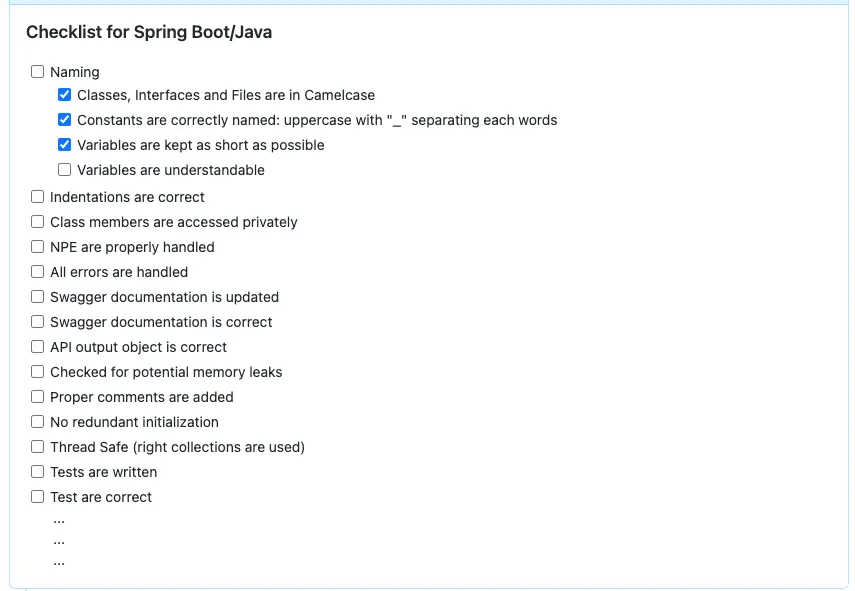

In my early career, when I was asked for the first time by one of my seniors to review his code, I was honored but confused at the same time. What could a junior developer have anything to say about his senior’s years of experience writing code? What I did not understand at that time was that there is no best code. The best code is no code [1](https://blog.codinghorror.com/the-best-code-is-no-code-at-all).

All new lines of code added to your project should be built, tested, reviewed, debugged and later, if necessary load tested. Moreover, being the most experienced developer of a team should not mean that you are given carte blanche to add whatever solution you bring without having it approved.

Writing code can simply be put as proposing an optimal solution that is tightly driven by the level of understanding of the problem to be solved and the skills of the person solving it. Given that we are only humans, there is always room for mistakes, misjudgments and even simply ignorance. Hence, the importance of conducting an effective code review.

In this article, we will first lay out some best practices for a code review. Then briefly discus the specific case of a candidate code challenge review.

## Take your time but don't waste it

You should not review code swiftly, just as you should not review code for too long. Sometimes we are so overwhelmed by the pace reviews are requested that we are tempted to just do basic checks. Code review time should be included in the task estimation time. Don't fall into the **“this will be manually tested anyway”** trap.

Long review time can be avoided with a good task breakdown. Enforce division of the work into smaller tasks with specific logic to deal with. Those are easier to review than a full feature at once.

## Use a checklist

Having a review checklist will ensure your code consistency. Code will be evaluated with the same criteria, and you will make sure nothing is left out. The list should be kept up to date as your team experience grows.

## Use automated code review tools

There are plenty of efficient and customizable code review and analyzer tools that your team can use to help assist the code review process [2](https://www.softwaretestinghelp.com/tools/top-40-static-code-analysis-tools).

## Build it locally and test it when necessary

Sometimes, just looking at the code might not be enough to spot crucial errors. For example when reviewing a batch process, running the code build locally can be more telling than just doing visual inspections. Any findings at this point could however mean poor test code quality.

## How to conduct a code review?

Each team has its own way of organizing a code review. Most of us, I presume, are mainly just writing comments on GitHub or sending feedback messages over Slack.

But when time permits, do pair programming or schedule a review meeting with the developer. These methods are more effective, more interactive than just leaving comments, and are a good mentoring means.

Don’t give orders, give suggestions and always give the reason why you think it is a better way. This will help the developer understand better.

Don’t just focus on finding mistakes, positive comments are always welcome. When you come across that clever and magical piece of code that impresses you, give a thumbs up or write a compliment. It makes a developer feel appreciated and can lead to a better working relationship.

## What to look for when reviewing?

- Are the requirements fulfilled?
- Is the code following good design principles?
- How complex is the code? Is it readable?
- What about performance and scalability issues? Always remember that data is the most important part of your system, and you should always think about how things would perform at a large scale.
- What about security issues? Look for potential security threats such as SQL injection, XSS, personal data handling, etc.
- Is the code well commented?
- What about maintainability? Is the code DRY?
- Is the code style following your predefined guidelines?
- What about reusability, naming conventions, etc.?

## Code challenge review

Most of the statements above also apply when reviewing a candidate code challenge. Even though the problem to solve is usually simple, there are interesting points that can help you decide whether to move the candidate to the next hiring step.

Review criteria include, but are not limited to,

- the ability to understand the given requirements,
- the problem-solving approach,
- the core architecture and design of the proposed solution,
- the initial setup complexity: it should not be OS dependent and should run out of the box,
- the choice of technology stack used,
- the quality of code proposed, ...

One thing to always keep in mind when doing a candidate code review is that these code challenges are not a contest. A candidate should not be penalized for proposing a solution that is less impressive than another candidate code that you have reviewed before.

## Conclusion

A good code review will save you time and money by spotting potential problems before moving to production. Beyond that it can help you build a good team collaboration by sharing techniques and tips. Especially in these pandemic days, when most developers spend their time isolated, let's avoid just leaving comments on GitHub and take the time to meet for code review.

## References

[1] [The Best Code is No Code At All](https://blog.codinghorror.com/the-best-code-is-no-code-at-all)

[2] [TOP 40 Static Code Analysis Tools](https://www.softwaretestinghelp.com/tools/top-40-static-code-analysis-tools)

[3] [How to do a code review](https://google.github.io/eng-practices/review/reviewer)
