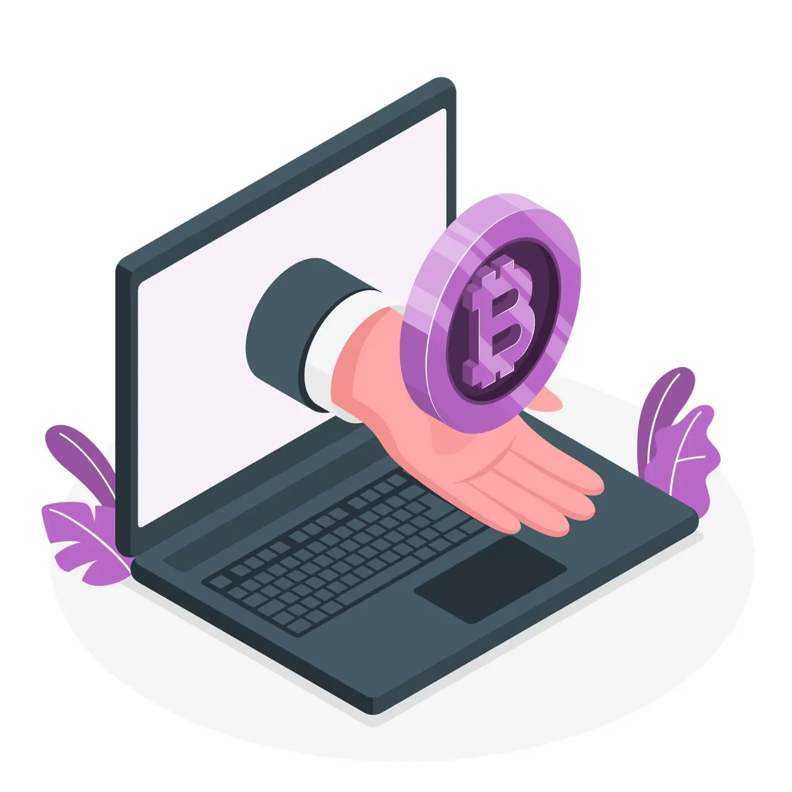

Hi, this is Bitcoin and from now on it will live with us!\
Traditional money has long been outdated and is gradually losing its popularity.
In most cases, we already use electronic money.
But e-money is not much different from cash, except in form, but the essence remains the same.
According to the plan of evolution, everything weak in this world dies and gives way to something stronger.\
So ***cryptocurrency*** came to us.

### Let’s figure out what a cryptocurrency is and what is it eaten with?
The main difference between a cryptocurrency and a regular one is that it is ***decentralized*** and exists exclusively in digital form.
In most cases, no one controls it, and the participants in the system are equal members. Such a system allows achieving a high level of trust.
And even if you block some participants, this will not prevent the rest from making transactions with other participants.

Emission occurs due to the work of millions of computers around the world according to the following principles:
* ***Proof of work*** is when a computer solves complex cryptographic problems in order to gain the right to confirm a transaction on the network, for which it will subsequently receive a reward
* ***Proof of Stake*** is when the most loyal member of the system gets the right to make a decision. The one who stacks (invests) more coins in the system.
* Other consensus mechanisms

***Bitcoin*** is the first and most popular ***decentralized*** cryptocurrency system using ***blockchain*** technology.
In traditional currencies, there is a ***centralized*** guarantor of the honesty of transactions - ***Uncle Sam*** (usually the state or the Central Bank).
This is the one who decides whether to confirm your transaction or not.
But in cryptocurrencies like bitcoin, such a guarantor is not needed, since it has technology such as consensus mechanisms.
It allows you to check the integrity of the transaction, as well as confirm transactions.

The most important thing for us is that cryptocurrency cannot be banned or destroyed without depriving us of the Internet.
Therefore, cryptocurrencies still exist and develop, despite attempts to regulate them. Let’s look at the statistics.

### Bitcoin versus the Internet:

As you can see from the graph, the popularity of bitcoin is growing twice as fast as the popularity of the internet.
This suggests that the probability of the complete destruction of the cryptocurrency is negligible and that it is time to get to know it better.

However, cryptocurrencies are just one of the blockchain-based creations. Using blockchain technology, you can create many different products that will have all the same features as cryptocurrencies and even more!

Have you heard about ***decentralized application***?
***dApp*** is a new generation of applications that run on the blockchain network and have all its advantages.
For example, the ***Ethereum*** blockchain has no downtime!
Can you imagine the backend which will never return you 500 Internal Server Error? So Etherium can do it!
A ***dApp*** can only stop working if the blockchain itself stops working.
It is common knowledge that large networks like ***Ethereum*** are difficult to attack.

Simply put, a dapp is, for example, when an application uses blockchain networks as a backend. This means that in order to attack your app, a hacker will have to attack the entire network. And this is for a minute more than 8,000 deployed nodes. This is the same as eight thousand duplicating each other servers.

After all, the technology that carries the fashionable word today - ***cryptocurrency***, is truly magnificent and has tremendous potential.

In this series of articles I will tell you about:
* How does cryptocurrency work and what kind of beast is this blockchain?
* What is a crypto wallet and what types are there?
* How to keep track of your own and other people’s transactions.
* What is farming and stacking?
* Blockchain as a backend for mobile applications.
* And much much more…

## Resources
- [Criptasutra](https://borisov.school/criptasutra)\
- [Ethereum](https://ethereum.org/en)\
- [Ethereum Mainnet Statistics](https://ethernodes.org)

### Art
- Article Photo by [Jonathan Borba](https://unsplash.com/es/@jonathanborba?utm_source=unsplash&utm_medium=referral&utm_content=creditCopyText) on [Unsplash](https://unsplash.com/?utm_source=unsplash&utm_medium=referral&utm_content=creditCopyText)\
- Photo by [Technology illustrations](https://storyset.com/technology) by [Storyset](https://storyset.com)\
- Photo by [Web illustrations](https://storyset.com/web) by [Storyset](https://storyset.com)
