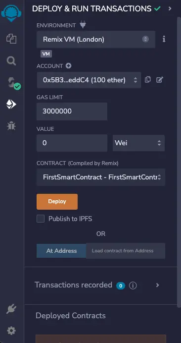
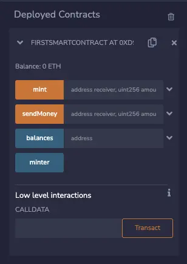
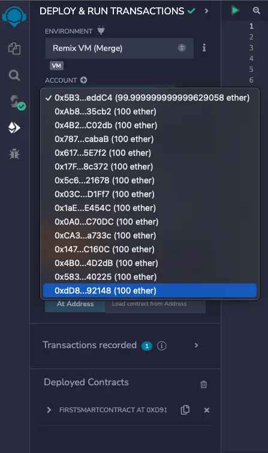

Smart contracts are an exciting way to build decentralized applications (DApps) on a blockchain. This tutorial will guide you in building your first smart contract on the Ethereum blockchain using Solidity.

## What is a Smart Contract?

According to Wikipedia, a [Smart Contract](https://en.wikipedia.org/wiki/Smart_contract) is a computer program or a transaction protocol stored on the Blockchain network.

You can say it's like an agreement between two people in the form of computer code. Transactions within a smart contract are processed by the blockchain and stored as a character chain hex address with the prefix "0x". This means they can be sent automatically, eliminating the need for a third party.

_Example_: **0xe827a5db9559dce2091c535e3f9ba9409defcfef18936da72c79dac190bfbab9**

**Note**: When your Smart Contract is deployed, everything stored on blockchain can not be change.

## What is Solidity?

Solidity is an object-oriented programming language created specifically by the Ethereum Network team for constructing and designing smart contracts on Blockchain platforms.

- Solidity was proposed in August 2014 by Gavin Wood.
- Solidity is a high-level language for smart contract applications.
- It is an object-oriented language designed specifically for the Ethereum Virtual Machine.
- Solidity is most profoundly influenced by C++, but also borrowed concepts from languages like Python, JavaScript.
- The open source project can be found on [Github](https://github.com/ethereum/solidity)
- All documentation can be accessed [here](https://docs.soliditylang.org/en/v0.8.19/)

## Problem to solve

Firstly, we will **create an amount token**. To do so, please follow the steps below:

- Create the Minter (originator)
- Create the Supply
- Create the Balance (account balance)

Next, we will **create a sent money** function. This involves several key points:

- Identify the Receiver's address (it's a character chain hex address)
- Check if your amount is less than or equal to the balance. If it's not, throw an error message stating, **"Not enough money to make the transaction"**
- If the transaction to send money is successful, we will update the total amount for the sender. This means: the sender's balance will decrease by the amount sent (**balance sender -= amount**). In parallel with this, we will also update the receiver's amount: the receiver's balance will increase by the amount received (**balance receiver += amount**).

## Build your first Smart Contract

1. Open Remix IDE from [here](https://remix.ethereum.org/)
2. Click Accept and get ready
3. Under **default_workspace**, click on _create new file_
4. Set the name to be **FirstSmartContract.sol**

Great, now we're ready to start coding.

**Contract code**

1. In the first line of the Smart Contract, we have to specify the _solidity version_.

```js
    pragma solidity ^0.8.18;
```

2. We then create a contract with the name **FirstSmartContract**.

```cpp
    contract FirstSmartContract {
        ...
    }
```

3. In the **FirstSmartContract {..}** contract, we will input some code, please see below.
4. We will create variables where the smart contract will store the minter [address](https://docs.soliditylang.org/en/v0.8.19/types.html#address) (a 42 character hex string with a "0x" prefix) of the both the Landlord & the Tenant.

```ts
    address public minter;
```

5. Create the **balances** value of type [mapping](https://docs.soliditylang.org/en/v0.8.19/types.html#mapping-types).

```ts
    mapping (address => uint) public balances;
```

This line indicates that for each [address](https://docs.soliditylang.org/en/v0.8.19/types.html#address) input, we will get a value of type **uint**. In this case, the **uint** represents the amount associated with each **address**. Since the balance for each address can never be negative, the value type is **uint** (range from 0 to 4294967295).

6. Create an [event](https://docs.soliditylang.org/en/v0.8.19/structure-of-a-contract.html#events) named _sendSuccess_.

This event requires three input values: the address of the minter, the address of the wallet you want to send to, and finally, the amount you want to send.

```cpp
    event sendSuccess(address from, address to, uint amount);
```

7. In the **constructor**, we will set minter address.

```ts
    constructor() {
        minter = msg.sender;
    }
```

In Solidity, if you want to get the address of the minter (sender) you can use `msg.sender;`.

8. Next, we create the **sendMoney** function. We need to pass two values as input: the **receiver's address** and the **amount sent**.

```ts
    function sendMoney(address receiver, uint amount) public {
        ....
    }
```

Firstly, we need to check whether the amount you want to send is less than your total balance. If this condition is not met, the program should throw the message **Not enough money to make the transaction** and stop.

This check can be implemented with the following line:

```ts
require(amount <
  balances[msg.sender], "Not enough money to make the transaction");
```

If the condition is met, the program will continue to the next lines. The next steps are:

- Update the receiver's total balance:

```ts
balances[receiver] += amount;
```

- Subtract the sent amount from your balance:

```ts
balances[msg.sender] -= amount;
```

**Remember**: For each of your transactions, you will be charged a gas fee, which is regulated by Ethereum.

Almost there.
To register the transaction on the blockchain, we will emit an event:

```ts
    emit sendSuccess(msg.sender, receiver, amount);
```

In summary, the **sendMoney** function will look like this:

```ts
    function sendMoney(address receiver, uint amount) public {
        require (amount < balances[msg.sender], "Not enough money to make the transaction");
        balances[receiver] += amount;
        balances[msg.sender] -= amount;
        emit sendSuccess(msg.sender, receiver, amount);
    }
```

9. Finally, we will create the **mint** function, which is used to generate balance for a given address.

```ts
    function mint(address receiver, uint amount) public {
        balances[receiver] += amount;
    }
```

10. Now, it's time for a demonstration:

## Compile

Click on the `Solidity Compile` option in the left sidebar.

1. Select the compiler version `0.8.18+`
2. Then, click on `Compile FirstSmartContract.sol`


## Deploy

Click on the `Deploy & Run Transactions` option in the left sidebar.

1. Choose `Environment > JavaScript VM (London)`
2. Click on `Deploy`



🎉 Congratulations, your smart contract has been deployed. 🎉


## Create Sample Transaction

Under `Deployed Contracts` click on `FIRSTSMARTCONTRACT AT... (MEMORY) ` to expand the section and fill in the details.



We have 4 buttons here:

- The first is **mint**. This button initializes the balance of the input address.
- The second is **sendMoney**. When you input a value in the box next to it and click the `sendMoney` button, a transaction will be executed.
- Next, we have the **balances** variable you already created in the code. Just input the wallet address (e.g., 0x...), and the available balance will be displayed.
- Finally, there's the **minter** variable. The address of the minter will be printed when you click this button.

Remember, your first Ether Address is the landlord of the room. (The one with 99.99 test ether in the wallet.)


Copy your current account address and input it into the **mint** field, followed by the amount. It should look like this:
Press the **mint** button:


To check your balances, paste the account address into the **balances** field and press the `balances` button. You should now see that the balance is **1000**.


Change the **Account Address** from the dropdown menu. (Choose any address except the one with 99.99 ether).

In this example, I will choose the last address.



Copy the address you just selected and paste it into the **sendMoney** field, followed by the amount you want to send. It should look similar to the following:


After that, change the selected account address to your 1st Ether Address and press the **sendMoney** button.

🎉 Well done. Congratulations, the money has been sent. 🎉


Figure: Check balances of account address receiver

## Gas fee

If you pay close attention, you will notice that you lose a few wei each time you make a transaction. This is called a gas fee.

- 1 ether = 1,000,000,000,000,000,000 wei

The Ethereum gas fee exists to compensate network validators for their work in securing the blockchain and network.

Without these fees, there would be little incentive to stake ETH and become a validator. The network would be at risk without the presence of validators and the essential work they do.

## Conclusion

You successfully understand now what Solidity is and how smart contracts work. Furthermore, you've successfully built and deployed a smart contract.

## Resources
- [Wikipedia Smart Contract](https://en.wikipedia.org/wiki/Smart_contract)
- [Github Repository solidity](https://github.com/ethereum/solidity)
- [Solidity official document](https://docs.soliditylang.org/en/v0.8.19/)

_Article Photo by [bitpanda](https://www.bitpanda.com/academy/en/lessons/what-is-ethereum/)_
