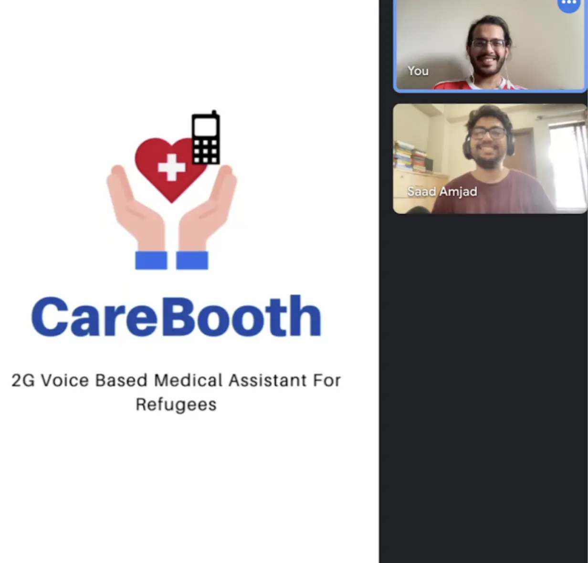
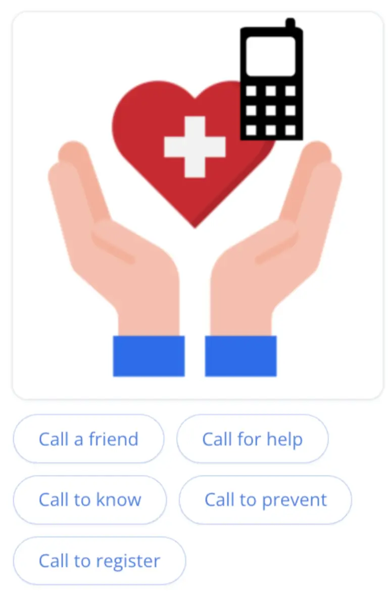

Back in 2019, there was a presentation made at [Google India](https://youtu.be/CFIxLnqEifs?t=3443), where it was showcased how Indians can use a phone number, toll-free, and talk to Google Assistant in their language. The idea was just mind-blowing and too good to be true, as features like this would ensure folks who have only 2G phones around the world, not part of the internet, can suddenly have empowerment to take any internet services while talking to the Google Assistant using a simple phone call. When MonstarHacks 2022 edition was announced, Team Bowlers comprised of Saad Bin Amjad and Ahmed Naseef Chowdhury, we knew exactly what we would be doing!

The goal for this [MonstarHacks](https://www.linkedin.com/showcase/monstarhacks) edition was to come up with an awesome product prototype over two days that can positively impact the lives of people, especially in the field of Life Science and healthcare. We registered and decided we will try to solve 2 challenges. Primarily to connect refugees with medical support in times of crisis (with a focus on low energy consuming solutions) and secondarily to assure equitable health care for everybody.

Our team strongly believes healthcare is a right for everyone, it should be especially protected for the most vulnerable groups in our societies. Unlike other commercial domains, like arts and business, we see a lack of innovation in medicare, as often systems are black-boxed for both caregivers and takers. So we wanted to have a solution where what works in other domains can be contextualized in the healthcare domain and used for similar meaningful impact. Through technology, we can impact people’s lives faster and efficiently, and medicare needs innovative ideas to do just that, to protect the most vulnerable folks, like senior citizens, expecting mothers, children, etc.

## Problem Statement

In Bangladesh, there is an ongoing Rohingya Refugee Crisis. There are now 860,000 Rohingya living in refugee camps in Cox’s Bazar, Bangladesh, over half of whom are children. The refugees still have inadequate water, sanitation, healthcare, education, nutrition, protection, and communication tools.

The recent Ukraine refugee crisis also put spotlight on the turmoils that can be faced even in developed countries. For the survival of refugees, the foremost need is to have a functioning medical health care system.

Our team believes in Tech For Good and wants to do our part to help ease the crisis, and make it a bit better than what it is right now.  

Apart from political will, the major risks/obstacles to connecting refugees with medical support are the overburdened medical workforce and lack of funded facilities, visible/invisible barriers for refugees to seek out help from proper authorities without fearing deportation.

## Case Study: CareBooth

2G Voice-Based Medical Assistant For Refugees

{{ youtube-link="ihrWeQ0V7g8" }}

CareBooth, is a 2G Voice-Based Medical Assistant For Refugees. To get various assistance like asking for emergency medical help, registering for vaccination, learning about prevention of diseases and updates of local news, etc, one does not need any internet connection! They just need a 2G Phone that can make a call. A phone call giving a gateway to internet services to refugees of different age groups!

This solution enables refugees of different age groups to have greater ease of access to health info and systems from a technical, UX perspective, as everything is abstracted behind simple voice commands in their local languages.

The use of Intent - Entity Matching, Knowledge Bank, Natural Language Processing, and Machine Learning on the assistant (Bot Cognition) ensures efficient automation of logical processes in refugee medicare flow, meaning most of the tasks would now not require a human workforce, thus reducing constraints on the medical/community workforce. The care flows now will have Machine Learning and AI inclusion, which will be trained and verified by credible authorities, ensuring efficacy and scalability of the solution. For example, when it comes to pre-medical screening for a vaccination drive, instead of health workers going door to door, a simple phone call would help the refugees to fill up the form and also get registered.

Phone calls are an example of low consuming energy from the user’s end and automation, and the use of internet services generates equitable healthcare as it removes any sort of censorship or bias from the manual workflow.

Ease of access, since voice commands are quite UX friendly than multiple forms, flows on webpages. Also, the consumption of information becomes authentic (since peer-reviewed FAQs) as well as it is done in local languages (the ones that are available in NLP units).

In the future, for CareBooth to be really practically viable for refugees, we would need corporations that host AI / Bot Cognition to come up with reduced prices for NLP or sponsor it on the humanitarian ground for refugees, and phone companies to give the phone numbers toll-free for the refugees access, just as we have seen how it was rolled out in India with the help of a phone company.

Medical Agent intent and entity modeling is quite tough, as there are no easy, available resources up for developer consumption, so we would also require different stakeholders to make it on the design board while designing the conversations effectively.

## Technologies used
(including 3rd party frameworks and services):

- [Google Cloud Console](https://cloud.google.com/gcp/)
- [Actions On Google](https://developers.google.com/assistant)
- [Firebase](https://firebase.google.com/)
- [Firestore](https://firebase.google.com/products/firestore?)
- [DialogFlow](https://cloud.google.com/dialogflow/docs)
- [DialogFlow Phone Gateway](https://cloud.google.com/dialogflow/es/docs/integrations/phone-gateway)
- Node.js Express Server
- HTML
- [Whimsical](https://whimsical.com/) for diagrams

Conversational Design and Basic Architecture can be found [here](https://whimsical.com/carebooth-FAQxXgCP5hqtpXbofnC2tK).

Voice applications are the next generation of applications, as billions of people who are still disconnected from the internet can avail internet services in 2G ways. Given the huge success of chatbots in CRM, it was a matter of time before voice would be adopted in the 4th Industrial Revolution. We were proud to spend our weekend creating something that can help ease the current refugee issue by empowering the refugees to avail of internet services via their 2G phones and not be dependent on internet connectivity or data packs.

_Article Photo by [Nastya Dulhiier](https://unsplash.com/photos/Ihi56-Qs39U)_
