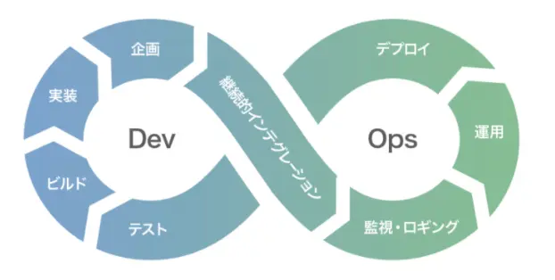
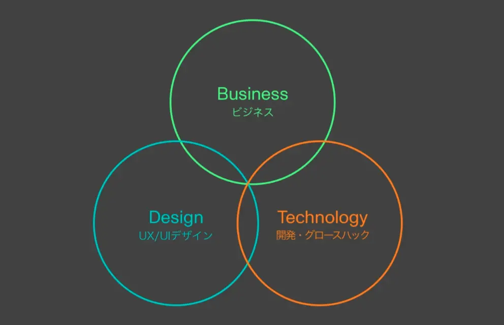

Hi there. I'm An, a Front-end Tech Lead at Monstarlab, Inc. (“Monstarlab”.)

If you are intimidated by coding tests, this article will wash your test anxieties away.
You will be able to optimally allocate time on the evaluation sections and be evaluated on your best performance!

**_The coding test described in this article is used at Monstarlab Tokyo Head office when recruiting engineers. Actual tests may differ, or not be conducted at all, depending on job type or hiring location._**

## What’s the purpose of a coding test?

The purpose is to check what isn’t covered in the oral interview. Since source code speaks of an engineer’s unique style and experiences, it can show the candidate’s level of achievement.

A Tech Lead at Monstarlab is required to have both engineering and managerial skills. While complex and deeply nested codes are excellent, evaluation criteria include codes to be understandable from a general perspective and have usability in future operations. It’s also used as a measure to assess whether the candidate is an optimum fit for Monstarlab’s team environment which is based on teamwork.

There are 11 evaluation criteria and based on the average points earned, the evaluator makes the final decision. Although average points are important, the key is whether you are a team player and someone the company wants as part of the team.

_The following is based on the March 2022 evaluation criteria. Please note that criteria may be partially changed depending on the assignment or modified in the future._

### General sections

This is an overall check in a general sense. Some sections are fixed depending on the area and may not be included in the score.

#### General Info

This general section covers platform, framework and language which may be common in the environment for some assignments. It may be excluded from scoring unless there is a specific and applicable element to the given assignment.

Take Frontend as an example. The general environment for Web application is common and therefore excluded from the score.

#### Architecture

This section looks into the choice of architectural pattern. Basically, focus is placed on the intent behind the selection of architecture out of the various patterns.

Technically speaking, evaluating an architecture is not easy and it is not expected in the assignment. This is to check if one of the commonly used modern day architecture is being used.

### In-depth sections

Your coding skills are checked in these sections.

#### Setup/Build

**Are there any issues with the setup and building of the project?**

This section covers the setup and building of a project. Initial behavior is checked based on README and others, and points are earned if everything is executed without issues. Once you proceed with development, there may be cases of local dependencies, but the idea is to see if you have handled these correctly.

If possible, check the setup and build it in a different environment than the one you used to develop and make sure that there are no issues. If there are specific tools or libraries required for the project to build, be sure to demonstrate that. You do not need to explain language installation but include anything that is particular, and not general.

#### Dependency/Library

**How are the project dependencies?**

This section covers libraries. This section checks whether you set up a dependency with a library that is suitable for the project, especially if the library is managed and updated. Using an outdated library which is impracticable in actual operation will cause point reduction.

What this means from a `javascript` Front End perspective, this section checks to see if you properly separated `dependencies` and `devDependencies` and if the library version is up to date. Determining an old library is difficult, but the basic evaluation criteria are LTS (Long Term Support) or npm versions. The differences between libraries are taken into consideration.

#### Tests

**Are test cases set up? Did all the test cases pass?**

This is a section on unit testing. There is no need to create test cases for all the code. The evaluation is on whether test cases are created for the most critical logic.

#### Readability

**Is your code readable?**

This section deals with readability.

#### Code Style

**Is the code style optimal for the platform?**

Although code style differs by platform, this section checks whether it was created appropriately from an up-to-date and general standpoint. Based on consistent usage of unified space, tab, indent, and vertical sort, this section checks consistency in programming grammar (eslint, tslint, beautify, and others are acceptable for this part) and mixed use of old and new grammar.

#### Code Comments

**Did you write comments?**

Similar to the test section, you will not be evaluated on whether you have comments for all logics or not but if you provided appropriate code comments for the critical business logics that must be commented on.

#### Code Structure

**How is the structure of the source code organized?**

This section checks if the tree structure is appropriately organized with intention. Any tree structure is acceptable, but evaluation is based on a form that is easy to understand for the platform and framework being used and designed with future expandability.

An example of an extreme case that would cause point reduction is managing all files in a single folder.

### Others

This section includes maintenance and additional elements based on the evaluator’s experience.

#### Maintainability

**How is maintainability based on the code you created?**

The code structure, code style, and the ease in which features are added, changed, or deleted based on readability are evaluated.

#### Other considerations

This section includes items that are not part of the 10 sections mentioned above, or those that can be considered to be additional points when all sections are linked together, even if they are covered in another section. This also includes sections that are not mandatory in a coding test but included as additional features in the test assignment.

It’s hard to give an example because there are numerous areas, but it includes whether user satisfaction is met when the actual service is released, and the presence of a DevOps element that eliminates repetitive work.

## Conclusion

I’ve explained the scoring criteria for Monstarlab’s coding test.

The minimal criteria checks if an acceptable level of business performance is demonstrated, and individually established know-how based on current trends are utilized appropriately based on a general standard.

In other words, Monstarlab is not looking for 100% correct answers in a coding test but rather uses the test as a way to measure the finished quality as a product and the level of your skills.

This has become too lengthy to be considered as a cheat sheet, but as a last note, I’d like to share my personal advice. Instead of focusing on writing codes to receive good evaluation, assume that you are creating a product that will be released and envision yourself as a user who would want to continue using it.

Since all evaluators are engineers who are working on-site, your dedication will be fully communicated through your code. I believe the love and passion instilled in the product are the biggest evaluation criteria.

I hope this helps and look forward to working with you at Monstarlab.

## Reference

- [モンスターラボ採用ページ(Japanese)](https://www.join.monstar-lab.com/)

_Article Photo by [Clay Banks](https://unsplash.com/photos/8q6e5hu3Ilc)_
