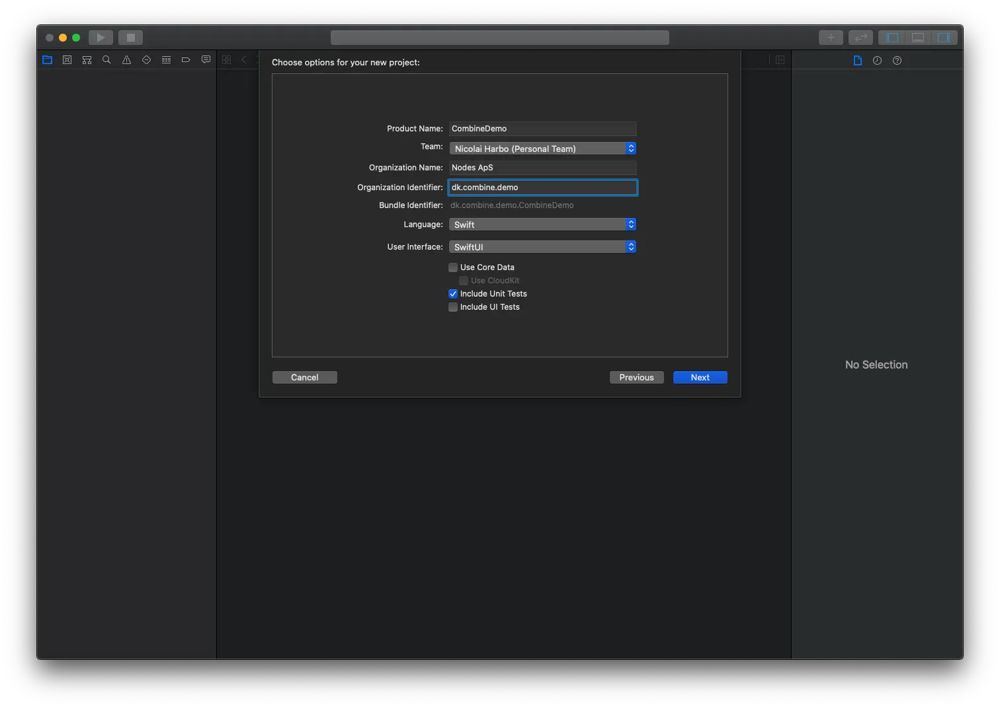

In this blogpost we will examine what Combine is and how it can be used. Combine is a huge topic, and obviously, we will not cover everything here.
So, continue reading to learn how we can use Combine to make network requests in a very general and efficient way, and finally display the fetched data in a `List`, using `SwiftUI`.

## What is Combine?

At WWDC 2019 Apple introduced the new framework Combine, which is their take on reactive programming for Swift.
The term "reactive programming" probably deserves its own blogpost, but for now, let's keep it simple, and say that reactive programming is like an observer/observable pattern. You subscribe to, in this case, a publisher, and when the publisher gets the data you're waiting for, it informs a subscriber, which is then able to act on that newly fetched data.

As Combine was released in 2019, the minimum iOS version is 13, so for Combine to run with your app, you must specify a minimum target of iOS 13+.

## When to use Combine, and how does it work?

Reactive programming is mainly used to handle asynchronous datastreams inside your app, such as API calls (which is what this blogpost will cover). It can also be used if your UI has to wait for some action to happen, before being updated.

The way it works is described as a dataflow pipeline. There are three elements involved in this pipeline: publishers, operators and subscribers. Before diving into the actual elements, here is a simple overview of how they work:

> The `subscriber` asks the `publisher` for some data, which sends it through an `operator` before it ends up at the subscriber who requested it.

### Publishers

Simply, the publisher provides the data and an error if necessary. The data will be delivered as an object defined by us, and we can also handle custom errors.
There are 2 types of publishers:

- `Just`: initialised from a value that only provides a single result (no error)
- `Future`: initialised with a closure that eventually resolves to a single output value or a failure completion

**Subjects** are a special kind of publisher, that is used to send specific values to one or multiple subscribers at the same time. There are two types of built-in subjects with Combine; `CurrentValueSubject` & `PassthroughSubject`. They act similarly, the difference being currentValueSubject remembers and requires an initial state, where passthroughSubject does not.

### Subscribers

The subscriber asks the publisher for data. It's able to cancel the request if needed, which terminates a subscription and shuts down all the stream processing prior to any Completion sent by the publisher.
There are two types of subscribers build into Combine; `Assign` and `Sink`.
`.assign` assigns values to objects, like assigning a string to a labels text property directly.
`.sink` defines a closure, that accepts the value from the publisher when it's read.
In this blogpost's example, we will only use `.sink`.

### Operators

An operator is a middle ground between the `publisher` and the `subscriber`, and because of this, it acts as both. When a publisher talks to the operator, it's acting as a subscriber, and when the subscriber talks to the operator, it's acting as a publisher.
The operators are used to change the data inside the pipeline. That could be if we want to filter out nil-values, change a timestamp etc. before returning. `Operator` is actually just a convenience name for higher order functions that you probably already know, such as `.map` , `.filter`, `.reduce` etc.

## Let's dig into some code 🧑‍💻

Alright, now that we have the basic knowledge (kinda) sorted, let's dive a bit into the code that makes Combine useful as a reactive programming-framework.

In this example, we will use `The Movie Database API`, which takes that we have an `api_key`. So first of all, you need to go to their documentation and generate a token, which you will need to get actual data from their API: [The Movie Database API documentation](https://developers.themoviedb.org/3/authentication/how-do-i-generate-a-session-id)

Then create a new Xcode project, and make sure to pick `SwiftUI` as our `User Interface`.



_💡 If you're following the example, please be aware that you might be met with compiler errors, before completing all steps_

Alright, so this leaves us with an all fresh project, with the SwiftUI basic setup.
For good sakes measure, you might want to change the filename to `MoviesView`.
Afterwards, change the boilerplate code to look like this:

```swift
import SwiftUI

struct MoviesView: View {

    // 1
    @ObservedObject var viewModel = MovieViewModel()

    var body: some View {
        List(viewModel.movies) { movie in // 2
            HStack {
                VStack(alignment: .leading) {
                    Text(movie.title) // 3a
                        .font(.headline)
                    Text(movie.originalTitle) // 3b
                        .font(.subheadline)
                }
            }
        }
    }
}

struct ContentView_Previews: PreviewProvider {

    static var previews: some View {
        MoviesView()
    }
}
```

Explanation:

1. We add the `@ObservedObject` property wrapper, to let our app know, what we need to observe for any changes in the viewModel property.
2. We give our List the array of movies that we are going to fetch together with Combine. This will later be the part that automatically updates the list, when the data is added to the movies-array.
3. a+b: We add the movie's title and its original title to a Text-object.

_💡 If you changed the name of the ContentView, you have to go to your `SceneDelegate`-file and change the name there as well_

Not much code needed to set up our super-simple listview - if we were to do this with UIKit and a UITableView, we would have had a lot more code. So let's take a second to appreciate SwiftUI 👏.

**Create the models for the data we are about to fetch: `MovieResponse` and `Movie`**

Add the following to the two newly created files:

```swift
import Foundation

struct MovieResponse: Codable {
    let movies: [Movie]

    enum CodingKeys: String, CodingKey {
        case movies = "results"
    }
}
```

and for the Movie-model:

```swift
import Foundation

struct Movie: Codable, Identifiable {
    var id = UUID()
    let movieId: Int
    let originalTitle: String
    let title: String

    enum CodingKeys: String, CodingKey {
        case movieId = "id"
        case originalTitle = "original_title"
        case title
    }
}
```

Now that we got our models in place, let's get to the fun part.

## 🕺 ..Finally! It's time to fetch some data!

We are going to build a very general `APIClient`, which we will call from our `MovieViewModel` that we instantiated in the very top of our `MoviesView` that we just did.

**Create a new file named `MovieViewModel`**, and add the following to it:

```swift
import Foundation
import Combine

class MovieViewModel: ObservableObject {

    @Published var movies: [Movie] = [] // 1
    var cancellationToken: AnyCancellable? // 2

    init() {
        getMovies() // 3
    }

}

extension MovieViewModel {

    // Subscriber implementation
    func getMovies() {
        cancellationToken = MovieDB.request(.trendingMoviesWeekly) // 4
            .mapError({ (error) -> Error in // 5
                print(error)
                return error
            })
            .sink(receiveCompletion: { _ in }, // 6
                  receiveValue: {
                    self.movies = $0.movies // 7
            })
    }

}
```

Explanation:

1. The `@Published` property wrapper lets Swift know to keep an eye on any changes of this variable. If anything changes, the body in all views where this variable is used, will update.
2. Subscriber implementations can use this type to provide a “cancellation token” that makes it possible for a caller to cancel a publisher. Be aware that your network calls won't work if you're not assigning your call to a variable of this type.
3. We are fetching the data as soon as the ViewModel is created, since there's no lifecycle in SwiftUI like we're used to from UIKit.
4. Here we start the actual request for "trending movies weekly"
5. Here we can handle the errors, if any
6. Here the actual subscriber is created. As mentioned earlier, the sink-subscriber comes with a closure, that lets us handle the received value when it's ready from the publisher.
7. We assign the received data to the movies-property - this will trigger the action mentioned in step 1

Alright, so far so good - we still need to make the actual API call. For this, we need a general `APIClient`.
So, **create a new file named `APIClient`** and add the following code:

```swift
import Foundation
import Combine

struct APIClient {

    struct Response<T> { // 1
        let value: T
        let response: URLResponse
    }

    func run<T: Decodable>(_ request: URLRequest) -> AnyPublisher<Response<T>, Error> { // 2
        return URLSession.shared
            .dataTaskPublisher(for: request) // 3
            .tryMap { result -> Response<T> in
                let value = try JSONDecoder().decode(T.self, from: result.data) // 4
                return Response(value: value, response: result.response) // 5
            }
            .receive(on: DispatchQueue.main) // 6
            .eraseToAnyPublisher() // 7
    }
}
```

Explanation:

1. This is our generic response object. The value property will be the actual object, and the response property will be the URL response including status code etc.
2. This is our only entry point for network requests, no matter if it's `GET`, `POST` or whatever - it's all specified in the request parameter.
3. Here we are "turning the `URLSession` into a publisher"
4. Decode the result to the generic type we defined in the `APIClient` (in this case `MovieResponse`)
5. Our "homemade" Response object now contains the actual data + the URL response from which we can find status code etc.
6. Return the result on the main thread
7. We end with erasing the publisher's type, since it can be very long and "complicated", and then transform and return it as the return type we want `(AnyPublisher<Response<T>, Error>)`

Now we have the `APIClient` set up, and as you can see, it just takes an `URLRequest` as parameter, so let's make something that can build URLRequests for us, that matches our API.

**Create a new file and name it `MovieDBAPI`**

Add the following code to the newly created file:

```swift
import Foundation
import Combine

// 1
enum MovieDB {
    static let apiClient = APIClient()
    static let baseUrl = URL(string: "https://api.themoviedb.org/3/")!
}

// 2
enum APIPath: String {
    case trendingMoviesWeekly = "trending/movie/week"
}

extension MovieDB {

    static func request(_ path: APIPath) -> AnyPublisher<MovieResponse, Error> {
        // 3
        guard var components = URLComponents(url: baseUrl.appendingPathComponent(path.rawValue), resolvingAgainstBaseURL: true)
            else { fatalError("Couldn't create URLComponents") }
        components.queryItems = [URLQueryItem(name: "api_key", value: "your_api_key_here")] // 4

        let request = URLRequest(url: components.url!)

        return apiClient.run(request) // 5
            .map(\.value) // 6
            .eraseToAnyPublisher() // 7
    }
}
```

Explanation:

1. Set up the basics needed for making the request
2. Set up the paths we want to be able to call from the API.
3. Here we create the URL request. The request is a `GET`-request by default, hence we don't need to specify that.
4. Add the api_key you created at `The Movie Database` here!
5. We run the newly created request through our API client
6. Map is our operator, that lets us set the type of output we want. `\.value` in this case, is our generic type defined as return value of this method (`MoviesData`), since the client returns a Response-object, which contains both a value and a response property, but for now, we're only interested in the value.
7. This call cleans up the return type from something like `Publishers.MapKeyPath<AnyPublisher<APIClient.Response<MoviesData>, Error>, T>` to the expected type: `AnyPublisher<MoviesData, Error>`

## 🎉 That's it!

Run the project, and you should be presented with a list of weekly trending movies.
Combine publishes the list as soon as it's ready, all reactive and smoothly.

The way we built the `APIClient`, allows us to easily add more paths to the `APIPath` enum in a nice and clean way.
For simplicity, we only made a very basic and simple `GET` request, but we could make the `func request(_ path: APIPath)` function build any other kinds of requests for us as well, e.g a `POST`-request. The `APIClient` just takes a `URLRequest` of any kind, and that's what we feed it.

I hope you made it work and can see the advantages of using Combine for networking. It's super powerful as soon as you get the grasp of it!

_Article Photo by [Unsplash](https://unsplash.com)_
