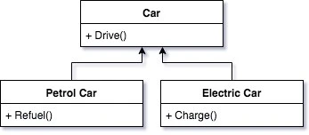
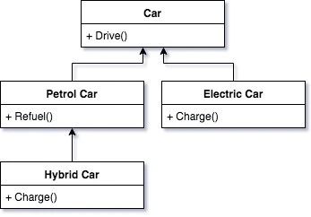

You are tasked with building an application that deals with cars. You are off designing the classes for cars unaware of the looming dangers of inheritance.

Every car has a drive functionality, the driver floors the accelerator and the car moves.

So, you design a base class called Car which has a function drive().

You implement the Drive() method in this base class so that all the sub-car classes inheriting from this base Car class get it as it is common functionality. You feel very good about yourself for writing reusable code.

The client wants a car that can drive with petrol and another on electricity.

You create two classes for these:

The petrol driven car needs to be refueled and the electric car needs to be charged, hence the two methods in each class.

Your application works as expected and the client is happy which in turn makes you and your boss happy.

A couple of months go by and the client comes back to you with guess what? A new requirement. They need a hybrid car.

The hybrid needs to run on both petrol and electricity. Suddenly, you have a problem. You find three ways to fit this into your existing model.

Either inherit from the Petrol Car class and duplicate the code for Charge().

Or, you can inherit from the Electric Car class and duplicate the code for Refuel().

The third option you see, and by far the most popular choice, is to inherit from the Car class and duplicate the code for both Refuel() and Charge().

This decision makes the most sense among all three in my opinion. The Hybrid car is not exclusively an electric car that it should be derived from the Electric Car class; the same applies for the Petrol Driven Car class. However, there is still a lot of code duplication going on. Changes in refueling logic needs to be implemented in multiple places now, this will prove to be troublesome during maintenance. You accept the risks thinking there won’t be much changes in the future. Right when you were feeling good about your work, the client approaches you and tells you they need a Toy Car now. The Toy Car is special. It will not have the Drive functionality. And just like that, the model you had created, collapses. The Drive() method will now have to be duplicated across all the car classes except Toy Car class. You can see how we are now heading down a slippery slope right?

What we are seeing is a pattern of IS-A relations; and electric car IS A car. This is the root of the problem here. We should get rid of so many IS-A relations and compose a car object with HAS-A relations. HAS-A relations can be interpreted as a car HAS A drive behaviour. We can create separate interfaces for each behaviour:

We can now compose the Car Class with these behaviours:

What this means is that a car object is composed of the above functionality. They are not concrete implementation, rather, they are abstractions to allow any behaviour to be plugged in depending on the need. There can be any number of concrete implementations of the behaviours:

Every Refuel Behaviour class must have a Refuel method. The NoRefuelBehaviour class is also a Refuel Behaviour in the sense that it states the absence of this behaviour in the object.

We take a concrete implementation of the interfaces we have in the Car class and inject them to compose cars with mixed functionalities.

The composition can look like this:

Petrol Car = SimpleDriveBehaviour + RefuelPetrolBehaviour + NoChargeBehaviour

Electric Car = SimpleDriveBehaviour + NoRefuelBehaviour + FastChargeBehaviour

Hybrid Car = SimpleDriveBehaviour + RefuelDieselBehaviour + SimpleChargeBehaviour

Toy Car = NoDriveBehaviour + NoRefuelBehaviour + NoChargeBehaviour

As you can see, this way the software becomes much more robust; the model supports pluggable interface implementations and has no code duplication. Now when the client comes up with a new car type, you can just compose it to match the requirement; no inheritance hierarchies to manage.

## Conclusion

We have looked at a very simple example in this article. Even in this simple model, the inheritance tree broke and we looked into how to fix it using composition.

You might be thinking, but Tanveer, isn’t inheritance one of the pillars of object oriented programming, are you telling us not to use it?

All I’m saying, like many other developers, is to favor composition over inheritance. Currently I’m working with Golang most of the time, and it does not support inheritance. It forces developers to use composition instead. This leads to a much better software design. I believe it wouldn’t be going too far to suggest that we don’t even need inheritance.

_Article Photo by [Kelly Sikkema](https://unsplash.com/photos/JRVxgAkzIsM)_
