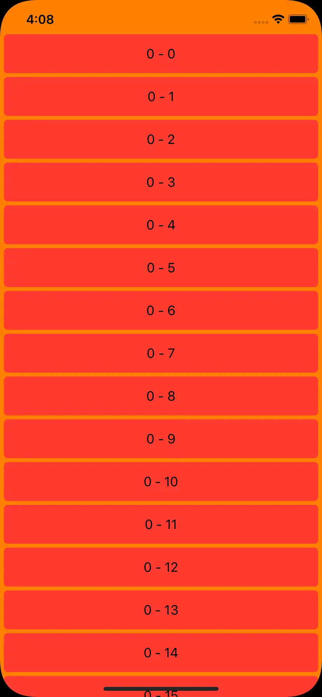
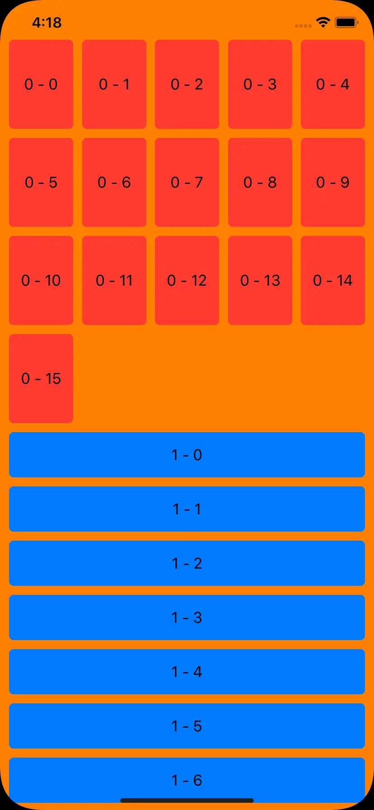

Even though this year at WWDC Apple introduced the new SwiftUI framework, which will redefine the way we create our app UI's from iOS 13, there were as well presented some advances in `UIKit`, precisely, in the way we can build an `UICollectionView` through the newly added Compositional Layout. With this new type of layout, we can now easily create a custom `UICollectionView` that supports different layouts for each section and eliminates the need for subclassing `UICollectionViewLayout` for achieving similar behaviour.

This series will focus on the way we can take advantage of the Compositional Layout when implementing an `UICollectionView`.

#### Notes:

- Even though we will focus on implementing a Compositional Layout in an iOS application, you can use most of this code to achieve similar results as well on macOS or tvOS.

#### Prerequisites:

You will need to use Xcode 11 for this tutorial and our starter project. As well download our [start project](https://github.com/nodes-ios/Compositional-Layout) to follow along.

## Create a Simple Compositional Layout

We will start this tutorial with the creation of a simple Compositional Layout, a list, that we will subsequently modify into a more advance layout.

So let's get started!

In our `UIViewController` add the following code in the `makeLayout` function:

```swift
// 1
let itemSize = NSCollectionLayoutSize(widthDimension: .fractionalWidth(1),
                                      heightDimension: .absolute(50))

// 2
let item = NSCollectionLayoutItem(layoutSize: itemSize)

// 3
let group = NSCollectionLayoutGroup.horizontal(layoutSize: itemSize,
                                               subitems: [item])

// 4
let section = NSCollectionLayoutSection(group: group)
section.interGroupSpacing = 5
section.contentInsets = NSDirectionalEdgeInsets(top: 0,
                                                        leading: 5,
                                                        bottom: 5,
                                                        trailing: 5)

let layout = UICollectionViewCompositionalLayout(section: section)
return layout
```

1 - To create a Compositional Layout we will first need to declare an instance of `NSCollectionLayoutSize`. This will represent in our case the size of the `UICollectionViewCell`.

We can initialise this by specifying the width/height via an `NSCollectionLayoutDimension` instance in several ways:

- absolute: by providing an absolute value we set the width/height of the cell to a fixed value
- estimated: by providing an estimated value we set the width/height of the cell to an estimative value, which will depend on the content's instrict size
- fractionalWidth: by providing a fractionalWidth we set the width/height of the cell to a value proportional with the parent's width
- fractionalHeight: by providing a fractionalHeight we set the width/height of the cell to a value proportional with the parent's height

2 - After creating a size, we need to create an `NSCollectionLayoutItem` to which we will assign it. The item together with its size represent the way our cell will be displayed in the layout.

3 - Now that we have our items aspect defined, we will need to group them. To do this we need to create an instance of `NSCollectionLayoutGroup`. Here we can define several types of groups:

- horizontal: will have a horizontal layout
- vertical: will have a vertical layout
- custom: allows you to create a group based on your needs

When creating a group we will need to pass the size as well in the initialiser, together with the items for the group. For the moment we will assign the group the same size as provided for the item object.

4 - With all the components created, we can wrap the `NSCollectionLayoutGroup` in a section object (`NSCollectionLayoutSection`) which we will use to create our `UICollectionViewCompositionalLayout` instance.

Note: If you want to create a Compositional Layout on macOS, you will need to create an instance of `NSCollectionViewCompositionalLayout`.

Run your code and you should see the following layout:



## Create a Simple Compositional Layout with Different Section Layouts

Now that we know how the Compositional Layout structure and the meaning of the newly introduced classes, we can put all of them together and create a custom layout with different types of layout for each section.

For this example we will build a dynamic layout with a list type section and a grid type section.

We will start by declaring `enum SectionLayoutKind: Int`, in our `UIViewController`, which will be in charge of specifying the layout type and as well the number of columns for each layout type.

```swift
enum SectionLayoutKind: Int {
    case grid
    case list

    func columnCount(for width: CGFloat) -> Int {
    	// have column count defined by screen size to make use of whole screen spacing
        let wideScreen = width >= 1000

        switch self {
        case .grid:
            return wideScreen ? 10 : 5

        case .list:
            return wideScreen ? 2 : 1
        }
    }
}
```

Go ahead and replace the contents of `makeLayout` with the following code block:

```swift
// 1
let layout = UICollectionViewCompositionalLayout { (sectionIndex: Int, layoutEnv: NSCollectionLayoutEnvironment) -> NSCollectionLayoutSection? in
		// 2
        guard let sectionLayoutKind = SectionLayoutKind(rawValue: sectionIndex) else { return nil }

        let itemSize: NSCollectionLayoutSize
        let groupSize: NSCollectionLayoutSize

        switch sectionLayoutKind {
        case .grid:
            itemSize = NSCollectionLayoutSize(widthDimension: .fractionalWidth(0.25),
                                              heightDimension: .fractionalHeight(1))

            groupSize = NSCollectionLayoutSize(widthDimension: .fractionalWidth(1),
                                               heightDimension: .fractionalWidth(0.25))
        case .list:
            itemSize = NSCollectionLayoutSize(widthDimension: .fractionalWidth(1),
                                              heightDimension: .absolute(50))

            groupSize = itemSize

        default:
            return nil
        }

        let item = NSCollectionLayoutItem(layoutSize: itemSize)

		// 3
        let group = NSCollectionLayoutGroup.horizontal(layoutSize: groupSize,
                                                       subitem: item,
                                                       count: sectionLayoutKind.columnCount(for: layoutEnv.container.effectiveContentSize.width))
        group.interItemSpacing = .fixed(10)

        let section = NSCollectionLayoutSection(group: group)
        section.interGroupSpacing = 5
        section.contentInsets = NSDirectionalEdgeInsets(top: 0,
                                                        leading: 5,
                                                        bottom: 5,
                                                        trailing: 5)

        return section
    }

return layout
```

1 - To create a Compositional Layout with multiple types of layout, we need to switch the order presented in the above section and start by initialising the layout first.

2 - In the provided initialisation code block, based on the `sectionIndex`, we initialise an instance of `SectionLayoutKind`. This will help determine the `itemSize` and `groupSize` for the expected type of layout.

3 - Since we want to be able to provide spacing and insets for our layout, but we don't want to handle all the math ourselves, we can call the `NSCollectionLayoutGroup` initialiser which takes `count` as a parameter. In our case, this will represent the column count which is set in the `SectionLayoutKind` `func columnCount(for width: CGFloat) -> Int`. This will automatically calculate and adjust the size of the item and the group to fit our need by overriding the appropriate dimensions values provided in the `NSCollectionLayoutSize` initialiser.

Run your code and you should see the following layout:



## Final notes

Compositional Layouts redefined the way we can build custom `UICollectionView`'s by allowing us to implement complex designs with ease.

To learn more about Compositional Layout's advanced features, be sure to check out [Part 2]({{ baseurl }}2020-01-10-Compositional-Layout-Part2) and [Part 3]({{ baseurl }}2020-01-10-Compositional-Layout-Part3) of these tutorial series.

Hope to see you next time!

#### References:

- [WWDC 2019 - Advances in Collection View Layout](https://developer.apple.com/videos/play/wwdc2019/215/)
- [Compositional Layout Objects Docs](https://developer.apple.com/documentation/uikit/views_and_controls/collection_views/compositional_layout_objects)
- [Part 2]({{ baseurl }}2020-01-10-Compositional-Layout-Part2)
- [Part 3]({{ baseurl }}2020-01-10-Compositional-Layout-Part3)
