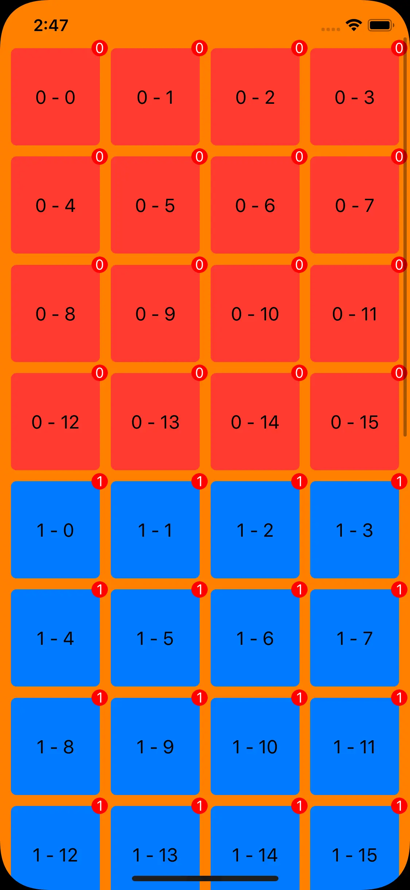
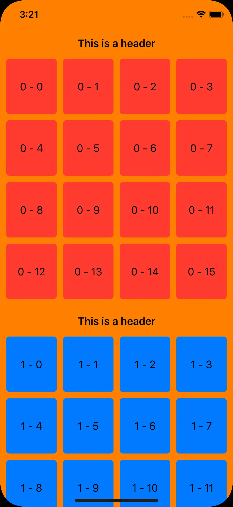

[The previous part of this series]({{ baseurl }}2020-01-10-Compositional-Layout-Part1) covered the ground base for implementing a Compositional Layout.

Now that we are comfortable with the base implementation, this part of the series will focus on the Supplementary Items and Decorations that we can use in a Compositional Layout and the way to implement them.

#### Prerequisites:

This post contains specifics to describe Compositional Layout implementation. Be sure to download our [starter project](https://github.com/nodes-ios/Compositional-Layout) to follow along.

## Suplementary Items

Supplementary Items implementation was redefined, now allowing us to anchor them to an item or a group, thus `NSCollectionLayoutSupplementaryItem`'s became more versatile and their implementation became simpler.
`NSCollectionLayoutSupplementaryItem`'s position is now defined relative to its host geometry by making use of `NSCollectionLayoutAnchor`'s.

### Creating a Badge

Since a `NSCollectionLayoutSupplementaryItem` became more versatile and we can achor it to an item, creation of badges for each item in the collection view becomes possible.

To showcase the implementation of badges, we will reuse the grid layout we have created in [part 1]({{ baseurl }}2020-01-10-Compositional-Layout-Part1) of this series, but first, we will need to create the badge item. To do so we are going to create a new function `func makeBadge() -> NSCollectionLayoutSupplementaryItem` that will create for us the supplementary item we will add to our item.

```swift
func makeBadge() -> NSCollectionLayoutSupplementaryItem {
        // 1
        let anchor = NSCollectionLayoutAnchor(edges: [.top,
                                                      .trailing],
                                              fractionalOffset: CGPoint(x: 0.5, y: -0.5))
        // 2
        let size = NSCollectionLayoutSize(widthDimension: .absolute(15),
                                          heightDimension: .absolute(15))
        // 3
        let badge = NSCollectionLayoutSupplementaryItem(layoutSize: size,
                                                        elementKind: "badge",
                                                        containerAnchor: anchor)
        return badge
    }
```

1 - Here we define an `NSCollectionLayoutAnchor` for our badge. By specifying `[.top, .trailing]` we position our badge in the top right corner of the parent, while the `fractionalOffset` positions our badge's center in the the corner. A `fractionalOffset` of `.zero` would possition the whole badge inside the parent.

2 - As encountered before, we need to create a size for our item, so here we specify that we our badge should have a fixed value for width and height.

3 - We initialise our `NSCollectionLayoutSupplementaryItem` by assigning it the size, the anchor and an `elementKind`, based upon which we will identify our badge in `collectionView:viewForSupplementaryElementOfKind:atIndexPath:`.

Now that we have our badge ready, we just need to assign it to our items. To do so just replace `NSCollectionLayoutItem` initialiser in our `func makeLayout` with the following:

```swift
// 1
let item = NSCollectionLayoutItem(layoutSize: itemSize, supplementaryItems: [makeBadge()])
```

1 - Here we create the item for our layout and assign it the `NSCollectionLayoutSupplementaryItem` badge.

Run your code and you should see the following result:



### Creating a Header

Previously, in our collection views, we could have encountered difficulties when trying to create and position header views. For example in a `UICollectionViewFlowLayout` the header would follow the same direction as the layout, making it impossible to use a supplementary view, if we would have liked our header to be above the content in a horizontal scrollable collection view. This is no longer the case because of the newly introduced `NSCollectionLayoutAnchor`, which allows us to possition our header anywhere in the parent.

For our header we will create an `NSCollectionLayoutBoundarySupplementaryItem`, that, similarly to a badge, we can anchor the way it better fits our needs.

So let's go ahead and create a function that will make our header.

```swift
func makeHeader() -> NSCollectionLayoutBoundarySupplementaryItem {
        // 1
        let size = NSCollectionLayoutSize(widthDimension: .fractionalWidth(1),
                                          heightDimension: .estimated(50))
        // 2
        let header = NSCollectionLayoutBoundarySupplementaryItem(layoutSize: size,
                                                                 elementKind: "header",
                                                                 alignment: .top)
        return header
	}
```

1 - Assign a size for our header. This will have the parent's width and an estimated height of 50, that will allow for font scaling if needed.

2 - We initialise our `NSCollectionLayoutBoundarySupplementaryItem` by assigning it the size, the anchor and an `elementKind`, based upon which we will identify our badge in `collectionView:viewForSupplementaryElementOfKind:atIndexPath:`.

Now that we have our header, in our `func makeLayout` we need to pin it to our section. To do so add the following after the section initialisation code.

```swift
// 1
section.boundarySupplementaryItems = [makeHeader()]
```

1 - We assign the header as one of our section's `boundarySupplementaryItems`.

Run your code and you should see the following result:



## Decoration Items

A new design feature we started seeing a lot in iOS 13 is the new "Card Design". When implementing this type of design it could come in handy if we can set a specific background to a section. This is now possible because of the introduction of `NSCollectionLayoutDecorationItem`.

Let's start by creating a function that will make our background decoration item.

```swift
func makeBackgroundDecorationItem() -> NSCollectionLayoutDecorationItem {
        let backgroundItem = NSCollectionLayoutDecorationItem.background(elementKind: "background")
        return backgroundItem
    }
```

Now to be able to assign our `NSCollectionLayoutDecorationItem` to our layout we will need to add the following code in our `func makeLayout()`.

```swift
...
	// 1
    section.decorationItems = [makeBackground()]
...
	// 2
    layout.register(BackgroundDecorationView.self,
                    forDecorationViewOfKind: "background")
...
```

1 - Assign our decoration item to the section.

2 - Register the `UICollectionReusableView` we will use for our background item with the layout. This will be dequed automatically.

Run your code and you should see the following result:


## Final notes

Compositional Layouts redefined the way we can build and design our layout by making it easier to implement suplemenraty items and introducing the concept of decoration items.

To learn more about Compositional Layout's advanced features be sure to check out [part 3]({{ baseurl }}2020-01-10-Compositional-Layout-Part3) of these tutorial series.

Hope to see you next time!

#### References:

- [WWDC 2019 - Advances in Collection View Layout](https://developer.apple.com/videos/play/wwdc2019/215/)
- [Compositional Layout Objects Docs](https://developer.apple.com/documentation/uikit/views_and_controls/collection_views/compositional_layout_objects)
- [Part 1]({{ baseurl }}2020-01-10-Compositional-Layout-Part1)
- [Part 3]({{ baseurl }}2020-01-10-Compositional-Layout-Part3)
