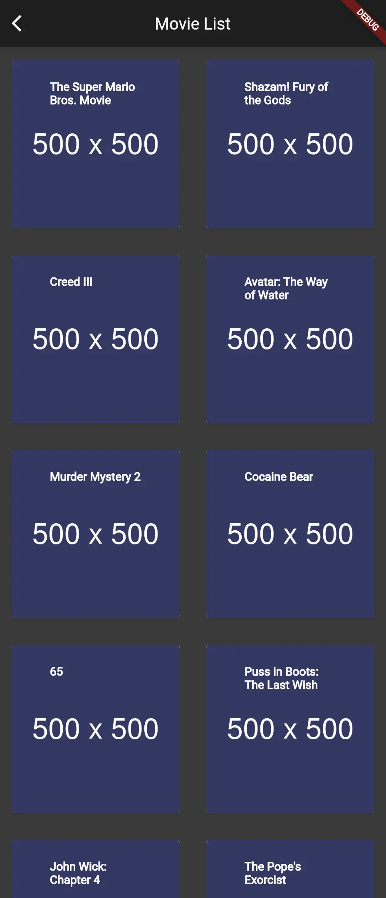
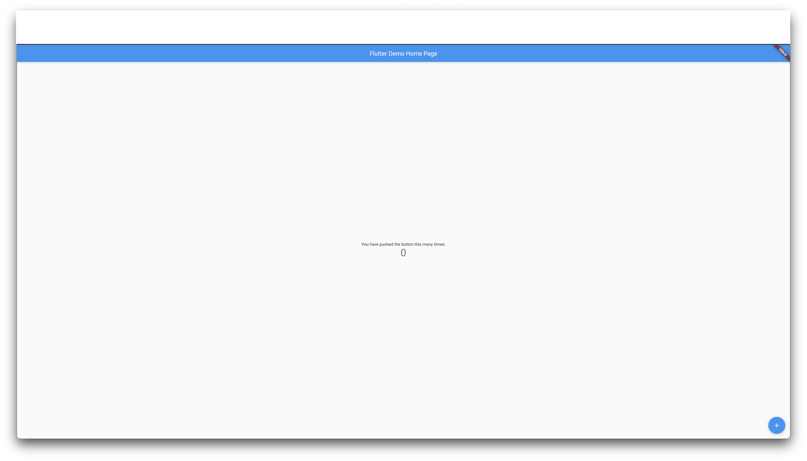

Recently, Monstarlab has been receiving an increasing number of app development projects using Flutter. In this article, we will have a look at how you can easily create a simple web app using Flutter on the web.

## How to create a simple sample app

For this project, I have developed an application that showcases movie details.
The main points of the development are as follows:

- Use [The Movie Database API](https://developers.themoviedb.org/) to fetch movie information via a Web API.
- Use [Get Widget](https://docs.getwidget.dev/) to customize the appearance.
- Use [Fluro](https://github.com/lukepighetti/fluro) to display parameterized URLs even with direct access.
  - By default, Flutter cannot interpret dynamic paths like `/movies/:movieId`.

※Due to copyright reasons, the movie image is replaced with a sample image.

| Movie list                                                                                                                     | Movie details                                                                                                                    |
| ------------------------------------------------------------------------------------------------------------------------------ | -------------------------------------------------------------------------------------------------------------------------------- |
|  |  |

## Steps to create the web app

### 1. Set up the development environment for Flutter

Install Flutter using Homebrew

```shell
brew install --cask flutter
```

Create a Flutter project in your working directory

```shell
flutter create my_app
cd my_app
```

Run the application

```shell
flutter run -d web-server
```

#### How the app looks like after initial set up



### 2. Install the `http` package

Install the `http` package to fetch data from the Internet.

```shell
flutter pub add http
```

### 3. Direct access to URLs with parameters

Now, let's implement a way to directly access URLs with parameters.

The following article might help you understand how to set up a router with Fluro: [Routing in Flutter using Fluro](https://medium.com/flutter-community/routing-in-flutter-using-fluro-bedb564cb737)

#### Install `Fluro`

```shell
flutter pub add fluro
```

Modify `main.dart` as following:

```dart
// lib/main.dart
import 'package:fluro/fluro.dart';
import 'package:flutter/material.dart';
import 'package:flutter_dotenv/flutter_dotenv.dart';
import 'package:flutter_web_plugins/flutter_web_plugins.dart';
import 'package:my_app/router/routes.dart';

class MyApp extends StatelessWidget {
  static FluroRouter? router;
  const MyApp({Key? key}) : super(key: key);

  @override
  Widget build(BuildContext context) {
    return MaterialApp(
        title: 'Movie',
        initialRoute: '/',
        onGenerateRoute: (setting) {
          return MyApp.router?.generator(setting);
        });
  }
}

Future main() async {
  await dotenv.load(fileName: '.env');
  setUrlStrategy(PathUrlStrategy());
  final router = FluroRouter();
  Routes.configureRoutes(router);
  MyApp.router = router;
  runApp(const MyApp());
}

```

Create `routes.dart` to create routes:

```dart
// lib/router/routes.dart
import 'package:fluro/fluro.dart';
import 'package:flutter/material.dart';
import 'package:my_app/pages/movie_detail.dart';
import 'package:my_app/pages/movie_list.dart';

Handler createBasicHandler(Widget targetWidget) {
  return Handler(
      handlerFunc: (BuildContext? context, Map<String, List<String>> params) {
    return targetWidget;
  });
}

Handler movieDetailPageHandler = Handler(
    handlerFunc: (BuildContext? context, Map<String, List<String>> params) {
  return MovieDetailPage(movieId: params['movieId']!.first);
});

class Routes {
  static void configureRoutes(FluroRouter router) {
    router.notFoundHandler = Handler(
        handlerFunc: (BuildContext? context, Map<String, List<String>> params) {
      print("ROUTE WAS NOT FOUND!!!");
      return null;
    });
    router
      ..define('/', handler: createBasicHandler(const MovieListPage()))
      ..define('/movies', handler: createBasicHandler(const MovieListPage()))
      ..define('/movies/:movieId', handler: movieDetailPageHandler);
  }
}

```

### 4. Network requests

In order to hide the API key value, I created an API key environment variable by using [flutter_dotenv](https://pub.dev/packages/flutter_dotenv).

```shell
flutter pub add flutter_dotenv
```

The following code is to fetch data from [The Movie Database API](https://developers.themoviedb.org/):

```dart
// lib/apis/movie.dart
import 'dart:convert';
import 'package:flutter_dotenv/flutter_dotenv.dart';

import 'package:http/http.dart' as http;

final API_KEY = dotenv.get('API_KEY');

Future<http.Response> fetchMovieList() async {
  return http.get(
      Uri.parse('https://api.themoviedb.org/3/movie/popular?api_key=$API_KEY'));
}

Future<http.Response> fetchMovieDetail(dynamic movieId) async {
  return http.get(Uri.parse(
      'https://api.themoviedb.org/3/movie/$movieId?api_key=$API_KEY'));
}
```

### 5. Convert the responses data type

If the return type of the data-fetching function is non-typed, it can be challenging to manage it.
Therefore, it is necessary to create a class that can convert the response data into a custom Dart object.

API schema is provided by [The Movie Database API](https://developers.themoviedb.org/).

- [Movie List API schema](https://developers.themoviedb.org/3/movies/get-popular-movies)
- [Movie Detail API schema](https://developers.themoviedb.org/3/movies/get-movie-details)

```dart
// lib/models/movie.dart
class Movie {
  final String? posterPath;
  final bool adult;
  final String overview;
  final String releaseDate;
  final List<int> genreIds;
  final int id;
  final String originalTitle;
  final String originalLanguage;
  final String title;
  final String? backdropPath;
  final num popularity;
  final int voteCount;
  final bool video;
  final num voteAverage;

  const Movie(
      {this.posterPath,
      required this.adult,
      required this.overview,
      required this.releaseDate,
      required this.genreIds,
      required this.id,
      required this.originalTitle,
      required this.originalLanguage,
      required this.title,
      this.backdropPath,
      required this.popularity,
      required this.voteCount,
      required this.video,
      required this.voteAverage});

  factory Movie.fromJson(Map<String, dynamic> json) {
    return Movie(
        posterPath: json['poster_path'],
        adult: json['adult'],
        overview: json['overview'],
        releaseDate: json['release_date'],
        genreIds: List<int>.from(json['genre_ids']),
        id: json['id'],
        originalTitle: json['original_title'],
        originalLanguage: json['original_language'],
        title: json['title'],
        backdropPath: json['backdrop_path'],
        popularity: json['popularity'],
        voteCount: json['vote_count'],
        video: json['video'],
        voteAverage: json['vote_average']);
  }
}

```

```dart
// lib/models/movie_list.dart
import 'movie.dart';

class MovieList {
  final int page;
  final List<Movie> results;
  final int totalResults;
  final int totalPages;

  const MovieList(
      {required this.page,
      required this.results,
      required this.totalResults,
      required this.totalPages});

  factory MovieList.fromJson(Map<String, dynamic> json) {
    return MovieList(
        page: json['page'],
        results: (json['results'] as List<dynamic>)
            .map((e) => Movie.fromJson(e))
            .toList(),
        totalResults: json['total_results'],
        totalPages: json['total_pages']);
  }
}

```

```dart
// lib/models/movie_detail.dart
class MovieDetail {
  final bool adult;
  final String? backdropPath;
  final Map<String, dynamic>? belongsToCollection;
  final int? budget;
  final List<dynamic> genres;
  final String? homePage;
  final int id;
  final String? imdbId;
  final String originalLanguage;
  final String originalTitle;
  final String? overview;
  final num popularity;
  final String? posterPath;
  final List<dynamic> productionCompanies;
  final List<dynamic> productionCountries;
  final DateTime releaseDate;
  final int? revenue;
  final int? runtime;
  final List<dynamic> spokenLanguages;
  final String status;
  final String? tagline;
  final String title;
  final bool video;
  final num voteAverage;
  final dynamic voteCount;

  const MovieDetail(
      {required this.adult,
      this.backdropPath,
      this.belongsToCollection,
      required this.budget,
      required this.genres,
      required this.homePage,
      required this.id,
      this.imdbId,
      required this.originalLanguage,
      required this.originalTitle,
      required this.overview,
      required this.popularity,
      required this.posterPath,
      required this.productionCompanies,
      required this.productionCountries,
      required this.releaseDate,
      required this.revenue,
      this.runtime,
      required this.spokenLanguages,
      required this.status,
      this.tagline,
      required this.title,
      required this.video,
      required this.voteAverage,
      required this.voteCount});

  factory MovieDetail.fromJson(Map<String, dynamic> json) {
    return MovieDetail(
        adult: json['adult'],
        backdropPath: json['backdrop_path'],
        belongsToCollection: json['belongs_to_collection'],
        budget: json['budget'],
        genres: List<dynamic>.from(json['genres']),
        homePage: json['home_page'],
        id: json['id'],
        imdbId: json['imdb_id'],
        originalLanguage: json['original_language'],
        originalTitle: json['original_title'],
        overview: json['overview'],
        popularity: json['popularity'],
        posterPath: json['poster_path'],
        productionCompanies: json['production_companies'],
        productionCountries: json['production_countries'],
        releaseDate: DateTime.parse(json['release_date']),
        revenue: json['revenuew'],
        runtime: json['runtime'],
        spokenLanguages: json['spoken_languages'],
        status: json['status'],
        tagline: json['tagline'],
        title: json['title'],
        video: json['video'],
        voteAverage: json['vote_average'],
        voteCount: json['vote_count']);
  }
}

```

### 6. Modify the return type of the fetch functions

How to modify the return type of the fetch functions has been covered in step 3.

```dart
import 'dart:convert';
import 'package:flutter_dotenv/flutter_dotenv.dart';

import 'package:http/http.dart' as http;
import 'package:my_app/models/movie_detail.dart';
import 'package:my_app/models/movie_list.dart';

final API_KEY = dotenv.get('API_KEY');

// Future<http.Response> fetchMovieList() async {
//   return http.get(
//       Uri.parse('https://api.themoviedb.org/3/movie/popular?api_key=$API_KEY'));
// }

// Future<http.Response> fetchMovieDetail(dynamic movieId) async {
//   return http.get(Uri.parse(
//       'https://api.themoviedb.org/3/movie/$movieId?api_key=$API_KEY'));
// }

// Modify code created in the step 4 to the code below.

Future<MovieList> fetchMovieList() async {
  final response = await http.get(
      Uri.parse('https://api.themoviedb.org/3/movie/popular?api_key=$API_KEY'));

  if (response.statusCode == 200) {
    return MovieList.fromJson(jsonDecode(response.body));
  } else {
    throw Exception('Failed to load movies');
  }
}

Future<MovieDetail> fetchMovieDetail(dynamic movieId) async {
  final response = await http.get(Uri.parse(
      'https://api.themoviedb.org/3/movie/$movieId?api_key=$API_KEY'));

  if (response.statusCode == 200) {
    return MovieDetail.fromJson(jsonDecode(response.body));
  } else {
    throw Exception('Failed to load the movie detail.');
  }
}

```

### 7. Create Pages

In this step we will create pages that display a list of movie information and their individual details.
We also install [Get Widget](https://docs.getwidget.dev/) in this step.

#### Install `Get Widget`

```shell
flutter pub get getwidget
```

#### Movie list Page

To keep the movie list data in a widget, create it as a Stateful Widget.
In order to transition to the movie detail screen when tapped, the transition process should be executed on the `onTap` event.

```dart
// lib/pages/movie_list.dart
import 'package:flutter/material.dart';
import 'package:getwidget/getwidget.dart';
import 'package:my_app/main.dart';
import 'package:my_app/apis/movie.dart';
import 'package:my_app/models/movie_list.dart';

class MovieListPage extends StatefulWidget {
  const MovieListPage({super.key});

  @override
  State<MovieListPage> createState() => _MovieListPageState();
}

class _MovieListPageState extends State<MovieListPage> {
  late Future<MovieList> futureMovies;

  @override
  void initState() {
    super.initState();
    futureMovies = fetchMovieList();
  }

  @override
  Widget build(BuildContext context) {
    return Scaffold(
        backgroundColor: Colors.grey[800],
        appBar: AppBar(
          title: const Text('Movie List'),
          backgroundColor: Colors.grey[900],
        ),
        body: Center(
            child: FutureBuilder<MovieList>(
          future: futureMovies,
          builder: (context, snapshot) {
            if (snapshot.hasData) {
              return GridView.count(
                  crossAxisCount: 2,
                  children: snapshot.data!.results
                      .map((e) => GestureDetector(
                          onTap: () => {
                                MyApp.router!
                                    .navigateTo((context), '/movies/${e.id}')
                              },
                          child: GFCard(
                            color: Colors.white,
                            boxFit: BoxFit.cover,
                            showOverlayImage: true,
                            imageOverlay: NetworkImage(
                                'https://image.tmdb.org/t/p/w500${e.posterPath}'),
                            title: GFListTile(
                              title: Text(
                                e.title,
                                style: const TextStyle(
                                  color: Colors.white,
                                  fontWeight: FontWeight.bold,
                                ),
                              ),
                            ),
                          )))
                      .toList());
            } else if (snapshot.hasError) {
              return Text('${snapshot.error}');
            }
            return const CircularProgressIndicator();
          },
        )));
  }
}

```

#### Movie detail page

```dart
// lib/pages/movie_detail.dart
import 'package:flutter/material.dart';
import 'package:getwidget/getwidget.dart';

import 'package:my_app/apis/movie.dart';
import 'package:my_app/models/movie_detail.dart';

class MovieDetailPage extends StatefulWidget {
  const MovieDetailPage({super.key, required this.movieId});

  final dynamic movieId;

  @override
  State<MovieDetailPage> createState() => _MovieDetailPageState();
}

class _MovieDetailPageState extends State<MovieDetailPage> {
  late Future<MovieDetail> futureMovieDetail;

  @override
  void initState() {
    super.initState();
    futureMovieDetail = fetchMovieDetail(widget.movieId);
  }

  @override
  Widget build(BuildContext context) {
    return Scaffold(
        backgroundColor: Colors.grey[800],
        appBar: AppBar(
          title: const Text('Movie Detail'),
          backgroundColor: Colors.grey[900],
        ),
        body: Center(
            child: FutureBuilder<MovieDetail>(
                future: futureMovieDetail,
                builder: ((context, snapshot) {
                  if (snapshot.hasData) {
                    return Column(
                      crossAxisAlignment: CrossAxisAlignment.start,
                      children: [
                        GFImageOverlay(
                          image: NetworkImage(
                            'https://image.tmdb.org/t/p/w500${snapshot.data!.posterPath!}',
                          ),
                          height: 200.0,
                          boxFit: BoxFit.cover,
                        ),
                        Padding(
                            padding:
                                const EdgeInsets.only(left: 16.0, right: 16.0),
                            child: Column(
                              crossAxisAlignment: CrossAxisAlignment.start,
                              children: [
                                Padding(
                                    padding: const EdgeInsets.only(top: 16.0),
                                    child: Text(snapshot.data!.title,
                                        style: const TextStyle(
                                            fontSize: 24.0,
                                            color: Colors.white))),
                                GFRating(
                                  onChanged: (value) {},
                                  value:
                                      snapshot.data!.voteAverage.toDouble() / 2,
                                  size: 16.0,
                                ),
                                Padding(
                                    padding: const EdgeInsets.only(top: 16.0),
                                    child: Text(snapshot.data!.overview!,
                                        style: const TextStyle(
                                            color: Colors.white))),
                                Padding(
                                    padding: const EdgeInsets.only(top: 16.0),
                                    child: Text(
                                      'Genres: ${snapshot.data!.genres.map((e) {
                                        return e['name']!;
                                      }).join(', ')}',
                                      style:
                                          const TextStyle(color: Colors.white),
                                    ))
                              ],
                            ))
                      ],
                    );
                  } else if (snapshot.hasError) {
                    return Text('${snapshot.error}');
                  }
                  return const CircularProgressIndicator();
                }))));
  }
}

```

This is the end of the guide for the sample application.

## About SEO

SEO performance is often required in web application development.
I investigated how SEO can be configured in Flutter.
I found the following information in the official documentation:

> In general, Flutter is geared towards dynamic application experiences. Flutter’s web support is no exception. Flutter web prioritizes performance, fidelity, and consistency. This means application output does not align with what search engines need to properly index. For web content that is static or document-like, we recommend using HTML—just like we do on flutter.dev, dart.dev, and pub.dev. You should also consider separating your primary application experience—created in Flutter—from your landing page, marketing content, and help content—created using search-engine optimized HTML.

When considering SEO in your Flutter application, it is recommended that you use HTML.
Depending on your SEO requirements, you may want to avoid using Flutter if you want to improve the SEO performance of your site itself.

## Wrap up

After creating an example app and researching Flutter on the Web, I felt that it is still less mature compared to the web-front competitors, such as React and Vue.
However, when the main development technology stack of an organization is Flutter/Dart, it is attractive to develop applications with it for better costs considerations.
I'll be keeping an eye on how Flutter continues to boost web development!

## Resources

- [Search Engine Optimization (SEO)](https://docs.flutter.dev/development/platform-integration/web/faq#search-engine-optimization-seo)
- [Fetch data from the internet](https://docs.flutter.dev/cookbook/networking/fetch-data)
- [flutter_dotenv](https://pub.dev/packages/flutter_dotenv)
- [The Movie Database API](https://developers.themoviedb.org/)
- [Get Widget](https://docs.getwidget.dev/)
- [Fluro](https://github.com/lukepighetti/fluro)
- [Routing in Flutter using Fluro](https://medium.com/flutter-community/routing-in-flutter-using-fluro-bedb564cb737)

Article Photo by [Flutter Web](https://flutter.dev/multi-platform/web)
