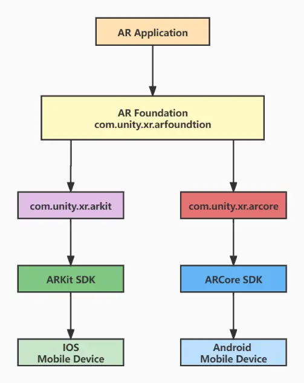
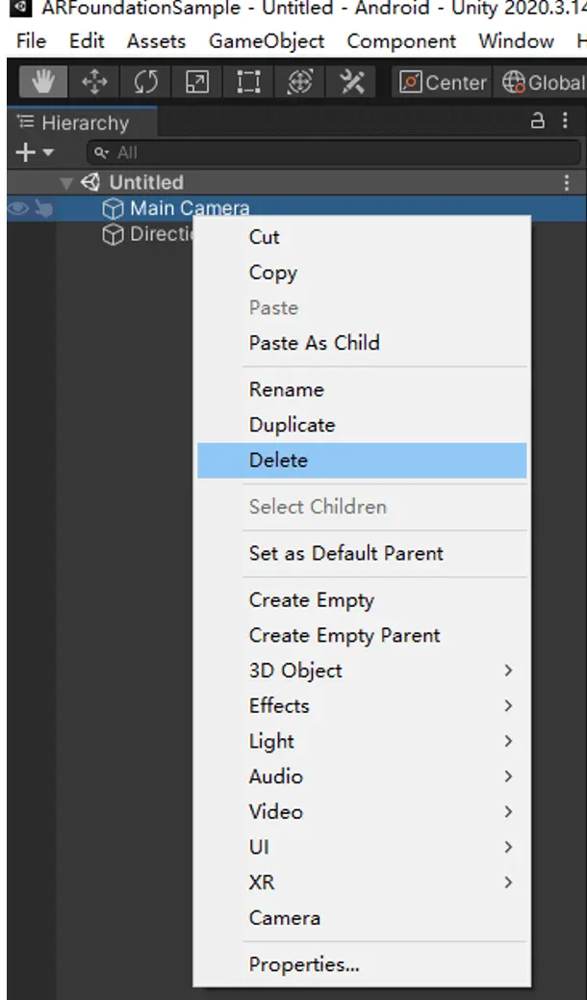

**I am glad to participate in the first edition of the [MonstarHacks](https://www.linkedin.com/showcase/monstarhacks) hackathon organized by Monstarlab. In this event, I made an Augmented Reality Panda Demo, and I will take this opportunity to introduce ARFoundation to you and take you through a small AR Demo.**

## About ARFoundation
In 2017, Apple and Google launched their respective AR development SDK toolkits, ARKit and ARCore, corresponding to AR development for iOS and Android platforms respectively. ARFoundation platform architecture is based on ARKit and ARCore, and its purpose is to use Unity's cross-platform capability to build ARFoundation. ARFoundation's goal is not limited to ARKit and ARCore, but to build a unified and open AR development platform.

**ARFoundation operating principle**


**Features supported by ARFoundation**


**In this tutorial, we will build a simple app to preview a 3D model in AR.**

## Preparation

1. Download [Unity 2020.3.14](https://unity.com/download)
2. An Android device that supports Google ARCore

## Getting Started

1. Open Unity Hub and create an empty Unity project
   

2. Select Window-> Package Manager in the toolbar
   

3. Select Unity Registry in Package Manager
   

4. Find the following Package and install it
   

5. In the right Hierarchy view, delete the original MainCamera, right-click on the blank space and add ARSession and ARSessionOrigin respectively.
   

6. Create a Cube, first set the scale of the cube to (0.2, 0.2, 0.2), then drag and drop the cube to the project view, set it to Prefab, and finally delete the Cube in Hierarchy
   
   Create another ARPlane and set it to Prefab, then delete the ARPlane from Hierarchy
   

7. Right-click the blank space of Project view to create a C# script named PlaceOnPlane. After successful creation, double-click the script to add the following code and save it.

```
using System.Collections.Generic;
using UnityEngine;
using UnityEngine.XR.ARFoundation;
using UnityEngine.XR.ARSubsystems;


[RequireComponent(typeof(ARRaycastManager))]
public class PlaceOnPlane : MonoBehaviour
{
   [SerializeField]
   [Tooltip("Instantiates this prefab on a plane at the touch location.")]
   GameObject m_PlacedPrefab;

   /// <summary>
   /// The prefab to instantiate on touch.
   /// </summary>
   public GameObject placedPrefab
   {
       get { return m_PlacedPrefab; }
       set { m_PlacedPrefab = value; }
   }

   /// <summary>
   /// The object instantiated as a result of a successful raycast intersection with a plane.
   /// </summary>
   public GameObject spawnedObject { get; private set; }

   void Awake()
   {
       m_RaycastManager = GetComponent<ARRaycastManager>();
   }

   bool TryGetTouchPosition(out Vector2 touchPosition)
   {
       if (Input.touchCount > 0)
       {
           touchPosition = Input.GetTouch(0).position;
           return true;
       }

       touchPosition = default;
       return false;
   }

   void Update()
   {
       if (!TryGetTouchPosition(out Vector2 touchPosition))
           return;

       if (m_RaycastManager.Raycast(touchPosition, s_Hits, TrackableType.PlaneWithinPolygon))
       {
           // Raycast hits are sorted by distance, so the first one
           // will be the closest hit.
           var hitPose = s_Hits[0].pose;

           if (spawnedObject == null)
           {
               spawnedObject = Instantiate(m_PlacedPrefab, hitPose.position, hitPose.rotation);
           }
           else
           {
               spawnedObject.transform.position = hitPose.position;
           }
       }
   }

   static List<ARRaycastHit> s_Hits = new List<ARRaycastHit>();

   ARRaycastManager m_RaycastManager;
}

```

8. Click ARSessionOrigin component in Hierarchy view, add ARPlaneManager, ARRaycastManager and the PlaceOnPlane script we created via Add Component button in Inspector view. And drag the cube prefab we created to the PlaceOnPlane script and then drag the ARPlane Prefab to the ARPlaneManager script, as shown in the figure.
   

## Now we finished editing, let's start building the APK next.

1. Open File-> Build Settings window, click Add Open Scenes button to add scene, Platform select Android, and finally click Switch Platform to switch platforms
   
   Click Player Settings and change the Company Name and Product Name.
   
   Modify Other setting options
   

2. After the modification, take out the prepared Android phone, open the USB debugging mode, connect to the computer, and click Build And Run in the Build Settings window to start building the APK.
   

3. When the build is completed, check the connected Android device, find the App which is installed automatically, click Run and you will be able to see the AR Demo we made.
   {{ youtube-link="k_8XoIhzs9U" }}
   **Now, our ARDemo can run successfully, we can identify the plane and place a cube on the
   plane and can move the position of the cube.**

## Summary

**AR Foundation has a lot of functions, and we just used the relatively basic functions this time, surely you can build very interesting apps if you would like.**

## References

1. [Unity’s Handheld AR Ecosystem](https://blogs.unity3d.com/2018/12/18/unitys-handheld-ar-ecosystem-ar-foundation-arcore-and-arkit/)
2. [ARFoundation](https://docs.unity3d.com/Packages/com.unity.xr.arfoundation@4.2/manual/index.html)

Article photo by [Unity](https://developer.unity.cn/projects/5c32ddfbedbc2a0020e732b9) & [ARFoundation](https://docs.unity3d.com/Packages/com.unity.xr.arfoundation@4.2/manual/index.html)
