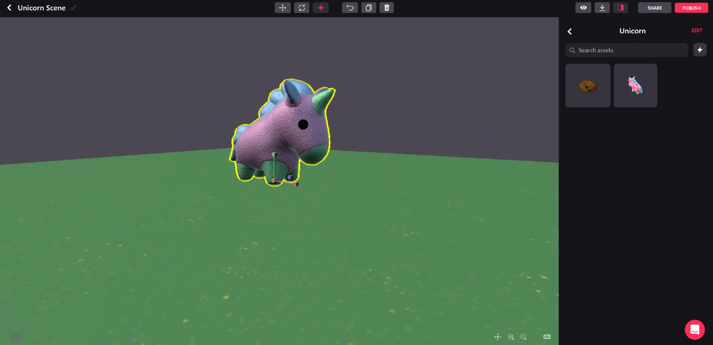
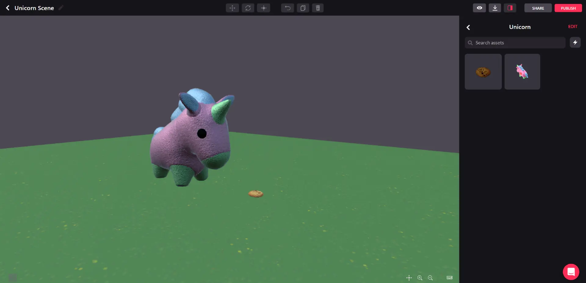
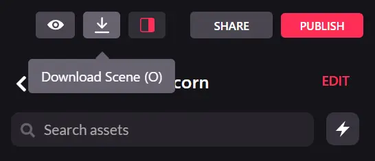
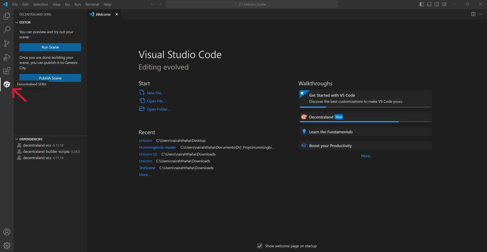
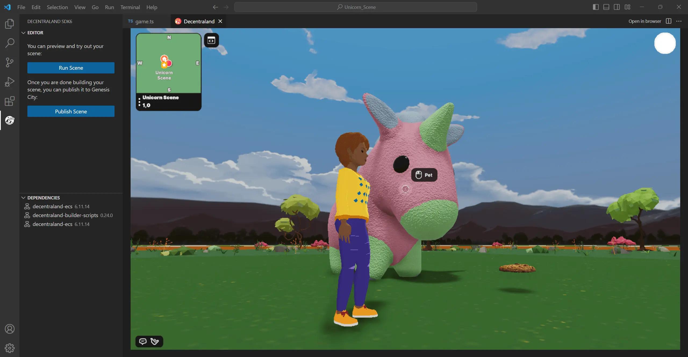
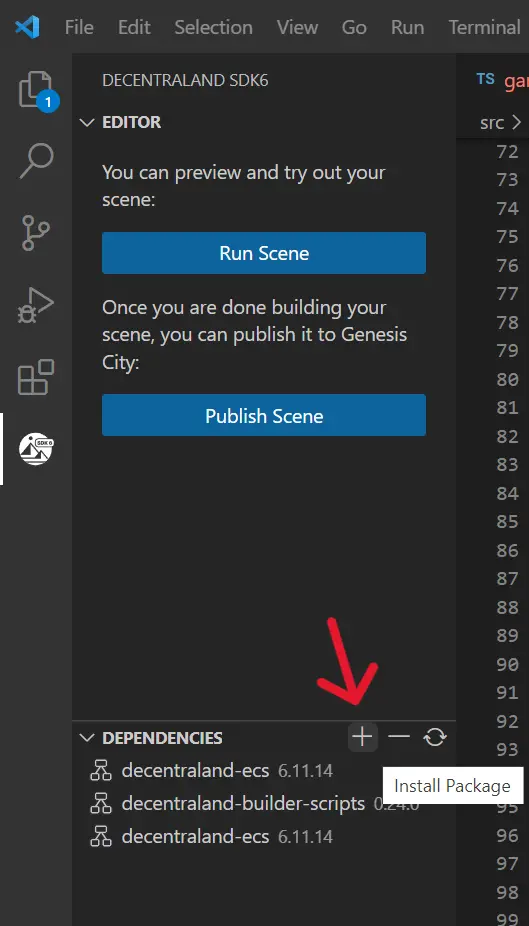

As the metaverse continues to gain popularity, Decentraland has emerged as a powerful platform and is an excellent tool to learn. This tutorial will guide you through the process of creating your first project on Decentraland.


Using Decentraland's Builder, it's simple for anyone to create scenes. However, if you’d like to add more complex interactions, you would need to use the Decentraland SDK. The Decentraland SDK is a powerful tool that lets you create scenes by writing in Typescript. First, we can start by positioning our 3D models in the builder, and then export it to the SDK to add further interactivity.

Let’s dive into creating a  scene in Decentraland with an easy interaction.


### Before we get started:
* Install [Visual Studio Code](https://code.visualstudio.com/)
* Install the Decentraland SDK 6 extension for Visual Studio Code
* Create an account for [Decentraland](https://decentraland.org/)
* Download [this unicorn 3D model ](https://sketchfab.com/3d-models/plush-unicorn-fd6f044ab8164a7e947f69fbe58435ee) (as a .glb file)
* Download [this cookie 3D model](https://sketchfab.com/3d-models/cookie-1bbcdb1d6dd34bfe8c9176ccfb7d5c3c) (as a .glb file)

## Step One - Using the Decentraland Builder
Go to the [Decentraland Builder](https://builder.decentraland.org), and click on **Build Scenes**. Give your scene a name and description and build it with 2 rows and 2 columns.
You should now see an empty scene with only grass. You can orbit and pan around the scene by holding and dragging the left or right mouse buttons respectively.

On the top right, you’ll see **Asset packs**, click the + sign near it to be able to upload your own models. Upload and import the plush unicorn model. Give your asset pack a name and create it. You should now be able to see the asset pack you created on the list on the right panel, select it and click **“edit”**. From here you can click on **“Add Assets”** and import more models to the same pack. Go ahead and upload the low poly cookie model too.


Back in the scene, click on the unicorn from the asset pack and it should show up in the scene on the grass. Select your unicorn in the scene and type in **“R”** on your keyboard. This will bring up the scaling tool. Click on the center of the gizmo and hold it. Dragging this to the right and left will scale the model up or down respectively. Scale the unicorn to your liking. Click **‘R’** again to remove the scaling gizmo. Drag the unicorn model to move it around the map or use **‘W’** to bring up the transform gizmo.




Once you’re happy with the position and scale of the unicorn, click on the cookie from the asset pack to import it into the scene. Scale it to your liking. The position of the cookie will not matter for now, as we will be spawning it into the scene with code later.




## Step Two - Exporting the scene to use the Decentraland SDK
Download your scene from the button on the top right corner.




Unzip the downloaded folder, and open it in Visual Studio Code. You should see your Decentraland SDK 6 extension on the left sidebar.




Click “Run Scene” to preview what you’ve built so far.


## Step Three - Adding interactions
Now, let’s add some functionality to the scene. Let’s start by giving the unicorn a “Pet” option. Open the game.ts file inside the src folder. This is where all the game logic for our scene sits, which has been automatically generated based on the models and its positions we previously gave the Decentraland builder.


Scroll down till you find the plushUnicorn variable.
```
    const plushUnicorn = new Entity('plushUnicorn')

    engine.addEntity(plushUnicorn)
    plushUnicorn.setParent(_scene)
    const transform6 = new Transform({
      position: new Vector3(17, 0, 15.5),
      rotation: new Quaternion(0, 0, 0, 1),
      scale: new Vector3(12.5, 12.5, 12.5)
    })

    plushUnicorn.addComponentOrReplace(transform6)

    const gltfShape2 = new GLTFShape("a0c1fd58-702d-4955-8d9f-82fea766c3b8/plush_unicorn.glb")
    gltfShape2.withCollisions = true
    gltfShape2.isPointerBlocker = true
    gltfShape2.visible = true

    plushUnicorn.addComponentOrReplace(gltfShape2)
```


A few things are happening here. A new variable is created called **plushUnicorn**. It’s then added to the Decentraland engine, so it can be displayed. Its position, rotation and scale are set in the **Transform** component. A **gltfShape** variable holding the path to the unicorn’s model is also created, and then added as a component to plushUnicorn.

Let’s add the following code right after:

```
    plushUnicorn.addComponent(
      new OnPointerDown(
        (e) => {

        },
        { button: ActionButton.POINTER, hoverText: 'Pet' }
        )
    )
```

We add a new component to the plushUnicorn called **OnPointerDown**. This creates a button called “Pet” which will appear when you hover over the unicorn. Save the file and go back to the Decentraland SDK 6 extension and run the scene to see it.




Clicking this does nothing currently, so let’s change that.

Back in the game.ts script, find all the code related to creating the **cookie** variable and encapsulate it into a new function called **newCookie()**.

```
    function newCookie() {

      const cookie = new Entity('cookie')
      engine.addEntity(cookie)
      cookie.setParent(_scene)
      const transform7 = new Transform({
        position: new Vector3(21, 0, 16),
        rotation: new Quaternion(0, 0, 0, 1),
        scale: new Vector3(6.488997459411621, 6.488997459411621, 6.488997459411621)
      })

      cookie.addComponentOrReplace(transform7)
      const gltfShape3 = new GLTFShape("9e14fd6f-7e06-4fe5-9114-5c898f99bbc5/cookie.glb")
      gltfShape3.withCollisions = true
      gltfShape3.isPointerBlocker = true
      gltfShape3.visible = true
      cookie.addComponentOrReplace(gltfShape3)
    }
```

If you run the scene again, you’ll notice that the cookie is gone. That’s because we’ve put the instantiation of the cookie in a function, but then never call it.

Let’s go back to the **OnPointerDown** component on the **plushUnicorn**, and let’s call the **newCookie** function from there.
```
    plushUnicorn.addComponent(
      new OnPointerDown(
        (e) => {
             newCookie()
        },
        { button: ActionButton.POINTER, hoverText: 'Pet' }
        )
    )
```

Now if you run the scene again, you’ll see that when you click *"Pet"* on the unicorn, the cookie appears.

Currently, a new cookie is spawned every time the unicorn is pet, but you cannot see them because they're being spawned in the exact same position.


Let’s change this by adding a random position every time the function is called.

```
    function newCookie() {
      const cookie = new Entity('cookie')
      engine.addEntity(cookie)
      cookie.setParent(_scene)

      const newPosition = new Vector3(
        Math.random() * 4 + 18,
        -0.35,
        Math.random() * 4 + 15
      )

      const transform7 = new Transform({
        position: newPosition,
        rotation: new Quaternion(0, 0, 0, 1),
        scale: new Vector3(6.488997459411621, 6.488997459411621, 6.488997459411621)
      })
      cookie.addComponentOrReplace(transform7)
      const gltfShape3 = new GLTFShape("9e14fd6f-7e06-4fe5-9114-5c898f99bbc5/cookie.glb")
      gltfShape3.withCollisions = true
      gltfShape3.isPointerBlocker = true
      gltfShape3.visible = true
      cookie.addComponentOrReplace(gltfShape3)
    }
```

Here, we’ve created a variable named **newPosition** where the x and z coordinates are randomly chosen. The y coordinate is also set to be below 0 so the cookies aren’t floating in the air. This variable is then assigned to the position parameter in the **Transform** component.

*You can play around with the numbers to suit your scene. For easy testing, you can keep the Decentraland scene tab open near your game.ts script. Every time you save the file, the scene will re-compile.*

Now everytime you pet the unicorn, cookies will spawn around it!


## Step Four - Adding the Decentraland ECS Utils library
Let’s go on and add a bit more functionality to make it more engaging.

```
    const startPosition =  new Vector3(17, 4, 15.5)
    function newCookie() {
      const cookie = new Entity('cookie')
      engine.addEntity(cookie)
      cookie.setParent(_scene)

      const newPosition = new Vector3(
        Math.random() * 4 + 18,
        -0.35,
        Math.random() * 4 + 15
      )

      const transform7 = new Transform({
        position: newPosition,
        rotation: new Quaternion(0, 0, 0, 1),
        scale: new Vector3(6.488997459411621, 6.488997459411621, 6.488997459411621)
      })
      cookie.addComponentOrReplace(transform7)
      const gltfShape3 = new GLTFShape("9e14fd6f-7e06-4fe5-9114-5c898f99bbc5/cookie.glb")
      gltfShape3.withCollisions = true
      gltfShape3.isPointerBlocker = true
      gltfShape3.visible = true
      cookie.addComponentOrReplace(gltfShape3)

      cookie.addComponent(new utils.MoveTransformComponent(startPosition, newPosition, 1))
    }
```
Here, we’ve added the **startPosition** variable. This should be the same vector3 as the position of your **plushUnicorn** entity, except the y coordinate where I’ve added +4. This is so the cookies still spawn from “inside” the unicorn but closer to its head.

At the end of the function, we’ve added a new component **MoveTransformComponent** that will move the cookie from the **startPosition** to **newPosition** in 1 second.

However, Visual Studio will not find the “utils” library, so let’s add that. From the left sidebar, click on the + sign near the *dependencies* under the Decentraland SDK 6 extension.




When prompted for the package name, type in **“@dcl/ecs-scene-utils”** and press enter to confirm.
Now at the very top of the script, add the following:

```
import * as utils from '@dcl/ecs-scene-utils'
```

And there you go! Run the scene again, and when you “pet” the unicorn, he should spit out cookies 🙂

### Resources

- [Decentraland Scenes - Awesome Repository on Github](https://github.com/decentraland-scenes/Awesome-Repository#Examples)
- [Decentraland Development Guide - Utils](https://docs.decentraland.org/creator/development-guide/utils/)

_Article Photo by [Decentraland](https://decentraland.org/blog/announcements/genesis-plaza-relaunched)_
