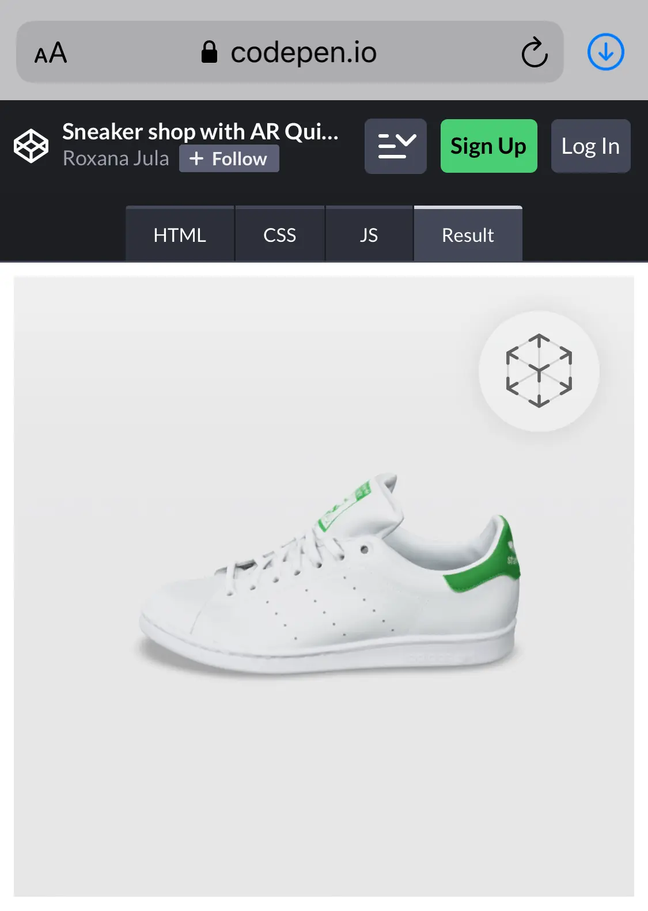
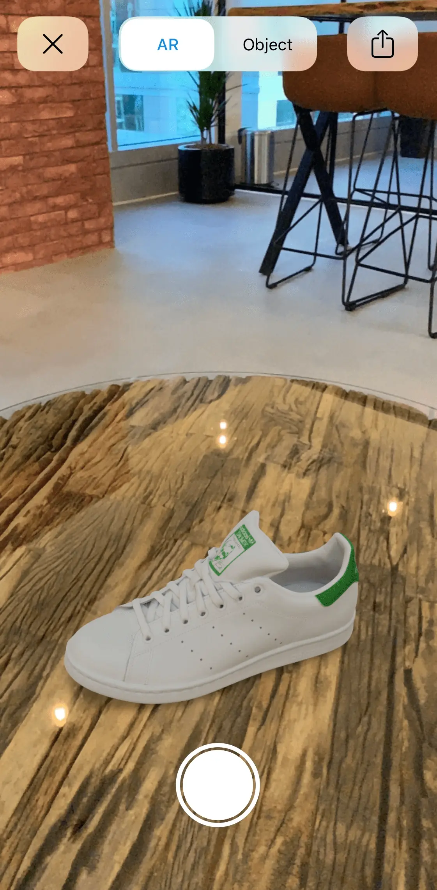
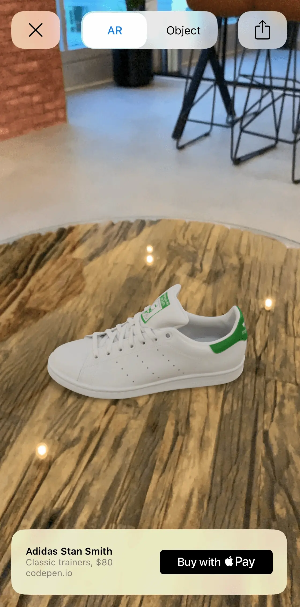
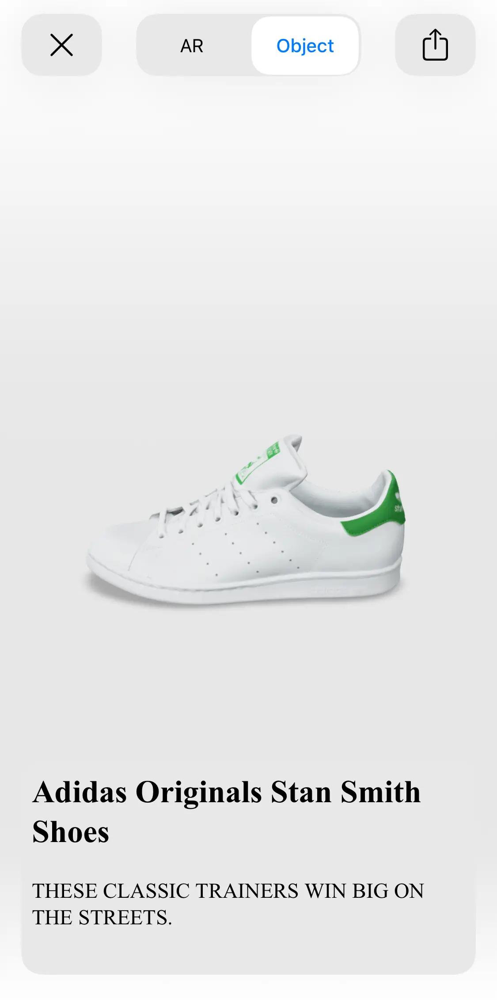

Apple is making augmented reality accessible to everyone with AR Quick Look. Not only is this great for iOS apps, but also for websites. Online shopping is one of the best industries that can take advantage of AR, as it can give users the possibility to see the products in 3D and in their own environments. From previewing furniture in your home with apps like [IKEA Place](https://apps.apple.com/us/app/ikea-place/id1279244498), to experiencing newly launched cars like this [Lamborghini Huracán](https://www.lamborghini.com/en-en/models/huracan/huracan-evo-rwd-spyder), this technology can improve our experience as buyers. But of course, the applications of web AR extend beyond retail as well.

## AR Quick Look

> Built-in apps, such as Safari, Messages, Mail, News, and Notes, use Quick Look to display USDZ files of virtual objects in 3D or AR on iPhone and iPad. You can embed Quick Look views in your apps and websites to let users see incredibly detailed object renderings in a real-world surrounding with support for audio playback.

There are many advantages of using AR Quick Look: it gives you interactions like placing, moving and scaling the object, people occlusion and sharing of the model available “out of the box”. It supports vertical and horizontal planes for placing your content and even viewing face accessories. You can view a gallery of Apple's AR Quick Look examples [here](https://developer.apple.com/augmented-reality/quick-look/), all you need to do is open the models on an iPhone or iPad to view them in AR.

For web based AR Quick Look experiences we can use USDZ, the distribution format for [USD (Universal Scene Description)](http://openusd.org/),which is a 3D file format developed by Pixar that focuses on speed, scalability and collaboration.

In this tutorial, we will build a simple webpage that shows a sneaker in AR.

## Preparing the 3D model

I will be using a model from [Sketchfab.com](www.sketchfab.com) but feel free to use whatever model you wish in USDZ file format. Sketchfab offers the option to download the model directly in this file format.

[Adidas Originals Stan Smith by VRModelFactory](https://sketchfab.com/3d-models/adidas-originals-stan-smith-358c67bd2bf74460a5ffc5d93e1e5be0)

### Converting your 3D models to USDZ Files/Changing the base unit of the model

In case you already have your models in other 3D formats, you can check out [this article](https://engineering.monstar-lab.com/2020/04/26/how-to-convert-3d-models-to-usdz-files-using-apples-reality-converter) on how you can easily convert them to USDZ using Apple's [Reality Converter](https://developer.apple.com/news/?id=01132020a).
In this article you can also see in the `Properties` section how to edit the base unit for example from meters to centimetres. I had to do this as well for the sneaker model so that it has a real life size when viewing it in AR.

## Getting started

In order to test what we are building right away on real devices, for simplicity, we will be using [codepen.io](https://codepen.io/):

1. Sign up or login on Codepen
2. Create a new pen and name it as you wish
3. Click save, this will create a link that you can open on your device for testing. Here is how my link looks like: <https://codepen.io/roxanajula/pen/poydGKx>, you should have something similar.

## Showing the model in AR

For basic AR Quick Look functionality, all we need to do is add the following code in the HTML file:

```html
<div>
  <a
    rel="ar"
    href="https://roxanajula.com/wp-content/uploads/2020/09/Adidas_Originals_Stan_Smith.usdz"
  >
    
  </a>
</div>
```

The code above is pretty straightforward, we have the AR model inside a hyperlink tag and an image to be displayed for the model. By adding the `rel="ar"` attribute we tell the browser that this is an AR model so it will automatically add the AR badge in the right corner of the image and will start the AR experience directly instead of navigating to another page.



I uploaded the image and model on my personal website as you can only host assets directly on Codepen with a paid account. When you will be developing your project you can also link to your project files, like this for example: `href="/assets/models/model.usdz"`.

Additionally, I added the following to the CSS file to fit the image nicer on the screen:

```css
img {
  width: 100%;
}
```

And that's it! You can now save it and reload the Codepen link from your device. When we tap on the image on iOS, we will be taken to the AR Quick Look view. If we tap on the image on macOS, the model will be downloaded on your machine.



## Banners

_Available for devices running iOS 13.3 or later_

In the previous section we looked at the most basic AR Quick Look experience, but you can also add banners with `Apple Pay` or `Custom Actions` to your AR experience.

Check out this very useful [webpage](https://applepaydemo.apple.com/ar-quick-look) made by Apple for more information on integrating those features. You can enter all the customisation details you need for your banner and this webpage will generate the code for you, pretty cool!

In this section we will have a look at different styles of banners you can add but it will be up to you to define the actions your website takes in response to tapping on the banner. For more information, see [this article from Apple](https://developer.apple.com/documentation/arkit/adding_an_apple_pay_button_or_a_custom_action_in_ar_quick_look).

The flow of your experience will look like this:


_Image Source: [Apple](https://developer.apple.com/videos/play/wwdc2020/10604/)_

Here are some examples of custom banners for our sneaker webpage:

**Apple Pay banner with title, subtitle, price and a "Buy with  Pay" button:**

- Button types: `plain` (default), `book`, `buy`, `check-out`, `donate`, `pay` and `subscribe`
- The `price` is optional on Apple Pay banners only from iOS 14.

```html
<div>
  <a rel="ar" id="ar-link" href="https://roxanajula.com/wp-content/uploads/2020/09/Adidas_Originals_Stan_Smith.usdz#applePayButtonType=buy&checkoutTitle=Adidas%20Stan%20Smith&checkoutSubtitle=Classic%20trainers&price=$80">
      
</div>
```



Find out more about how to support Apple Pay on your website [here](https://developer.apple.com/documentation/apple_pay_on_the_web).

**Custom action banner with title, subtitle, price and a "Preorder" button:**

```html
<div>
  <a
    rel="ar"
    id="ApplePay"
    href="https://roxanajula.com/wp-content/uploads/2020/09/Adidas_Originals_Stan_Smith.usdz#callToAction=Preorder&checkoutTitle=Adidas%20Stan%20Smith&checkoutSubtitle=Classic%20trainers&price=$100"
  >
    
  </a>
</div>
```


**Custom large sized banner with own html:**

- You can pick between 3 height sizes: `small` (81 points), `medium`(121 points) and `large`(161 points). Small will be set by default if `customHeight` is omitted.
- The custom HTML file must be sent over HTTPS.
- I am hosting [the custom html file on my website](https://roxanajula.com/wp-content/uploads/2020/09/sneaker_custom.html)

```html
<div>
  <a rel="ar" id="ApplePay" href="https://roxanajula.com/wp-content/uploads/2020/09/Adidas_Originals_Stan_Smith.usdz#custom=https://roxanajula.com/wp-content/uploads/2020/09/sneaker_custom.html&customHeight=large">
    
</div>
```



## Content scaling

Content scaling is enabled by default but you can disable it with the following URL parameter: `allowsContentScaling=0`.

## Share link

The share functionality will link to the model by default, but you can also specify another link with the following URL parameter: `canonicalWebPageURL=https://example.com`.

## Detect support for AR

It is good practice to only show the AR model to the users if it's supported, here is how you can detect if AR is supported:

```javascript
const a = document.createElement("a");
if (a.relList.supports("ar")) {
  // AR is available.
}
```

_Code Source: [Viewing Augmented Reality Assets in Safari for iOS](https://webkit.org/blog/8421/viewing-augmented-reality-assets-in-safari-for-ios/)_

## Bonus: Nested models

You can have a look at the `Making the nested USDZ file` section in this [article](https://engineering.monstar-lab.com/2019/12/31/How-to-make-an-Augmented-Reality-decorating-experience-app-with-AR-Quick-Look) for a step by step tutorial on how to nest together more models into one USDZ file.

_Keep in mind that USDZ is still a fairly new format so you might need to check that your web server understands the `model/vnd.usdz+zip` MIME-type. Refer to your web server documentation on how to configure this if not already supported._

## Resources

- [Sneaker shop with AR Quick Look Codepen](https://codepen.io/roxanajula/pen/poydGKx)
- [Adding an Apple Pay Button or a Custom Action in AR Quick Look](https://developer.apple.com/documentation/arkit/adding_an_apple_pay_button_or_a_custom_action_in_ar_quick_look)
- [Viewing Augmented Reality Assets in Safari for iOS](https://webkit.org/blog/8421/viewing-augmented-reality-assets-in-safari-for-ios/)
- [Previewing a Model with AR Quick Look](https://developer.apple.com/documentation/arkit/previewing_a_model_with_ar_quick_look)
- [WWDC20: Shop online with AR Quick Look](https://developer.apple.com/videos/play/wwdc2020/10604/)
