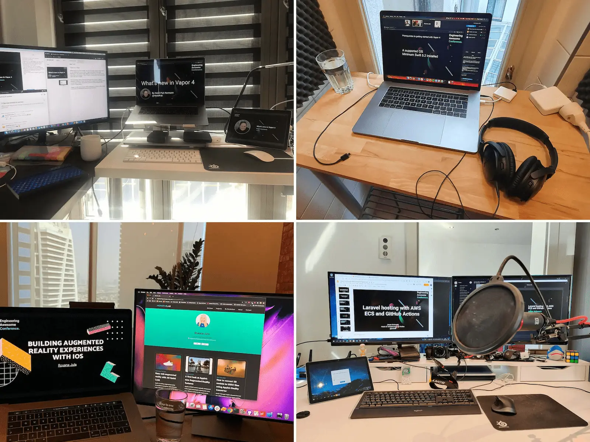

We love engaging with the tech community, and we are big consumers of the awesome work that people share online. So a couple of weeks ago we hosted our [first-ever online conference](https://www.nodesagency.com/engineering-awesome-conference-2020/) as a way to give back to the community. 6 experts from across our offices in Europe and the Middle East shared their knowledge in topics like Flutter, Vapor, Sitecore and more. After each talk, we had a Q&A session as well so participants can freely ask their questions on the topic.

All the talks are available on our [Youtube channel](https://www.youtube.com/c/BorderlessEngineeringConference) so you can watch or rewatch them at any time. You can also find the presentations slides [here](https://github.com/nodesagency/events-slides/tree/master/Engineering%20Awesome%20Conference%202020).

_Here are a few behind the scenes photos from our facilitator and speakers._

#### Building Augmented Reality experiences with iOS

_by [Roxana Jula](http://twitter.com/roxanajula), Mobile developer from our Dubai office_

Apple has a big lead when it comes to augmented reality and in this session, we will have a look at everything that is possible today with ARKit. From motion capture, people occlusion to geolocation activated AR experiences, there are a lot of amazing opportunities for AR.

{{ youtube-link="LHuidzivLs4" }}

#### Laravel hosting with AWS ECS and GitHub Actions

_by [Jonas Schwartz](https://twitter.com/joscdk), Head of Infrastructure at Nodes sitting in our Berlin office_

This talk will give you a quick introduction into setting up AWS ECS (Elastic Container Service). We will also be setting up workflows on GitHub Actions for automatically deploying our app on pushes to GitHub.
After this talk, you will have an idea of how to utilize AWS ECS to get your Laravel app up and running in the Cloud. And how to utilize GitHub Actions for your CI/CD system.

{{ youtube-link="aca3LqdD6TM" }}

#### What's new in Vapor 4

_by [Heidi Hermann](https://twitter.com/HeidiPuk), Vapor Developer at Nodes, from our Berlin office_

Vapor 4 is released! – So let's have a look at what's new. Some of the topics we'll cover are the changes to Fluent, to database models and the support for eager loading.
Vapor is the most popular Server Side Swift framework. It is written on top of Apple's SwiftNIO, a cross-platform asynchronous event-driven network application framework. You can read more about Vapor [here](https://vapor.codes/).

{{ youtube-link="fGFA_mfQWWw" }}

#### Flutter: Creating responsive apps

_by [Markus Rubey](https://twitter.com/markusrubey), Senior Android Developer from our Berlin office_

In this session, we will look at how to layout UI according to the size and shape of a screen or window in order to target phones, tablets, laptop or desktop computers. You can download the code used in this session [here](https://github.com/markusrubey/responsive_playground).

{{ youtube-link="qtXxrk4q_2A" }}

#### Android Compose

_by [Johnny Sørensen](https://twitter.com/jeghedderjohnny), Head of Android from our Copenhagen office_

We time travel to the year 2021 in a world where Compose is the standard of the presentation layer on Android. We will have a quick look at how Compose works, a glimpse into structuring an app and how it can work piecing data streams together and ultimately compare it to the ancient days of XML. You can download the code used in this session [here](https://github.com/johsoe/moviedb-compose).

{{ youtube-link="f_rfr_8cvcY" }}

#### Thanks to everyone for participating!

Our facilitator, [Tiago Araujo de Souza](https://www.linkedin.com/in/taraujodesouza/), gave us some good vibes in between the talks with those lo-fi [Sunny beats](https://open.spotify.com/playlist/37i9dQZF1DXbtuVQL4zoey?si=6VrRBS7PQta647jUsDvmZQ).

<blockquote class="twitter-tweet">
Coffee breaks in Zoom Webinars are way more fun 🤩. Plus the lo-fi from <a href="https://twitter.com/Nodes_Apps?ref_src=twsrc%5Etfw">@Nodes_Apps</a> in the background makes everything better. <a href="https://t.co/dqT6VbUWno">pic.twitter.com/dqT6VbUWno</a>
&mdash; Juan Carlos (@JC_Tec_) <a href="https://twitter.com/JC_Tec_/status/1308404290650869760?ref_src=twsrc%5Etfw">September 22, 2020</a></blockquote> 

We really enjoyed doing this conference and we are planning to bring a second edition soon.

Follow us on social media to stay up to date with Engineering Awesome Conference announcements:

- [Facebook](https://www.facebook.com/nodesagency/)
- [Linkedin](https://www.linkedin.com/company/nodes/)
- [Twitter](https://twitter.com/Nodes_Apps)
