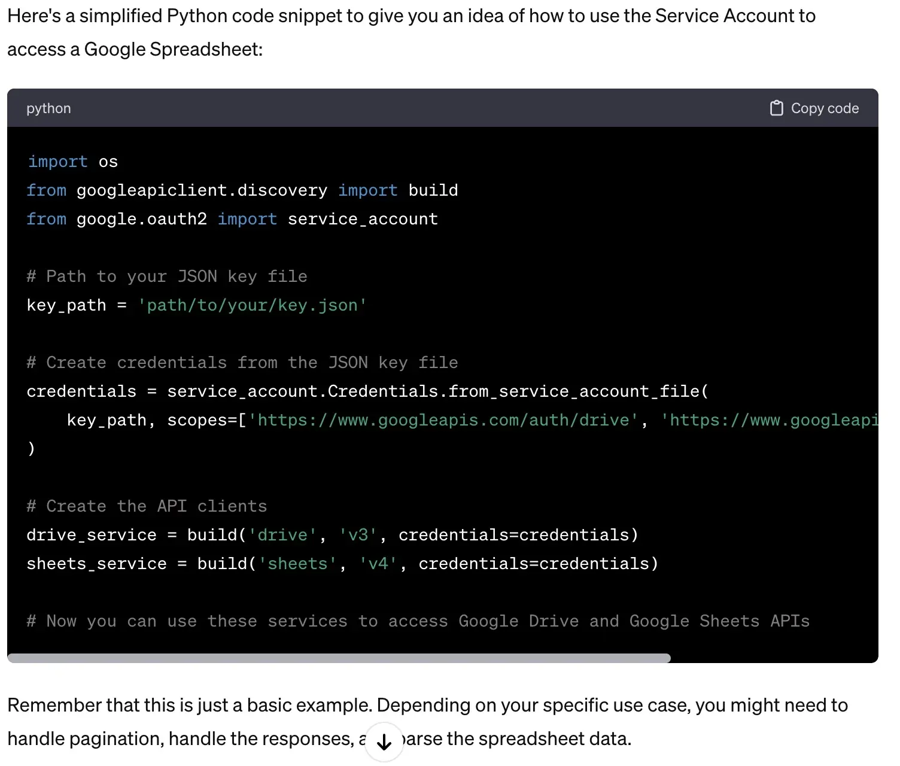
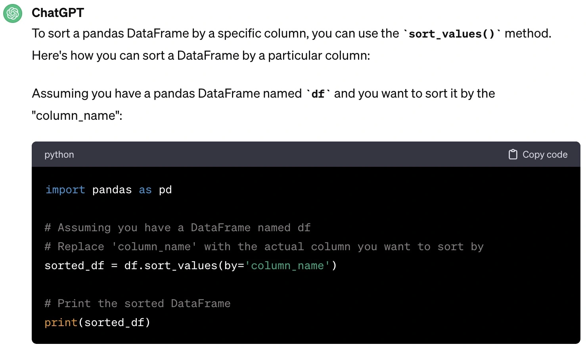
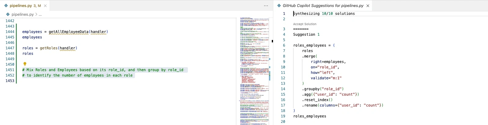
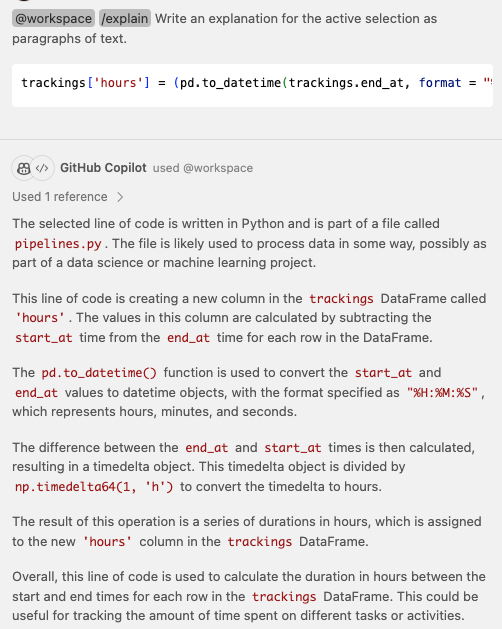

A few months ago, I started exploring the world of data engineering. Armed with just basic knowledge of Python, I set out to implement my first ETL (Extract, Transform, Load) pipeline using Python to move data between two systems seamlessly.

GitHub Copilot turned out to be my guiding star in this Python odyssey. With its code suggestions and real-time assistance, it felt like I had a seasoned Python developer right by my side. Copilot not only streamlined my coding process but also served as an exceptional teacher. It provided explanations, alternative solutions, and helped me grasp Python's intricacies faster than I could have imagined.

But Copilot wasn't my only ally. ChatGPT, another AI companion, was there to answer my questions and provide insights whenever I needed them. It didn't matter if it was about Python syntax, or data manipulation with Pandas, or even conceptualizing ETL workflows – ChatGPT was always ready with accurate and thorough responses.

Together, Copilot and ChatGPT became the dynamic duo that guided me through the twists and turns of this project. They helped me build an ETL pipeline that not only met the project's goals but exceeded my own expectations. The pipeline seamlessly extracted data, transformed it to fit the target system, and loaded it with just some adjustments on the code but in general guiding me with really good samples.

As I reflect on this journey, I can't help but marvel at the capabilities of modern technology. With just basic Python knowledge, I accomplished what once seemed like an task I wouldn't have the skills to do. Copilot and ChatGPT not only accelerated my learning but also provided creative solutions and expanded my horizons. This project has taught me that with the right tools and determination, even a novice can achieve remarkable results in the world of programming.

### Getting Started

Beyond coding, ChatGPT helped me with setting up my development environment. It guided me through best practices for organizing Python scripts, ensuring my codebase was clean and maintainable. When it came to connecting to various data sources, ChatGPT was my helper when I got blocked. It provided step-by-step guidance on how to integrate with Salesforce, external APIs, and Google Services like Google Drive API. Obviously, I had to explore a little bit directly into the APIs documentation to ensure the current ChatGPT response was in line with the needs. At one moment I was lost on a task to set up the services needed for the project and ChatGPT surprised me. It even outlined the necessary roles and permissions demystifying the process of establishing these connections and setting up the grants needed for this task.

Moreover, ChatGPT helped me navigate the complex world of the Google Cloud (GCloud) infrastructure. It guided me through setting up connections to services like BigQuery and Google Storage. And as mentioned before it also helped me demystifying the process of managing grants between service accounts needed to open a connection between the different services used, ensuring that my ETL pipeline operated smoothly within the Google Cloud ecosystem. ChatGPT showed me step by step instructions on how to do things like creating a Service Account Key and how I could use it to connect with Google services using Python and the libraries used for a specific service.

On the other hand, ChatGPT helped me to set up Salesforce connections and it guided me through the existent APIs. Building the connection between Salesforce and the ETL on Python was a challenge since it implies a different kind of Authentication with OAuth. ChatGPT was able to explain me the ways that we could authenticate and it showed a few approaches that could do. In fact, during the implementation, it was necessary to look at the libraries used for an easier Salesforce API connection. During this research the Simple Salesforce library was recommended which ended up being my tool to build the solution and perform in a easy way queries to retrieve the information from that source.

One more sample that ChatGPT provided was for Google spreadsheets connection. I asked “Which grants needs a Google Service account to read using Google Drive API and get access to Google Spreadsheets?” and ChatGPT showed me what I needed from Google Cloud and how I could use a Service Account:



That was not the only thing, it also helped to understand things like how could I sort and use Pandas dataframes. This was really helpful through my work of developing the solution:



### Using Copilot for Code Assistance

Initially, I started thinking about how I could use the tools and libraries to set up my environment. During this phase, Copilot helped me build the initial inputs for tasks like establishing the connection with the Salesforce API and how I could start sending requests through it using SOQL queries to retrieve information from the system. I have to admit that in those cases where a language like SOQL comes into the scene, it was not completely precise since it showed normal SQL in the suggestions, but sometimes it was close enough to what I wanted to achieve, so I just had to modify the proposed query slightly.

One additional task Copilot helped me with was clarifying complex aspects of Python and the Pandas library, providing me with insights and solutions that were instrumental in achieving the project's goals and understanding the libraries used.

Tasks like opening a research to merge two different Pandas or understanding how the Pandas work, are easier with Copilot completion:



### Navigating Legacy Code and Pandas Mastery

One early challenge I encountered was dealing with legacy code from an old ETL pipeline, in order to understand the model expected by the final output. There was a huge amount of "spaghetti code" that I had to try to understand, which was not an easy task given my expertise in managing Python and Pandas. However, Copilot proved to be a lifesaver in giving me clarity. It assisted me in understanding the intricacies of the existing code, breaking down its logic, and understanding legacy code that was not following best practices.

As I mentioned, a significant part of my project involved working with Pandas library for data manipulation. Copilot helped me understand how Pandas could make different tasks like merging data from different tables, making transformations, sorting, and more. Its code suggestions and explanations really helped me, enabling me to merge different tables from different data sources and to ensure data consistency throughout the ETL process.

In cases where I was not completely sure what the code was doing Copilot Chat was able to explain it to me and give me more context about what a piece of code was doing.

Let’s say that I have the next piece of code:

```python
trackings['hours'] = (pd.to_datetime(trackings.end_at, format = "%H:%M:%S") - pd.to_datetime(trackings.start_at, format = "%H:%M:%S")) / np.timedelta64(1, 'h')
```

It was able to read the opened file and explain to me a little bit about the operation of the given code:



In addition it was able to add some improvements suggestions to the code:


This method proved beneficial in not only developing the code but also in documenting it simultaneously. Whenever a line of code had ambiguous intentions, the tool assisted by generating explanations and documentation, ensuring each step of the code was clear and well-documented from the outset.


Copilot helps a lot when you want to document your code **to improve its readability**.

### Transformation Magic

Data transformation was a fundamental aspect of my ETL processes. Copilot and ChatGPT became my virtual mentors in this regard. They guided me through the process of applying transformations to the data, showcasing the versatility of Pandas in handling diverse data manipulation tasks. Whether it was altering data types, aggregating information, or reshaping dataframes, Copilot provided clear code suggestions. It is important to mention that in some cases where Copilot had generated some strange code I used ChatGPT in conjunction with Copilot’s suggestions to give me some clear explanations and better approaches. This enabled me to wield Pandas with confidence.

Considerations such as how to use the Pandas 'loc' function to fill data from other columns only when a specific condition is met, or other suggestions where I just need to adjust the names of the columns in the dataframes, are areas where these tools have proven invaluable. They have also assisted in performing calculations within the dataframes, such as the sample of computing the number of hours between a range of dates. This demonstrates that using both AI tools can unleash your potential and streamline complex tasks, saving significant time.

Even when I had to combine data from multiple tables and sources, providing samples in the prompt or within the method, it was capable of generating an entire method with the required output. In this case, I provided sample inputs of the method along with the expected output, and it generated multiple completion options, which was really helpful as it saved me a lot of time. To successfully accomplish these complex tasks, it was necessary to provide sufficient scenarios of data combinations from the input tables and the expected output.

Things like how I could split column tables on rows assigning numeric values in the same method it was able to actually build the whole structure.

Whit the next explanation on the method:

```python
def transform_work_calendar_to_user_working_days(
    users_df: pd.DataFrame,
    work_calendar_df: pd.DataFrame,
) -> pd.DataFrame:
    """Converts work calendar to user working days mixing users_df and work_calendar_df in order
    to create a user_working_days_df output matching with UserWorkingDays model,
    with the following columns:
    - user_id: User.Username | Contact.Id depending if the user is a resource contact. Each contact has Work_Calendar_id relationship.
    - numeric_day: Day of the week starting from 0 (Sunday) to 6 (Saturday), use the Work_Calendar.{day}_Hours to identify the day.
    - hours: Work_Calendar.{day}_Hours value as hours in float format.

    Args:
        users_df (pd.DataFrame): users df with user data to match with its information.
        work_calendar_df (pd.DataFrame): work calendar df with work calendar.
    Returns:
        pd.DataFrame: with the MPlanner UserWorkingDays schema columns needed.
    """

```

It was able to produce the following implementation:

```python
    # Transform days to numeric values and placing values to its corresponding numeric day
    # Melt the DataFrame to reshape the data
    working_hours_df = pd.melt(
        working_hours_df,
        id_vars=["id"],
        value_vars=[
            "Sunday_Hours",
            "Monday_Hours",
            "Tuesday_Hours",
            "Wednesday_Hours",
            "Thursday_Hours",
            "Friday_Hours",
            "Saturday_Hours",
        ],
        var_name="numeric_day",
        value_name="hours",
    )

    # Map the day names to numbers
    day_to_number = {
        "Sunday_Hours": 0,
        "Monday_Hours": 1,
        "Tuesday_Hours": 2,
        "Wednesday_Hours": 3,
        "Thursday_Hours": 4,
        "Friday_Hours": 5,
        "Saturday_Hours": 6,
    }
    working_hours_df["numeric_day"] = working_hours_df["numeric_day"].map(
        day_to_number
    )
```
And it was also able to create the merge output of the data:

```python
...
    user_working_hours_df = user_df.merge(
        work_calendar_df,
        left_on="Work_Calendar_id",
        right_on="Id",
        how="left",
    )

    return user_working_hours_df
```

The above code is just a sample that I have in the method. With more complex tables, it was also able to combine different tables, rename columns, and make calculations if needed. I just had to make some adjustments to clean the code and align with best practices.

On the other hand, tasks like defining new methods to refactor the code and avoiding duplicated pieces of code are aspects that Copilot does not always identify. When it generates suggestions, I conduct a thorough review of the generated code, removing or calling existing methods or defining new ones as needed. Even in these cases, it helps me to refactor and create new code with minimal effort, without needing specific prompts. Therefore, it's important to pay special attention to these aspects when using a companion tool like Copilot.

### Filtering and Beyond

Navigating through data filtering posed a significant challenge for me. The guidance I received in crafting and implementing filter conditions within dataframes was tremendously helpful. It wasn't just about understanding the syntax; it was about discovering innovative ways to accurately and efficiently retrieve the necessary data.

## Challenges and Limitations with GitHub Copilot

While GitHub Copilot undoubtedly played a pivotal role in my ETL project, it was not without its share of challenges and limitations. It's essential to acknowledge these aspects to provide a comprehensive view of my experience. It is important to mention that the challenges come with the prompts you use and that is where you start seeing the limitations of this kind of technology.

### Contextual Understanding

One notable challenge I encountered was Copilot's occasional difficulty in grasping the full context of my project. This became apparent when it came to fetching columns from tables within my code. Copilot tended to infer common fields found in typical databases, such as 'id,' 'name,' 'full_name,' 'cost,' and others. While these fields are indeed prevalent, my project often required more specific columns that were unique to our data schema and the model on the project used.

In such cases, I found myself having to provide additional context within the prompt, explaining the current columns of a table explicitly. This was necessary to guide Copilot in suggesting the correct fields. It's worth noting that this limitation might have arisen because I couldn't grant Copilot access to the entire codebase due to company privacy agreements so I had to be really careful to not share information relevant to keys and other variables that could imply an exposure risk.

Another noteworthy observation was the evolving precision of Copilot's suggestions as I actively engaged with it. Over time, while Copilot was active and I navigated through the code, it gradually became more precise in its recommendations.

### Quality of Suggestions

However, it's important to acknowledge that Copilot isn't infallible. There were instances when it provided suggestions that were not entirely aligned with the project's requirements, particularly in handling Pandas dataframes and processing its data in some cases. For example, I encountered a situation where Copilot recommended iterating through dataframe rows using conventional loops. This approach, while technically viable, was less efficient and more cumbersome compared to utilizing Pandas' built-in functions for data transformation. These kinds of suggestions, though well-intentioned, could sometimes lead to undesirable or even incorrect code snippets. This was especially challenging in scenarios where leveraging Pandas' powerful and optimized methods could significantly streamline processes and improve performance. Such instances highlighted the need for careful review and consideration of Copilot's suggestions, especially when implementing more sophisticated data manipulation techniques in Python.

## Recommendations for Improvement

Based on my experience on this project, I'd like to offer some suggestions for enhancing Copilot's effectiveness to new users:

1. Access to the whole codebase: To improve Copilot's contextual understanding, granting it access to the entire codebase would be beneficial. This would enable it to better recognize and adapt to project-specific variables, tables, objects, schemas and so on. In that way it could give better suggestions using existent code and giving more context.

2. Context in prompts: Providing more detailed context within prompts could aid Copilot in generating code that aligns closely with the project's needs. For example you could explicitly specifying the desired columns or explaining unique data requirements which will lead to more accurate suggestions.

3. Iterative learning: As observed, Copilot's suggestions became more precise with active usage. So, encouraging developers to interact with Copilot on a project actively and fine-tune its suggestions during the coding process could lead to better results.

4. Don’t use the first suggestion and instead explore different prompts, it possibly suggest better outputs.

5. Before apply a suggestion from Copilot think about which other solution could be better on terms of performance and also taking into account best practices like clean code or applying SOLID principles for example.

Limitations that I found were the plugins on certain IDEs don’t have all the features that Visual Studio Code IDE offers like interacting with Copilot in a similar way as we were chatting to ChatGPT. This feature at the moment of this article has been written is in Beta and not all people have access to it on other IDEs.

Also it is important to mention that even with this companion tools is necessary to have the knowledge of expertise building applications and applying concepts like clean code and clean architecture principles.

## Conclusion: Copilot - ChatGPT

In summary, GitHub Copilot proved to be an indispensable coding companion throughout my ETL project. It bridged the gap between my basic Python knowledge and the intricate demands of data migration and transformation. Copilot's ability to clarify legacy code, demystify Pandas, and provide guidance on data manipulation was instrumental in achieving the project's objectives. With Copilot's assistance, I not only completed the project successfully but also expanded my Python and data engineering skills significantly. Its ability to accelerate coding, offer insights, and simplify complex tasks is undeniable.

However, it's essential to acknowledge its limitations and work towards improving its contextual understanding and the quality of its suggestions. With continuous development and refinement, Copilot has the potential to become an even more indispensable asset in the developer's toolkit.

On the other hand, ChatGPT is another really valuable companion tool that helps you to find in a easy way the punctual topics that you need to achieve your goals, whether in professional or even in your personal life, showing you clarity, guidance, and really useful suggestions in your tasks. Questions, blockers or lack of comprehension in your daily life could be improved and it could unleash more of your potential. I have to admit that my searches on Google and StackOverflow have decreased significantly using these tools. It’s like talking with an expert without those extensive explanations and really long threads that sometimes just lead you to waste your time and energy without a clear answer.

Obviously, this tools won’t replace the expertise you have gained during years of hard work, and here is another good point to underline: even with all this access to exactly what you need using AI, you always have to make smart decisions and not just copy and paste what these companion tools suggest to you. You have to continuously apply best practices, and depending of your challenge it could guide you to make different decisions than the suggestions made by these tools.

_Article Photo by Luis Forero generated using DALL-E_
