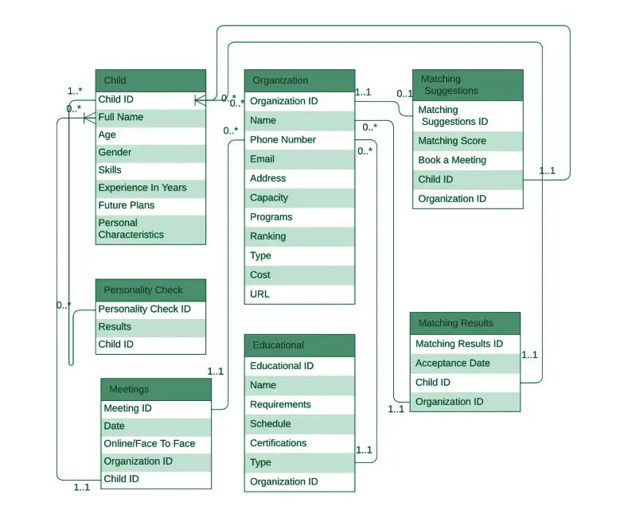
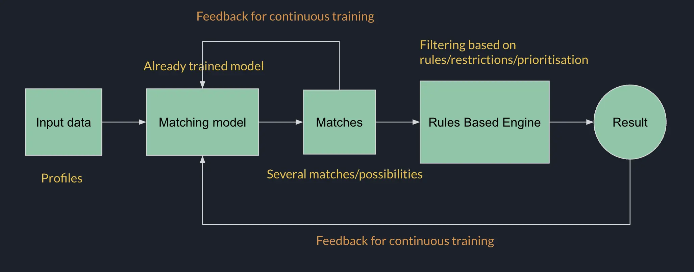
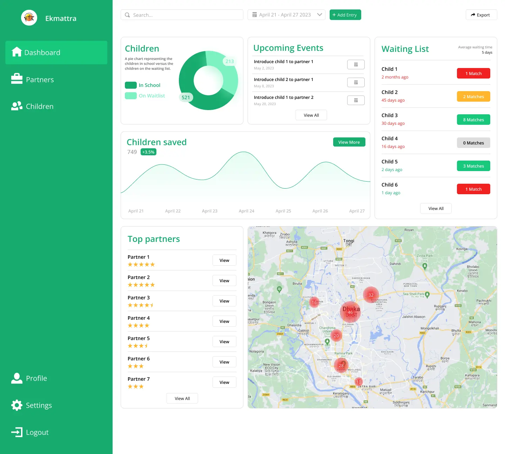
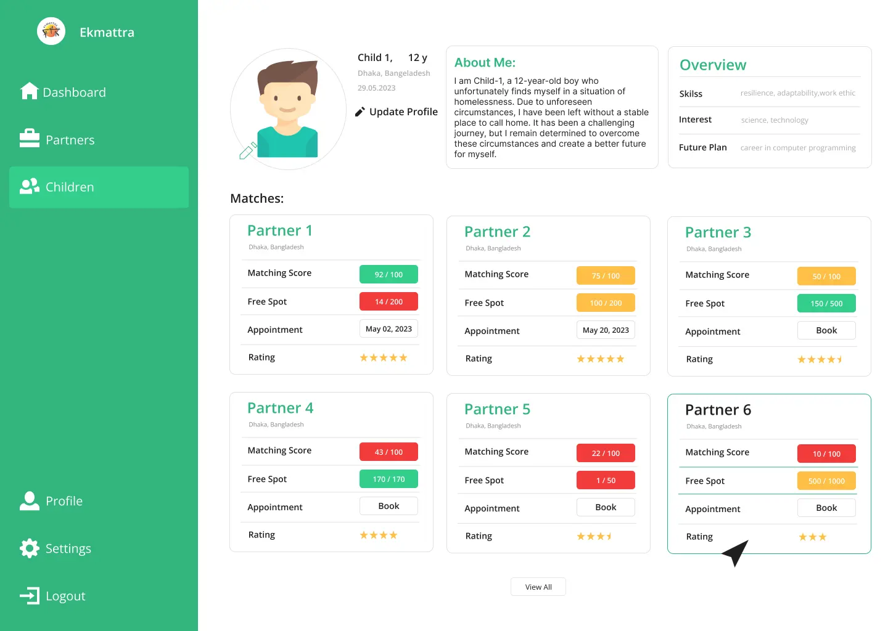

[MonstarHacks](https://www.linkedin.com/showcase/monstarhacks), the esteemed annual competition hosted by Monstarlab, has reached its 3rd edition, bringing together talented individuals from diverse backgrounds who are driven by innovation and dedicated to creating a positive social impact. This year, the theme was "NGOs" where 4 different organizations brought their own individual challenges for the hackathon participants to try to solve.

## Problem statement
One of the challenges put forward by [Ekmattra](https://ekmattra.org/), one of the partnering NGOs, draws attention to the pressing issue of children who are abandoned or who have fled from their villages. The task is to connect these children with the appropriate schools and NGOs that can offer them the necessary support for living and studying. The matchmaking process is considerably complex, often relying on impromptu decisions and relationships within a restricted network. This frequently sparks concerns about whether the decisions made truly serve the best interests of the children.

Recognizing the urgency of this challenge, our borderless team, known as `The CzechMate Coders`, selected this particular challenge to provide a solution that could have a lasting impact.

## The proposed solution
In this blog post, we will take you through our team's journey as we tackled the challenge presented by Ekmattra. We will discuss the reasons behind our choice of this specific challenge, the technical decisions we made, and the exceptional efforts we put forth during the competition. With collaboration, ingenuity, and a deep understanding of the problem at hand, our team aimed to make a lasting impact and provide vulnerable children with the support and opportunities they truly deserve.

We believe that a data-driven solution leveraging machine learning strategies can yield promising results. By identifying similarities and comparing profiles of children with those of potential partners, we can significantly simplify the process. To accomplish this, we employ a matching model that continuously learns and improves based on real data from actual cases. Given the wide variety of children's profiles, including factors such as age, health condition, social circumstances, special needs, and cultural-specific requirements, continuous training is crucial for the efficacy of the model.

Safety is our top priority, especially when it comes to children. We ensure that the system is not used for unethical activities or purposes. Moreover, we take into account the safety precautions implemented by partner sites when making the final choice. We maintain a system of regular feedback loops input by the NGO agent after each successful or unsuccessful case, with restricted access to the system to guarantee safe usage. This continuous training of the machine learning model ensures its reliability.

While our solution is digitalized, we strive to preserve the human factor, particularly in the final and most critical phase of the process. By combining technology with human intervention, we aim to create a comprehensive and effective matchmaking system for these vulnerable children.

## Our Tech stack
- Machine Learning
- React JS (Frontend)
- Python (Backend)

### Short presentation video
- [Demo](https://drive.google.com/file/d/1XkAZUCVquuK1x_ubMI4IMpcqENCsdtHT/view?usp=share_link)
- [Slides](https://docs.google.com/presentation/d/1-B_zK7ExYyKdKOn_ciBlUdQxsaIf1iAr57xjKBNnLBs/edit?usp=sharing)

### Attachments

Figure: ER diagram

Figure: ML model

Figure: Homepage

Figure: Matches Page

### Conclusion
The matchmaking system developed by The CzechMate Coders in response to Ekmattra's challenge has the potential to change the lives of vulnerable children living on the streets. The team's dedication, technical expertise, and innovation have enabled them to create a solution that can have a lasting impact and address a pressing social need. Thanks to Monstarlab, the MonstarHacks competition serves as a testament to the power of collaboration and ingenuity in creating positive social change. The impact of this project will undoubtedly be felt for years to come as children are given a chance for a better future.

_Article Photo by [Ekmattra](https://ekmattra.org/contact-us/)_
