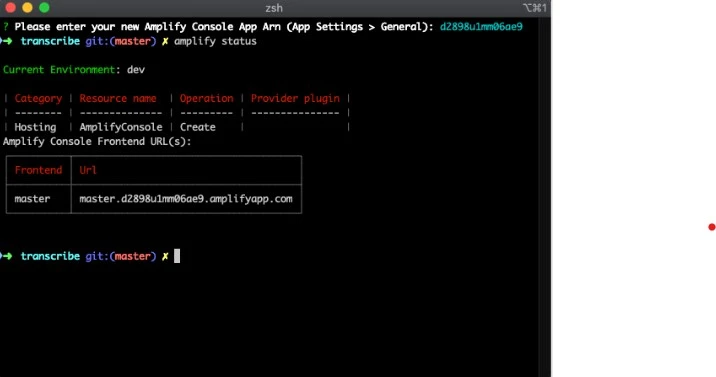
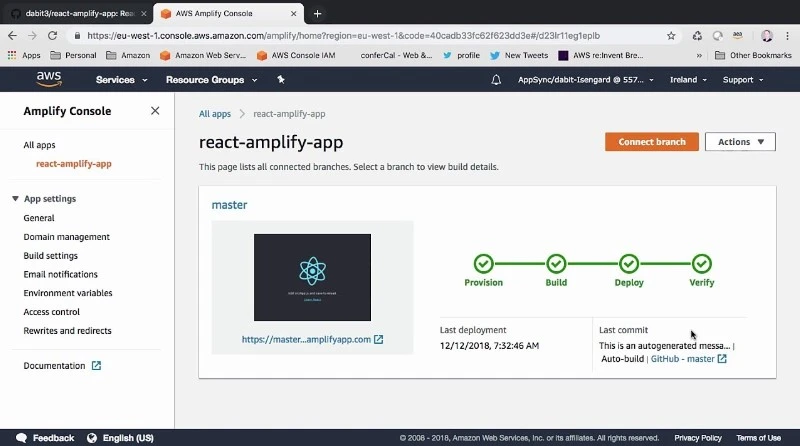

In today's fast-paced world, businesses need to quickly develop and deploy web and mobile applications to stay competitive. AWS Amplify, a powerful development framework provided by Amazon Web Services (AWS), enables developers to build scalable and secure applications with ease. In this article, we'll explore AWS Amplify and delve into its key features and benefits.


Figure: What is Amplify?

## What is AWS Amplify?

AWS Amplify is a comprehensive set of tools and services designed to simplify the development and deployment of web and mobile applications. It offers a seamless workflow for frontend and backend development, including features such as authentication, storage, APIs, and serverless functions.

## Key Features of AWS Amplify

1. **Authentication**: Amplify provides built-in authentication capabilities, including authentication providers such as Amazon Cognito, social sign-ins, and even custom authentication flows.
    Here is an example:

First, add the authentication library:

```shellscript
amplify add auth
```
In your React application directory, install the Amplify library:
```shellscript
npm install aws-amplify @aws-amplify/ui-react
```
In your, _App.js_ make sure you import the required components you need from the _aws-amplify/ui-react_ library. For now, we are importing _withAuthenticator_ and _AmplifyAuthenticator_:

```javascript
import React from 'react';
import { withAuthenticator, AmplifySignOut } from '@aws-amplify/ui-react';
const App = () => ( <div> <AmplifySignOut /> My App </div> ); export default withAuthenticator(App);
```
You will also notice the _AmplifySignOut_ component here, which renders a signout button.

2. **Data Storage**: With Amplify, developers can easily integrate data storage solutions such as Amazon DynamoDB, Amazon S3, or even custom data sources to store and retrieve application data. Here’s an example:

The fastest way to get started with using datastore in React is:
```shellscript
npx create-react-app amplify-datastore --use-npm
cd amplify-datastore
npx amplify-app@latest
```
3. **APIs and AppSync**: Amplify simplifies the process of creating and integrating APIs into your applications. It supports both REST and GraphQL APIs and provides a robust backend infrastructure with features like real-time data synchronization using AWS AppSync.


Figure: Amplify's API

4. **Serverless Functions**: Amplify integrates with AWS Lambda to enable developers to build and deploy serverless functions easily. This allows for the execution of backend logic without worrying about managing servers or infrastructure.


Figure: Serverles functions

5. **Hosting and Continuous Deployment**: Amplify offers a streamlined process for hosting and deploying web applications. It supports automatic deployment through Git-based workflows, making it easy to deploy updates to your application in a controlled and efficient manner.


Figure: CICD

## Amplify CLI and Amplify Console

1. **Amplify CLI**: The Amplify Command Line Interface (CLI) provides a convenient way to initialize, configure, and manage Amplify projects from the command line. It offers a simple and consistent interface to set up services, configure authentication, and deploy your application.


Figure: CLI

2. **Amplify Console**: The Amplify Console provides a hosting and continuous deployment service specifically designed for Amplify applications. It automatically deploys updates as you push changes to your repository, simplifying the deployment process and ensuring a smooth development workflow.


Figure: Console


Figure: Save

## Benefits of AWS Amplify

1. **Rapid Development**: Amplify's pre-built UI components, simplified workflows, and ready-to-use backend services enable developers to quickly prototype and develop applications.

2. **Scalability and Security**: Leveraging AWS services, Amplify ensures that your applications can scale seamlessly as demand increases while maintaining a high level of security.

3. **Platform Flexibility**: Amplify supports multiple platforms, including web, iOS, Android, and React Native, providing developers with the flexibility to build applications for various devices and environments.

4. **Developer Experience**: With its intuitive interface, extensive documentation, and community support, Amplify offers a pleasant development experience, enabling developers to focus on building great applications.

## Conclusion

AWS Amplify empowers developers to build feature-rich and scalable web and mobile applications by simplifying the development process and integrating with AWS services. Its comprehensive set of tools, including authentication, data storage, APIs, and serverless functions, along with the Amplify CLI and Amplify Console, accelerate the development and deployment cycles. Embrace the power of AWS Amplify to streamline your application development process and deliver exceptional user experiences in a shorter time frame.

_Article Photo by [AWS Documentation](https://docs.aws.amazon.com/)_
