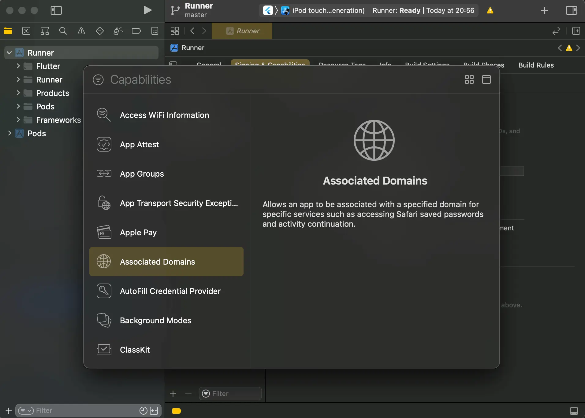
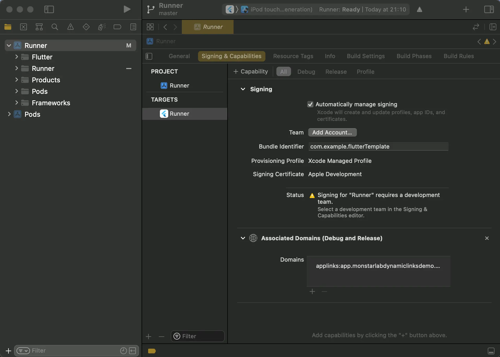
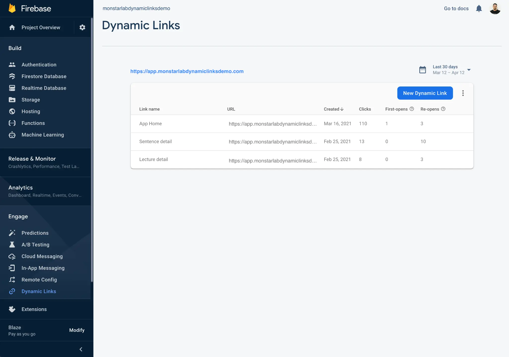
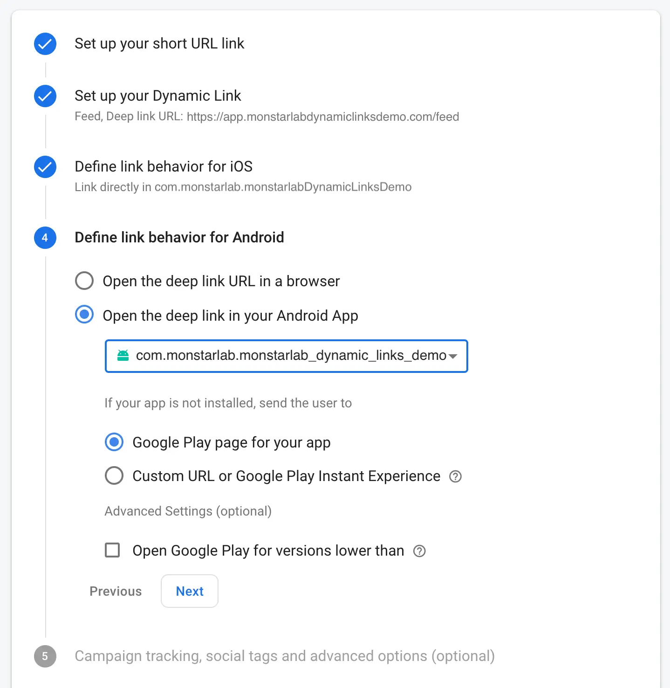

This article explains how to make use of Dynamic Links in Flutter through a step by step guide.

## What are Dynamic Links?

Dynamic Links are smart URLs that lead to a specific screen in our application. They can be easily used in an outsider website/app and are more commonly known as deep links.


## Why Firebase Dynamic Links?

Why Firebase? Could we not implement this by ourselves? Do we really need to rely on another service to do that? These were some of the questions we asked ourselves before we made a decision to go with Firebase. Luckily those questions were easily answered by watching the video below.

{{ youtube-link="LvY1JMcrPF8" }}

So, why Firebase Dynamic Links are a really good option to go with:

- **They work in and adapt to all platforms (iOS, Android, Web):** one link works perfectly between all platforms.
- **App not-installed behavior can be adjusted:** we can lead the users to a landing page or the platform (iOS, Android) store in case they don’t have our app installed.
- **The flow doesn’t die after app installation:** even if the user does not have our app installed, after installation and opening the app for the first time; the Dynamic Link works.
- **Easily used in combination with Firebase Analytics:** we can use Firebase Analytics to count the number of times a Dynamic Link is used.

## Getting started

In this article we are only going to elaborate on how to implement Dynamic Links with Flutter. In other words, the below steps are necessary and we are not going to get into detail on how to do so.

- Create a Firebase project
- Add the necessary iOS and Android apps
- Configure the iOS and Android apps in Flutter to use Firebase

Before going further, let’s make sure the above steps are finished!

## Step 1: Create a prefix URL

A Dynamic Link is defined by a URL, and that is what we are going to do first. Define the URL that is going to be used in all our links.

To specify our URL, we go to:

*Firebase Console > Dynamic Links > Get started*


Here is where we are going to set up our prefix URL. This prefix will be the one showing in all our Dynamic Links and should be explicit to our app. Therefore we should choose something clear and precise. For this example we decided on the prefix below:

***<p style="text-align: center;">https://app.monstarlabdynamiclinksdemo.com/<p/>***

Subsequent links from this prefix URL will look like the one below:

***<p style="text-align: center;">https://app.monstarlabdynamiclinksdemo.com/home<p/>***

Along with an explicit prefix URL, we have to own that domain too, due to the fact that we need to prove that ownership on the **Verify** step.


Once we get to the **Finish** step of the **Get started** guide, we should have a prefix URL ready to create Dynamic Links for our app.

## Step 2: Install

To implement the Dynamic Links in our Flutter app, we are going to make use of the firebase_dynamic_links library.

[https://pub.dev/packages/firebase_dynamic_links](https://pub.dev/packages/firebase_dynamic_links)

Running the command below in our terminal will install the library into our Flutter project.

```shellscript
flutter pub add firebase_dynamic_links
```

After installation, to receive Dynamic Links on Android nothing more should be done. However, iOS devices need some more configuration. In the next sections we are going to explain the three procedures that made our app capable of opening Dynamic Links successfully.

#### Step 2.1: Universal Link configuration

The first configuration step will be to add the Associated Domains capability to our iOS app. To do so, we need to open our Runner.workshop in Xcode and go to:

*Project root > App target > Signing & Capabilities > + Capability > Associated Domains*





We will set the **Associated Domains>Domains** as **applinks:(URL prefix)**.

```shellscript
applinks:app.monstarlabdynamiclinksdemo.com
```

After this change, we will need to update the configuration of our App ID (Apple dev center), adding the Associated Domains capability as well, and update our provisioning profile accordingly. Otherwise we will not be able to test our Dynamic Links in iOS.

#### Step 2.2: Support Custom URL schemes

For our second configuration step we need to support the custom URL schemes in our iOS app. We need to go to:

*Project root > App target > Info > URL Types > +*


Here we need to set the **Identifier** field as **Bundle ID** and the **URL Schemes** field with our iOS app bundle ID.

```shellscript
com.monstarlab.monstarlabDynamicLinksDemo
```

#### Step 2.3: Info.plist configuration

For the third and final configuration step we will add a **FirebaseDynamicLinksCustomDomains** Array into our app **Info.plist**.


Once the array has been added, we will also need to insert a **String item** into the array with our URL prefix.

```shellscript
https://app.monstarlabdynamiclinksdemo.com/
```

At this point we should be ready to go. Nevertheless, iOS configuration is one of the troublesome tasks dealing with Dynamic Links. If you have difficulties trying to configure the Dynamic Links for iOS, especially when opening them on a device later in this tutorial. Return here and check the link below, it was a great help for us.

{{ youtube-link="KLBjAg6HvG0" }}

## Step 3: Generate Dynamic Links (Immutable url)

In the previous steps we created a prefix URL that works with our app, but that is not enough. As stated before, Dynamic Links are smart URLs that lead to a specific screen in our application. We need to define the last part of our URL that leads to that specific screen.

In this first part of step 3, we are going to focus on links that refer to a screen that does not need additional information to show. Examples of those links could be:

***<p style="text-align: center;">https://app.monstarlabdynamiclinksdemo.com/feed</p>***

***<p style="text-align: center;">https://app.monstarlabdynamiclinksdemo.com/premium</p>***

***<p style="text-align: center;">https://app.monstarlabdynamiclinksdemo.com/profile</p>***

This kind of link can be easily created from the Firebase Console:

*Firebase Console > Dynamic Links section > New Dynamic Link*



Clicking this button will trigger a window with a series of steps explained in the following sections.

#### Step 3.1: Short URL

In this first step we need to set up the last part of our short Dynamic Link URL.


For an immutable URL a short link may not be that useful. Moreover, at this point it may be difficult to understand why they are used for. Thus, we recommend leaving the field with the random string as is and continuing to the next step.

#### Step 3.2: Dynamic Link setup


In this second step we need to set up the last part of our **Deep link URL**. This will become our actual Dynamic Link. Anything should be fine, but we recommend it to be clear and explicit to the screen we are referring to.

In addition to the URL path, a **Dynamic Link name** is required. This Dynamic Link name is for internal use, it is used to help us identify links easier. This name will show on the Firebase console Dynamic Links list next to the URL.

#### Step 3.3: iOS behavior


For the third step we will need to configure the behavior of our link when opening the smart link on an iOS device. We want our link to open a specific screen in our app, for that we need to specify **Open the deep link in your iOS App**.

Likewise, we also can set the behavior if the user does not have our app installed. In our case, we decided to show the **App Store page for your app**, and guide them to install our app. Similarly we could choose **Custom URL** and define a URL to fall through to instead.

#### Step 3.4: Android behavior



For the fourth step we will need to configure the behavior of our link when opening the Dynamic Link on an Android device. As in the previous step, we want to open a specific screen in our app with the Dynamic Link, for that we need to select the **Open the deep link in your Android App**.

We also selected the **Google Play page for your app** to guide the users to the Play Store in case they don’t have the app installed.

#### Step 3.5: Advanced options

In the fifth and final step we are going to add a bunch of optional parameters to our Dynamic Link.


**Meta tag parameters** are easily used on social media, when presenting links in their interfaces. Setting up those parameters will allow us to show our link more appealingly, rather than a plain URL.

On the other hand, the **UTM parameters** (see image above) are set to be used along with Firebase Analytics.

#### App preview page

The app preview page is an html page between the generated Dynamic Link and the app screen. This html page is shown in the user device default browser and also presents the social meta tag parameters that were set in the last step (title, image and description).


App preview pages are usually useful because they let the user decide if they really want to open the link or not. In case we don’t want to show it, we can skip it by checking the **Skip the app preview page (not recommended)** checkbox.

## Step 3: Generate Dynamic Links (Mutable links)

Continuing with Dynamic Link generation, we learnt how to generate links that refer to a screen that does not need additional information to show. But what if they need some changing parameters to be specified? In this second part we are going to focus on mutating links and how they are generated.

Examples of those links would be:

***<p style="text-align: center;">https://app.monstarlabdynamiclinksdemo.com/detail/9875</p>***

***<p style="text-align: center;">https://app.monstarlabdynamiclinksdemo.com/news/305</p>***

***<p style="text-align: center;">https://app.monstarlabdynamiclinksdemo.com/profile/monstarlab</p>***

For these cases we will need to generate our deep links with code.

#### Coding with firebase_dynamic_links library

To create a mutating Dynamic Link URL we are going to make use of the **DynamicLinkParameters** class of the firebase_dynamic_links library.

The code below is an example of a deep link creation using the DynamicLinkParameters.

```dart
final DynamicLinkParameters parameters =
DynamicLinkParameters(
    uriPrefix: 'https://app.monstarlabdynamiclinksdemo.com/',
    link: Uri.parse('https://app.monstarlabdynamiclinksdemo.com/detail/$id'),
    androidParameters: AndroidParameters(
      packageName: 'com.monstarlab.monstarlab_dynamic_links_demo',
    ),
    iosParameters: IosParameters(
      bundleId: 'com.monstarlab.monstarlabDynamicLinksDemo',
      appStoreId: '962194608',
    ),
);
final Uri dynamicUrl = await parameters.buildUrl();
```

The parameters specified in the piece of code are mandatory in order to have a Dynamic Link working properly:

- **uriPrefix:** specifies the URL prefix.

```shellscript
http://app.monstarlabdynamiclinksdemo.com/
```

- **link:** specifies the Dynamic Link URL. The below “id” is a value that changes depending on each case/screen.

```shellscript
https://app.monstarlabdynamiclinksdemo.com/detail/$id
```

- **androidParameters > packageName:** specifies the Android package name set on the Firebase console.

```shellscript
com.monstarlab.monstarlab_dynamic_links_demo
```

- **iosParameters > bundleId & appStoreId:** specifies the iOS bundle id set on the Firebase console.

```shellscript
com.monstarlab.monstarlabDynamicLinksDemo
```

And the App Store id, also set on the Firebase console. In case you still don’t own an App Store id, you can use the one below. It is the Google Photos App Store id.

```shellscript
962194608
```

#### Short links

```dart
final Uri dynamicUrl = await parameters.buildUrl();
```

After setting the parameters following the previous section and executing the code above, our mutating Dynamic Link would look something like this:

***<p style="text-align: center;">https://app.monstarlabdynamiclinksdemo.com/?link=https://app.monstarlabdynamiclinksdemo.com/detail/9234&apn=com.monstarlab.monstarlab_dynamic_links_demo&ibn=com.monstarlab.monstarlabDynamicLinksDemo&isi=962194608</p>***

A little bit too long for a handy deep link, huh!? Especially for a tweet.

Here is where we can make good use of a short link.

```dart
final ShortDynamicLink shortDynamicLink = await parameters.buildShortLink();
final Uri shortUrl = shortDynamicLink.shortUrl;
```

By using the previously generated parameters variable we can create a short url looking like the one below:

***<p style="text-align: center;">https://t.co/9YPgIeGACb</p>***

The deep link will work equally well as the first one and will have the same properties, but it is shorter.

#### Platform additional parameters

There is a series of additional parameters that we can set on the Android and iOS parameters.

```dart
final DynamicLinkParameters parameters =
DynamicLinkParameters(...),
    androidParameters: AndroidParameters(
      packageName: 'com.monstarlab.monstarlab_dynamic_links_demo',
      minimumVersion: 21
      fallbackUrl: 'https://www.monstar-lab.com',
    ),
    iosParameters: IosParameters(
      bundleId: 'com.monstarlab.monstarlabDynamicLinksDemo',
      appStoreId: '962194608',
      minimumVersion: '12.0'
      fallbackUrl: 'https://www.monstar-lab.com',
    ),
);

final Uri dynamicUrl = await parameters.buildUrl();
```

Same as when we created the link through the Firebase console, we can specify a url to show in case the user does not have our app installed. If **fallbackUrl** is not set then the platform store (App store, Play store) will show instead.

Using the **minimumVersion** we are also able to specify the minimum OS version which our link should work with.

#### Social meta tag parameters

To make use of the meta tag parameters on a code generated Dynamic Link we will need to set the **socialMetaTagParameters**. Here an example of code:

```dart
final DynamicLinkParameters parameters =
DynamicLinkParameters(...),
    androidParameters: AndroidParameters(...),
    iosParameters: IosParameters(...),
    socialMetaTagParameters: SocialMetaTagParameters(
      title: ‘title’,
      description: ‘description’,
      imageUrl: Uri.parse(imageUrl),
    ),
);

final Uri dynamicUrl = await parameters.buildUrl();
```

## Step 4: Open Dynamic Links

Once we have our Dynamic Links properly generated, we will need to prepare our app to receive them.

Below is the needed code to make our app responsive when receiving a Dynamic Link.

```dart
FirebaseDynamicLinks.instance.onLink(onSuccess: (dynamicLink) async {
  final Uri deepLink = dynamicLink?.link;
  if (deepLink != null) {
    // Show desired screen
  }
});
```

We should place it somewhere the app goes through when coming from the background, in our case we placed it in our root view.

As discussed previously, Firebase Dynamic Links permits the Dynamic Link flow to continue after installation. In order to make that possible, we need to make use of the code below.

```dart
final PendingDynamicLinkData data = await FirebaseDynamicLinks.instance.getInitialLink();
final Uri deepLink = data?.link;
if (deepLink != null) {
	// Show desired screen
}
```

**getInitialLink()** will let us know if the user has clicked a link before installation and will provide us with it.

To finish with the link opening we just need to show the pertinent screen. Below an example of code showing a screen using our previous Dynamic Link.

***<p style="text-align: center;">https://app.monstarlabdynamiclinksdemo.com/?link=https://app.monstarlabdynamiclinksdemo.com/detail/9234&apn=com.monstarlab.monstarlab_dynamic_links_demo&ibn=com.monstarlab.monstarlabDynamicLinksDemo&isi=962194608</p>***

```dart
if (deepLink.contains('detail')) {
  final strings = deepLink.split('detail/');
  navigatorKeys[TabPage.home].push(
    MaterialPageRoute(
      builder: (context) => LectureDetailView(strings.last),
    ),
  );
}
```

## Testing

Arriving at this point we are practically done, we only need to check if the generated Dynamic Link properly opens on our app and shows the right screen.

Remember that Dynamic Links cannot be opened on the browser, that means we cannot copy paste them on the address bar and hit enter because that is not going to work. They need to be clicked. Our recommendation is to use a Notes app or a tweet on Twitter.

**<p style="color: indianred;">Besides that, deep links can be opened on Android emulators and Android devices. But they can only be tested on iOS devices, iOS simulators will not work.</p>**

Last but not least, we found an issue while working with iOS 14 and a VPN that is worth mentioning here. Let’s make sure to enable “Associated Domains Development” on the “Developer menu” in “iOS Settings” if we are using a VPN connection. Otherwise the opening of deep links will generate no response at all. We leave the link to the bug discussion thread below.

<u>https://developer.apple.com/forums/thread/659156</u>

## Conclusion

To sum up, generating links with Firebase is super powerful and kind of easy, the worst part is definitely the iOS configuration.

The Flutter firebase_dynamic_links library has also a very handy URL generation, but there are so many options that it is difficult to understand all at first glance.

Clearly it is a tool that brings a better experience to the end user and empowers developers. Making everybody happier.
