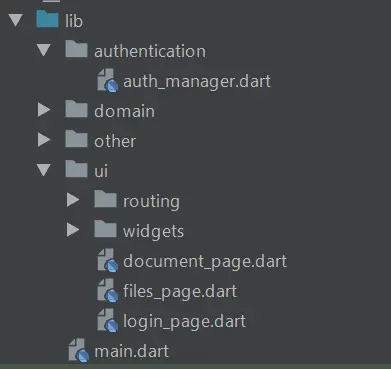
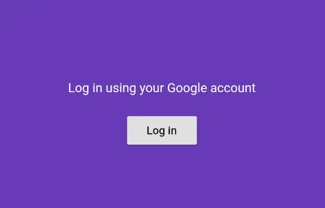
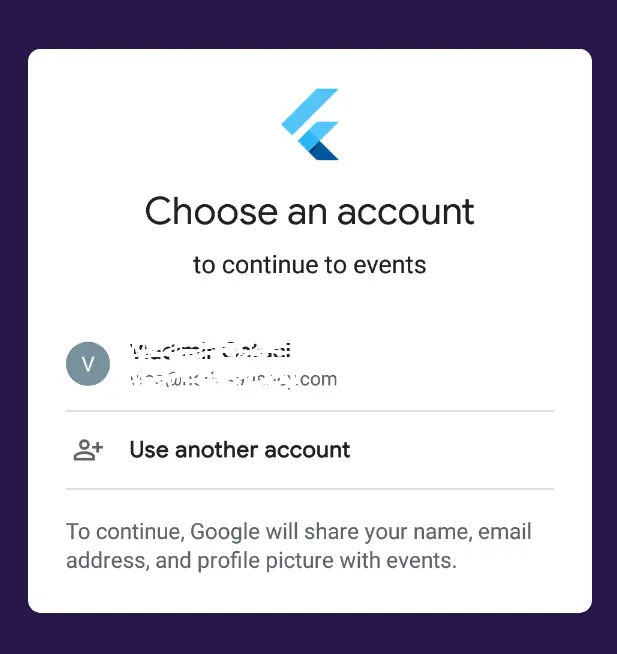
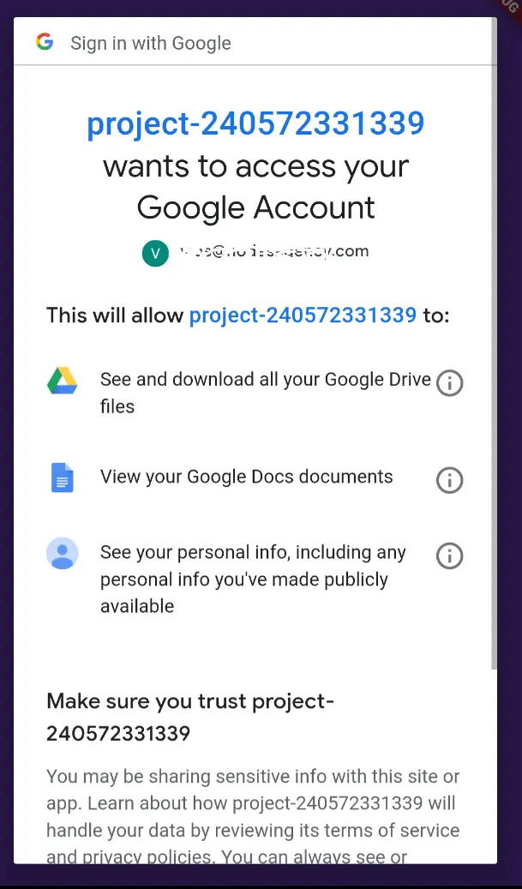
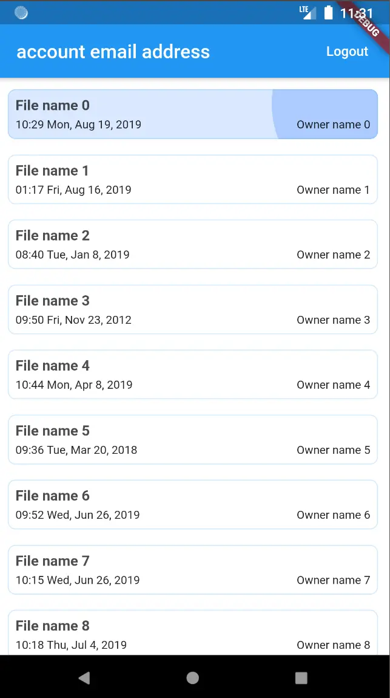
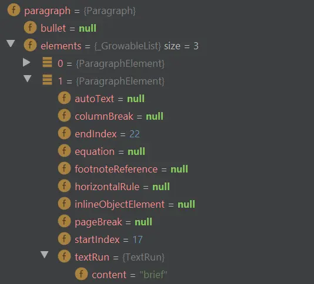
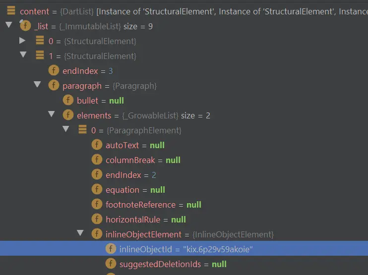
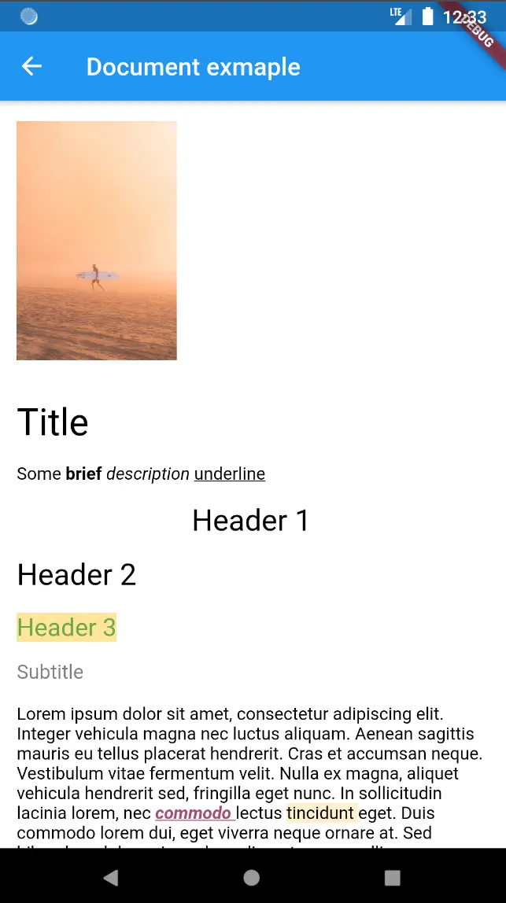
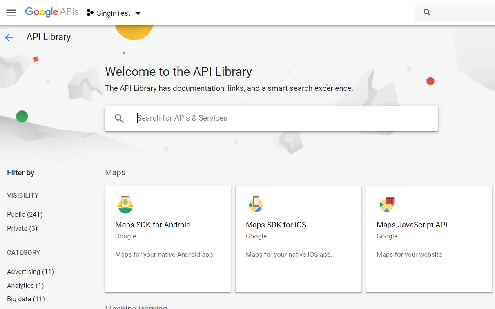

Flutter is a powerful framework when it comes to rendering complex nested widgets with countless styles and customizations. This small project will explain the basics of using Google APIs and Services, in particular Google Drive, Google Docs and rendering a Google Document using Flutter widgets. The app supports basic text styling and displaying of images included in the document. Let's dive in and see how Flutter makes it easy to dynamically structure a complex page without any performance issues.

## About the structure

The project is composed of three pages: LoginPage (handles the user authentication), FilesPage (displays all the Google Docs documents), DocumentPage (displays the content of the document) and AuthManager which handles the authentication that I can reuse in all pages to keep them clean. There are also two custom widgets to display Ripple effect and Circular Progress but I will not cover them because they are used only for convenience.



Let's start with the Login page. I'm using the [google_sign_in](https://pub.dev/packages/google_sign_in) package to handle the user authentication.

## Actual code

The `AuthManager` code is self-explanatory and only makes sure all the errors are handled and defines the `GoogleSignIn` scopes so I'm granted the required permissions to the user account.

- `email` access to user info like email
- `documents.readonly` access to read the documents
- `drive.readonly` access to fetch the list of documents

```dart
import 'package:google_sign_in/google_sign_in.dart';

GoogleSignIn _googleSignIn = GoogleSignIn(
  scopes: <String>[
    'email',
    'https://www.googleapis.com/auth/documents.readonly',
    'https://www.googleapis.com/auth/drive.readonly'
  ],
);

class AuthManager {
  static Future<GoogleSignInAccount> signIn() async {
    try {
      final account = await _googleSignIn.signIn();
      print('account: ${account?.toString()}');
      return account;
    } catch (error) {
      print(error);
      return null;
    }
  }

  static Future<GoogleSignInAccount> signInSilently() async {
    var account = await _googleSignIn.signInSilently();
    print('account: $account');
    return account;
  }

  static Future<void> signOut() async {
    try {
      _googleSignIn.disconnect();
    } catch (error) {
      print(error);
    }
  }
}
```

And this is how our Login page looks like.



```dart
@override
Widget build(BuildContext context) {
  return Scaffold(
    body: Container(
      color: Colors.deepPurple,
      child: Center(
        child: Column(
          mainAxisAlignment: MainAxisAlignment.center,
          children: <Widget>[
            Spacer(),
            Text(
              'Log in using your Google account',
              style: TextStyle(fontSize: 16, color: Colors.white),
            ),
            SizedBox(height: 20.0),
            RaisedButton(
              child: Text('Log in'),
              onPressed: _handleSignIn,
            ),
            Spacer(),
          ],
        ),
      ),
    ),
  );
}
```

When the user enters the Login page I check silently if the user was already signed-in in the past (the Authentication token is cached by the **google_sign_in** package). If the user is already signed-in `AuthManager.signInSilently()` returns the user account and I redirect to the **Files** page.

```dart
Future<void> signInSilently() async {
  var account = await AuthManager.signInSilently();
  if (account != null) {
    Navigator.pushReplacementNamed(context, AppRoute.files);
  }
}
```

In case this is first app launch the user has to tap the **Login** button and the **google_sign_in** package will show the _Account chooser_ and the _Permissions_ dialogs as showed below.





In case the sign-in is successful, the Navigator is used to redirect the user to the Files page:

```dart
Future<void> _handleSignIn() async {
  var account = await AuthManager.signIn();
  if (account != null) {
    Navigator.pushReplacementNamed(context, AppRoute.files);
  }
}
```

`AppRoute` holds the route names. The routing is organized as follows:

```dart
Route onGenerateRoute(RouteSettings settings) {
  switch (settings.name) {
    case AppRoute.login:
      return MaterialPageRoute(
        builder: (context) => LoginPage(),
      );
    case AppRoute.files:
      return MaterialPageRoute(
        builder: (context) => FilesPage(),
      );
    case AppRoute.document:
      final args = settings.arguments as Map;
      return MaterialPageRoute(
        builder: (context) => DocumentPage(fileId: args[Args.fileId]),
      );
    default:
      return null;
  }
}

class Args {
  static const fileId = 'fileId';
}

class AppRoute {
  static const login = '/login';
  static const files = '/files';
  static const document = '/document';
}
```

Let's switch to the Files page. Despite the fact the code looks longer there's only a small important part where I fetch the file list using Google Drive Api. The rest is related to showing the file list UI.

```dart
  Future<void> _loadFiles() async {
    if (_currentUser == null) return;

    GoogleSignInAuthentication authentication =
        await _currentUser.authentication;
    print('authentication: $authentication');
    final client = MyClient(defaultHeaders: {
      'Authorization': 'Bearer ${authentication.accessToken}'
    });
    DriveApi driveApi = DriveApi(client);
    var files = await driveApi.files
        .list(q: 'mimeType=\'application/vnd.google-apps.document\'');
    setState(() {
      _items = files.items;
      _loaded = true;
    });
  }
```

I use the access token retrieved from `GoogleSignInAuthentication` object to access all the Google APIs. One thing to note here is that a custom HTTP client is used so the `Authorization` header is added to all the requests made by the Drive and Docs API clients. An alternative solution can be to use the _googleapis_auth_ package which provides a few other ways to authenticate the user but I thought they required more code to implement.

To display the file list I use a simple ListView widget.

```dart
  Widget get _listView {
    return Container(
      color: Colors.white.withOpacity(0.8),
      child: ListView.separated(
        itemBuilder: (context, index) {
          var item = _items[index];
          final formatter = DateFormat('hh:mm EEE, MMM d, yyyy');

          return Card(
            elevation: 0.0,
            shape: RoundedRectangleBorder(
              side: BorderSide(width: 1.0, color: Colors.blue.withOpacity(0.2)),
              borderRadius: BorderRadius.circular(8.0),
            ),
            color: Colors.white.withOpacity(0.8),
            child: RippleWidget(
              radius: 8.0,
              onTap: () {
                var args = {Args.fileId: item.id};
                Navigator.pushNamed(context, AppRoute.document,
                    arguments: args);
              },
              child: Padding(
                padding: const EdgeInsets.all(8.0),
                child: Column(
                  crossAxisAlignment: CrossAxisAlignment.start,
                  children: <Widget>[
                    Text(
                      item.title,
                      style: TextStyle(
                        fontSize: 15.0,
                        fontWeight: FontWeight.bold,
                        color: Colors.black.withOpacity(0.7),
                      ),
                    ),
                    SizedBox(height: 4.0),
                    Row(
                      children: <Widget>[
                        Expanded(
                          child: Text(
                            formatter.format(item.createdDate),
                            style: TextStyle(
                              fontSize: 12.0,
                            ),
                          ),
                        ),
                        SizedBox(width: 8.0),
                        Text(
                          KtList.from(item.ownerNames).joinToString(),
                          style: TextStyle(
                            fontSize: 12.0,
                          ),
                        ),
                      ],
                    ),
                  ],
                ),
              ),
            ),
          );
        },
        separatorBuilder: (context, index) {
          return SizedBox(height: 8.0);
        },
        itemCount: _items.length,
        padding: const EdgeInsets.all(8.0),
      ),
    );
  }
```



There's also a logout button to log-out the user and open the Login page.

```dart
  _logout() {
    setState(() {
      _currentUser = null;
    });
    AuthManager.signOut();
    Navigator.pushReplacementNamed(context, AppRoute.login);
  }
```

When we tap on a list item the `fileId` is passed to the **Document** page so we can fetch our document using Docs API.
In the Document page first thing called when the user enters the screen is `_loadDocument()` which fetches the document and extracts the data we intend to display. Currently only a small subset of all the document features is supported.

```dart
  Future<void> _loadDocument() async {
    if (_currentUser == null) return;

    GoogleSignInAuthentication authentication =
        await _currentUser.authentication;
    print('authentication: $authentication');
    final client = MyClient(defaultHeaders: {
      'Authorization': 'Bearer ${authentication.accessToken}'
    });

    final docsApi = docsV1.DocsApi(client);
    var document = await docsApi.documents.get(widget.fileId);
    print('document.title: ${document.title}');
    print('content.length: ${document.body.content.length}');
    _parseDocument(document);
  }
```

The [kt_dart](https://pub.dev/packages/kt_dart) package is used to simplify parsing of the interested fields. **kt_dart** wraps Dart List, Map, Set classes with custom classes prefixed with _Kt_ which bring Kotlin operators used in _Kotlin Standard library_ as they are much more complete compared to Dart standard classes.

```dart
  Future<void> _parseDocument(docsV1.Document document) async {
    _documentTitle = document.title;
    var content = KtList.from(document.body.content);

    final elements = content
        .mapNotNull(
          (element) => (element?.paragraph?.elements != null ||
                  element?.paragraph?.positionedObjectIds != null)
              ? element
              : null,
        )
        .asList();

    var inlineObjects = emptyMap<String, DocImageData>();
    if (document.inlineObjects?.isNotEmpty == true) {
      inlineObjects = KtMap.from(document.inlineObjects).map((inlineObject) {
        var embeddedObject =
            inlineObject.value.inlineObjectProperties.embeddedObject;
        return KtPair(
          inlineObject.key,
          DocImageData(
            url: embeddedObject.imageProperties.contentUri,
            width: embeddedObject.size.width.magnitude,
            height: embeddedObject.size.height.magnitude,
          ),
        );
      }).associate((pair) => pair);
    }

    var positionedObjects = emptyMap<String, DocImageData>();
    if (document.positionedObjects?.isNotEmpty == true) {
      positionedObjects =
          KtMap.from(document.positionedObjects).map((positionedObject) {
        var embeddedObject =
            positionedObject.value.positionedObjectProperties.embeddedObject;
        return KtPair(
          positionedObject.key,
          DocImageData(
            url: embeddedObject.imageProperties.contentUri,
            width: embeddedObject.size.width.magnitude,
            height: embeddedObject.size.height.magnitude,
          ),
        );
      }).associate((pair) => pair);
    }

    setState(() {
      _listItems = elements;
      _imagesData = inlineObjects.plus(positionedObjects).asMap();
      _contentLoaded = true;
    });
  }
```

What we are interested in are the paragraph text, inline and positioned images. The text can be found in the `ParagraphElement.textRun.content` field as you can see from the image below.



The inline image id is stored in the `ParagraphElement.inlineObjectElement.inlineObjectId`.



The positioned image ids are stored directly in the document in `Document.positionedObjects`. In our case we treat positioned images and inline images the same and show them inline just to make things easier.
The most important part in all this is probably mapping the Document elements to Flutter Widgets. All of this is happening in `_elementToWidget()` which takes an element we support and create a widget for it.

```dart
  Widget _elementToWidget(docsV1.StructuralElement element) {
    final alignment =
        _getAlignment(element.paragraph.paragraphStyle?.alignment);
    final paragraphSpans = KtList.from(element.paragraph.elements)
        .mapNotNull((element) => element?.textRun)
        .map(
      (textRun) {
        if (textRun.textStyle != null) {
          return TextSpan(
            text: textRun.content,
            style: _getTextStyle(
              element.paragraph.paragraphStyle?.namedStyleType,
              textRun.textStyle,
            ),
          );
        } else {
          return TextSpan(text: textRun.content);
        }
      },
    );
    var paragraphText = paragraphSpans.isNotEmpty()
        ? Container(
            width: double.infinity,
            child: RichText(
              textAlign: alignment,
              text: TextSpan(
                children: paragraphSpans.asList(),
                style: TextStyle(color: Colors.black),
              ),
            ),
          )
        : null;

    var paragraphInlineImages = [];
    if (element.paragraph.elements != null) {
      paragraphInlineImages = KtList.from(element.paragraph.elements)
          .mapNotNull((element) => element.inlineObjectElement?.inlineObjectId)
          .map((String objectId) => _imagesData[objectId])
          .map((DocImageData imgData) {
        return Image.network(
          imgData.url,
          width: imgData.width,
          height: imgData.height,
        );
      }).asList();
    }

    var paragraphPositionedImages = [];
    if (element.paragraph.positionedObjectIds != null) {
      paragraphPositionedImages =
          KtList.from(element.paragraph.positionedObjectIds)
              .map((String objectId) {
        return _imagesData[objectId];
      }).map((DocImageData imgData) {
        return Image.network(
          imgData.url,
          width: imgData.width,
          height: imgData.height,
        );
      }).asList();
    }

    final hasImages = (paragraphInlineImages.isNotEmpty == true) ||
        (paragraphPositionedImages.isNotEmpty == true);

    return hasImages
        ? Column(
            crossAxisAlignment: CrossAxisAlignment.start,
            children: <Widget>[
              ...paragraphInlineImages,
              ...paragraphPositionedImages,
              if (paragraphText != null) paragraphText,
            ],
          )
        : (paragraphText != null) ? paragraphText : Container();
  }
```

Text paragraphs are mapped to `RichText` widgets so they can support text styles (bold, italic), colors, alignment, size, background color. The images are displayed without any modifications by only applying the provided size.



The widgets are displayed in a LitView lazily. This way we don't create all the widgets at once but only as the user scrolls the page.

In order to run this project you will need to create a Firebase project and download the `google-services.json`. The process is also described in [googleapis_auth](https://pub.dev/packages/googleapis_auth) and [google_sign_in](https://pub.dev/packages/google_sign_in) pages.
Remember to also enable the Google Docs and Google Drive services in **APIs and Services** (console)[https://console.developers.google.com]. The services will usually take around 5-10 minutes to be enabled.



And last but not least we have to configure the **support email** in your newly created Firebase project otherwise the APIs will return _ApiException 12500_ error and not work ([setting support email in Firebase](https://stackoverflow.com/a/56313867/1502079)).

The [source code](https://github.com/nodes-android/google-docs-viewer-flutter) for this project is available on [GitHub](https://github.com/nodes-android/google-docs-viewer-flutter).
