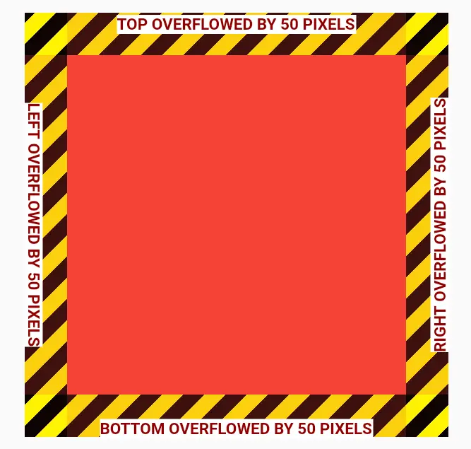
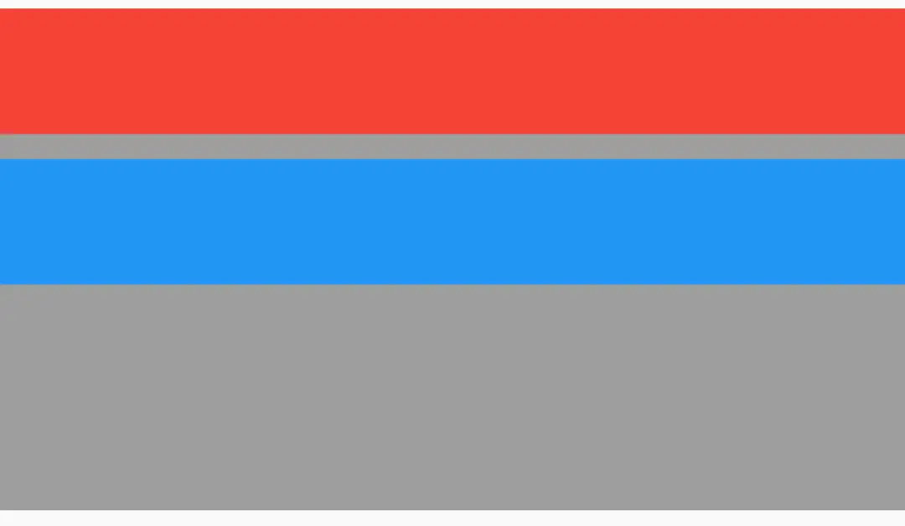

Flutter's size-restricted container components include `ConstrainedBox`, `UnconstrainedBox`, `SizedBox`, `AspectRatio`, `FractionallySizedBox`, `LimitedBox`, and `Container`. These components can constrain the size of sub-components, one by one introduced below.

## ConstrainedBox

The `ConstrainedBox` component constrains the maximum width and height of the subcomponents. If a component has a width and height of 300, it is wrapped in a `ConstrainedBox`, and a maximum width and height constraint is added to the `ConstrainedBox`. The usage is as follows:

```dart
ConstrainedBox (
  constraints: BoxConstraints (maxHeight: 60, maxWidth: 200),
  child: Container (height: 300, width: 300, color: Colors.red),
)
```

At this point, the subcomponent cannot break through the maximum width and height set by `BoxConstraints`, and the effect is as follows:


The default values of `BoxConstraints` are as follows:

```dart
const BoxConstraints ({
  this.minWidth = 0.0,
  this.maxWidth = double.infinity,
  this.minHeight = 0.0,
  this.maxHeight = double.infinity,
});
```

`BoxConstraints` provides convenient construction functions for developers to call, such as `BoxConstraints.tight (Size size)` and `BoxConstraints.expand ()`.
If `BoxConstraints` are nested, there are 2 `ConstrainedBoxes` as follows:

```dart
ConstrainedBox (
  constraints: BoxConstraints (maxHeight: 60, maxWidth: 200),
  child: ConstrainedBox (
    constraints: BoxConstraints (maxHeight: 100, maxWidth: 240),
    child: Container (height: 300, width: 300, color: Colors.red),
  ),
)
```

Taking the maximum width as an example, the `maxHeight` value of the first `BoxConstraints` is 60, which means that the maximum height of the child controls is 60, and the `maxHeight` value of the second `BoxConstraints` is 100. Since the second `BoxConstraints` is also subject to the first Constraints, so the maximum height of the second `BoxConstraints` can only be 60, the maximum height of the final subcomponent is 60, and the maximum width of the same is 200, so the final value of the multi-level `BoxConstraints` nested constraint maximum value is equal to multiple `BoxConstraints` constraints The minimum value. Similarly, the minimum value of nested constraints is equal to the maximum value of multiple `BoxConstraints` constraints.

## UnconstrainedBox

The `UnconstrainedBox` component does not impose any constraints on the child components. For example, there is a parent component whose size is 200x200, and the child component is `UnconstrainedBox`. The `UnconstrainedBox` wraps a 300x300 component. The code is as follows:

```dart
Container (
  height: 200,
  width: 200,
  child: UnconstrainedBox (
    child: Container (height: 300, width: 300, color: Colors.red),
  ),
)
```

The effect is as follows:



Note: The yellow area indicates that the child control is beyond the area of the parent control. The yellow area will only exist in debug mode, and only the red area in release mode.
Although `UnconstrainedBox` does not limit the size of its child controls, it is still constrained by the parent control, and the area beyond the parent control will be intercepted.
`UnconstrainedBox` allows to set the alignment, the usage is as follows:

```dart
UnconstrainedBox (
  alignment: Alignment.topLeft,
  ...
)
```

The effect is as follows:


Compared with the previous picture, this time the left and upper sides did not exceed the area, and the right and lower sides exceeded 100px.

## SizedBox

`SizedBox` is a component with a fixed width and height, directly specify the specific width and height, the usage is as follows:

```dart
SizedBox (
  height: 60,
  width: 200,
  child: RaisedButton (
    child: Text ('this is SizedBox'),
  ),
)
```

We can also set an infinite size, as follows:

```dart
SizedBox (
  height: double.infinity,
  width: double.infinity,
  ...
)
```

Although the infinite size is set, will the child controls be infinitely long? No, no, the child control will still be constrained by the parent component, will expand to the size of the parent component, and there is a convenient way to set this method:

```dart
SizedBox.expand (
  child: RaisedButton (
    child: Text ('this is SizedBox'),
  ),
)
```

`SizedBox` can have no sub-components, but it will still take up space, so `SizedBox` is very suitable for controlling the gap between 2 components, the usage is as follows:

```dart
Column (
  children: <Widget> [
    Container (height: 30,),
    SizedBox (height: 10,),
    Container (height: 30,),
  ],
)
```

## AspectRatio

The `AspectRatio` component is a component with a fixed aspect ratio. If the width of the component is fixed, the height is expected to be 1/2 of the width. `AspectRatio` can be used to achieve this effect.

```dart
AspectRatio (
  aspectRatio: 2/1,
  child: Container (color: Colors.red),
)
```

The `aspectRatio` parameter is the aspect ratio. It can be written directly as a fraction or as a decimal, but it is recommended to write it as a fraction, which is more readable. The effect is as follows:


## FractionallySizedBox

When we need a control whose size is relative, for example, the width of the current button accounts for 70% of the parent component, we can use `FractionallySizedBox` to achieve this effect.
Wrap the child control with `FractionallySizedBox`, set the `widthFactor` width coefficient or `heightFactor` height coefficient, the coefficient value range is 0-1, 0.7 means 70% of the parent component, the usage is as follows:

```dart
FractionallySizedBox (
  widthFactor: .7,
  child: RaisedButton (
    child: Text ('button'),
  ),
)
```

The position of the sub-component is controlled by the `alignment` parameter. The default is center, and the usage is as follows:

```dart
FractionallySizedBox (
  alignment: Alignment.centerLeft,
  ...
)
```

If you want the interval between 2 controls to be 10% of the current parent control, you can use `FractionallySizedBox` without child controls, the usage is as follows:

```dart
Container (
  height: 200,
  color: Colors.grey,
  child: Column (
    children: <Widget> [
      Container (
        height: 50,
        color: Colors.red,
      ),
      Flexible (
        child: FractionallySizedBox (
          heightFactor: .1,
        ),
      ),
      Container (
        height: 50,
        color: Colors.blue,
      ),
    ],
  ),
)
```

The effect is as follows:



## LimitedBox

The `LimitedBox` component limits its size when it is not constrained by the parent component. What does it mean by not being constrained by the parent component? Like the other components introduced in this article, they will constrain the child components. The unconstrained parent components are `ListView`, `Row`, `Column`, etc. If the parent component of the `LimitedBox` is constrained, the `LimitedBox` will not do anything at this time. Think that without this component, the code is as follows:

```dart
Container (
  height: 100,
  width: 100,
  child: LimitedBox (
    maxHeight: 50,
    maxWidth: 100,
    child: Container (color: Colors.green,),
  ),
)
```

The effect is as follows:


The width and height set by the `LimitedBox` are not square. At this time, the effect is square, indicating that the `LimitedBox` has no effect.
Add the `Container` component directly in the `ListView` as follows:

```dart
ListView (
  children: <Widget> [
    Container (
      color: Colors.green,
    ),
    Container (
      color: Colors.red,
    ),
  ],
)
```

At this time, you will find that there is nothing, because when the container is not constrained, the size will be set to 0, just wrap the `Container` in the `LimitedBox`:

```dart
ListView (
  children: <Widget> [
    LimitedBox (
      maxHeight: 100,
      child: Container (
        color: Colors.green,
      ),
    ),
    LimitedBox (
      maxHeight: 100,
      child: Container (
        color: Colors.red,
      ),
    ),
  ],
)
```

effect:


## Container

The `Container` component should be one of the most commonly used components. The `Container` component can directly set its width and height. The usage is as follows:

```dart
Container (
  height: 100,
  width: 100,
  ...
)
```

The `Container` component is the one with the most attributes in these components, and of course the one with the most complex usage. There is an opportunity to write another article introduction, [Official Document](https://api.flutter.dev/flutter/widgets/Container-class.html).

## Summary

With so many constrained container components, which one should you use? Summarized as follows:

`ConstrainedBox`: It is suitable for setting the maximum / small width and height, the size of the sub-component since the component size, but it cannot exceed the set limit.  
`UnconstrainedBox`: Not used much, as a child component of ConstrainedBox can "break through" the constraints of ConstrainedBox, and parts that exceed the limit will be intercepted.  
`SizedBox`: It is suitable for the case of fixed width and height, and is often used as a gap between two components.  
`AspectRatio`: Applicable to fixed aspect ratio.  
`FractionallySizedBox`: Applies to the percentage of parent components.  
`LimitedBox`: Applicable when there is no parent component constraint.  
`Container`: Applicable to situations where there are not only size constraints, but also decorations (colors, borders, etc.), inner and outer margins, etc.
