This article introduces 4 tools that can greatly improve the efficiency of Flutter development.

## 1. Powerful logging package

Printing logs during `Flutter` development is one of the commonly used debugging methods, but the log printing built in `Flutter` is very simple. Here we recommend a powerful package: `Logger`.

**`Logger`** is an easy to use and extensible logger, it can print beautiful logs and can divide the log into different levels.

```dart
    var logger = Logger();
    logger.v("Verbose log");
    logger.d("Debug log");
    logger.i("Info log");
    logger.w("Warning log");
    logger.e("Error log");
    logger.wtf("What a terrible failure log");
```


[Logger Pub](https://pub.dev/packages/logger)

## 2. Convert JSON data to model

The data returned from a network request is usually in `JSON` format, so it is particularly important to convert the `JSON` format to `model`.

Assume the `JSON` string as follows:

```json
{
  "name": "monstar",
  "age": 14,
  "email": "monstar@example.com"
}
```

Define its corresponding `Model` class: `User`:

```dart
class User {
  final String name;
  final int age;
  final String email;

  User({this.name, this.age, this.email});

  @override
  String toString() {
    return 'name:$name,age:$age,email:$email';
  }
}
```

For parsing:

```dart
String jsonStr = "{\"name\":\"monstar\",\"age\":14,\"email\":\"monstar@example.com\"}";
    var jsonMap = json.decode(jsonStr);
    var user =
        User(name: jsonMap['name'], age: jsonMap['age'], email: jsonMap['email']);
    print('$user');
```

Console output:

```
flutter: name:monstar,age:14,email:monstar@example.com
```

In the case above, there are only three fields in `JSON`. There are often many fields in real life use cases, and writing code by hand is not only error-prone, but also extremely inefficient.

For this situation, `Google` offers a solution: **`json_serializable`**.

But it is cumbersome by this way ([json_serializable Pub](https://pub.dev/packages/json_serializable)), we do not recommend it. Instead, we recommend a simpler plugin named **`JsonToDart`**.

In `Android Studio` install `JsonToDart`, select `Preferences (Mac)` or `Setting (Windows)`, then select `Plugins` and search for `JsonToDart`.

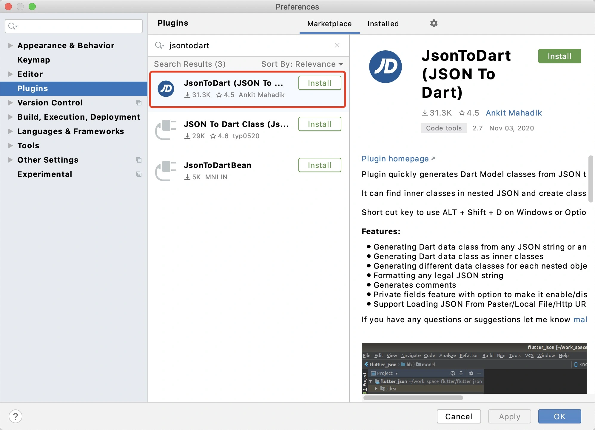

Click `Install` and after the installation is completed, restart Android Studio. If the search fails, you can download it from the [official website](https://plugins.jetbrains.com/plugin/12562-jsontodart-json-to-dart-) and install it.

Once installed, select the directory, right-click and select `New->Json to Dart`.


Then the `JSON` input screen appears:

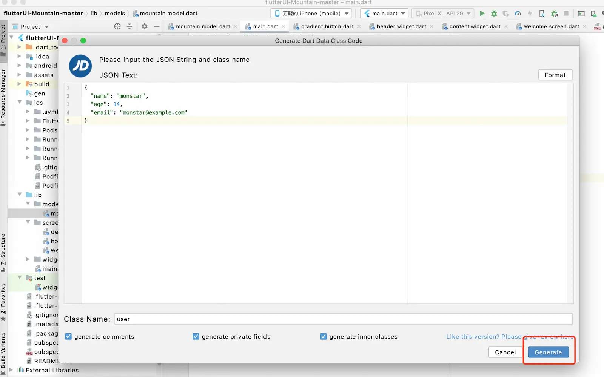

In this screen input the `JSON` content and file name, click the **`Generate`** button to generate a file named `user.dart`.

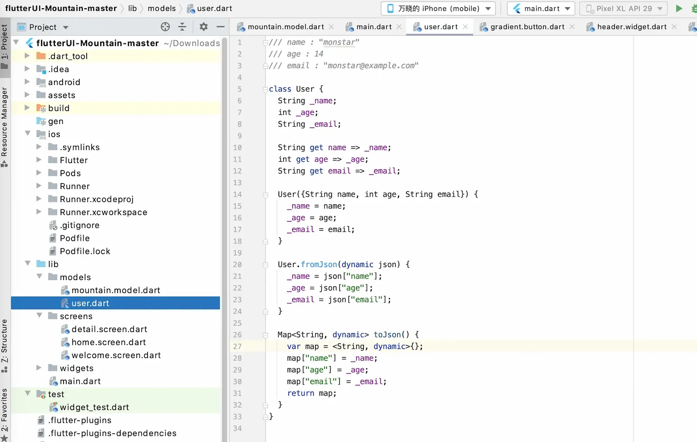


## 3. View UI effects on phones with different resolutions

The biggest advantage of `Flutter` development is that it is cross-platform.

When the development is complete, you want to see the effects on different resolutions of the phone. Should you buy one for each phone to test?

No, using **`device_preview`** allows you to view the interface of different resolution devices on a single device.

#### How to use

First you need to import the dependent library into the project, open the file: `pubspec.yaml`, and add the reference library:

```yaml
dependencies:
  device_preview: ^0.5.4
```

Then execute the following command from the command line:

```shellscript
$ flutter pub get
```

Finally here is a sample code on how to use it:

```dart
import 'package:device_preview/device_preview.dart';

void main() => runApp(
  DevicePreview(
    enabled: !kReleaseMode,
    builder: (context) => MyApp(), // Wrap your app
  ),
);

class MyApp extends StatelessWidget {
  @override
  Widget build(BuildContext context) {
    return MaterialApp(
      locale: DevicePreview.locale(context), // Add the locale here
      builder: DevicePreview.appBuilder, // Add the builder here
      home: HomePage(),
    );
  }
}
```

#### Demo


- Interface effect display is supported under different devices (iPhone, iPad, Mac, Windows, Linux).

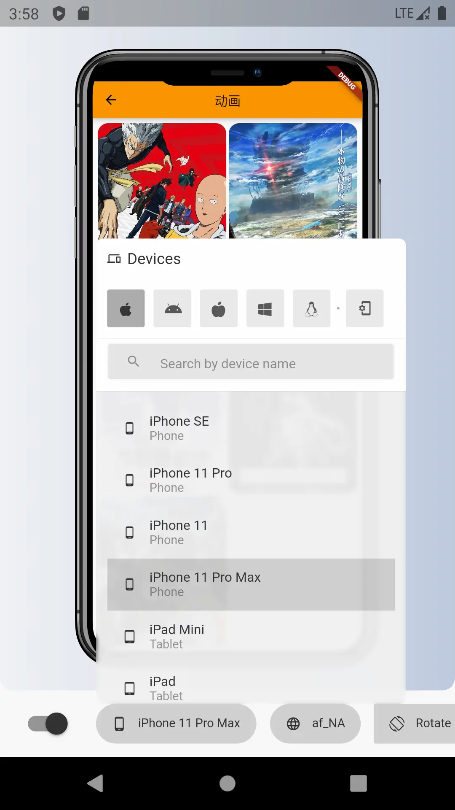

- Dynamic system configuration: language, dark mode, text scaling.

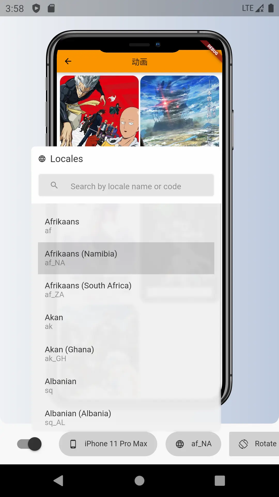

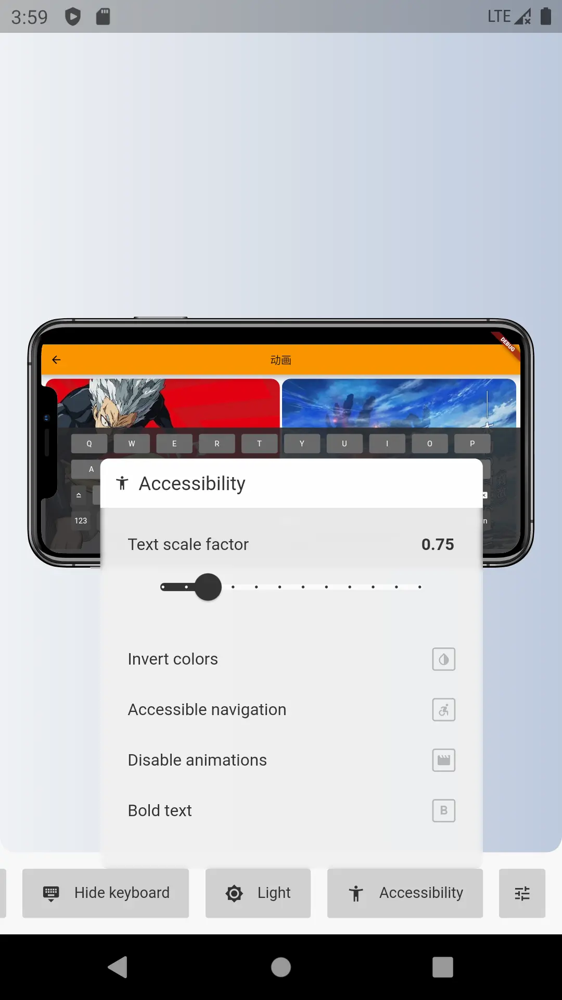

- Change device direction.

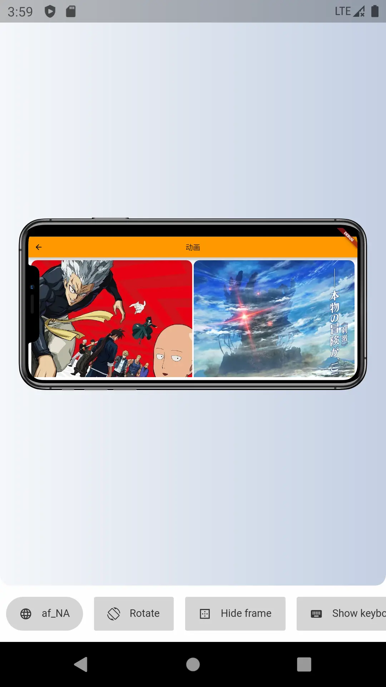

- Virtual keyboard pop-up effect.

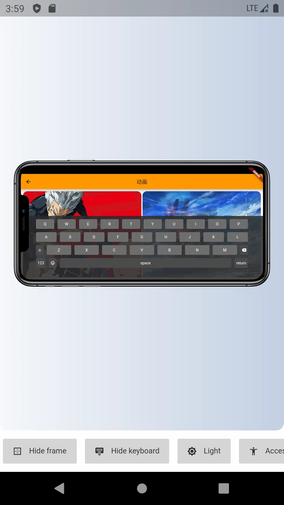

- Screenshots.

[Device_preview Pub](https://pub.dev/packages/device_preview)

## 4. Localization package

**`Intl`** can localize your `Flutter` project quickly.

### How to use

If you use `Android Studio`, you only need to install this plugin: `Flutter Intl`.

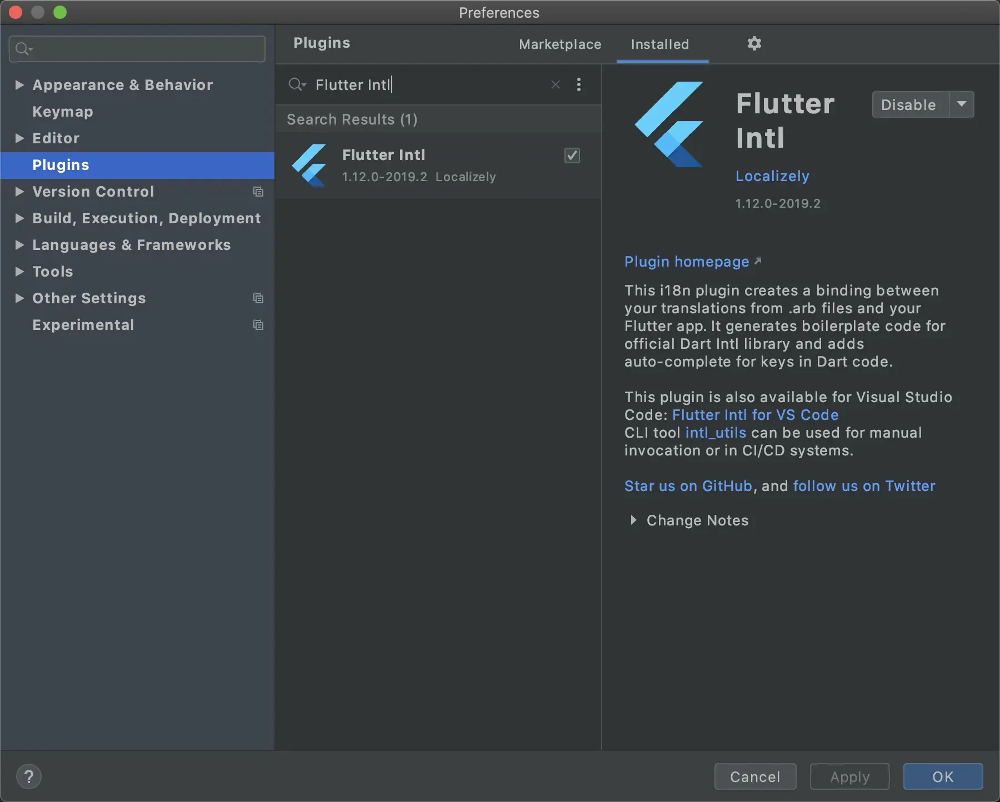

For `Visual Studio Code` there is also a corresponding plugin: `Flutter Intl`.

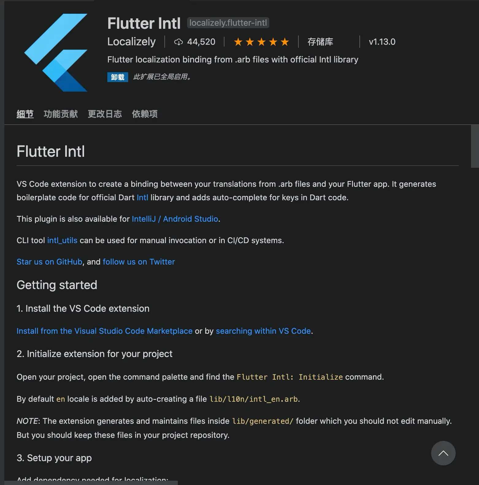

After installing the plugin, you need to add the dependency library to the `pubspec.yaml` file：

```yaml
dev_dependencies:
    ...
  flutter_localizations:
    sdk: flutter
```

Then execute the command:

```shellscript
$ flutter pub get
```

Using `Android Studio` as an example, open `Tool->Flutter Intl -> Initalize for the project` to add localization support for the project. The plugin automatically alters the file `pubspec.yaml`, and generates **generated** and **l10n** two file directories under `lib`.

- Directory **intl** under **generated** generates `messages_all.dart` and `messages_en.dart` by default. The file at the beginning of **messages_xxx.dart** does not require manual modification and is automatically generated.
- Directory **I10n.dart** under **generated** is implementation of `Localizations` and `Delegate`, does not require manual modification and is automatically generated.
- **intl_en.arb** exists under **l10n**, the text is stored here。

If you want to add a language，open `Tool->Flutter Intl -> Add Locale`, input the language abbreviation to be supported, and the plugin will automatically generate the relevant file, as shown in the screenshot below, adding support for Chinese：

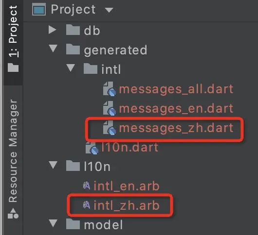

With localization, you need to add package dependencies in the file `pubspec.yaml`:

```yaml
dependencies:
  flutter:
    sdk: flutter
  flutter_localizations:
    sdk: flutter
```

Then execute the command:

```shellscript
$ flutter pub get
```

Modify `MaterialApp` as follows:

```dart
...
import 'generated/l10n.dart';

...
MaterialApp(
  ...
  localizationsDelegates: [
    S.delegate,
    GlobalMaterialLocalizations.delegate,
    GlobalWidgetsLocalizations.delegate,
    GlobalCupertinoLocalizations.delegate,
  ],
  supportedLocales: S.delegate.supportedLocales,
  ...
)
```

Add text under **intl_en.arb** and **intl_zh.arb**, for example: `cartoon_title`

intl_en.arb

```json
{
  "cartoon_title": "cartoon"
}
```

intl_zh.arb

```json
{
  "cartoon_title": "动画"
}
```

Use `command + s (Mac)` to save, The associated files under the **generated** directory will be generated again.
Here is an example of how to use it:

```dart
    ...
    Text('${S.of(context).cartoon_title}');
    ...
```

The effect looks like the following:


## Reference

- [Logger Pub](https://pub.dev/packages/logger)
- [JSON Serializable Pub](https://pub.dev/packages/json_serializable)
- [JSON to Dart Plugin](https://plugins.jetbrains.com/plugin/12562-jsontodart-json-to-dart-)
- [Device preview Dart Pub](https://pub.dev/packages/device_preview)
- [Flutter Intl Plugin](https://plugins.jetbrains.com/plugin/13666-flutter-intl)
- [Intl Pub](https://pub.dev/packages/intl)

_[Source of the header image](https://proandroiddev.com/building-your-ios-android-app-in-30-minutes-using-flutter-2ec61b78a1e5)_
