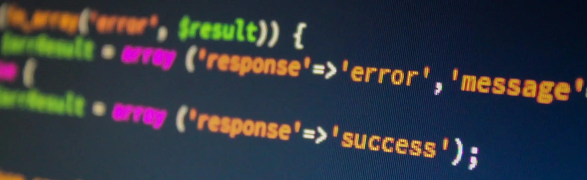
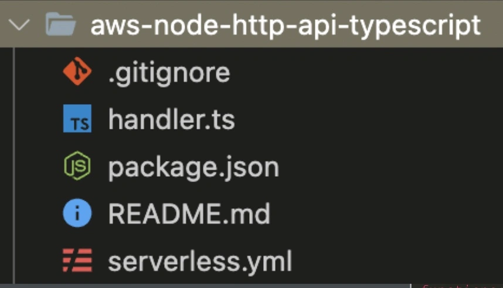

<!-- summary -->

As a frontend engineer, learning to become a full stack engineer can seem like a daunting task. However, with the right tools and knowledge, it's possible to build scalable, production-ready web applications that incorporate both frontend and backend logic and functionality. This article will explore how to use Universal JavaScript tech stacks, with the Serverless Framework for Infrastructure and API Functions, and GitHub Actions for CI/CD to build full stack applications.

---

## Introduction

This article is based on an actual case of a successfully released project. From personal experience, that project was a great training for a frontend engineer. It provides the opportunity to expand their skills from developing single-page applications to developing APIs, cloud infrastructure, and DevOps, among other areas. Let's look at the key aspects that a frontend engineer could start with for the path of the full stack.

## Learn Universal JavaScript/Typescript tech stacks



One of the keys to building full stack applications as a frontend engineer is to use a Universal JavaScript or Typescript tech stack. Universal JavaScript is a paradigm that enables developers to write JavaScript code that can run on both the client and the server side. This approach allows frontend engineers to begin writing server-side code without having to learn a new language. Moreover, since both sides are written by the same team, which can reduce many unnecessary communications and make development faster and more efficient. Some popular Universal JavaScript tech stacks include React, Node.js, and OpenAPI.

## Use Serverless Framework for Infrastructure and API Functions


Once you have applied Universal JavaScript, the next step is to set up the infrastructure and incorporate server-side functionality into your application. A popular way to do this is to use Serverless Framework.

### About Serverless Framework

The Serverless Framework is an open-source, developer-friendly framework for building and deploying serverless applications. It provides an easy-to-use, consistent, and vendor-agnostic way to define, deploy, and manage serverless functions and resources, making it easy for developers to build and run cloud-native applications.

Serverless Framework is based on the **Infrastructure as Code (IaC)** concept. Comparing it with other IaC services can help to understand its strengths.

|                        |  |  |  |
| ---------------------- | -------------------------------------------------------------------------------------------------------- | ------------------------------------------------------------------------------------------------------ | ---------------------------------------------------------------------------------------------------------------- |
|                        | Serverless                                                                                               | Terraform                                                                                              | CloudFormation                                                                                                   |
| Infrastructure as Code | YAML/JSON config files                                                                                   | HCL/JSON config files                                                                                  | YAML/JSON config files                                                                                           |
| Platforms              | AWS, Azure, Google Cloud, etc                                                                            | AWS, Azure, Google Cloud, etc                                                                          | AWS only                                                                                                         |
| Focus                  | **All-in-one development solution** for cloud-native applications                                        | Provision, change, and version resources on **ANY environment**.                                       | Provision, manage AWS and third-party resources                                                                  |

### A Quick Sample of Serverless Framework

Let’s take a look at a sample Lambda-based API created using the Serverless Framework. You can find more sample codes [here](https://github.com/serverless/examples)

As you can see from the sample code folder structure, a serverless project consists of two main parts: the application code and the configuration file for the infrastructure.


The **handler.ts** file creates an API that responds a simple message.

```
import { APIGatewayProxyEvent, APIGatewayProxyResult } from "aws-lambda";

export const hello = async (
 event: APIGatewayProxyEvent
): Promise<APIGatewayProxyResult> => {
 return {
   statusCode: 200,
   body: JSON.stringify(
     {
       message: "Hello Serverless!",
       input: event,
     },
     null,
     2
   ),
 };
};
```

In the **serverless.yml** file, infrastructure can be defined simply by specifying the function and its related handler file. Other resources such as the API Gateway will be created automatically.

```
service: serverless-http-api-typescript
frameworkVersion: '3'

provider:
 name: aws
 runtime: nodejs14.x

functions:
 hello:
   handler: handler.hello
   events:
     - httpApi:
         path: /
         method: get

plugins:
 - serverless-plugin-typescript
```

Then by a single magic command **`$serverless deploy`**, your API will be ready to use.

Plugins can also be used to enable additional cloud resources and functionality. In the above case, typescript plugin was added. In our real project, we added plugins for backend to use RDS, Data API, SQS, etc. For the frontend, since it's a `Sveltkit` based SPA, another plugin was used to deploy the built files to S3 and create a related Cloudfront distribution.

These features are extremely helpful to frontend engineers who may have limited knowledge of infrastructure and backend development, allowing us to begin full stack development with minimal prerequisites.

### Summary of Serverless Framework

To summarize, these are the main features of Serverless Framework:

- Infrastructure as Code: The framework allows developers to define their infrastructure and resources as code, using a configuration file, which can be version controlled, tested, and easily shared among team members.

- Easy Deployment: The framework makes it easy to deploy your serverless application with a single command, and automates the packaging, deployment, and resource management tasks.

- Plugin Architecture: The framework provides a plugin architecture that allows developers to extend and customize the functionality of the framework, by adding new plugins, or creating their own.

- Local Development: The framework enables developers to test and debug their serverless applications locally, using the Serverless Offline plugin.

Overall, the Serverless Framework provides a great set of tools and features that make it easier for developers to build and deploy serverless applications, by providing a consistent and unified way to manage and deploy cloud resources.

## Set up GitHub Actions with Serverless Framework for CI/CD

To ensure that your full stack applications are reliable and stable, it's important to use continuous integration and continuous deployment (CI/CD) practices. GitHub Actions is a popular CI/CD tool that integrates well with the Serverless Framework. With GitHub Actions and the Serverless Framework, you can set up automated testing, linting, and deployment processes that ensure your code is always up-to-date and running smoothly.

### Workflow for CI

First, once a new PR was created, it will run jobs for lint and test. A **static code analysis** scan was also conducted in the end. Developers can then fix any detected issues even without requiring a manual code review, as all test and scan results will be updated in the PR conversation.

_check.yml:_

```
name: status check

on:
  pull_request:
    types: [opened, synchronize, reopened]

jobs:
  check:
    name: lint and check App
    runs-on: ubuntu-latest
    environment: develop
    steps:
      - name: Checkout
        uses: actions/checkout@v3
        with:
          fetch-depth: 0

      - uses: actions/setup-node@v3
        with:
          node-version: 16.x

      - name: Install Dependencies
        run: npm install

      - name: Make envfile
        uses: SpicyPizza/create-envfile@v1.3
        with:
          envkey_VITE_EXAMPLE: test

      - name: Build
        run: npm run build
        env:
          CI: true

      - name: check format & lint
        run: npx lint-staged

      - name: test and coverage
        run: npm run coverage

      - name: SonarCloud Scan
        uses: sonarsource/sonarcloud-github-action@master
        env:
          GITHUB_TOKEN: ${{ secrets.GITHUB_TOKEN }}
          SONAR_TOKEN: ${{ secrets.SONAR_TOKEN }}
```

### Workflow for CD

The deploy jobs run when a PR is merged to a target branch. Before and after the deployment, notifications are sent via Slack to inform about the status of the deployment. Environment variables, such as AWS and Slack keys, can be configured in the **Environments** of the GitHub Repo settings. Behind the deploy command _`npm run deploy:staging`_ is the script defined in **package.json** :

```
"deploy:staging": "serverless deploy --stage staging"
```

_deploy-staging.yml:_

```
name: Deploy - Staging

on:
  push:
    branches:
      - develop

concurrency:
  group: staging
  cancel-in-progress: false

jobs:
  deploy:
    name: Deploy App
    runs-on: ubuntu-latest
    environment: develop
    steps:
      - name: Post to a Slack channel
        id: slack
        uses: slackapi/slack-github-action@v1.21.0
        with:
          channel-id: ${{ secrets.SLACK_BOT_POST_CHANNEL }}
          slack-message: 'FRONTEND STAGING RELEASE started'
        env:
          SLACK_BOT_TOKEN: ${{ secrets.SLACK_BOT_OAUTH_TOKEN }}
      - uses: actions/checkout@v3
      - uses: actions/setup-node@v3
        with:
          node-version: 16.x
      - uses: aws-actions/configure-aws-credentials@v1
        with:
          aws-access-key-id: ${{ secrets.AWS_ACCESS_KEY_ID }}
          aws-secret-access-key: ${{ secrets.AWS_SECRET_ACCESS_KEY }}
          aws-region: ${{ secrets.AWS_REGION }}
      - name: install
        run: npm install
      - name: Make envfile
        uses: SpicyPizza/create-envfile@v1.3
        with:
          envkey_VITE_ENVIRONMENT: ${{ secrets.VITE_ENVIRONMENT }}
          ...
           # .env variables here - name: deploy
      - name: deploy
        run: npm run deploy:staging
      - name: Post to a Slack channel - success
        if: success()
        id: slack-success
        uses: slackapi/slack-github-action@v1.21.0
        with:
          channel-id: ${{ secrets.SLACK_BOT_POST_CHANNEL }}
          slack-message: 'FRONTEND STAGING RELEASE finished'
        env:
          SLACK_BOT_TOKEN: ${{ secrets.SLACK_BOT_OAUTH_TOKEN }}
      - name: Post to a Slack channel - failure
        if: failure()
        id: slack-failure
        uses: slackapi/slack-github-action@v1.21.0
        with:
          channel-id: ${{ secrets.SLACK_BOT_POST_CHANNEL }}
          slack-message: 'FRONTEND STAGING RELEASE failed'
        env:
          SLACK_BOT_TOKEN: ${{ secrets.SLACK_BOT_OAUTH_TOKEN }}

```

## Keep learning and practicing

Becoming a full stack engineer is an ongoing process of learning and practice. Keep up with the latest trends and technologies in both front-end and back-end development, and always be looking for ways to improve your skills. Join online communities, attend conferences and meetups, and collaborate with other team members to stay up-to-date and continue to grow as a full stack engineer.

To truly master full stack development, you'll need to build more full stack projects. Start by creating small projects that allow you to practice integrating front-end and back-end code. As you gain confidence, you can move on to larger, more complex projects that require you to use a wider range of tools and skills.

In conclusion, applying Universal JavaScript, the Serverless Framework, and GitHub Actions can help to build scalable, cloud-native applications effectively. By mastering these tools and building full stack projects, you can become a more valuable and versatile member of any development team.

_Article Photo by [Midjourney](https://www.midjourney.com/)_
