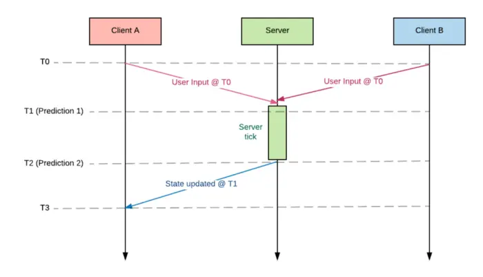
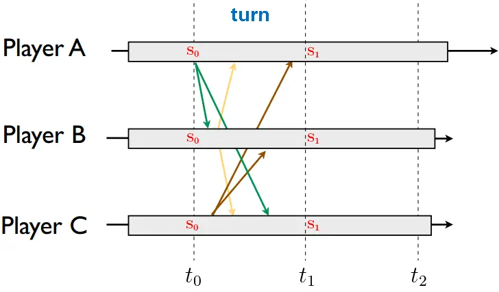
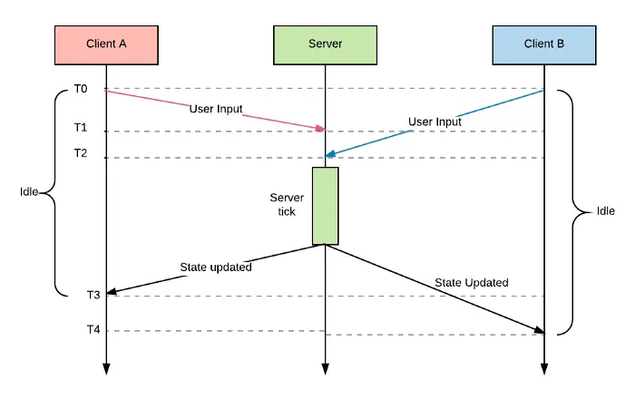
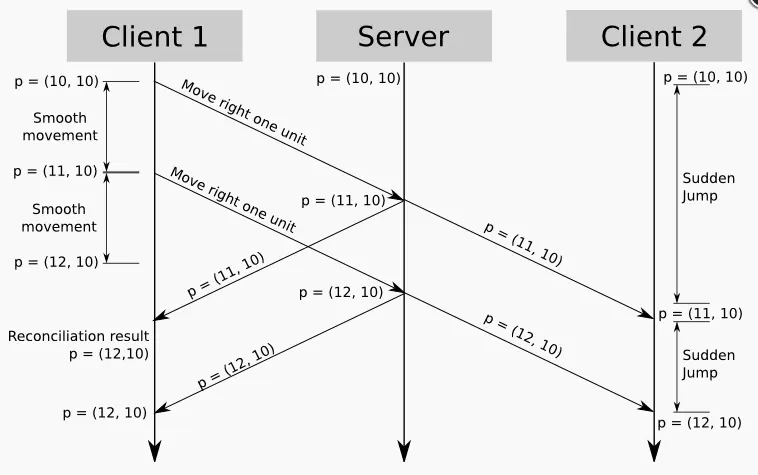

Multiple players interacting at the same time in a game room will generate a lot of data that needs to be synchronized, such as each player's basic data, change data, skill performance data, damage data, map data, monster data, etc. According to the refresh rate of the game's FPS, it needs to be synchronized to each client in a very short time, so two mainstream synchronization methods are produced: `frame synchronization` and `state synchronization`.

## What is frame synchronization?

It is usually used in real-time strategy and battles that require very high real-time performance. It synchronizes the player's operation instructions which include the previous frame index. The client uploads the operation to the server, and the server does not calculate the game behavior after receiving it. It is forwarded to all clients. The most important concept here is that the `same input + the same timing = the same output`. The process of realizing frame synchronization is generally:

1. **Synchronize the random number seed**. In games, the use of random numbers is common. By synchronizing the random number seeds, the consistency of those can be maintained.
2. **Client uploads the operation instructions**. Instructions include game operations and current frame index.
3. **The server broadcasts all client operations**. If there is no operation, it also broadcasts a null command to drive the game frame forward.
4. **Because of the frame synchronization feature, we can easily replay the battle**. The server records all operations, and the client requests the operation file to execute it again.

### Advantages of frame synchronization

1. Save the amount of messages, each message transfer only needs to be accompanied by operation information, and the message package for state synchronization needs to be accompanied by various state information.
2. It is convenient to realize the synchronization problem of real-time battle games under weak networks, and the battle can be maintained with as few messages as possible.
3. To reduce the calculation pressure of the server, the state of the battle is synchronized, the server needs to calculate all the battle logic.
4. Improve development efficiency, because the server can only rebroadcast messages, and the client can also be separated from the server during development.
5. Obtain better expressive power in terms of client performance, because the client has obtained more performance management permissions, and does not have to be hard driven by data.
6. It is very convenient to make battle videos. With the initial information of the battle and the list of battle frames, the battle process can be perfectly reproduced.

### Choice of network protocol

- [TCP](https://en.wikipedia.org/wiki/Transmission_Control_Protocol): The message is stable, but slow. It is suitable for games that are not instantaneous and communication is not intensive, such as cards.
- [UDP](https://en.wikipedia.org/wiki/User_Datagram_Protocol): Message delivery is fast, but unstable, prone to packet loss and disorder. It is suitable for the key technology in the frame synchronization design of games with strong real-time, random value pseudo-random algorithm. Safe use of UDP protocol.

## What is state synchronization?

To synchronize various states in the game, the client uploads operations to the server, the server calculates the results, broadcasts various states in the game and the client displays the content according to the state after receiving the state.
State synchronization is widely used in turn-based games and it is actually a loose synchronization. In its thinking, the consistency of the performance of different players on the screen is not an important indicator, as long as the result of each operation is the same.

Therefore, state synchronization does not require high network delay. Like playing RPG games, 200-300ms delay is also acceptable. But in RTS games, the 50ms delay is also obvious. For example, while on the move, a delay has passed after 50ms. During this process, client B needs to do some smooth processing locally, and finally make the movement normal. In a state-synchronized game, the damage is often displayed after the attack is over, because it needs to wait for the server calculation to end through special effects animation.

### Advantages of state synchronization

1. It is relatively simple, the client only needs to synchronize data according to the push of the server.
2. There are almost no plug-ins, because all operations are checked by the server.
3. It is suitable for some games with small real-time synchronization data: such as RPG, hang-up, chess and other game types.
4. Client-side development is less difficult, and problems are better positioned for debugging and development.

## Comparison of the two designs

|                   | State synchronization                  | Frame synchronization                       |
| ----------------- | -------------------------------------- | ------------------------------------------- |
| Flow rate         | Very high                              | Relatively low                              |
| Combat playback   | The record file is large               | The record file is small                    |
| Security          | High (server computing)                | Low (client computing, unavoidable plug-in) |
| Server pressure   | Large                                  | Small                                       |
| Caton performance | Teleportation, inexplicable blood loss | Battle Caton                                |

## Sources

- [How do multiplayer games sync their state? Part 1](https://medium.com/@qingweilim/how-do-multiplayer-games-sync-their-state-part-1-ab72d6a54043)
- [Fast-Paced Multiplayer (Part II): Client-Side Prediction and Server Reconciliation](https://www.gabrielgambetta.com/client-side-prediction-server-reconciliation.html)
