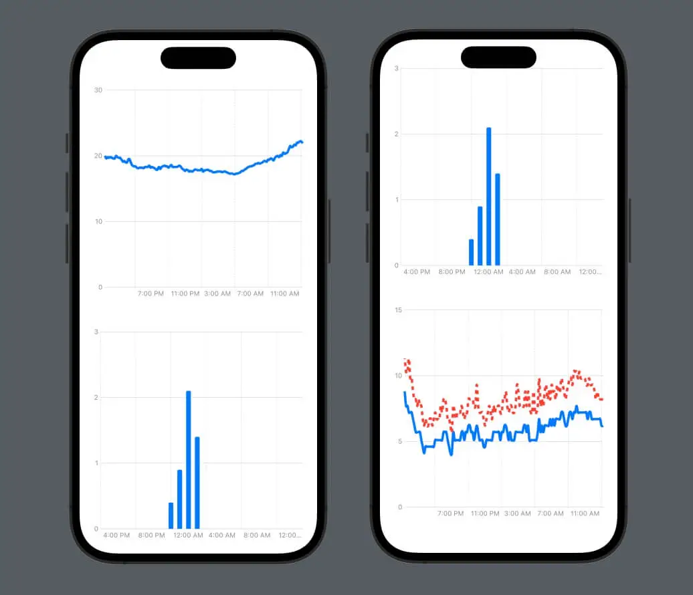
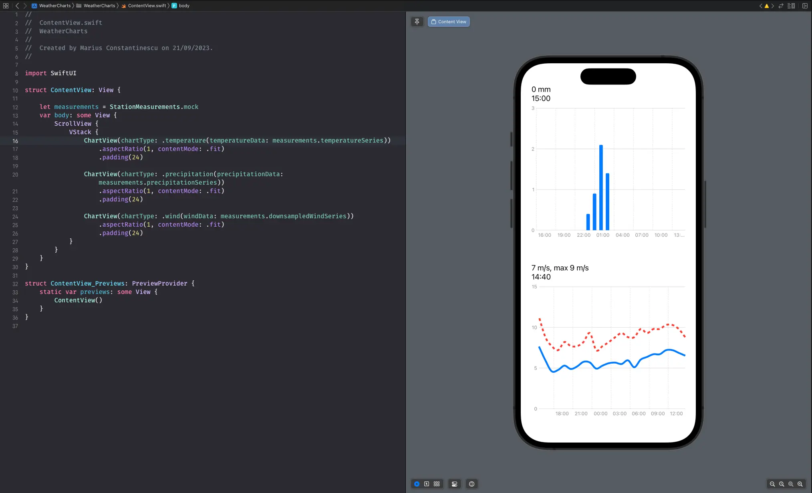
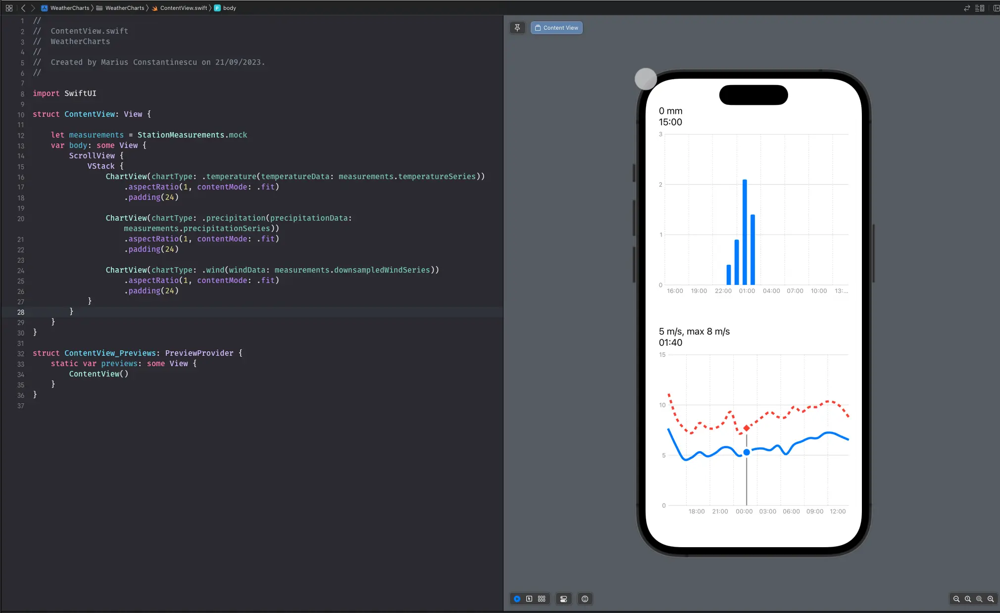

Last time we looked at [how to get started with Swift Charts]({{ baseurl }}/post/2023/10/23/Getting-started-with-Swift-Charts). Let's pick up where we left off.

We have the data, we have three ChartTypes, which show temperature (line chart), precipitation (bar chart) and wind (double line chart) and we have customized the axes.



## Data pre-processing

Looking at the wind chart, with the double line, it is a bit difficult to make sense of it, there's just too much data. So let's see what we can do about it. We have one measurement every ten minutes for 24 hours, so in total, we have 144 measurements. Plotting 144 data points for the average wind speed and for the maximum wind speed on the same chart makes it a bit crowded. But maybe we don't need all those data points. Let's have a look at how we can turn a data set with 144 points into one with only 24, as we want one measurement every hour for the wind.

One way to do it could be to only pick every 6th measurement, and just ignore the rest. But this new dataset could end up showing a different trend than the initial one and is not a good downsampling representation of the original data set. We need to do this in such a way that for every 6 data points in the original data set, we have only one data point, and this new one is an accurate representation or summarization of the original 6. This process is called downsampling.

So let's create a function that takes the original data set and returns the downsampled one:

```swift
func downsample(originalArray: [WeatherDataPoint]) -> [WeatherDataPoint] {
  var downsampledArray: [WeatherDataPoint] = []
  // .. We'll add some stuff here
  return downsampledArray
}
```

We'll use Swift's `stride` function because it's perfect for this use case. The `stride` function takes a `start`, an `end` and a `stride`, and returns a sequence from `start` to, but not including, `end`, stepping by `stride`. So for example, `stride(from: 0, to: 10, by: 2)` will be `[0, 2, 4, 6, 8]`, and `stride(from: 0, to: 10, by: 3)` will be `[0, 3, 6, 9]`. We want to create slices of the original data source, of size 6.

```swift
for i in stride(from: 0, to: downsampledArray.count, by: 6) {
      let endIndex = min(i + 6, downsampledArray.count)
      let slice = Array(self[i..<endIndex])
      let aggregatedValue: WeatherDataPoint
      // .. Figure out how to calculate the aggregated value
      downsampledArray.append(aggregatedValue)
  }
```

But what is the aggregated value? That's interesting, right? Because it depends. Our data set measures wind average speed, and wind maximum speed. What's a good aggregated value for 6 average speed data points? Well, it's the average of those. What about the maximum speed? It's the maximum of those. Because the average wind speed in an hour is the average of the wind speed in the first 10 minutes, the one in the following 10 minutes, and so on (6 times). And similarly for the maximum speed.

So let's pass the aggregation function as a parameter, and redefine our method like this:

```swift
func downsample(originalArray: [WeatherDataPoint], aggregationFunction: ([WeatherDataPoint]) -> WeatherDataPoint) -> [WeatherDataPoint] {
    var downsampledArray: [WeatherDataPoint] = []

    for i in stride(from: 0, to: originalArray.count, by: 6) {
        let endIndex = min(i + 6, originalArray.count)
        let slice = Array(originalArray[i..<endIndex])
        let aggregatedValue = aggregationFunction(slice)
        downsampledArray.append(aggregatedValue)
    }
    return downsampledArray
}
```

To make it even nicer, we can make this method an extension on Array and pass the `step` (the length of the slice) as a parameter too:

```swift
extension Array where Element == WeatherDataPoint {
    func downsample(step: Int, aggregationFunction: ([WeatherDataPoint]) -> WeatherDataPoint) -> [WeatherDataPoint] {
        var downsampledArray: [WeatherDataPoint] = []

        for i in stride(from: 0, to: self.count, by: step) {
            let endIndex = Swift.min(i + step, self.count)
            let slice = Array(self[i..<endIndex])
            let aggregatedValue = aggregationFunction(slice)
            downsampledArray.append(aggregatedValue)
        }

        return downsampledArray
    }
}
```

We can now use this method to downsample the wind data series, so we add to the `StationMeasurements` the following:

```swift
var downsampledWindSeries: [WeatherDataPoint] {
  return windSeries.downsample(step: 6) { slice in
    let count = slice.count
    let values = slice.map { $0.measuredValue }
    let secondaryValues = slice.compactMap { $0.secondaryMeasuredValue }
    return WeatherDataPoint(dateTime: slice.safelyAccessElement(at: count/2)?.dateTime ?? slice[0].dateTime,
                            measuredValue: values.reduce(0, +) / Double(count),
                            secondaryMeasuredValue: secondaryValues.max())
        }
    }
```

Where `safelyAccessElement` is a helper method which gives us the element at one index, or nil if the index is out of bounds.

```swift
private extension Array {

    func safelyAccessElement(at index: Int) -> Element? {
        guard indices.contains(index) else {
            return nil
        }

        return self[index]
    }

}
```

Now we have managed to turn our data set from 144 points to 24 points. We can use this one to draw the wind chart instead, and the chart immediately looks better.



## Interactive charts

Now that the charts look better, let's make them even more useful: let's show the value for a precise measurement when the user taps on a point in the chart.

We want to detect when the user taps on the chart, show an indicator of the point they tapped, and show the value at that point in a label above the chart. So we add a `.chartOverlay` which detects the taps and drags to our chart like this:

```swift
.chartOverlay { proxy in
    GeometryReader { geo in
        ZStack(alignment: .topLeading) {
            Rectangle().fill(.clear).contentShape(Rectangle())
                .gesture(
                    DragGesture(minimumDistance: 0.0)
                        .onChanged { value in
                            switch chartType {
                            case .temperature(let data), .precipitation(let data), .wind(let data):
                                selectedElement = findElement(in: data, location: value.location, proxy: proxy, geometry: geo)
                            }
                        }
                        .onEnded { _ in
                            selectedElement = nil
                        }

                )
            if let selectedElement {
                LollipopView(chartType: chartType, selectedElement: selectedElement, chartProxy: proxy, geometryProxy: geo)
            }
        }
    }
}
```

We want to keep the currently selected element in the `selectedElement` `@State` property, which can be nil if no element is currently selected (if the user isn't currently tapping or dragging their finger on the chart). If the user taps on the chart and an element is selected, we show an indicator of that (vertical line from the X axis to the chart point where the user tapped, and a rounded circle at its top; we call this `LollipopView`)

For finding the element on which the user tapped, we have to translate the touch point from screen coordinates to chart coordinates and find the closest data point to that. Here is the `findElement` method:

```swift
private func findElement(in data: [WeatherDataPoint], location: CGPoint, proxy: ChartProxy, geometry: GeometryProxy) -> WeatherDataPoint? {
    let relativeXPosition = location.x - geometry[proxy.plotAreaFrame].origin.x
    if let date = proxy.value(atX: relativeXPosition) as Date? {

        // Find the closest element.
        var minDistance: TimeInterval = .infinity
        var index: Int?
        for dataIndex in data.indices {
            let nthDataDistance = data[dataIndex].dateTime.distance(to: date)
            if abs(nthDataDistance) < minDistance {
                minDistance = abs(nthDataDistance)
                index = dataIndex
            }
        }
        if let index {
            return data[index]
        }
    }
    return nil
}
```

When we have a selected element, we want to show a visual indicator of the tapped point, so here's our LollipopView:

```swift
struct LollipopView: View {
    let chartType: ChartType
    let selectedElement: WeatherDataPoint
    let chartProxy: ChartProxy
    let geometryProxy: GeometryProxy

    var body: some View {

        let dateInterval = Calendar.current.dateInterval(of: .minute, for: selectedElement.dateTime)!
        let startPositionX1 = chartProxy.position(forX: dateInterval.start) ?? 0

        let lineX = startPositionX1 + geometryProxy[chartProxy.plotAreaFrame].origin.x
        let chartAreaHeight = geometryProxy[chartProxy.plotAreaFrame].maxY
        let plotLineY = chartAreaHeight - (chartProxy.position(forY: selectedElement.secondaryMeasuredValue ?? selectedElement.measuredValue) ?? 0)

        // The vertical line
        Rectangle()
            .fill(.gray)
            .frame(width: 2, height: plotLineY)
            .position(x: lineX, y: chartAreaHeight - plotLineY / 2)

        // The symbol shown at the point we've tapped on the graph
        Circle()
            .foregroundColor(.blue)
            .frame(width: 16, height: 16)
            .overlay(
                Circle()
                    .stroke(Color.white, lineWidth: 4)
            )
            .position(x: lineX, y: chartProxy.position(forY: selectedElement.measuredValue) ?? 0)

        // If we're on the wind data chart, show the diamond on the gust line too
        if case .wind = chartType {
            Rectangle()
                .rotation(Angle(degrees: 45))
                .aspectRatio(1.0, contentMode: .fit)
                .foregroundColor(.red)
                .frame(width: 13, height: 13)
                .overlay(
                    Rectangle()
                        .rotation(Angle(degrees: 45))
                        .stroke(.white, lineWidth: 4)
                        .aspectRatio(1.0, contentMode: .fit)
                )
                .position(x: lineX, y: chartProxy.position(forY: selectedElement.secondaryMeasuredValue ?? 0) ?? 0)
        }
    }
}
```

On top of what we mentioned, for the wind chart which has 2 line charts, we want to show different symbols on each line: a circle on the average speed and a diamond on the gust. That's why we added the last block of code in the LollipopView.

Printing the latest measurement or the currently selected measurements above the chart should be pretty straightforward, as long as you make sure you format the data correctly.

And here's the LollipopView in action. We just made our charts interactive!


<!-- TODO <center>{{ html5-link="./8.mov" }}</center> -->

Resources:
1. [Swift-Charts-Examples](https://github.com/jordibruin/Swift-Charts-Examples)

_Article photo generated with [Midjourney](https://www.midjourney.com/)_
