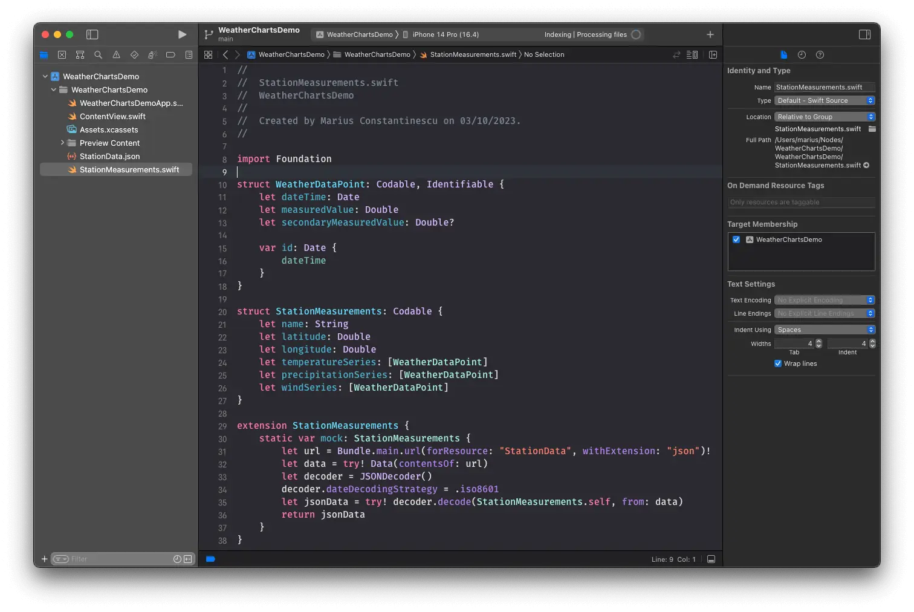
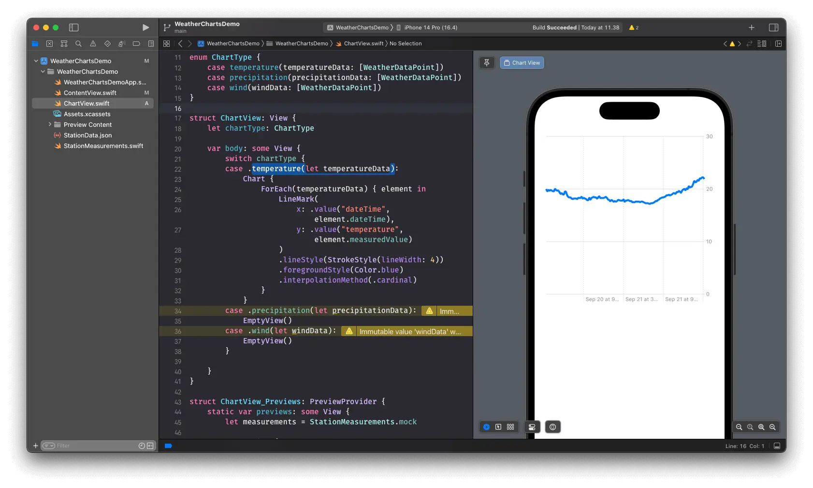
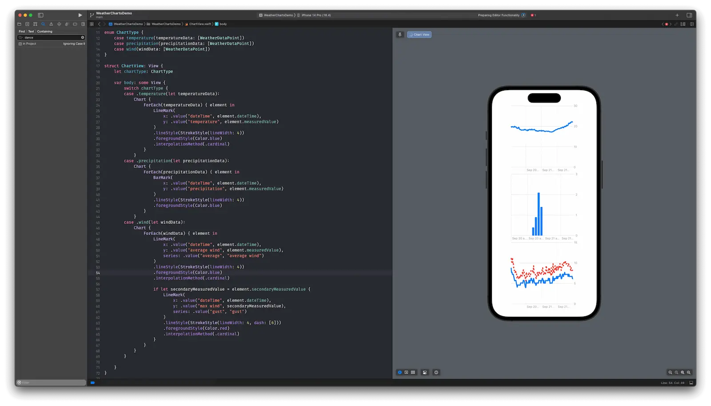
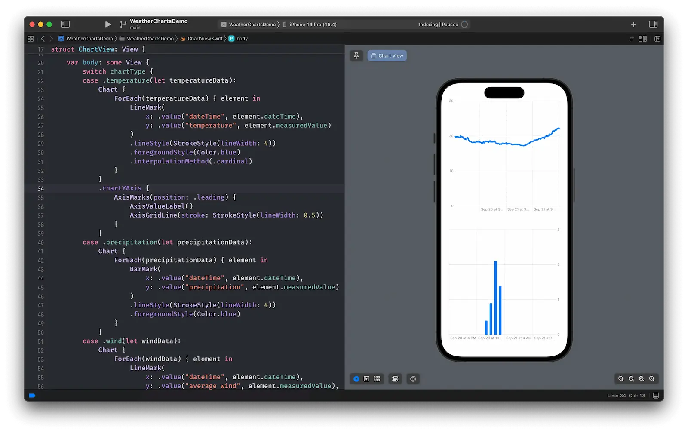
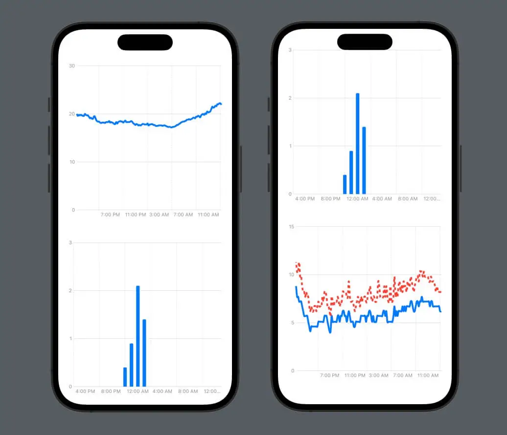

Let's have a look at [Swift Charts](https://developer.apple.com/documentation/Charts) and see how we can use it to plot weather data.

Apple introduced Swift Charts in iOS 16, and improved it in iOS 17, adding, among others, new chart types. If your app still needs to support iOS 15 or lower versions, you can use a 3rd party library, like [Daniel Gindi's Charts](https://github.com/danielgindi/Charts). In this demo project, we'll focus on the initial release of Swift Charts and well target iOS 16.


## Data
First, let's find some data to plot. We'll be looking at weather data, and, for the sake of simplicity, we'll just load locally some JSON from [this file](StationData.json). The JSON looks like this:

```json
{
    "name": "Københavns Lufthavn",
    "latitude": 55.6139,
    "longitude": 12.6455,
    "temperatureSeries": [{
        "dateTime": "2023-09-21T13:10:00Z",
        "measuredValue": 21.9
    }, ...
    ],
    "precipitationSeries": [{
        "dateTime": "2023-09-21T13:00:00Z",
        "measuredValue": 1.4
    }, ...
    ],
    "windSeries": [{
        "dateTime": "2023-09-21T13:10:00Z",
        "measuredValue": 6.2,
        "secondaryMeasuredValue": 8.2
    },
    ]
}
```

We have the details of a station, with its name, and position, and then we have 3 series of data, one for temperature (measured in Celsius degrees), one for precipitation (measured in millimetres) and one for wind, which contains the value of the average wind and the value of the gust (max wind speed) for that particular time. All entries in the data series have a `dateTime`. For temperature and wind, we have 144 data points, corresponding to one measurement every 10 minutes, and for precipitation we have 24 data points, corresponding to a measurement every hour.

Let's start a new Xcode project, using SwiftUI, and let's add the JSON file to the project and the target.

We want to parse this data, so we're creating our model. The purpose of this article is to play with Swift Charts; there are other, possibly better-suited ways of modelling the data, but for now, let's create a WeatherDataPoint struct.

```swift
struct WeatherDataPoint: Codable, Identifiable {
    let dateTime: Date
    let measuredValue: Double
    let secondaryMeasuredValue: Double?

    var id: Date {
        dateTime
    }
}
```

And a StationMeasurements struct:

```swift
struct StationMeasurements: Codable {
    let name: String
    let latitude: Double
    let longitude: Double
    let temperatureSeries: [WeatherDataPoint]
    let precipitationSeries: [WeatherDataPoint]
    let windSeries: [WeatherDataPoint]
}
```

And let's parse the data from the JSON file into a mock:

```swift
extension StationMeasurements {
    static var mock: StationMeasurements {
        let url = Bundle.main.url(forResource: "StationData", withExtension: "json")!
        let data = try! Data(contentsOf: url)
        let decoder = JSONDecoder()
        decoder.dateDecodingStrategy = .iso8601
        let jsonData = try! decoder.decode(StationMeasurements.self, from: data)
        return jsonData
    }
}
```



## Basic Charts
We now have the data in our project, we can go ahead and start playing with it.
We want to have three types of charts, a line chart to show the temperature, a bar chart to show precipitations, and another one with two lines on the same chart, so we can see the average and maximum wind on the same graph.

Let's describe that in code, by making an enum with a case for each chart type, and the data as an associated value.

```swift
enum ChartType {
    case temperature(temperatureData: [WeatherDataPoint])
    case precipitation(precipitationData: [WeatherDataPoint])
    case wind(windData: [WeatherDataPoint])
}
```

Let's start by creating the temperature chart. We'll make a new SwiftUI View, called ChartView. It will have a `ChartType`, which we'll also use to pass the data in through the associated value of the enum cases. The temperature chart will be a line chart, so inside the `Chart` we'll create a `LineMark`. We can then configure the line style, color and interpolation method, to make it prettier.

```swift
struct ChartView: View {
    let chartType: ChartType

    var body: some View {
        switch chartType {
        case .temperature(let temperatureData):
            Chart {
                ForEach(temperatureData) { element in
                    LineMark(
                        x: .value("dateTime", element.dateTime),
                        y: .value("temperature", element.measuredValue)
                    )
                    .lineStyle(StrokeStyle(lineWidth: 4))
                    .foregroundStyle(Color.blue)
                    .interpolationMethod(.cardinal)
                }
            }
        case .precipitation(let precipitationData):
            EmptyView()
        case .wind(let windData):
            EmptyView()
        }

    }
}
```

For the other two chart types, we can return `EmptyView()` for now. Here is the line chart showing the temperature data:



Let's continue and, similarly, create the bar chart. This time, we have to use the `BarMark`, but mostly everything else remains the same; we can remove the `interpolationMethod`, which doesn't make sense for a bar chart, and just change the identifiers.

```swift
case .precipitation(let precipitationData):
    Chart {
        ForEach(precipitationData) { element in
            BarMark(
                x: .value("dateTime", element.dateTime),
                y: .value("precipitation", element.measuredValue)
             )
              .lineStyle(StrokeStyle(lineWidth: 4))
              .foregroundStyle(Color.blue)
         }
    }
```

The wind chart will be a bit more interesting, it will consist of two line charts. So on the same `Chart`, we will have two `LineMark`s. The main difference from the temperature chart is that, for each LineMark, we will have to specify the `series` argument as well, so they will be plotted as individual series. We want the max wind speed to be plotted as a dashed line, so we also specify the `dash` parameter in the lineStyle.

```swift
case .wind(let windData):
    Chart {
        ForEach(windData) { element in
            LineMark(
                x: .value("dateTime", element.dateTime),
                y: .value("average wind", element.measuredValue),
                series: .value("average", "average wind")
            )
            .lineStyle(StrokeStyle(lineWidth: 4))
            .foregroundStyle(Color.blue)
            .interpolationMethod(.cardinal)

            if let secondaryMeasuredValue = element.secondaryMeasuredValue {
                LineMark(
                    x: .value("dateTime", element.dateTime),
                    y: .value("max wind", secondaryMeasuredValue),
                    series: .value("gust", "gust")
                )
                .lineStyle(StrokeStyle(lineWidth: 4, dash: [6]))
                .foregroundStyle(Color.red)
                .interpolationMethod(.cardinal)
            }
        }
    }
```



Now, we have the data plotted, but we would like to configure the axes. We want the vertical axis to be to the left of the chart, and we want to be able to change the font of the label on the vertical axes. Adding this code after the `Chart {...}` does the trick.

```swift
.chartYAxis {
    AxisMarks(position: .leading) {
        AxisValueLabel()
        AxisGridLine(stroke: StrokeStyle(lineWidth: 0.5))
    }
}
```

But that only customizes one of the three charts, and we don't like to repeat code.



So what we want now is to extract the Chart content, and use only one `Chart`, to be able to customize the axes the same way for all types of charts without repeating code.

Let's create the chart contents for our three charts.

```swift
struct LineChartViewContent: ChartContent {
    let data: [WeatherDataPoint]

    var body: some ChartContent {
        ForEach(data) { element in
            LineMark(
                x: .value("dateTime", element.dateTime),
                y: .value("temperature", element.measuredValue)
            )
            .lineStyle(StrokeStyle(lineWidth: 4))
            .foregroundStyle(Color.blue)
            .interpolationMethod(.cardinal)
        }
    }
}

struct BarChartViewContent: ChartContent {
    let data: [WeatherDataPoint]

    var body: some ChartContent {
        ForEach(data) { element in
            BarMark(
                x: .value("dateTime", element.dateTime),
                y: .value("precipitation", element.measuredValue)
            )
            .lineStyle(StrokeStyle(lineWidth: 4))
            .foregroundStyle(Color.blue)
        }
    }
}

struct DoubleLineChartViewContent: ChartContent {
    let data: [WeatherDataPoint]

    var body: some ChartContent {
        ForEach(data) { element in
            LineMark(
                x: .value("dateTime", element.dateTime),
                y: .value("average wind", element.measuredValue),
                series: .value("average", "average wind")
            )
            .lineStyle(StrokeStyle(lineWidth: 4))
            .foregroundStyle(Color.blue)
            .interpolationMethod(.cardinal)

            if let secondaryMeasuredValue = element.secondaryMeasuredValue {
                LineMark(
                    x: .value("dateTime", element.dateTime),
                    y: .value("max wind", secondaryMeasuredValue),
                    series: .value("gust", "gust")
                )
                .lineStyle(StrokeStyle(lineWidth: 4, dash: [6]))
                .foregroundStyle(Color.red)
                .interpolationMethod(.cardinal)
            }
        }
    }
}
```

## Customizing the axes

And now we can modify the ChartView to use the newly created ChartContents, and then we can customize the axes once for all charts.

```swift
struct ChartView: View {
    let chartType: ChartType

    var body: some View {
        Chart {
            switch chartType {
            case .temperature(let temperatureData):
                LineChartViewContent(data: temperatureData)
            case .precipitation(let precipitationData):
                BarChartViewContent(data: precipitationData)
            case .wind(let windData):
                DoubleLineChartViewContent(data: windData)
            }
        }
        .chartYAxis {
            AxisMarks(position: .leading) {
                AxisValueLabel()
                AxisGridLine(stroke: StrokeStyle(lineWidth: 0.5))
            }
        }
    }
}
```

We also want to customize the horizontal axes. On this one, we display dates. Since the measurements are for 24 hours, and the space on the axis is quite limited, we're only interested in the time. We print one label every 4 hours and only print the time. We also show a grid line every 4 hours.

```swift
.chartXAxis {
    AxisMarks(values: .stride(by: .hour, count: 4)) { value in
        if let date = value.as(Date.self) {
            let hour = Calendar.current.component(.hour, from: date)
            AxisValueLabel {
                Text(date, style: .time)
            }
            AxisGridLine()
        }
    }
}
```

So here's how far we've come:


Where can we go from here? It would be nice if we could tap on the chart to see the exact measurement value, right? And maybe we can do something about that wind chart, which looks a bit crowded. We're looking at that in [part 2]({{ baseurl }}/post/2023/10/23/Getting-started-with-Swift-Charts-part-2).

_Article photo generated with [Midjourney](https://www.midjourney.com/)_
