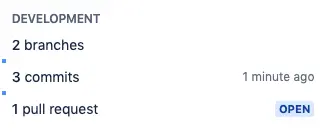

Thousands of organizations around the world use GitHub and Jira together to manage software projects. With your GitHub account linked to Jira, it gives your team the ability to see branches, commit messages, and pull request in the Jira tickets they’re working on. On the GitHub side, you can view relevant Jira ticket information in issues and pull requests.

Once the GitHub account is connected with Jira, there is no need to switch between Github & Jira and the entire team will be able to see the work status.

## Migration

The legacy ability to connect Jira Software and GitHub via the Jira DVCS connector is now deprecated in favor of this new **GitHub-maintained integration**. Once the migration is complete, the legacy integration (DVCS connector) is disabled automatically.

## How To Link GitHub And Jira

**Configure Github**

1. Go to [https://github.com/marketplace/jira-software-github](https://github.com/marketplace/jira-software-github) and click **Install**

2. During installation, you will be asked to select repositories you want to use with the Jira Integration
   

3. After installation, enter the site name and click **Continue**
   

4. Click on **Authorize Jira by GitHub** to give access to Jira
   

**Configure Jira**

1. Sign into your Jira Cloud account

2. Go to Jira settings -> Apps -> Find new apps -> Search for **GitHub for Jira**
   

3. Click on **GitHub for Jira** and Click on Get App -> **Get it now**
   

4. Click on **Get Started** to connect your GitHub Account

**Manage Repositories**

If you gave access to "All repositories" or "Single Repository", you can edit repository selection by:

1. Sign into your Jira Cloud account.
2. Select Jira settings -> Apps -> Manage Apps -> GitHub -> Get Started -> **Configure**

## Advantages

- See the status of development work right from the Jira board

- Use smart commits to update the status, leave a comment, or log time without leaving your command line or GitHub
  

- View associated pull requests, commits, and branches from within a Jira ticket
  

- Search for Jira issues based on related GitHub information, such as open pull requests
  

- You can automatically keep your Jira issues up to date while working in GitHub
  

  **References:**

[https://github.com/integrations/jira](https://github.com/integrations/jira)

[https://www.atlassian.com/blog/jira-software/github-for-jira](https://www.atlassian.com/blog/jira-software/github-for-jira)
