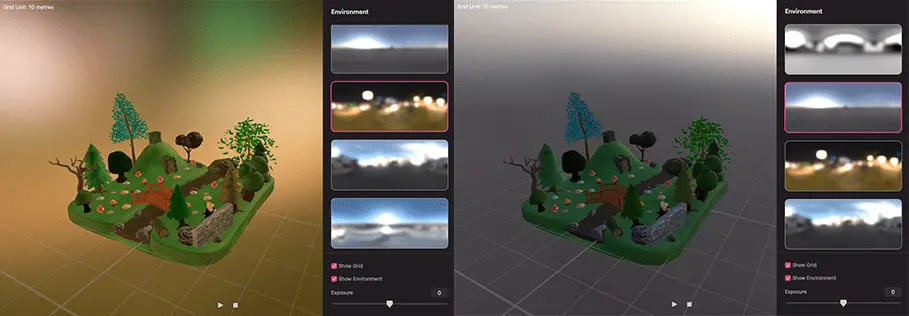
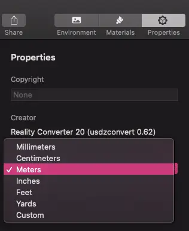

Earlier this year, Apple released the tool any ARKit enthusiast has been waiting for: `Reality Converter`. **Keep in mind this is a Beta Release as of the moment of this article**.

You can convert common 3D files like **.gltf, .obj, .fbx** using the Reality Converter, but you should expect to have occasional conversion fidelity issues due to different features available across formats. So far I had a pleasant experience using this tool and today I will show you how easy it is now to convert your existing 3D models to the USDZ file format.

If you want to learn more about the USDZ file format, you can check out [this article]({{ baseurl }}2019-10-07-Using-USDZ-for-a-better-AR-experience) where you can also see the previous way to convert files to USDZ using the [usdz command line tool](https://developer.apple.com/download/more/?=USDPython). The usdz command line tool still has some extra functionality and sample scripts so it is worth checking it out.

[Download Reality Converter beta from here](https://developer.apple.com/services-account/download?path=/Applications/Reality_Converter/Reality_Converter_Beta.dmg)

_You will need to have **macOS 10.15.2** or later to be able to use Reality Converter._

---

## Finding 3D models

Before we dive into the tutorial, if you don't have a 3D model yet, I can recommend 2 websites you can use to find a test model:

- [Sketchfab](https://sketchfab.com/feed)
- [Poly Google](https://poly.google.com/)

_Both of those websites also offer the option to download models as USDZ files directly._

---

## Converting .gltf files

Converting a .gltf model is as easy as drag and dropping it into Reality Converter. Just remember to drag and drop the whole model folder that contains the materials as well.

{{ vimeo-link="406283680" }}

It is worth mentioning some key differences between USD and .gltf that Apple wrote in the release notes:

> Upon conversion, vertex colors in .gltf files will be stored inside the mesh prim (under the displayColor
> property). However, these values will not be used for any surface calculations. It is recommended that you
> use your content creation app to “bake” vertex colors to textures instead.

> RealityConverter and AR Quicklook currently do not support the opacityThreshold property, so remove all
> gradients from the desired opacity masks and only use black and white for masked/unmasked areas.

> If your .gltf model uses double-sided geometry, then duplicate your geometry in your content creation
> app and flip it before converting it in Reality Converter.

## Converting .fbx files

To convert .fbx files, you will need to install the .fbx python SDK from [here](https://www.autodesk.com/
developer-network/platform-technologies/fbx-sdk-2020-0>). After installation, restart Reality Converter and you will be able to convert .fbx to USDZ.

---

Now that we successfully converted our models, let's have a look at the tool's options:

## Environments

In the `Environment` tab you can preview your USDZ objects under different environmental lighting.

## Materials

In Reality Converter you can modify the materials yourself. In the `Materials` tab, you can navigate between the available materials of the model and modify them if you wish. You even have a **Reset** button to get you back to the original version of the object if needed. Here is an example of how I turn one of my trees to a pink color:

## Properties

My favourite feature of the Reality Converter is the ability to change the base units of the model. I have personally encountered multiple times when the size of the model didn't have the right base unit (for example a plant pot with a size of 100 meters instead of 100 centimetres).

Under `Properties` you can also add copyright metadata.

## Share

You also have quick access to share your model and I have seen this extremely helpful for testing the object before exporting it.
You can email the model to yourself and open it from the Mail app or share it to your Notes app and open it from your Notes iPhone app.

## Exporting the model to USDZ

Last step after you converted and made all modifications needed to your model is to export it by selecting `Export` from the `File` menu.

## Shortcuts

There are a few shortcuts to keep in mind:

- `F` - Frame the object
- `Command + G` - Show/hide the grid
- `Space` - Play/pause the animation (if you have one on your model)
- `Command + E` - Export the model to USDZ

## Resources

- [How to make an Augmented Reality decorating experience app with AR Quick Look]({{ baseurl }}2019-12-31-How-to-make-an-Augmented-Reality-decorating-experience-app-with-AR-Quick-Look)
- [USDZ file format specification](https://graphics.pixar.com/usd/docs/Usdz-File-Format-Specification.html)
- [Reality Converter Beta Release Notes](https://download.developer.apple.com/Applications/Reality_Converter/Reality_Converter_Beta_Readme.pdf)
- [Forest model used in this tutorial](https://skfb.ly/6RJvx)
