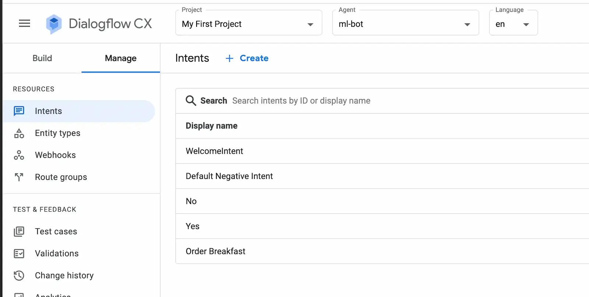
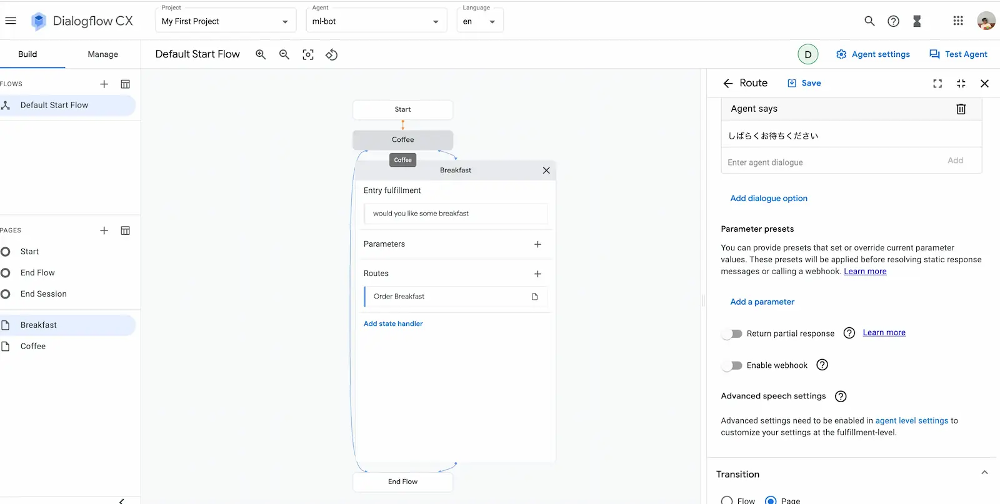
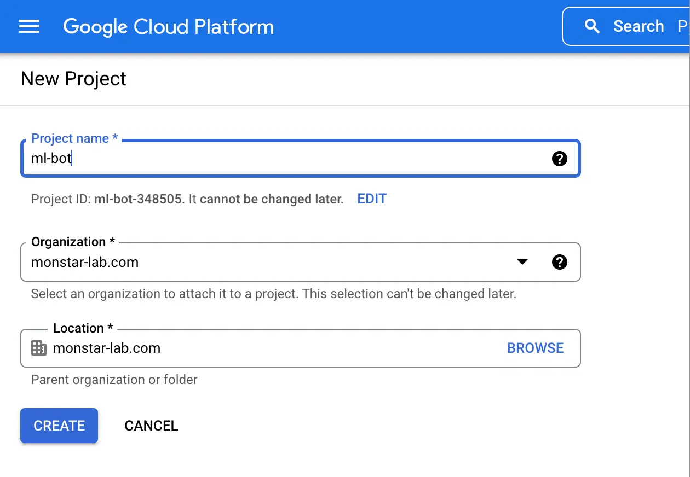
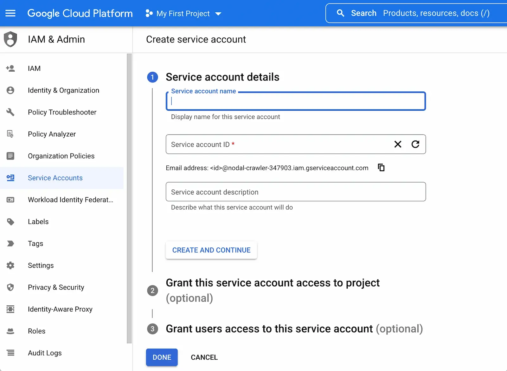
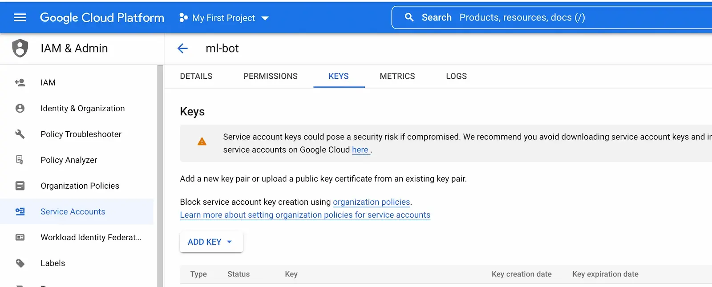
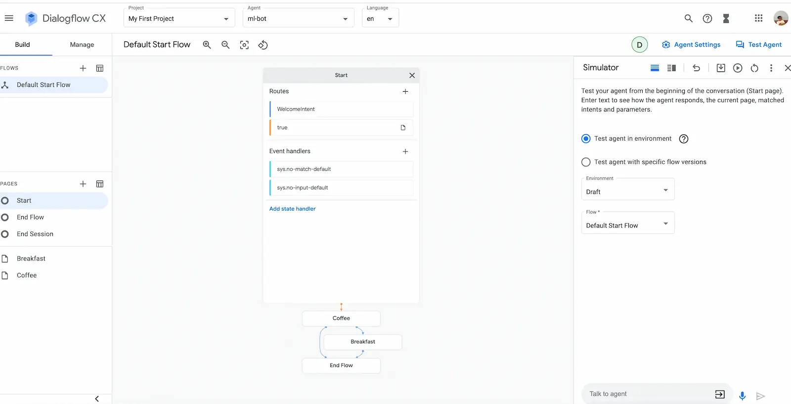

Every day we are asking "Hey google", "Hi google", "Please play this", do this, do that, but are we considering what's going on in the background? I made a small chatbot, named `ml-bot`, to find out how such a system works.

# What is Dialogflow?

Dialogflow is a Google AI Service, available in multiple languages.
By using it we can easily make conversational voice or chat bots.
Recently it is getting hard to write code from scratch due to advanced and super-fast client expectations. In a business situation we might need to make a running bot example in a couple of hours or a day. This is the point when thinking about using Dialogflow. Very easy to integrate on web and mobile apps.

## Advantages of Dialogflow

- ML/AI is used
- Easy to use
- Handles the complex conversation
- Available in many languages
- Integration with other tools is very easy
- Easy webhook integration (HTTP request events on specific action inside Dialogflow system)

# Types of Dialogflow services

## 1. Dialogflow CX (Customer Experience)

Designed for complex flows of conversation, it uses a state machine for managing the states of conversation.
Below is an example of what a food ordering flow for a pizza delivery agent can look like. Food ordering systems are a simple example where Dialogflow CX can be used.

_Image source: [Google](https://cloud.google.com/dialogflow/cx/docs/basics)_

## 2. Dialogflow ES (Essentials)

This is the older version of Dialogflow, which has been renamed to ES. While designing a bot, if we have simple and small agents, we should use ES.

_Image source: [Google](https://cloud.google.com/dialogflow/es/docs/basics)_

# Where should I use Dialogflow?

- Messaging tools like Slack are very easy to integrate with Dialogflow. See here for [more details](https://cloud.google.com/dialogflow/es/docs/integrations/slack).
- Voice bots can be easily made with Dialogflow, for serving all types of users, including physically challenged people.
- Chat bots on any mobile app platforms (Android, iOS, Flutter etc) and some kinds of web apps. Very accurate and fast response.

# What should I know before writing code or designing bots using CX?

### What are **Agents**?

Agents are the entry point to a bot system. Agent basically interact with end users and process the information behind the system.

Example of agent - here "ml-bot" is the agent name

### What is **Intent**?

Intent, in simple words, is what the user wants to say.
It is kind of the end user's intention. We can also combine many intents and do much more together.

Example of Dialogflow CX intents - "WecomeIntent", "No", "Yes" etc.

Example of a welcome intent on a page

The same intent can be described in the following ways:
"hi", "just going to say hi", "long time no see", "hello hi" etc.

### What are **Entity** and **Entity types**?

Entity is the data taken by the user. In the below picture eggs benedict is an example of entity.
The way to fetch the user's data is called entity types. In the picture below, `breakfast-type` is the entity type and `eggs benedict` is the entity which has synonyms (eggs, Eggs, eggs benedict). Synonyms is the way the user can type his message.

### What are **Routes**?

Routes are the way to control the flow inside a page. It is more about conditional logic in a flow.

### What are **Pages**?

Page represents the CX session. When started, the conversation page becomes active. The flow start and end state are handled by special pages.
In the below example, "Breakfast" and "Coffee" are the pages while ordering the food in a restaurant.
Here is one example how to add a page "Order Page" and the already made pages "Breakfast" and "Coffee".

### What are **Parameters**?

We can take the value sent by the user to the bot. These values are called parameters.

### What is **Flow**?

Flow is a module or unit which defines the simple part of a conversation and its flow. Flow acts as a path in the conversation. In the below example, "Breakfast" is a part of conversation while ordering the food in a restaurant.
Example of the coffee flow:

### What is **Fulfillment** - Bot response?

The response given by the bot to users is called fulfillment.
"しばらくお待ちください" (tr. "Please wait") is an example of fulfillment which the agent says after the order of the breakfast has been placed.

# Dialogflow system architecture

Below is an example when the user says "Hi" to the bot. The message goes to the system and the system connects to the Dialogflow API. Then if we have a webhook, then retract with that.
And now the process goes back, the Dialogflow API returns the response by detect intent and that is returned to the system we have and finally reaches the user.

_Image source: [Google](https://cloud.google.com/dialogflow/cx/docs/basics)_

# Implement a chatbot (ml-bot) using the CX visual builder

Using the below steps:

## Step 1
Create a project on [Google Dialog](https://dialogflow.cloud.google.com/) and login to Dialogflow Cloud: Cloud Console > New Project > Enter name and select other details as per below image.

## Step 2
[Enable the Dialogflow API](https://console.cloud.google.com/marketplace/product/google/dialogflow.googleapis.com?project=nodal-crawler-347903). Attached image is after the API is enabled. First time you should see an `Enable` button.

After the API is enabled, the Dialogflow API can be used.

## Step 3
[Download the .json file](https://console.cloud.google.com/apis/credentials?project=nodal-crawler-347903). Select Project -> tap the "CREATE CREDENTIALS" button -> Choose Service Account -> Enter service account details:
]

After you have entered all details go to the "KEYS" tabs and create and download the .json file.

## Step 4
Make the Dialogflow CX chat bot using the CX visual builder.

### Step 4.1
Create an agent by selecting Project > Select Agent > Create agent > type details.

### Step 4.2: Empty board
On an empty board we can start with the default start flow and add pages, flow, arguments, intents etc.

### Step 4.3: Board with already made example of coffee

This is the Dialogflow CX visual builder with an already created example:

Here you can do anything.

### Step 4.4: Test the chat bot

This is the Dialogflow CX visual builder with an already created example.

#### Example 1 - Ask for avocado

#### Example 2 - Ask for eggs

#### Example 3 - Say no to finish the chat

Here we can ask any type of questions to bot. The answer will be as defined using the CX visual builder.

## Write some code

### Follow the APIs

- [Dialogflow CX APIs](https://cloud.google.com/dialogflow/cx/docs/reference)
- [Dialogflow ES APIs](https://cloud.google.com/dialogflow/es/docs/reference)
  - [Dialogflow Essentials(ES) Build Voice Bots for Android with Dialogflow Essentials & Flutter](https://codelabs.developers.google.com/codelabs/dialogflow-flutter#0)
  - [Dialogflow Essentials(ES) - Dialogflow Flutter pub API](https://pub.dev/documentation/flutter_dialogflow_v2/latest/)

## Conclusion

We learned about the basics of Dialogflow and its types (CX, ES). We summarized the complete guide for using Dialogflow.
Overall, we learned about making a quick chatbot (ml-bot) using the Dialogflow CX visual builder.

I asked some questions using the visual builder from my bot `Ask-Me-Any-Thing`.

Implementing a chatbot from scratch might take a bit of time and effort, so we might consider using the Google Dialogflow system for chatbots.

## Useful references

- [Dialogflow Documentation](https://cloud.google.com/dialogflow/)
- [Dialogflow ES complete guide](https://dialogflow.cloud.google.com/#/getStarted)
- [Dialogflow CX complete guide](https://codelabs.developers.google.com/codelabs/dialogflow-cx-retail-agent#0)
- [Create service.json](https://console.cloud.google.com/apis/credentials?project=nodal-crawler-347903)
- [Enable DialogFlow API page](https://console.cloud.google.com/marketplace/product/google/dialogflow.googleapis.com?q=search&referrer=search&project=nodal-crawler-347903)
- [Intro to Dialogflow CX / Youtube](https://www.youtube.com/watch?v=Xfgn9iA1KMk&list=PLJLSPq0cTRmat9ec-c0hOJJhhNfObZXy3&index=1)
- [Deconstructing Chatbots / Youtube](https://www.youtube.com/watch?v=O00K10xP5MU&list=PLIivdWyY5sqK5SM34zbkitWLOV-b3V40B&index=1)
- [DialogFlow Pricing](https://cloud.google.com/dialogflow/pricing)

_Article Photo by [Robin Worrall](https://unsplash.com/photos/FPt10LXK0cg)_
