[Spatial](https://spatial.io/) is a metaverse platform that allows anyone to create immersive 3D spaces, which can be instantly shared to the Web, iOS, Android, and VR, and explored by others. The Spatial Creator Toolkit, powered by Unity, allows you to add even more interactivity to the experience, without needing to code. This tutorial will guide you through the process of creating and uploading your first Spatial experience using the Creator Toolkit on Unity.

### Before we get started:
* Create an account with [Spatial](https://spatial.io/signup)
* Install [Unity version 2021.3.21](https://unity.com/releases/editor/whats-new/2021.3.21) and install the “WebGL Build Support” module with it. If you don’t yet have Unity Hub installed, you will need to [install it first](https://unity.com/download)
* Download the [Spatial Unity Starter Template](https://drive.google.com/file/d/1AAdOCsfh-E1OlIqAwHOgBjVBxG4CYCyN/view?usp=sharing)
* Download this [3D golf ball](https://sketchfab.com/3d-models/golf-ball-5f158949c1084575abf02437f6b43028) in .obj file format 
* Download this [Monstarlab Badge](https://drive.google.com/file/d/1qQeiCBRPuWM8B2sfJdJYPeNmhBUHVU-K/view?usp=sharing)

Start by opening the Spatial Starter template project in Unity. You will be prompted to update to the latest Spatial SDK. Click 'yes' and allow the project to load. We will need to configure our Spatial credentials first. Click on the 'Spatial SDK' tab in the header > Account. This will open the Spatial Portal window (which we will keep coming back to). 

Click on "Get Login Token", which will redirect you to your browser where you can copy your token directly to your clipboard. Once you copy it, come back to Unity and click on "Paste Login Token". Now you should be ready and set up to start working!

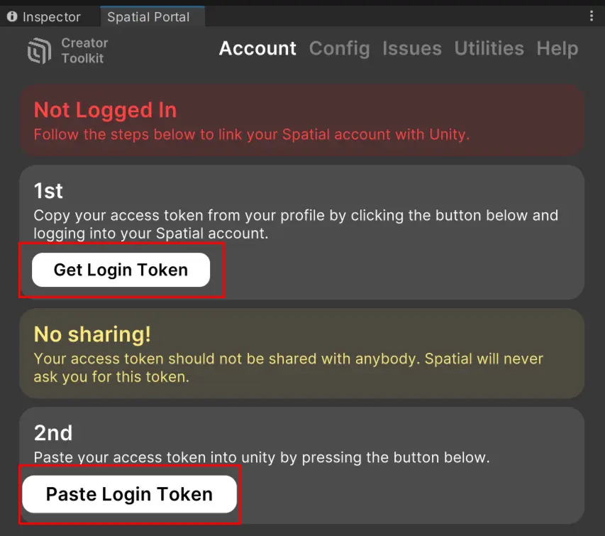

In the Project window, search for "GolfCourseDriving" and open this scene.

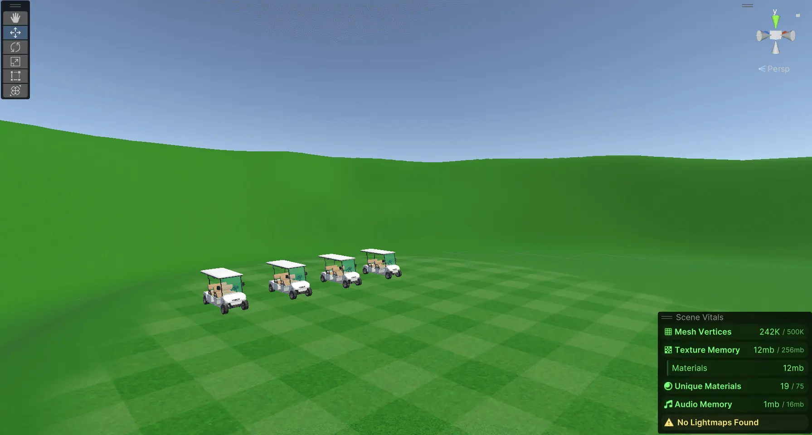

In the Spatial Portal window, under the 'Config' tab, set 'Active Package' to 'Space - Golf Course'. Now that we've set this golf course environment as our active scene, we can go ahead and test this scene in Spatial by clicking on 'Test Active Scene' at the top of the window.

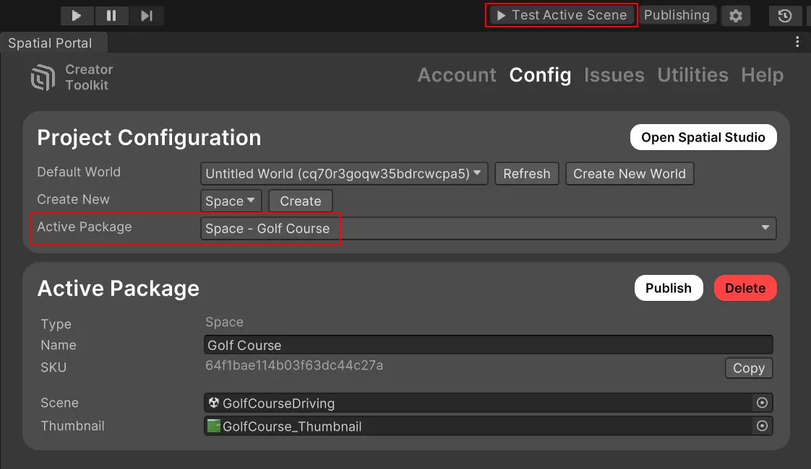

If this is your first time testing a scene on Spatial, it will take some time to load, but subsequent tests will be much quicker. Once it's done, your sandbox environment will open on your browser.

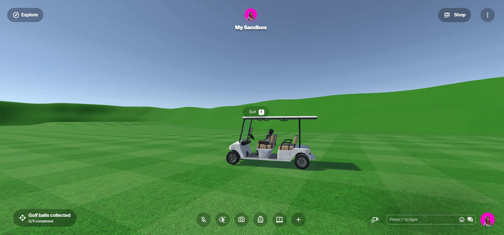

You can walk around using your arrow keys. Walk up to the golf cart and click [F] to drive it. Now your arrow keys will drive the golf cart around the scene! This is already pretty fun, but let's go back to Unity and see how we can add more interactivity to this scene.

Back in Unity, let's change out the default blue sky. Open the lighting window from 'Window' > 'Rendering' > 'Lighting'. Under the 'Environment' tab, click on the small circle next to 'Skybox Material'. This will let you search through your project to replace the material. Search for 'Epic_GloriousPink' and select it.

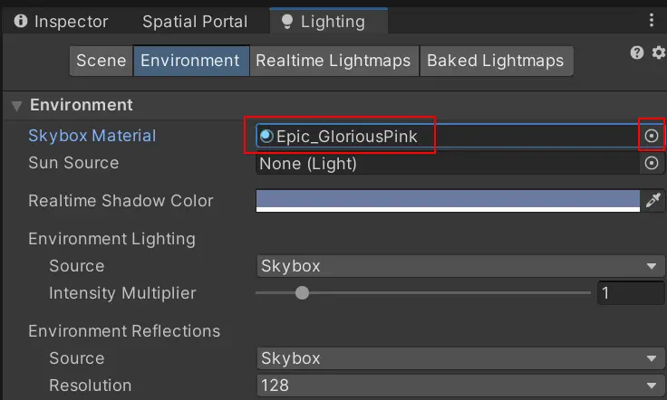

You will notice instantly that this also changes the ambient light of the scene to a more pink-ish hue. That's because the source of the environment lighting is currently being pulled from the sky, which is what happens in real life. However, if you'd like to control the mood of the scene yourself, you can choose a color from 'Lighting' > 'Environment lighting' > 'Source' > 'Color'. Personally, I like the pink sunset!

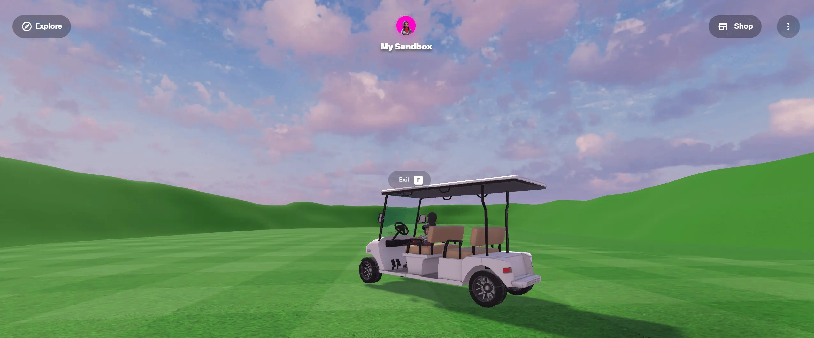

Now, let's import the 3D model of the golf ball into the project. You can do this by opening the root of your Unity project in your File explorer/Finder and pasting the 3D model folder inside the 'Assets' folder. For more information on importing 3D objects and how to deal with materials and textures, you can read more [here.](https://docs.unity3d.com/Manual/ImportingModelFiles.html) 

From the Project window, search for "Trigger (Collectable)" and drag this prefab directly into your scene. Set its position in the Transform component to (X: 522, Y: 4.48, Z: 654). If this is your first time using Unity, you can read [here](https://docs.unity3d.com/Manual/SceneViewNavigation.html) to learn how to navigate the scene view. 

If you look at the 'Spatial Trigger Event' component, you can see a few things that will happen when the player walks into the radius of this object.

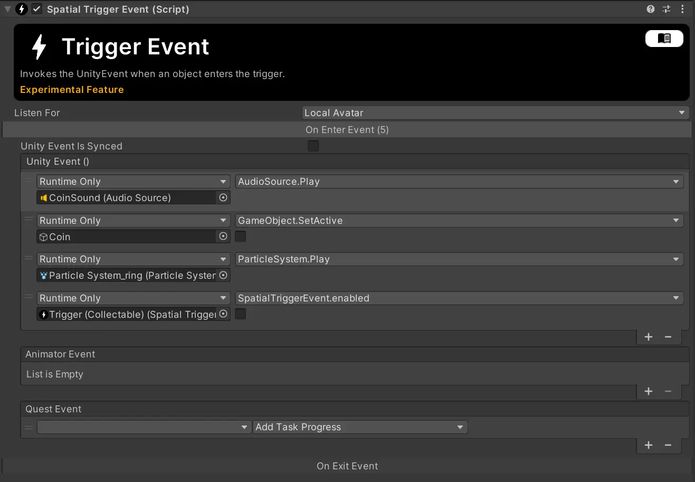

It's listening for 'Local Avatar', which is any player in Spatial. Once a player enters this trigger, 'On Enter Event' is called and the following happens:
- A coin sound effect is played
- The coin game object is disabled
- A particle effect plays
- The 'Spatial Trigger Component' is disabled

All of these happening in unison gives the impression of the player "collecting" the coin when they walk over it.

Let's switch out the coin model to the golf ball we imported earlier. Do this by disabling the child object "Coin" and dragging in the golf ball model as a child to the 'Trigger (Collectable)' game object. Scale and position it so it's roughly at the same size and position as the coin. 

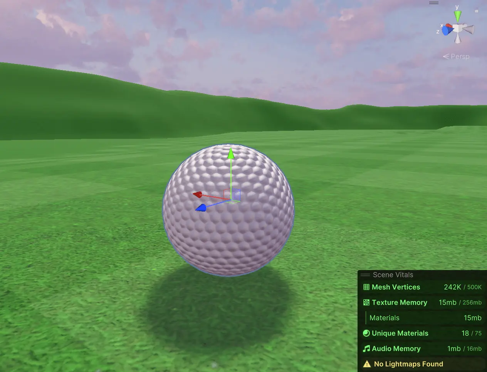

Make sure to switch out the coin for the golf ball in the 'On Trigger Event', so the new 3D model is disabled when collected.

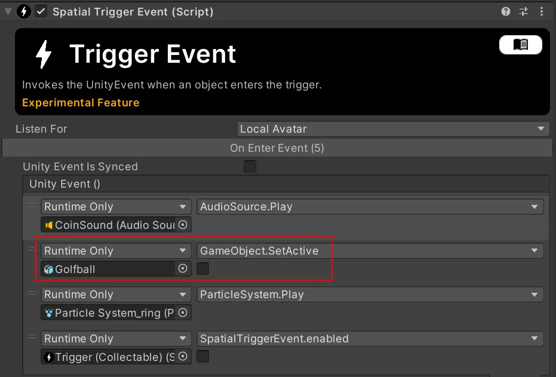

Now, let's set up a Quest. A Quest is a set of tasks the player needs to complete in order to fulfil a certain goal or objective. We can also reward players when they finish a quest, but more on that later.

Create an empty game object in the scene hierarchy and name it 'Golf Quest'. Click 'Add Component' > 'Spatial Quest'. Give your Quest a name and description. Enable the options as shown below:

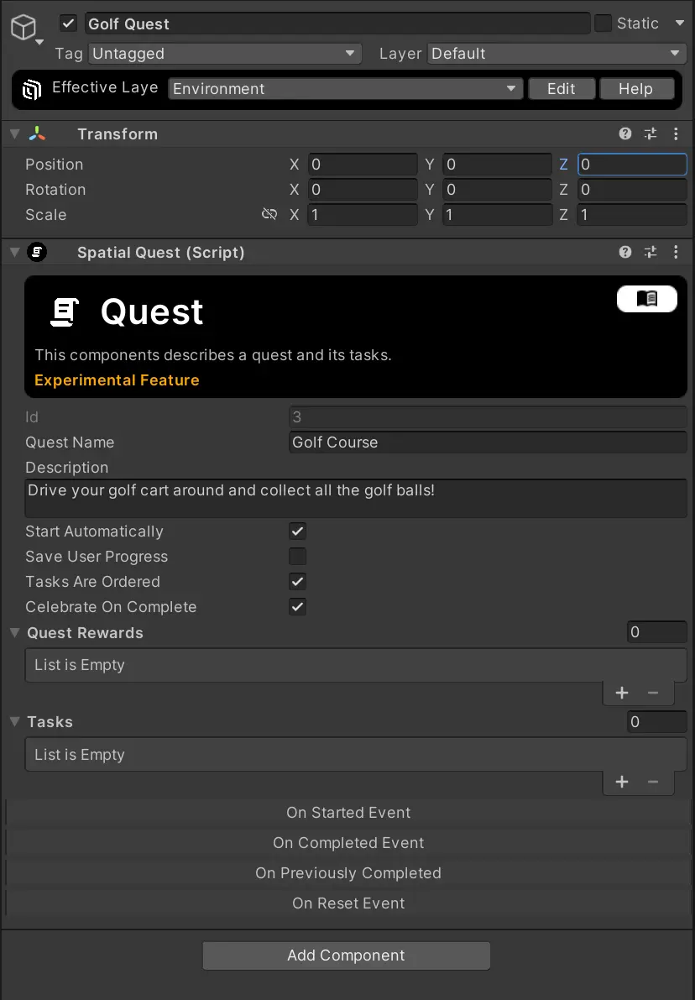

Let's add a task under the Tasks list.

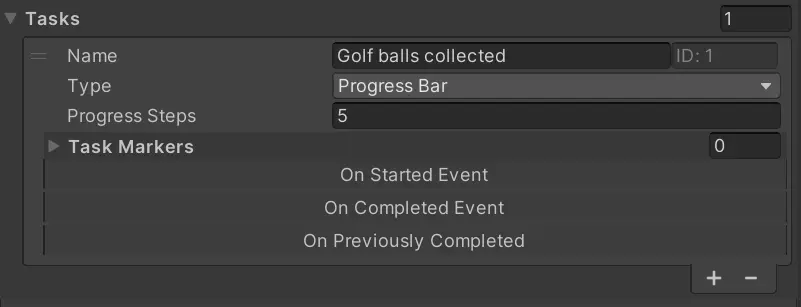

This task shows us that we would need to collect 5 golf balls to complete this task, but we need  some way of tracking that a golf ball has been collected. Back in the 'Golf Ball' game object, in the 'Spatial Trigger Event Component' > 'On Enter Event', add a 'Quest Event'. Select the Quest you created, and choose 'Add Task Progress' and 'Golf balls collected'.

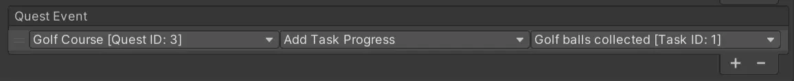

Now, when a player walks over this golf ball, it will update the task progress on the Quest. On the Quest game object, we said they would need to collect 5 golf balls, so go ahead and duplicate the golf ball 4 more times and place them around the environment as you like. Once you're done, go ahead and test the active scene to try it out yourself on Spatial!

If you run around and collect the balls, the quest gets updated on the bottom left of the screen. However, if you try driving a golf cart to collect it, you'll notice it's unable to pick it up. Let's fix this.

Back in Unity, select a GolfCart game object. You'll see it's on the 'Vehicle' layer. If you check any of the golf ball triggers, it's listening for a 'LocalAvatar', which would be the player. On the golf cart, switch out its layer to 'AvatarLocal'. The editor will ask if you want to change the layer of all its children objects too. Select 'No, this object only'.

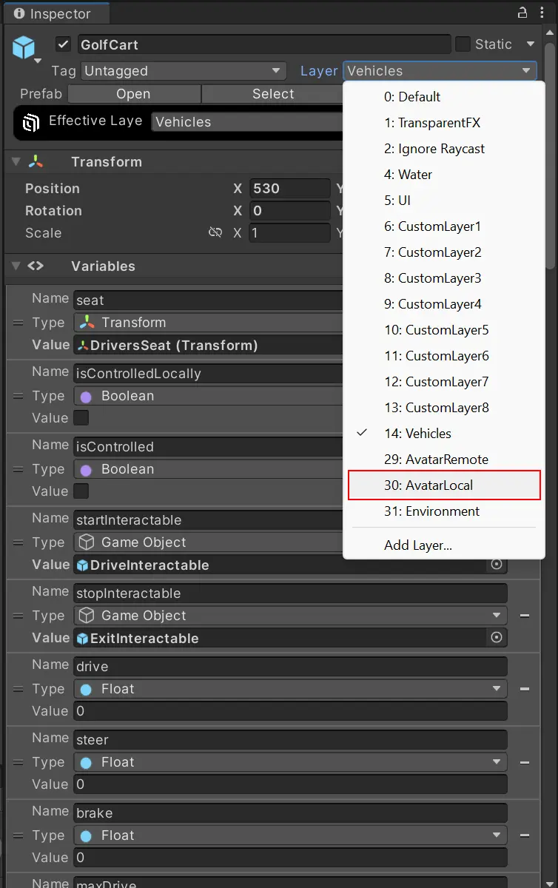

Now, we need to add a box collider around the cart to define the boundary of what needs to collide with the golf ball to trigger its event. On the cart object, click 'Add Component' > 'Box Collider'. Set 'IsTrigger' to true. Edit the box collider to be bigger than the cart.

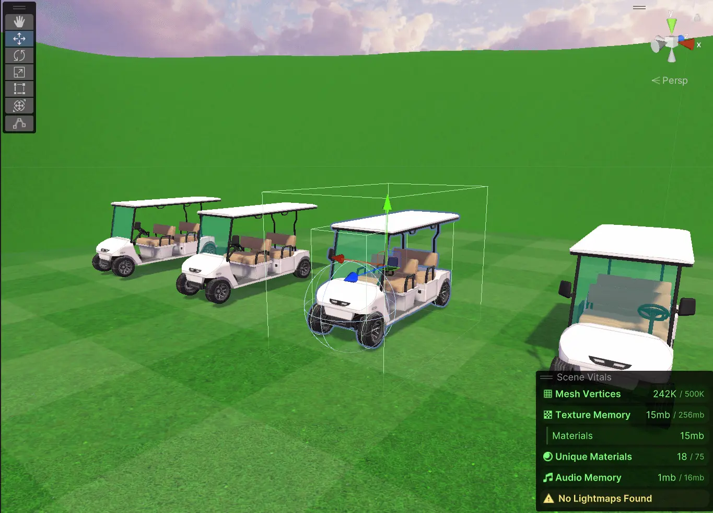

Go ahead and repeat these steps for all the carts. Test the scene again in your sandbox environment and you'll find you can drive the carts around to collect the golf balls now!

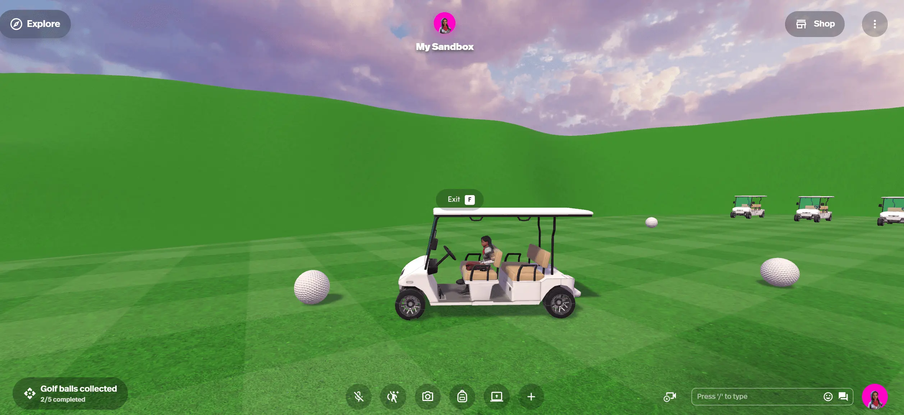

Finally, to reward the players for finishing the quest, we need to publish our space first (it can be set to private). In the Spatial Portal > Config tab, select 'Create New World'and then select 'Publish'. You'll receive an email once your space is successfully published. After that, we can set up a badge in [Spatial Studio](https://www.spatial.io/studio/worlds).

Select your world, and then select Badges > + New Badge. Here, you can upload the Monstarlab badge that you downloaded at the start of this blog (or feel free to create your own!). Give your badge a name and description.

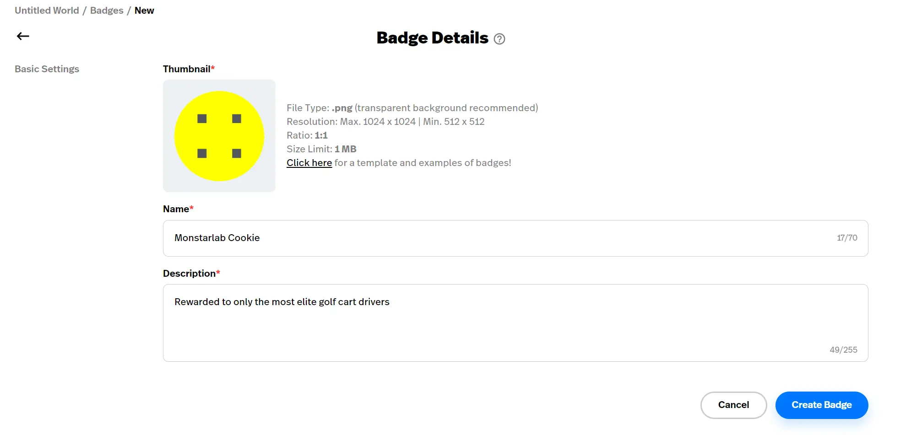

Now you can return to Unity, and go back to your Quest object. Add a 'Quest Reward' and select 'Badge'. Copy and paste the 'Id' from your badge in Spatial Studio.

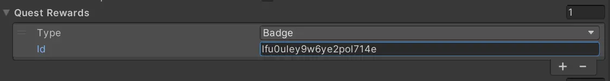

And there you go! Run the scene again, collect all the golf balls, and you should be rewarded with a badge when you're done! 🙂

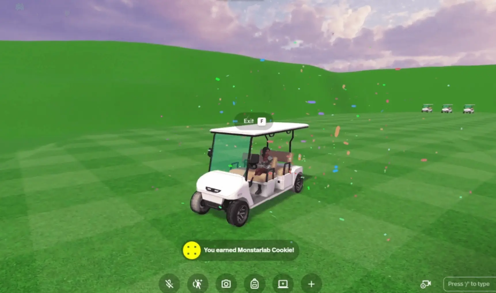

### Useful resources

* https://docs.spatial.io/
* https://docs.spatial.io/quests

_Article Photo by [Spatial](https://www.spatial.io/)_

_Spatial Unity Starter Template by [Spatial](https://docs.spatial.io/getting-started)_
