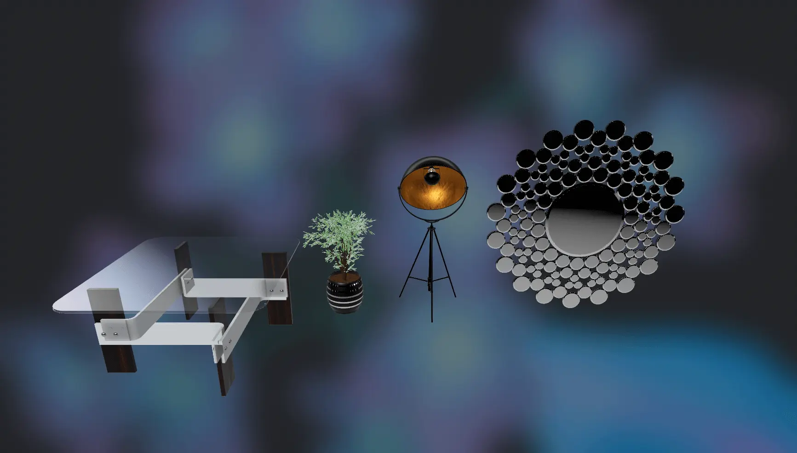
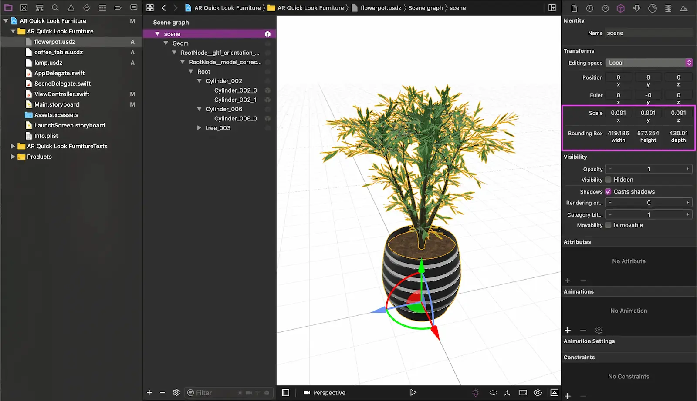
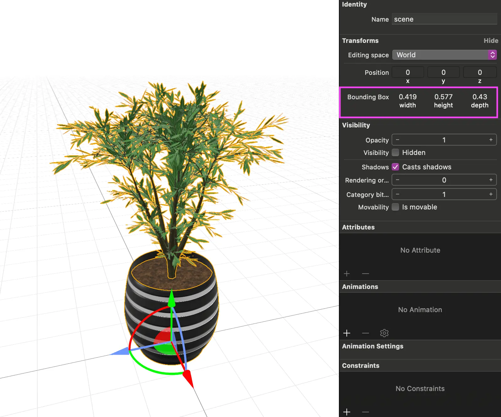
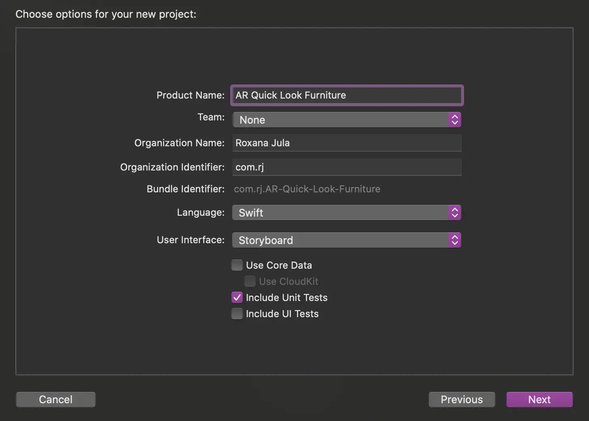
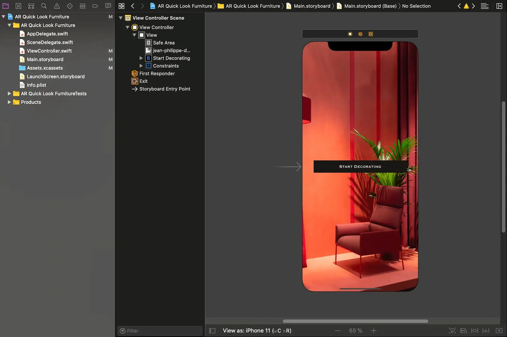

[AR Quick Look](https://developer.apple.com/augmented-reality/quick-look/) provides a very powerful augmented reality experience with user interactions like moving/scaling the object, people occlusion and sharing of the model supported “out of the box”.

Now, as easy as Apple makes it for us, from my experience, a big part of the work needed for an AR project goes into preparing the models. In case you have a 3D designer making the models for you - make sure you are very specific about the requirements of the models so there are as few adjustments to be done on your side as possible.

## Finding the models

AR Quick Look supports 2 input formats: `.usdz` and `.reality`.
We can interact with multiple models in AR Quick Look only with nested USDZ files, so for this reason we will use the `.usdz` file format in this tutorial.
Find and download the models you want to use in your experience. Two great places to find free 3D models are:

### [Sketchfab](https://sketchfab.com/feed)

My go-to place for 3d models for my AR experimental apps.
Those are the models I will be using in this tutorial, they will require a bit of extra work to have them ready for the app, but I like this example as this happens a lot of times in real life.

- [Vintage Coffee Table by Gueg](https://sketchfab.com/3d-models/vintage-coffee-table-70s-03-freebie-96bedccbbc3d470f8f7d636b598c7bd2)
- [Flower Pot by r.hessens](https://sketchfab.com/3d-models/flowerpot-0ead7a2453da47c3a39b550fb283314f)
- [Vintage Floor Lamp by Zuo Modern](https://sketchfab.com/3d-models/vauxhall-floor-lamp-antique-black-56054-12d878110c4e4cf2942d510f57417c7d)
- [Plot Mirror by Zuo Modern](https://sketchfab.com/3d-models/plot-mirror-850221-651d1e9e4b074e75934223d4014afa06)



### [Poly Google](https://poly.google.com/)

Also great for finding models to play around with ARKit. You will be able to see `USDZ File` as an option in the Download menu of a model if available. Here are 3 examples you can use:

- [Yellow low poly chair by Anonymous](https://poly.google.com/view/28PGrcM0hcZ)
- [Red low poly chair by Anonymous](https://poly.google.com/view/3qzceNuu8F2)
- [Green low poly chair by Anonymous](https://poly.google.com/view/aSjQVsSHIHQ)

_Tip: I have experienced it is way easier to find .gltf files and convert them to .usdz. You can checkout [this article](https://engineering.nodesagency.com/categories/ios/2019/10/07/Using-USDZ-for-a-better-AR-experience) I wrote for examples on how to do this using the USDZ Tools made by Apple._

## Size adjustments on the models (optional)

Sometimes the size is not good for the augmented reality experience (for example a chair should be 1 meter in height, not 100 meters) so you have to adjust it.

_Go to next step if your models are already in the right size._

It is better to resize the models using 3D software, but I will make the assumption of the worst case scenario: we don't have those tools installed, skills to use them or even access to the original 3D model designer to ask them to do it. So I will show you how to fix this in Xcode:

- Open the model in Xcode
- Select the parent node in the Scene graph tree (called `scene` in my example)
- On the right side in the `Node Inspector` view, you will be able to see `editing space`, `scale` and `bounding box`. Change the editing space to `Local` and adjust the scale of the model. The Bounding box measurements are in `meters` so in my case I scaled it down to 0.001 (for all coordinates - x, y and z - so the model keeps the aspect ratio).
  
- After adjusting the scale you can switch back to the `World` editing space and you will be able to see the updated bounding box.
  

## Making the nested USDZ file

To make the nested USDZ file that contains all of the furniture pieces I will use `usdzcreateassetlib` from the USDZ Tools. You can find a [tutorial on how to install it here]({{ baseurl }}2019-10-07-Using-USDZ-for-a-better-AR-experience).

- Put all .usdz files in a folder called `models`

- Navigate into the folder:

```shell
cd models
```

- Run the `usdzcreateassetlib` command, the first parameter will be the name of the nested model that is created for you, in this case `furniture.usdz`, followed by the names of all the models you want to include:

```shell
usdzcreateassetlib furniture.usdz coffee_table.usdz flowerpot.usdz lamp.usdz mirror.usdz
```

## Testing out the nested model

If you want to easily do a check of the model before adding it to your app you can use the Notes app if you have it synchronised between your MacBook and iPhone. Drag and drop the model on your MacBook Notes app in a new note and open the file directly from the iPhone. Simple as that!

## Making the app

- Now that we have the model ready we can start by creating a new `Single View App` project. For the User Interface mode I will be using Storyboards
  

- Open the `Main.storyboard` and add a Button that you can use to start the decorating experience. Feel free to add some extra UI niceness if you wish
  

- Connect the button to the ViewController as an `IBAction`

- Copy the nested USDZ file to your project. Make sure it is added to the target as well
  

- In the ViewController, we will first import `QuickLook` and `ARKit`

```swift
import QuickLook
import ARKit
```

- To enable the experience, we need to conform to [`QLPreviewControllerDataSource`](https://developer.apple.com/documentation/quicklook/qlpreviewcontrollerdatasource) and implement the following required functions. You can see in the `previewController` function that we create an URL with the path of the nested USDZ file and return that as a QLPreviewItem

```swift
func numberOfPreviewItems(in controller: QLPreviewController) -> Int { return 1 }

func previewController(_ controller: QLPreviewController, previewItemAt index: Int) -> QLPreviewItem {
    guard let path = Bundle.main.path(forResource: "furniture", ofType: "usdz") else { fatalError("Couldn't find the supported input file.") }
    let url = URL(fileURLWithPath: path)
    return url as QLPreviewItem
}
```

- In the `IBAction` we just declared we will add a few lines of code that will start the `QLPreviewController` with the setup we made above

```swift
@IBAction func startDecoratingButtonPressed(_ sender: Any) {
       let previewController = QLPreviewController()
       previewController.dataSource = self
       present(previewController, animated: true, completion: nil)
   }
```

- Here is the full code, so nice and clean

```swift
import UIKit
import QuickLook
import ARKit

class ViewController: UIViewController, QLPreviewControllerDataSource {
    override func viewDidLoad() {
        super.viewDidLoad()
    }

    @IBAction func startDecoratingButtonPressed(_ sender: Any) {
        let previewController = QLPreviewController()
        previewController.dataSource = self
        present(previewController, animated: true, completion: nil)
    }

    func numberOfPreviewItems(in controller: QLPreviewController) -> Int { return 1 }

    func previewController(_ controller: QLPreviewController, previewItemAt index: Int) -> QLPreviewItem {
        guard let path = Bundle.main.path(forResource: "furniture", ofType: "usdz") else { fatalError("Couldn't find the supported input file.") }
        let url = URL(fileURLWithPath: path)
        return url as QLPreviewItem
    }

}
```

## Demo

_Tip: You can use two-finger swipe gesture on an object to levitate it. This is what we will use to place the flower pot on top of the table_


## Resources

- [AR Quick Look](https://developer.apple.com/augmented-reality/quick-look/)
- [Previewing a model with AR Quick Look](https://developer.apple.com/documentation/arkit/previewing_a_model_with_ar_quick_look)
- [USDZ file format specification](https://graphics.pixar.com/usd/docs/Usdz-File-Format-Specification.html)
- [Image used in the app UI by Jean-Philippe Delberghe](https://unsplash.com/photos/dLmlYKuoJBc)
