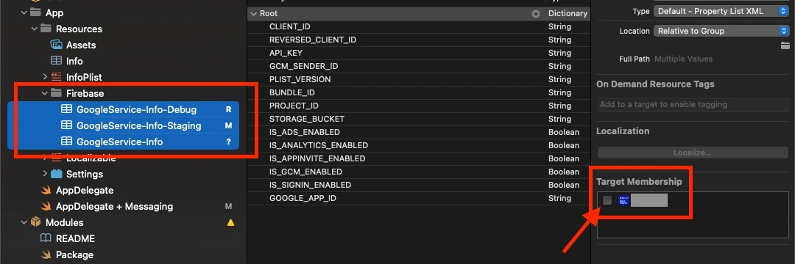
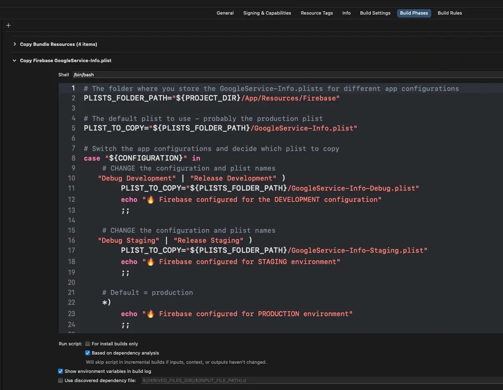

If you ever used Firebase Crashlytics for an iOS app's crash reports, chances are you also encountered the “missing dSYM files” warning in the Firebase console. The crash reports are basically useless without these files.

The Firebase Crashlytics documentation only guides you on how to set up Firebase and the dSYM upload for a single environment project. Real-life projects are usually deployed to two environments at a minimum though. And you really want to assign two different Firebase apps to these environments not to pollute your production data. It took me some time to figure out how to do this properly. Because even if you use the official Firebase configuration APIs, you can still mess up.

In this article, I will explain how to properly set up a multi-environment Xcode project for Firebase and correctly upload the dSYM files to their Firebase apps counterparts. 

I will also give a brief overview of what dSYM files are, how Xcode 14 changed where we find the dSYMs and how to debug the dSYM upload. 


## What are dSYM files?
dSYM files, or debug symbol files are files generated during the code compilation process. You can think of them as a map for the compiled binary. If a crash occurs in the app, the dSYMs will tell you in which part of the code the crash occurred. Crashlytics needs them to display a human-readable crash report. A crash report is not of much use if you do not know where and why the app crashed.
You can find the dSYM files in the dSYM folder inside the `xcarchive` file generated by Xcode during archiving.


## How to upload the dSYMs to Firebase 
You need to find a way to upload these files to Crashlytics. You can either do that manually, using a build phase script or some custom script solution (in your CI/CD preferably). I will explain how to do this with a build phase script which is probably the best method. 
Using the build phase script, you are sure that every time you compile your code, the generated dSYMs are uploaded to Crashlytics (if you have an internet connection working). 

The build phase script makes use of the `run` and `upload-symbols` scripts inside the Crashlytics package. You can check those for some additional information on how the upload works. 


Using a build phase script is also recommended in the [Crashlytics setup docs](https://firebase.google.com/docs/crashlytics/get-started?platform=ios).

## What changed with Xcode 14?
Xcode 14 release [deprecated bitcode](https://developer.apple.com/documentation/xcode-release-notes/xcode-14-release-notes#Deprecations). Bitcode was a big deal for dSym files. If your app used bitcode, the locally generated dSym files were basically useless. Once the bitcode-enabled app was uploaded to TestFlight, Apple recompiled the .ipa file and thus created brand new dSYM files. If you wanted to get crash reports from TestFlight and App Store, you needed to find a way to download these dSYM files from App Store Connect and upload them to Crashlytics. Usually, you would set up a CI/CD step to do that or make use of something like [fastlane download action](https://docs.fastlane.tools/actions/download_dsyms/). 

All of these solutions are now failing because there are no dSYM files to be found on App Store Connect anymore.  

On the brighter side, bitcode deprecation actually makes the dSYM upload problem easier now. You can always just upload the locally created dSYM files and be sure you are not missing anything.

## How to set up Xcode to use multiple Firebase apps
Let's see how to set up your project for multiple Firebase apps now. I will show you the wrong way first. 

### The wrong way
The official [Firebase docs](https://firebase.google.com/docs/ios/setup) only mention how to set up the project for one Firebase app. 
To add more Firebase apps, you need to add more `GoogleService-Info.plist` config files to the project and find a way to provide the right plist during a particular Xcode configuration.
The logical solution here would be to use the official Firebase APIs and configure Firebase in code similar to this (pardon the force unwrapping): 


```swift
# DO NOT DO THIS. THIS IS WRONG :)

var plistPath = Bundle.main.path(forResource: "GoogleService-Info-Production", ofType: "plist")

#if STAGING
plistPath = Bundle.main.path(forResource: "GoogleService-Info-Staging", ofType: "plist")
#elseif DEBUG
plistPath = Bundle.main.path(forResource: "GoogleService-Info-Debug", ofType: "plist")
#endif
        
FirebaseApp.configure(options: .init(contentsOfFile: plistPath!)!)
```

All should be fine, right? **WRONG!** :) 

I also made the mistake of configuring several iOS apps this way and then wondering where my dSYMs are when I started to get the warning in the Firebase console.

The problem with the configuration in code is that the Firebase app is configured with the correct `GoogleService-Info.plist` during the app **run time**. But the build phase script to upload the dSYMs is run during the **compilation time**. During the compilation time, Firebase has no idea which configuration to use and it usually defaults to the production `GoogleService-Info.plist` file if your app bundle contains it or it fails if you renamed the file. 

As a consequence, all of your dSYM files are always uploaded only to one Firebase app and the other ones completely miss all the dSYMs. 
On top of that, all the analytics events that are triggered before the `FirebaseApp.configure()` is run, are sent to the wrong (or none) Firebase app too. 

### The right way 
The solution to this problem is to provide the right `GoogleService-Info.plist` file **during the app compilation** before the dSYM upload script is executed. 
There are three steps to this: 
1. Take out all the plists from the app target so they are not included in the app bundle after archiving.



2. [Make a separate build phase script](https://developer.apple.com/documentation/xcode/running-custom-scripts-during-a-build?changes=_8) to copy the correct plist file to the root of your app’s bundle.

Put this build phase script before the dSYM upload build phase script. You will need to change the parts that are labeled with CHANGE.

```shellscript

# CHANGE
# The folder where you store the GoogleService-Info.plists for different app configurations
PLISTS_FOLDER_PATH="${PROJECT_DIR}/App/Resources/Firebase"

# CHANGE
# The default plist to use - probably the production plist
PLIST_TO_COPY="${PLISTS_FOLDER_PATH}/GoogleService-Info.plist"

# Switch the app configurations and decide which plist to copy
case "${CONFIGURATION}" in
    # CHANGE the configuration and plist names
   "Debug Development" | "Release Development" )
        PLIST_TO_COPY="${PLISTS_FOLDER_PATH}/GoogleService-Info-Debug.plist"
        echo "🔥 Firebase configured for the DEVELOPMENT configuration"
        ;;
         
    # CHANGE the configuration and plist names
   "Debug Staging" | "Release Staging" )
        PLIST_TO_COPY="${PLISTS_FOLDER_PATH}/GoogleService-Info-Staging.plist"
        echo "🔥 Firebase configured for STAGING environment"
        ;;

    # Default = production         
    *)
        echo "🔥 Firebase configured for PRODUCTION environment"
        ;;
esac

echo "🔥 FIREBASE CONFIG FILE COPIED TO THE APP BUNDLE: $PLIST_TO_COPY"
# The plist is copied straight to the root folder and renamed to the default name
# Having only this one plist in the app bundle - Firebase will use this plist for its config
cp -r $PLIST_TO_COPY "${BUILT_PRODUCTS_DIR}/${PRODUCT_NAME}.app/GoogleService-Info.plist"
```



You can find the configuration names in your project's build settings. 


3. Just configure the app with `FirebaseApp.configure()` as usual.
There will only be one `GoogleService-Info.plist` file in the bundle, so you do not need to specify it anymore. 

You can spin up your proxy now and check the right dSYMs are uploaded to the right Firebase apps for different build configurations. This approach works for your CI/CD as well. You do not need to set a custom workflow to upload the dSYMs from there. 

## How to debug the dSYM upload
If you want to know that the dSYM build phase upload works fine, you can try to build your app and check the build log in the Report Navigator. The build log should give you a short success message. 


This message tells you that the build script successfully found some Firebase configuration, the generated dSYM files, and started a background task that should upload them. 
Things can still go south from here though. If you want to know if and to which app the dSYMs were uploaded, you can start a proxy (like Charles or Proxyman) and check the upload request. 


You should see the dSYMs uploaded a few seconds after the app compiles. The request query contains the Firebase app ID which you can compare with what you see in the Firebase Console. 
By checking all of these, you can be sure things are configured correctly on your side. 


## Key takeaways
- dSYM files are no longer to be found on App Store Connect.
- All dSYM files necessary for Crashlytics are now produced during the local (your machine or CI/CD) code compilation.
- If you want to make sure your app is configured properly, rely on copying the correct GoogleService-Info.plist into the app bundle during the compilation.
- If you configure the app with the correct plist during run time, you will lose some dSYMs and certain early analytics.

_Article Photo by [Timothy Dykes](https://unsplash.com/@timothycdykes) on [Unsplash](https://unsplash.com/)_
