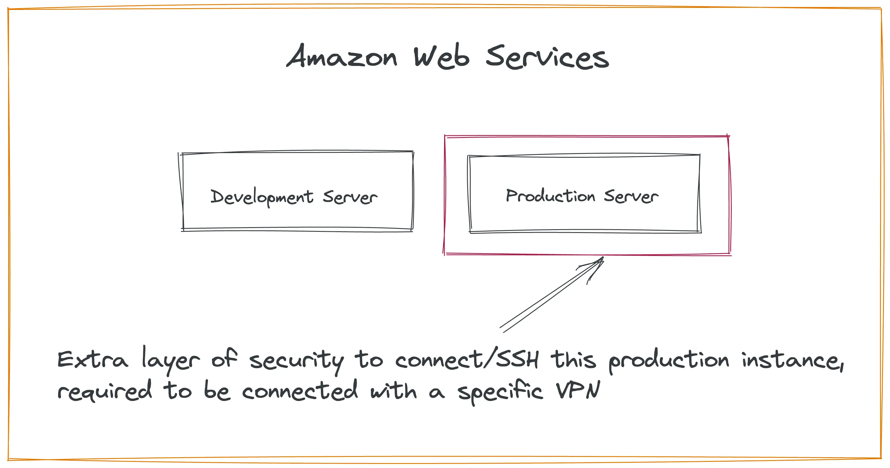

In the [previous article]({{ baseurl }}/post/2023/01/02/How-to-setup-CI-CD-pipeline-for-WordPress-with-GitHub-Actions-and-AWS), we discussed how to set up a **"GitHub hosted runner"** with WordPress. Now, in this part, we will explore how to achieve the same deployment process using a **"Self-hosted runner"**

## GitHub Branches and Web Servers Architecture Recap:

Before diving into the self-hosted runner setup, let's quickly recap our GitHub branches and web servers architecture. We have multiple branches, including **"dev-deploy"** and **"prod-deploy."** The **"dev-deploy"** branch has a dedicated GitHub runner for the development server. After successful testing on the dev server, we are ready to deploy changes to the production server using the **"prod-deploy"** branch.


| Branch Name       | Our Actions Based on it                                                                    |
| ----------------- | ------------------------------------------------------------------------------------------ |
| **_master_**      | Here we keep all up-to-date codebase.                                                      |
| **_prod-deploy_** | If any code is merge in this branch, We run a GitHub Action for the production deployment. |
| **_dev_**         | We work on this branch for fixing issues and building features.                            |
| **_dev-deploy_**  | If any code is merge in this branch, We run a GitHub Action for development deployment.    |

<br />
In our production environment, we have an added layer of security provided by a VPN. This VPN connection is necessary to access the webserver, and it is the primary reason why we opted for a self-hosted runner this time.



## Options for Self-Hosted Runners:

With self-hosted runners, we have three options to consider:

1. **Repository-level:** Runners dedicated to a single repository.
2. **Organization-level:** Runners capable of processing jobs for multiple repositories within an organization.
3. **Enterprise-level:** Runners assigned to multiple organizations in an enterprise account.
   Our example will be based on the repository-level, but you can choose the most suitable option based on your requirements.

## Setting Up the Self-Hosted Runner:

Navigate to the repository settings page and click on **"Actions,"** then select **"Self-Hosted Runner."**


Choose the appropriate **"Runner image**" available on your server and select the corresponding **"Architecture"** (e.g., "Linux" and "x64").


The installation and configuration of the self-hosted runner involve three steps:

1. Download
2. Configure
3. Using your self-hosted runner.


##### Download:

In this step, we need to log in to our own server and execute given commands.

##### Configure:

During the configuration, you may encounter some prompts. For the **"group name,"** you can use the default one. Give a name to the runner, such as **"production-deploy,"** which will appear in your runner page on the Github. Finally, set an label, for example, **"prod-deploy."**


##### Using your Self-Hosted Runner:

Now, you can start listening for job requests and to ensure continuous listening in the background by typing

```sh
sudo ./svc.sh install
sudo ./svc.sh start
```

With the self-hosted runner successfully configured and listening, any code changes merged into the **"prod-deploy"** branch will trigger the runner, facilitating deployment to our production server.


## Creating the Deployment Automation YML File:

###### Step 1:

Create a folder named **".github"** in the root of project directory. Inside the **".github"** directory, create another folder named **"workflows."** Within this **"workflows"** folder, create a file named **"prod_deploy.yml."** The file extension must be **".yml."** All the deployment automation code will be written in this file.

###### Step 2:

Provide a meaningful "name" for the workflow. This will help in identifying the workflow in the GitHub Actions interface.


###### Step 3:

Configure the **"on"** event to specify when the GitHub Action should run. For instance, we want the workflow to trigger when code is merged into the **"prod-deploy"** branch.


###### Step 4:

Set a default directory before running the **"jobs"** Since our root directory hasn't the WordPress theme, we can set the theme directory to avoid changing directories in each step.


###### Step 5:

Define the **"jobs"** within the GitHub workflow. Each job contains a series of **"steps,"** which can be actions or shell scripts. Here, we create a job and specify that it should run only if code is merged into the **"prod-deploy"** branch. We also add the **"prod-deploy"** label, which ensures that the self-hosted runner runs on the associated server.

Now let's see what it looks like when we write all the code together.

<script src="https://gist.github.com/Rasel-Mahmud/bdbe8200c07121a59870379b524e5844.js"></script>

##### Let's break down each step in the deployment process:

- **`checkout:`** This step involves checking out our files into the virtual server using the GitHub checkout action from https://github.com/actions/checkout. This ensures that we have the latest code available for the deployment process.

- **`cache:`** The cache step is used to store cached data, allowing the theme build process to be faster after the first execution, provided the cache exists. For more information on the cache action, you can refer to https://github.com/actions/cache.

- **`Install Node dependency:`** In this step, we run an action to install the npm package dependencies required for our project. This ensures that the necessary Node modules are available for the subsequent build process.

- **`Install PHP dependency:`** Here, we execute an action to install the PHP package dependencies that our WordPress theme relies on. This ensures that the required PHP libraries and components are available for the theme build.

- **`Build The Theme:`** This step involves running an internal package command to build our WordPress theme. For this purpose, we are using the ["Tonic starter"](https://labs.tonik.pl/theme/) theme, which provides a solid foundation for our WordPress Theme development.

- **`Move Theme:`** After the theme is successfully built, we need to move it to the appropriate location on our server. This step utilizes basic shell commands to carry out the process. For example, it may involve removing the existing theme using and moving the current build folder to the appropriate location using

```sh
sudo rm -rf /theme-location/theme-name/
sudo mv * /theme-location/theme-name/
```

These commands should not be exposed publicly as they reveal sensitive server file paths. To keep these details secure, we can follow the steps below:

1. Go to the Repository and click on the **"Settings"** tab
   
2. In the left side: menu, you will find **`"actions"`** under the **`"secrets"`** menu.
   
3. Click on **`"New repository secret"`**.
4. Provide a **`"name"`** on that specific **`"secret"`** which we can access it by its name **_`${{ secrets.THEME_LOCATION }}`_** here **`"THEME_LOCATION"`** was the name. <br />


With the self-hosted runner and GitHub workflow configured, we have established an automated deployment process for our WordPress theme. The self-hosted runner listens for changes in the "prod-deploy" branch, allowing us to deploy the latest changes to our production server. This setup ensures smoother and more efficient deployment while maintaining an extra layer of security through the VPN connection.

## Resources

_Article Photo by [Praveen Thirumurugan](https://unsplash.com/@praveentcom)_
